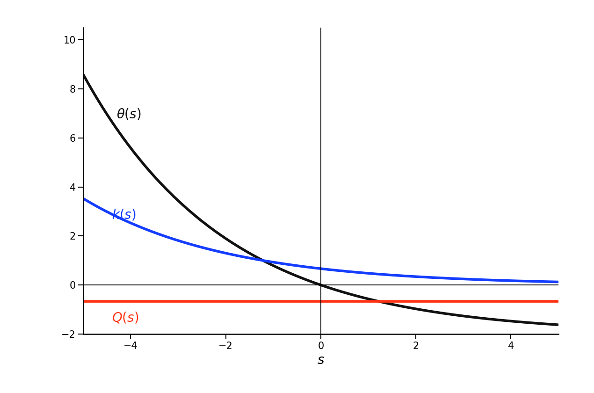
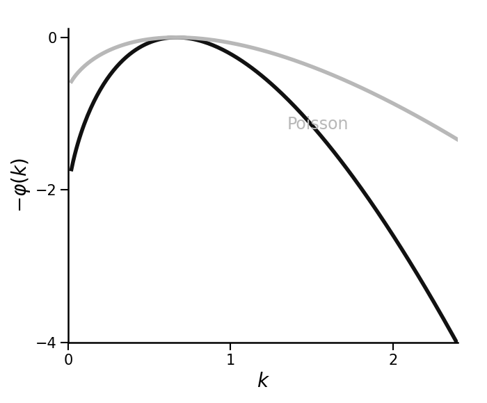
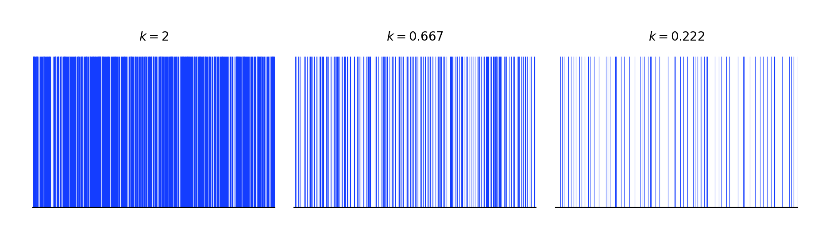
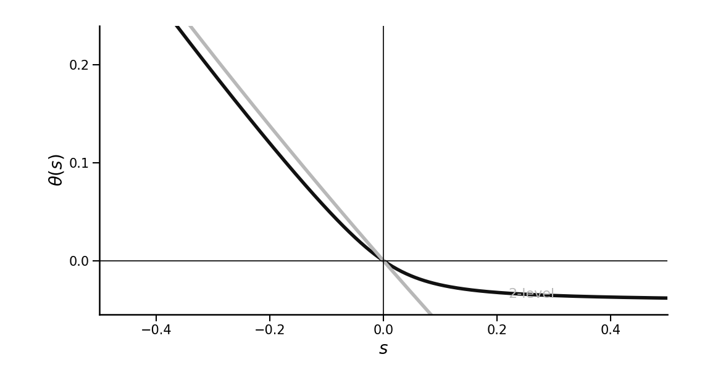
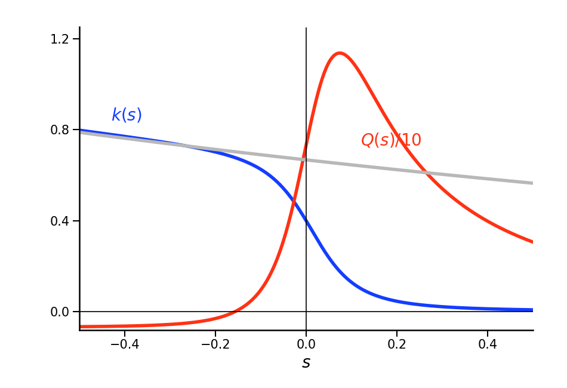
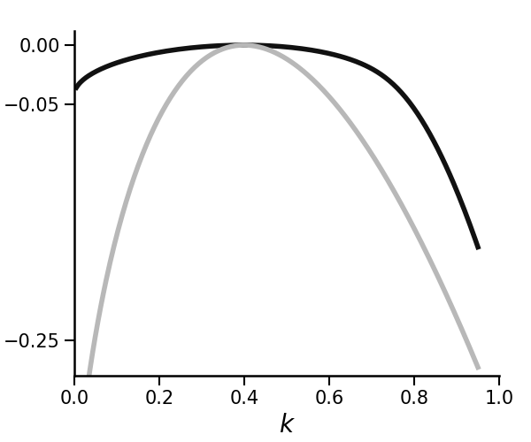
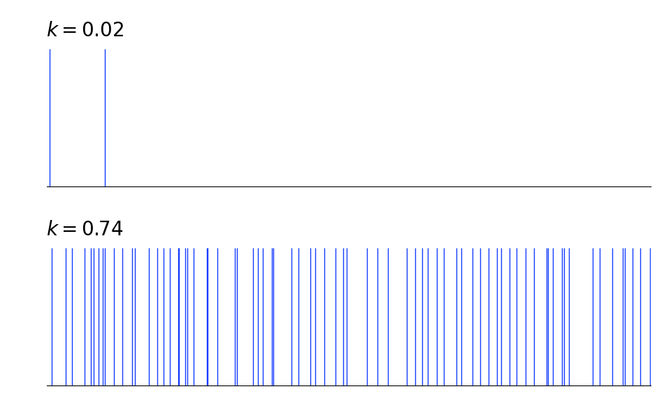
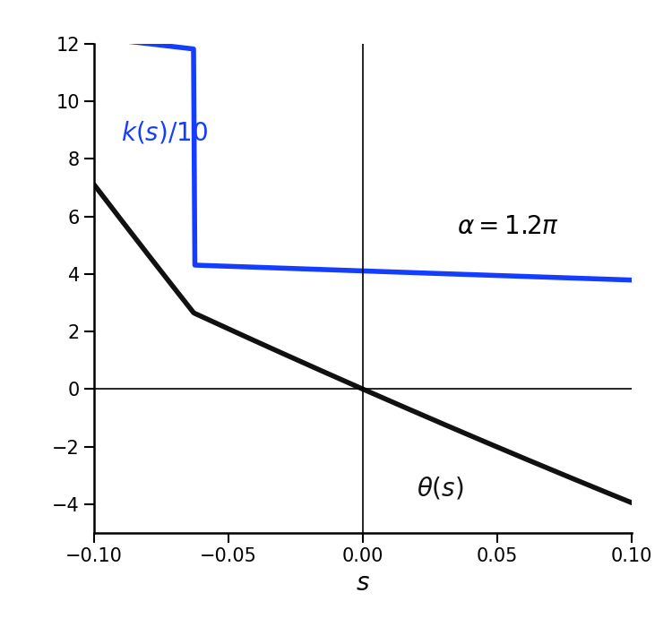
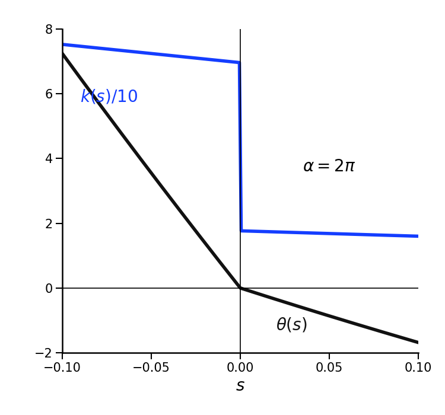
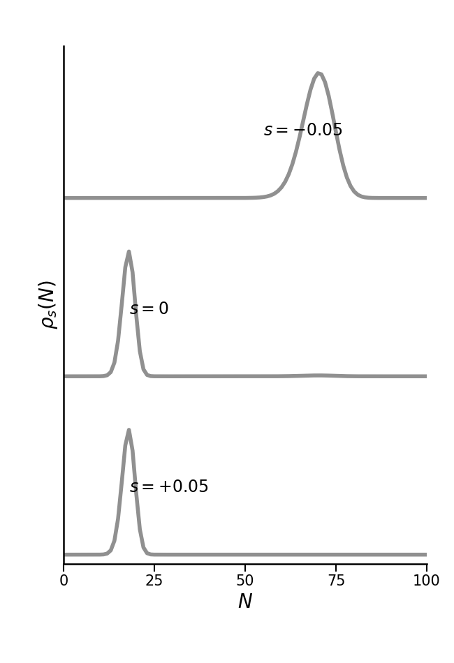

# 0911.0556: Thermodynamics of Quantum Jump Trajectories

Preprint: [arXiv:0911.0556 — Thermodynamics of Quantum Jump Trajectories](https://arxiv.org/abs/0911.0556)

Published as: [Thermodynamics of Quantum Jump Trajectories](https://doi.org/10.1103/PhysRevLett.104.160601)

Formal citation: 104, 160601 (2010) · DOI `10.1103/PhysRevLett.104.160601` · Locator `160601`

Public status: **Partial scientific reproduction** · Audit score: **77.27/100**

Case scaffolded from framework/templates/paper_case.

## Start Here / 从这里开始

- [中文复现 Note](note/reproduction-note.zh-CN.md)
- [English reproduction note](note/reproduction-note.en.md)
- [Equation-level derivation](docs/DERIVATION.md)
- [Numerical methods](docs/NUMERICAL_METHODS.md)
- [Public evidence index](docs/EVIDENCE_INDEX.md)
- [Comparison policy](docs/COMPARISON_POLICY.md)
- [Scientific consistency report](docs/CONSISTENCY_REPORT.md)
- [Paper review protocol](docs/PAPER_REVIEW_PROTOCOL_V2.md)
- [Code and run commands](code/README.md)
- [Machine-readable scorecard](outputs/checks/similarity_scorecard.json)
- [Machine-readable completion boundary](outputs/checks/completion_assessment.json)
- [Derivation (equations)](docs/DERIVATION.md)
- [Numerical methods](docs/NUMERICAL_METHODS.md)
- [Lessons learned](docs/LESSONS_LEARNED.md)

## Quick Run

```bash
python -m venv .venv
source .venv/bin/activate
pip install -r requirements.txt
cd cases/0911.0556/code
python scripts/run_reproduction.py --config config/paper_reconstructed.json --output-root outputs/public_quick_run
```

Generated files are kept under [data](outputs/data/), [figures](outputs/figures/), and [checks](outputs/checks/).

## Reproduction Boundary

This public case includes paper-derived code, generated data, generated figures, public validation checks, and explanatory notes. It does not redistribute the paper PDF, arXiv source archive, original figures, EPS paths, digitized source curves, source-derived point sets, or source-vs-generated composite panels.

Remaining limitation: The official arXiv archive contains manuscript TeX and three figure PDFs only; no author computational code or numerical arrays were found. Original-paper micromaser values N_ex and nu are omitted; the later public arXiv:1103.0919 parameter set N_ex=100, nu=0.15 is isolated as reconstructed provenance.

Final-parameter rule: final public figures use the paper parameters when feasible. Any reduced-scale, subset, proxy, or blocked target must be labeled explicitly and cannot be presented as a complete reproduction.

## Generated Figures




















