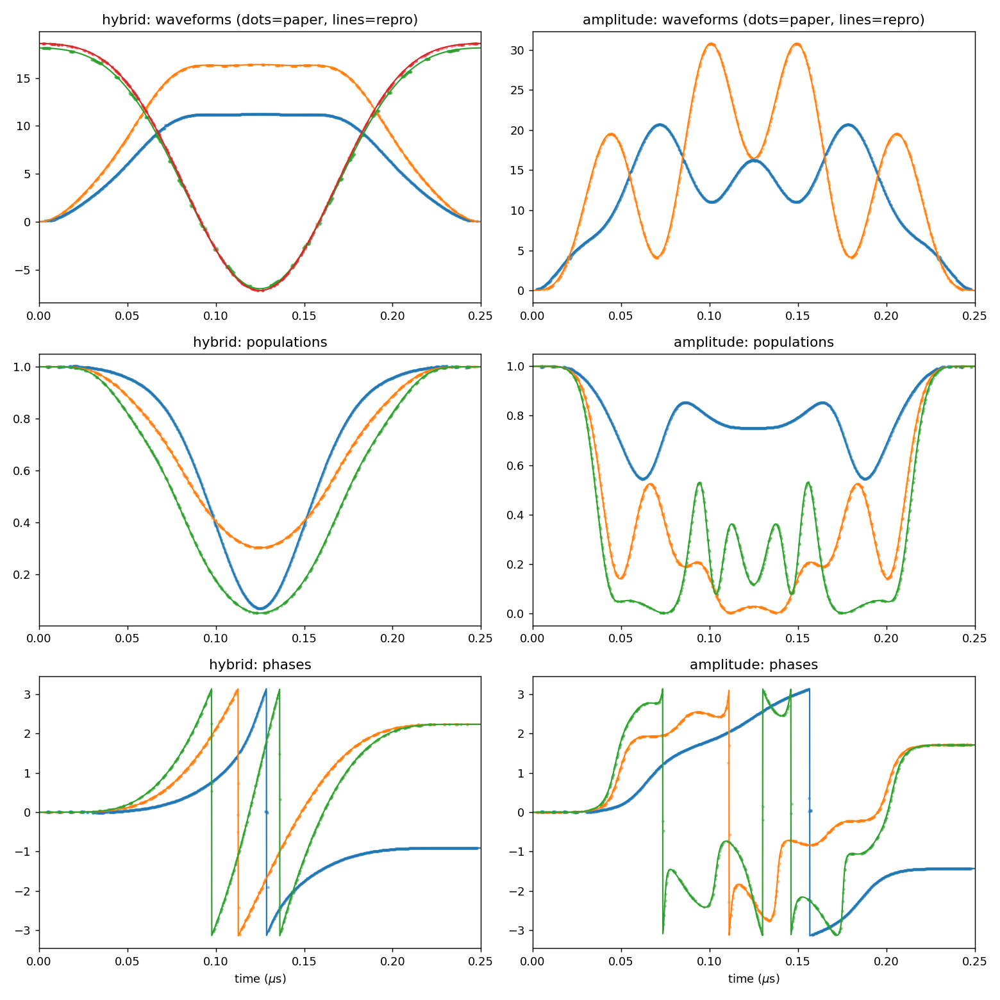
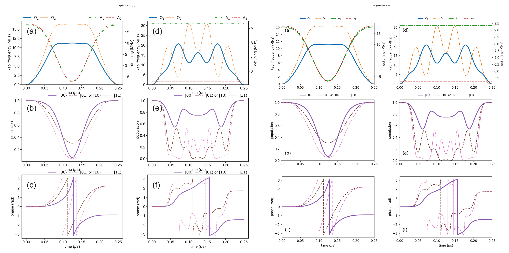
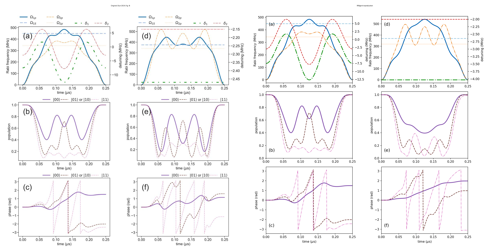
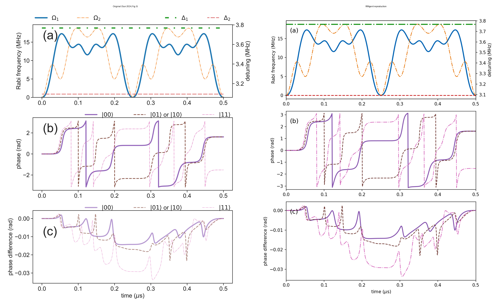
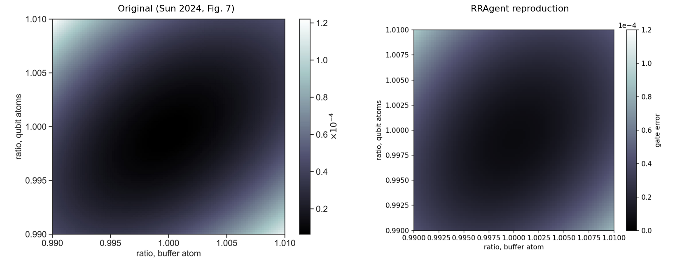

# 10.1007-s11433-024-2478-8: Buffer-atom-mediated quantum logic gates with off-resonant modulated driving

Preprint: **No preprint recorded as of 2026-07-14**

Published as: [Buffer-atom-mediated quantum logic gates with off-resonant modulated driving](https://doi.org/10.1007/s11433-024-2478-8)

Formal citation: Sci. China-Phys. Mech. Astron. 67, 120311 (2024) · DOI `10.1007/s11433-024-2478-8` · Locator `Article 120311`

Public status: **Partial scientific reproduction** · Audit score: **63.12/100**

Case scaffolded from framework/templates/paper_case.

## Start Here / 从这里开始

- [中文复现 Note](note/reproduction-note.zh-CN.md)
- [English reproduction note](note/reproduction-note.en.md)
- [Equation-level derivation](docs/DERIVATION.md)
- [Numerical methods](docs/NUMERICAL_METHODS.md)
- [Public evidence index](docs/EVIDENCE_INDEX.md)
- [Comparison policy](docs/COMPARISON_POLICY.md)
- [Scientific consistency report](docs/CONSISTENCY_REPORT.md)
- [Independent paper assessment](docs/PAPER_ASSESSMENT.md)
- [Code and run commands](code/README.md)
- [Machine-readable scorecard](outputs/checks/similarity_scorecard.json)
- [Machine-readable completion boundary](outputs/checks/completion_assessment.json)
- [Derivation (equations)](docs/DERIVATION.md)
- [Numerical methods](docs/NUMERICAL_METHODS.md)
- [Lessons learned](docs/LESSONS_LEARNED.md)

## Quick Run

```bash
python -m venv .venv
source .venv/bin/activate
pip install -r requirements.txt
cd cases/10.1007-s11433-024-2478-8/code
python scripts/run_reproduction.py --config config/scientific_closure.json --output-root outputs/public_quick_run
```

Published machine-readable artifacts are kept under [data](outputs/data/), [figures](outputs/figures/), [checks](outputs/checks/).

## Reproduction Boundary

This public case includes paper-derived code, generated data, generated figures, public validation checks, explanatory notes. It does not redistribute the paper PDF, arXiv source archive, original figures, EPS paths, digitized source curves, source-derived point sets, or source-vs-generated composite panels.

Remaining limitation: Remaining lifecycle boundaries: artifact_integrity=artifact_valid_with_warnings, parameters=paper_exact, causal_resolution=repair_required, science=pending, pixel=not_comparable, paper_assessment=inconclusive.

Final-parameter rule: final public figures use the paper parameters when feasible. Any reduced-scale, subset, proxy, or blocked target must be labeled explicitly and cannot be presented as a complete reproduction.

## Generated Figures

















