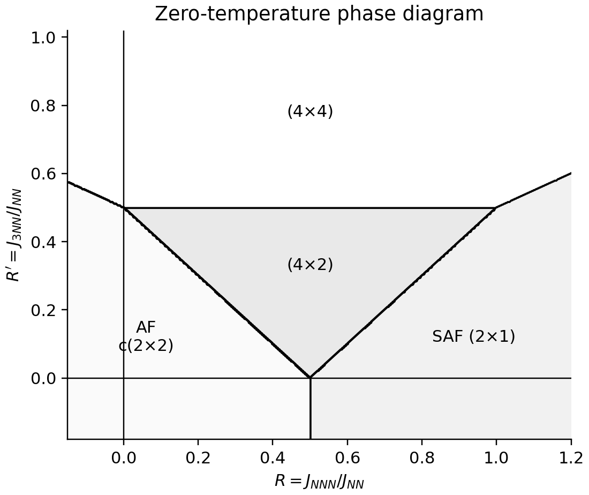
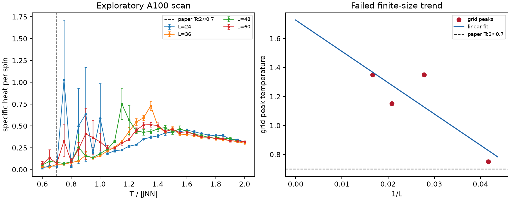

# 10.1103-PhysRevB.31.5946: Phase diagrams and critical behavior of Ising square lattices with nearest-, next-nearest-, and third-nearest-neighbor couplings

Preprint: **No preprint recorded as of 2026-08-04**

Published as: [Phase diagrams and critical behavior of Ising square lattices with nearest-, next-nearest-, and third-nearest-neighbor couplings](https://doi.org/10.1103/PhysRevB.31.5946)

Formal citation: Physical Review B 31, 5946-5953 (1985) · DOI `10.1103/PhysRevB.31.5946` · Locator `5946-5953`

Public status: **Historical scientific artifact (15 numerical targets; 11 blocked_missing_method, 1 blocked_missing_parameter, 2 failed, 1 reproduced)** · Audit score: **11.20/100**

Publishes the independently generated numerical artifacts retained by the historical case: 2 public generated data files, 2 public generated figures, and 15 declared numerical targets. The package preserves failed, partial, proxy, and unresolved outcomes instead of upgrading them to completion.

## Start Here / 从这里开始

- [中文复现 Note](note/reproduction-note.zh-CN.md)
- [English reproduction note](note/reproduction-note.en.md)
- [Code and run commands](code/README.md)
- [Machine-readable scorecard](outputs/checks/similarity_scorecard.json)
- [Derivation (equations)](docs/DERIVATION.md)
- [Numerical methods](docs/NUMERICAL_METHODS.md)
- [Lessons learned](docs/LESSONS_LEARNED.md)

## Main Reproduced Results

| Paper item | Reproduced result | Figure | Check |
| --- | --- | --- | --- |
| FIG002 | Exact zero-temperature phase diagram. | [PNG](outputs/figures/fig02_ground_state_phase_diagram.png) | [JSON](outputs/checks/similarity_scorecard.json) |
| FIG009 | Specific heat for R=0, R'=0.8. | [PNG](outputs/figures/fig09_fig10_a100_exploratory_scan.png) | [JSON](outputs/checks/similarity_scorecard.json) |

### FIG002: Exact zero-temperature phase diagram.



### FIG009: Specific heat for R=0, R'=0.8.



## Quick Run

```bash
python -m venv .venv
source .venv/bin/activate
pip install -r requirements.txt
pip install torch
cd cases/10.1103-PhysRevB.31.5946/code
python scripts/verify_public_artifacts.py
```

Generated files are kept under [data](outputs/data/), [figures](outputs/figures/), and [checks](outputs/checks/).

## Reproduction Boundary

This public case includes paper-derived code, generated data, generated figures, public validation checks, and explanatory notes. It does not redistribute the paper PDF, arXiv source archive, original figures, EPS paths, digitized source curves, source-derived point sets, or source-vs-generated composite panels.

Remaining limitation: Frozen non-final target states: T004=blocked_missing_method, T005=blocked_missing_method, T006=blocked_missing_method, T007=blocked_missing_method, T008=blocked_missing_method, T009=failed, T010=failed, T011=blocked_missing_method, T012=blocked_missing_method, T013=blocked_missing_method, T014=blocked_missing_method, T015=blocked_missing_parameter, T016=blocked_missing_method, T017=blocked_missing_method. The legacy case has no machine-verifiable author-code isolation attestation. No source-image comparison panel or digitized source curve is published in this projection.

Final-parameter rule: final public figures use the paper parameters when feasible. Any reduced-scale, subset, proxy, or blocked target must be labeled explicitly and cannot be presented as a complete reproduction.
