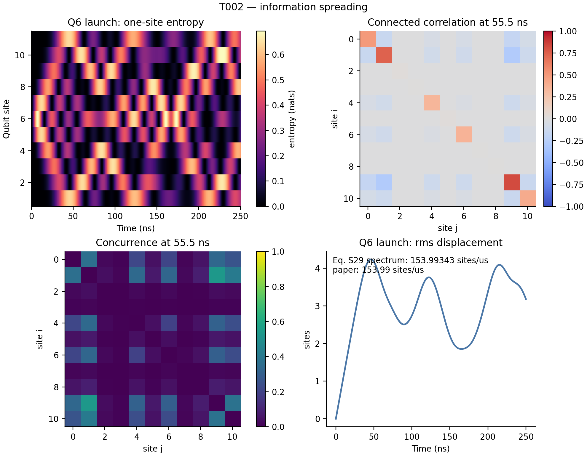
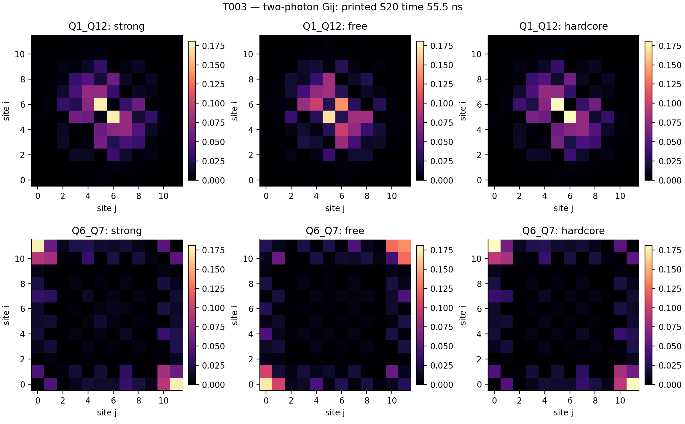
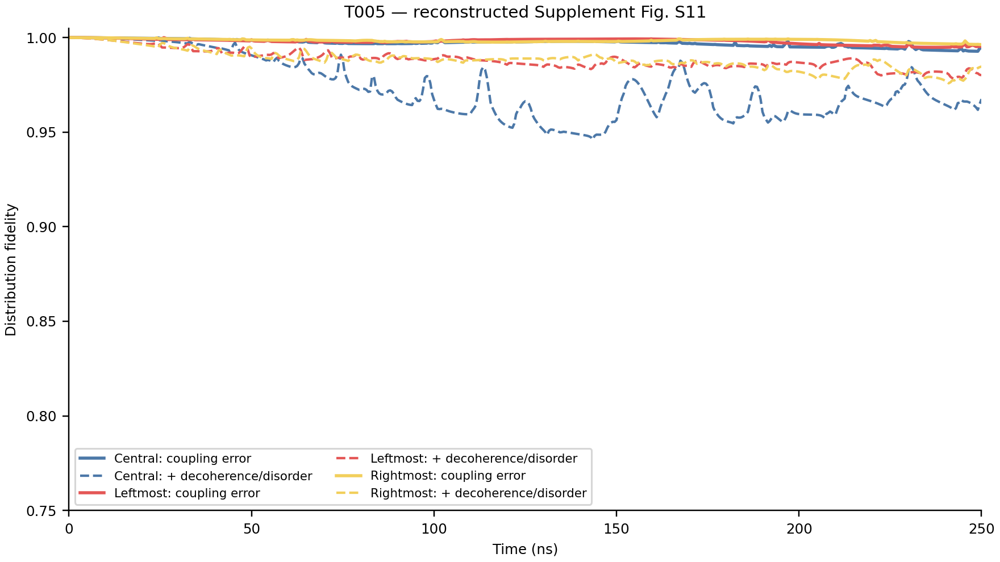
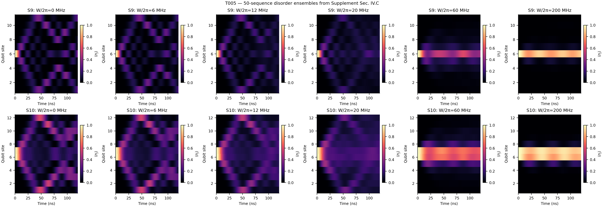

# 10.1126-science.aaw1611: Strongly correlated quantum walks with a 12-qubit superconducting processor

Preprint: **No preprint recorded as of 2026-07-15**

Published as: [Strongly correlated quantum walks with a 12-qubit superconducting processor](https://doi.org/10.1126/science.aaw1611)

Formal citation: Science 364, 753-756 (2019) · DOI `10.1126/science.aaw1611` · Locator `364(6442):753-756`

Public status: **Partial scientific reproduction** · Audit score: **75.14/100**

Case scaffolded from framework/templates/paper_case.

## Start Here / 从这里开始

- [中文复现 Note](note/reproduction-note.zh-CN.md)
- [English reproduction note](note/reproduction-note.en.md)
- [Equation-level derivation](docs/DERIVATION.md)
- [Numerical methods](docs/NUMERICAL_METHODS.md)
- [Public evidence index](docs/EVIDENCE_INDEX.md)
- [Comparison policy](docs/COMPARISON_POLICY.md)
- [Scientific consistency report](docs/CONSISTENCY_REPORT.md)
- [Code and run commands](code/README.md)
- [Machine-readable scorecard](outputs/checks/similarity_scorecard.json)
- [Machine-readable completion boundary](outputs/checks/completion_assessment.json)
- [Derivation (equations)](docs/DERIVATION.md)
- [Numerical methods](docs/NUMERICAL_METHODS.md)
- [Lessons learned](docs/LESSONS_LEARNED.md)

## Quick Run

```bash
python -m venv .venv
source .venv/bin/activate
pip install -r requirements.txt
cd cases/10.1126-science.aaw1611/code
python scripts/run_reproduction.py
```

Published machine-readable artifacts are kept under [data](outputs/data/), [figures](outputs/figures/), [checks](outputs/checks/).

## Reproduction Boundary

This public case includes paper-derived code, generated data, generated figures, public validation checks, explanatory notes. It does not redistribute the paper PDF, arXiv source archive, original figures, EPS paths, digitized source curves, source-derived point sets, or source-vs-generated composite panels.

Remaining limitation: Published article and 35-page supplementary material ingested from institutional mirrors and recorded by SHA-256. The full paper and supplement contain 38 independently computable theoretical numerical items; all 38 have atomic targets and generated data. Experimental hardware measurements and raw tomography are excluded from the numerical-runner denominator. The current isolated CPU run attests all 38 targets; the historical A100 result is backend-portability evidence only. Twelve S20 panels retain an unresolved printed-time/source discrepancy, and S11 lacks author realization-level parameters.

Final-parameter rule: final public figures use the paper parameters when feasible. Any reduced-scale, subset, proxy, or blocked target must be labeled explicitly and cannot be presented as a complete reproduction.

## Generated Figures










