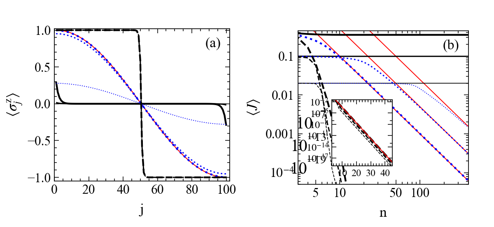

# 1106.2978: Exact nonequilibrium steady state of a strongly driven open XXZ chain

Preprint: [arXiv:1106.2978 — Exact nonequilibrium steady state of a strongly driven open XXZ chain](https://arxiv.org/abs/1106.2978)

Published as: [Exact Nonequilibrium Steady State of a Strongly Driven Open XXZ Chain](https://doi.org/10.1103/PhysRevLett.107.137201)

Formal citation: Phys. Rev. Lett. 107, 137201 (2011) · DOI `10.1103/PhysRevLett.107.137201` · Locator `137201`

Public status: **Scientific reproduction — paper-error candidates identified** · Audit score: **86.58/100**

Clean-room scientific reproduction; author code and author numerical arrays are excluded from numerical inputs.

## Start Here / 从这里开始

- [中文复现 Note](note/reproduction-note.zh-CN.md)
- [English reproduction note](note/reproduction-note.en.md)
- [Equation-level derivation](docs/DERIVATION.md)
- [Numerical methods](docs/NUMERICAL_METHODS.md)
- [Public evidence index](docs/EVIDENCE_INDEX.md)
- [Comparison policy](docs/COMPARISON_POLICY.md)
- [Scientific consistency report](docs/CONSISTENCY_REPORT.md)
- [Paper review protocol](docs/PAPER_REVIEW_PROTOCOL_V2.md)
- [Independent paper assessment](docs/PAPER_ASSESSMENT.md)
- [Code and run commands](code/README.md)
- [Machine-readable scorecard](outputs/checks/similarity_scorecard.json)
- [Machine-readable completion boundary](outputs/checks/completion_assessment.json)
- [Derivation (equations)](docs/DERIVATION.md)
- [Numerical methods](docs/NUMERICAL_METHODS.md)
- [Lessons learned](docs/LESSONS_LEARNED.md)

## Quick Run

```bash
python -m venv .venv
source .venv/bin/activate
pip install -r requirements.txt
cd cases/1106.2978/code
python scripts/run_reproduction.py --config config/paper_exact.json --output-root outputs/public_quick_run
```

Generated files are kept under [data](outputs/data/), [figures](outputs/figures/), and [checks](outputs/checks/).

## Reproduction Boundary

This public case includes paper-derived code, generated data, generated figures, public validation checks, and explanatory notes. It does not redistribute the paper PDF, arXiv source archive, original figures, EPS paths, digitized source curves, source-derived point sets, or source-vs-generated composite panels.

Remaining limitation: Remaining lifecycle boundaries: artifact_integrity=artifact_valid_with_warnings, parameters=paper_exact, causal_resolution=terminal_blocker, science=pending, pixel=passed_with_not_comparable, review_scope=incomplete, paper_assessment=paper_error_candidate.

Final-parameter rule: final public figures use the paper parameters when feasible. Any reduced-scale, subset, proxy, or blocked target must be labeled explicitly and cannot be presented as a complete reproduction.

## Generated Figures


