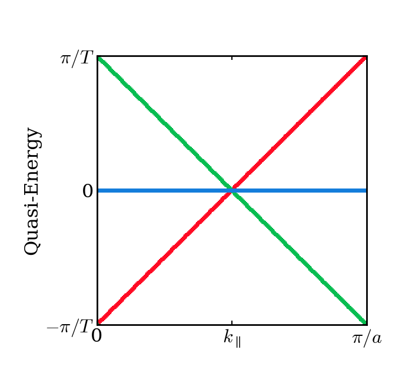
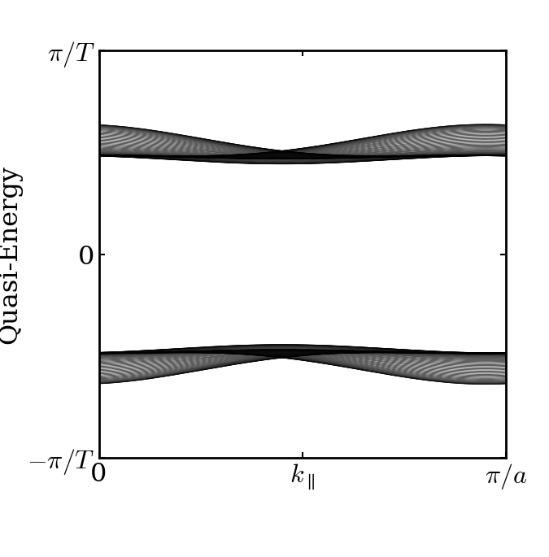
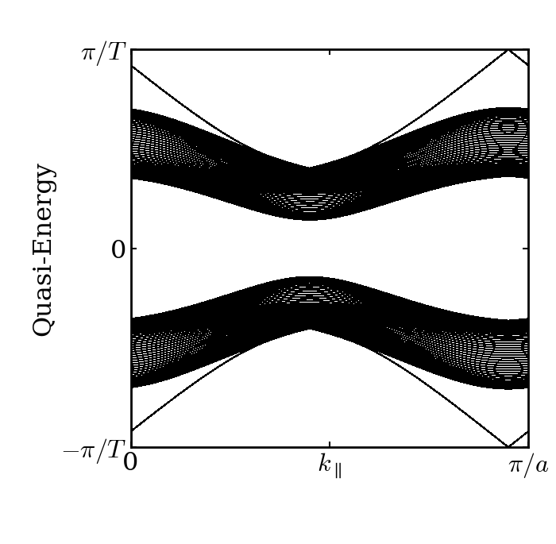
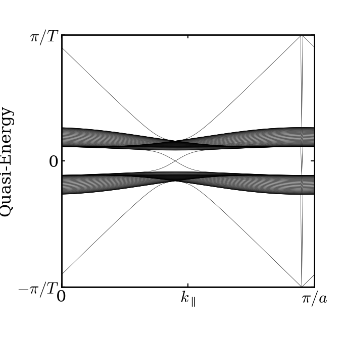
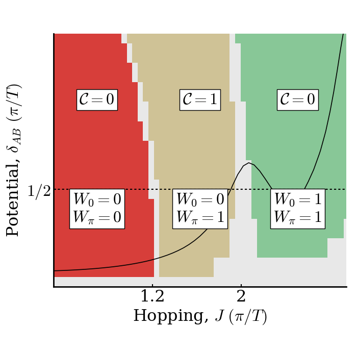
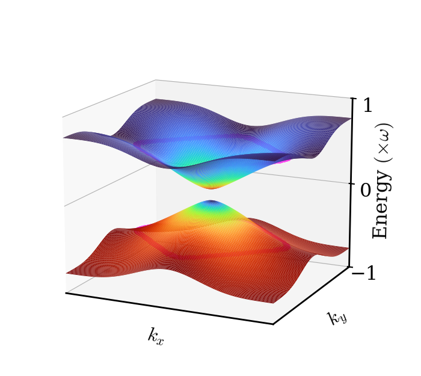
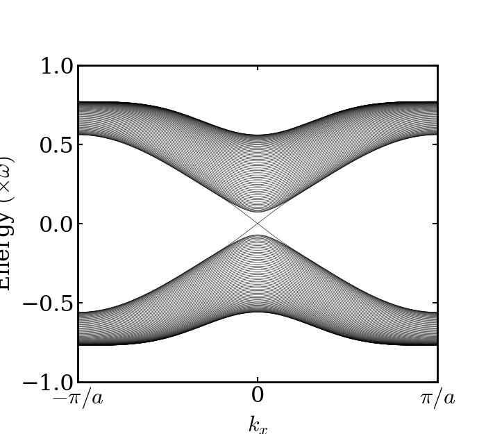
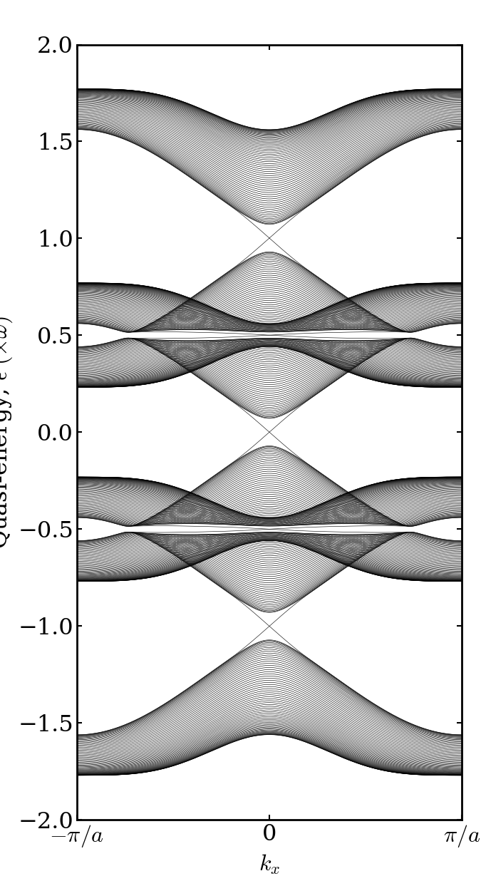

# 1212.3324: Anomalous edge states and the bulk-edge correspondence for periodically driven two-dimensional systems

Preprint: [arXiv:1212.3324 — Anomalous edge states and the bulk-edge correspondence for periodically driven two-dimensional systems](https://arxiv.org/abs/1212.3324)

Published as: [Anomalous Edge States and the Bulk-Edge Correspondence for Periodically Driven Two-Dimensional Systems](https://doi.org/10.1103/PhysRevX.3.031005)

Formal citation: Phys. Rev. X 3, 031005 (2013) · DOI `10.1103/PhysRevX.3.031005` · Locator `031005`

Public status: **Partial scientific reproduction** · Audit score: **81.11/100**

Clean-room scientific reproduction; author code and author numerical arrays are excluded from numerical inputs.

## Start Here / 从这里开始

- [中文复现 Note](note/reproduction-note.zh-CN.md)
- [English reproduction note](note/reproduction-note.en.md)
- [Equation-level derivation](docs/DERIVATION.md)
- [Numerical methods](docs/NUMERICAL_METHODS.md)
- [Public evidence index](docs/EVIDENCE_INDEX.md)
- [Comparison policy](docs/COMPARISON_POLICY.md)
- [Scientific consistency report](docs/CONSISTENCY_REPORT.md)
- [Paper review protocol](docs/PAPER_REVIEW_PROTOCOL_V2.md)
- [Independent paper assessment](docs/PAPER_ASSESSMENT.md)
- [Code and run commands](code/README.md)
- [Machine-readable scorecard](outputs/checks/similarity_scorecard.json)
- [Machine-readable completion boundary](outputs/checks/completion_assessment.json)
- [Derivation (equations)](docs/DERIVATION.md)
- [Numerical methods](docs/NUMERICAL_METHODS.md)
- [Lessons learned](docs/LESSONS_LEARNED.md)

## Quick Run

```bash
python -m venv .venv
source .venv/bin/activate
pip install -r requirements.txt
cd cases/1212.3324/code
python scripts/run_reproduction.py --config config/paper_reconstructed.json
```

Published machine-readable artifacts are kept under [data](outputs/data/), [figures](outputs/figures/), [checks](outputs/checks/).

## Reproduction Boundary

This public case includes paper-derived code, generated data, generated figures, public validation checks, explanatory notes. It does not redistribute the paper PDF, arXiv source archive, original figures, EPS paths, digitized source curves, source-derived point sets, or source-vs-generated composite panels.

Remaining limitation: Remaining lifecycle boundaries: parameters=mixed, causal_resolution=terminal_blocker, science=failed, pixel=needs_repair, independent_review=stale, review_scope=stale, paper_assessment=stale.

Final-parameter rule: final public figures use the paper parameters when feasible. Any reduced-scale, subset, proxy, or blocked target must be labeled explicitly and cannot be presented as a complete reproduction.

## Generated Figures
















