# 1608.02589: Discrete time crystals: rigidity, criticality, and realizations

Preprint: [arXiv:1608.02589 — Discrete time crystals: rigidity, criticality, and realizations](https://arxiv.org/abs/1608.02589)

Published as: [Discrete Time Crystals: Rigidity, Criticality, and Realizations](https://doi.org/10.1103/PhysRevLett.118.030401)

Formal citation: Phys. Rev. Lett. 118, 030401 (2017) · DOI `10.1103/PhysRevLett.118.030401` · Locator `030401`

Public status: **Partial scientific reproduction** · Audit score: **73.56/100**

Existing frozen evidence covers 32 of 89 eligible atomic reproduction items. Fifty-seven uncovered items are now explicit zero-credit targets with direct/root cause, code-fault status, and next discriminating tests.

## Start Here / 从这里开始

- [中文复现 Note](note/reproduction-note.zh-CN.md)
- [English reproduction note](note/reproduction-note.en.md)
- [Equation-level derivation](docs/DERIVATION.md)
- [Numerical methods](docs/NUMERICAL_METHODS.md)
- [Public evidence index](docs/EVIDENCE_INDEX.md)
- [Comparison policy](docs/COMPARISON_POLICY.md)
- [Scientific consistency report](docs/CONSISTENCY_REPORT.md)
- [Paper review protocol](docs/PAPER_REVIEW_PROTOCOL_V2.md)
- [Code and run commands](code/README.md)
- [Machine-readable scorecard](outputs/checks/similarity_scorecard.json)
- [Machine-readable completion boundary](outputs/checks/completion_assessment.json)
- [Derivation (equations)](docs/DERIVATION.md)
- [Numerical methods](docs/NUMERICAL_METHODS.md)
- [Lessons learned](docs/LESSONS_LEARNED.md)

## Quick Run

```bash
python -m venv .venv
source .venv/bin/activate
pip install -r requirements.txt
cd cases/1608.02589/code
python scripts/run_reproduction.py
```

Published machine-readable artifacts are kept under [data](outputs/data/), [figures](outputs/figures/), [checks](outputs/checks/).

## Reproduction Boundary

This public case includes paper-derived code, generated data, generated figures, public validation checks, explanatory notes. It does not redistribute the paper PDF, arXiv source archive, original figures, EPS paths, digitized source curves, source-derived point sets, or source-vs-generated composite panels.

Remaining limitation: Second iteration reproduces core DTC rigidity features at L=14. Corrected endpoint mutual information reproduces the main finite-size-flow feature. Full phase diagram, scaling collapse, and critical exponents remain large-scale ED targets.

Final-parameter rule: final public figures use the paper parameters when feasible. Any reduced-scale, subset, proxy, or blocked target must be labeled explicitly and cannot be presented as a complete reproduction.

## Generated Figures

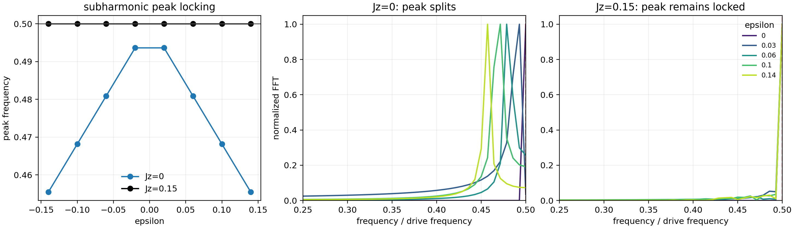

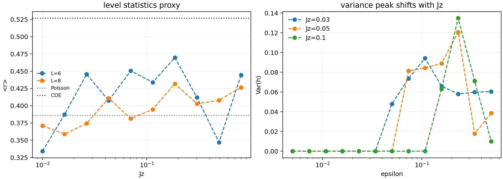

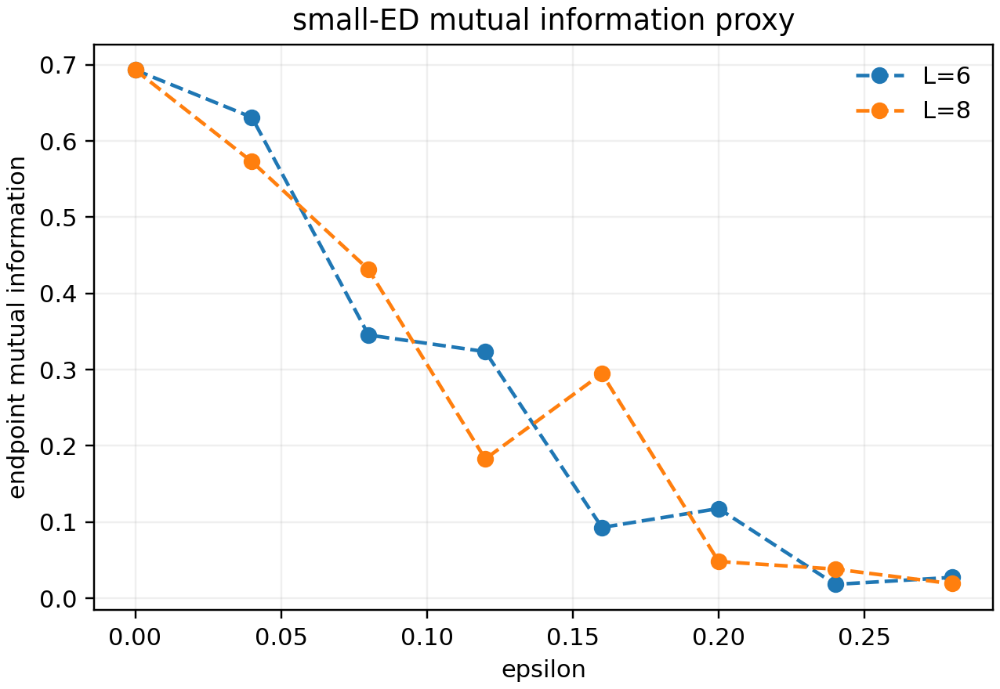

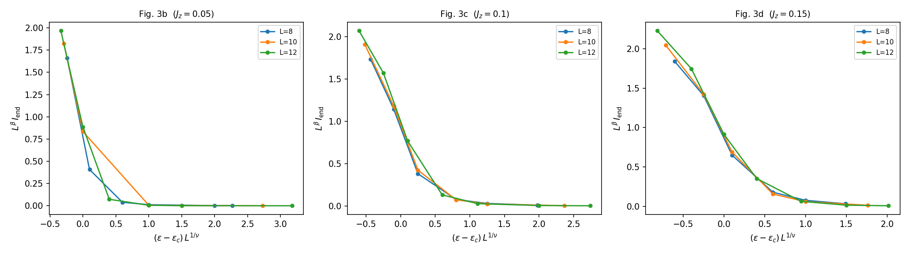

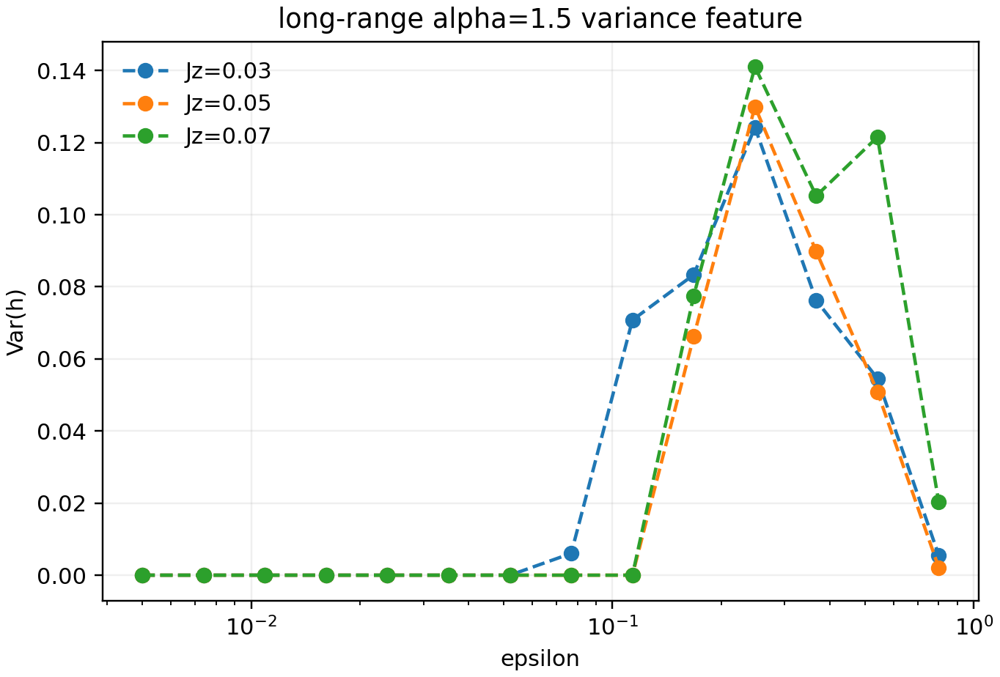

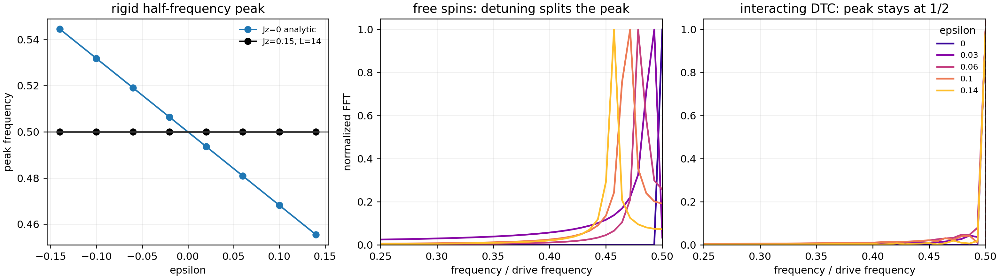

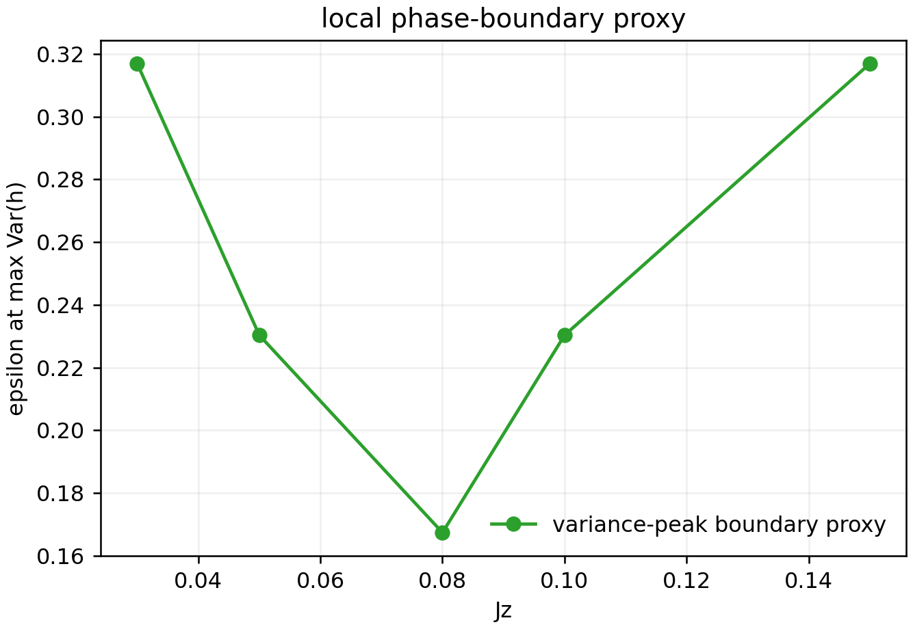

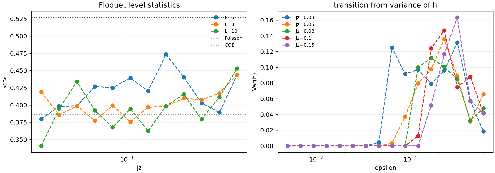

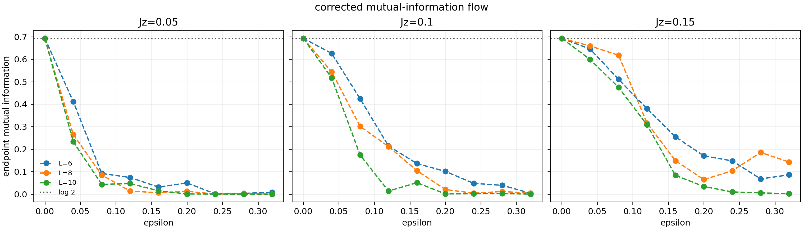

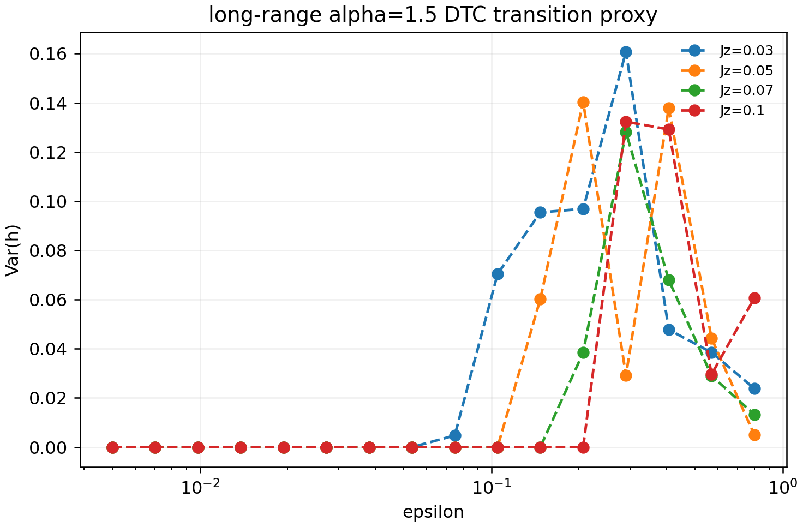

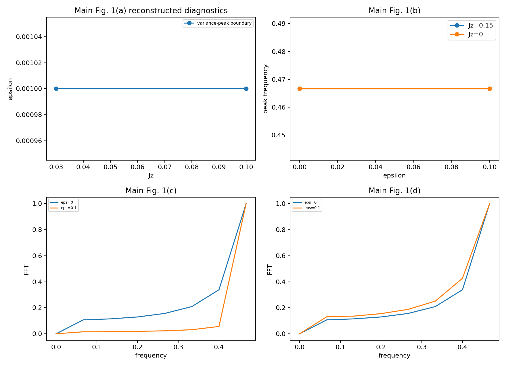

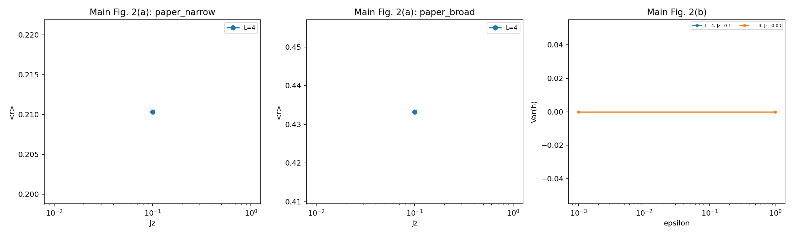

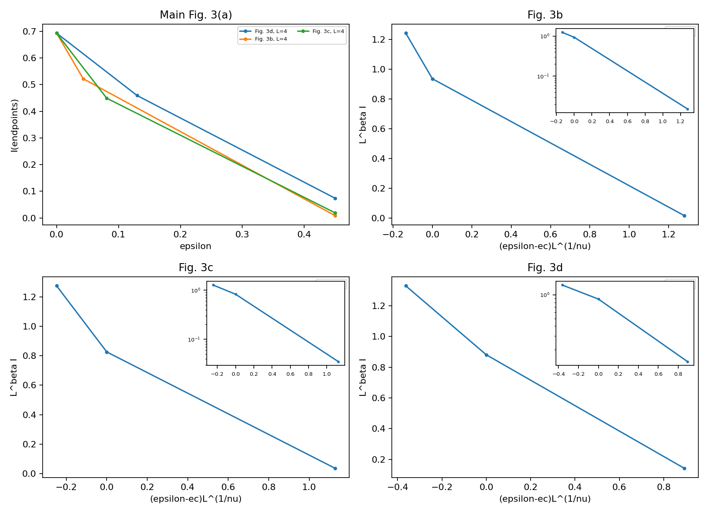

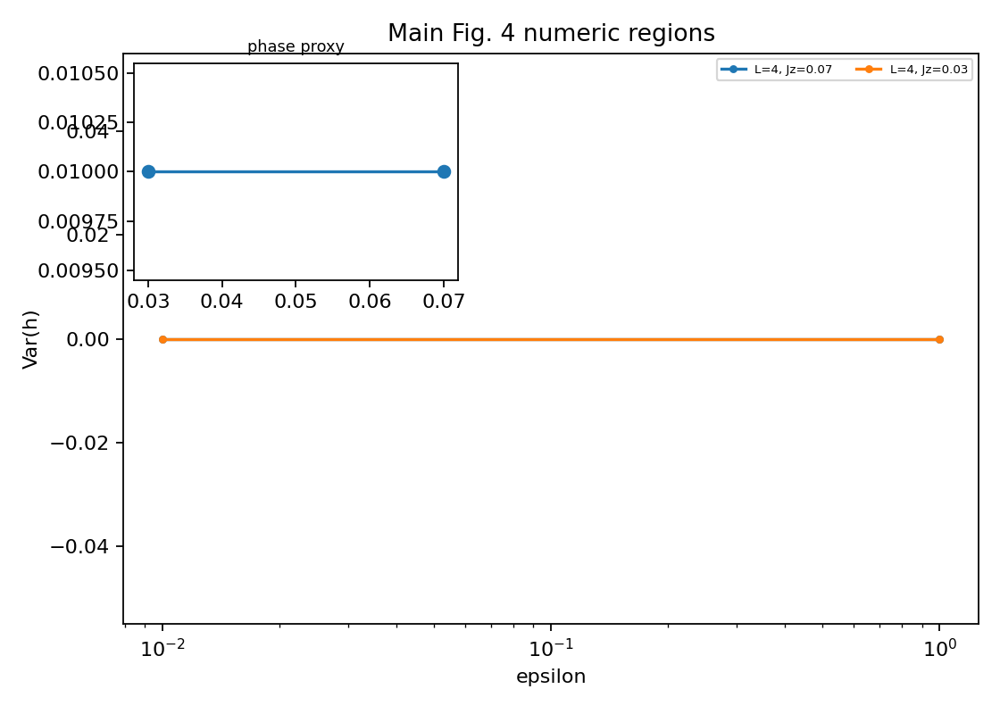

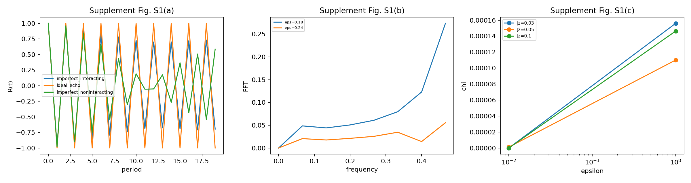

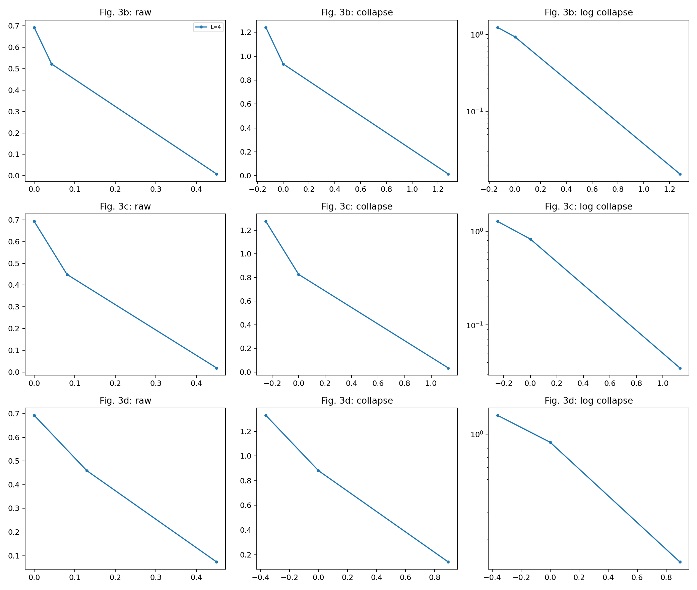

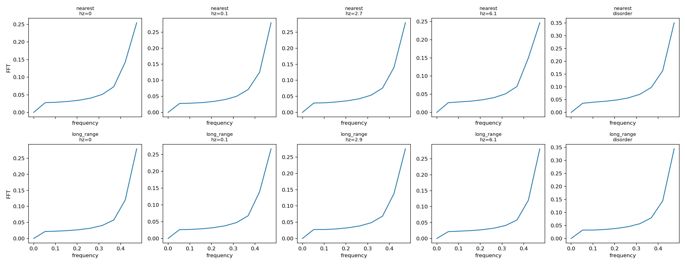
