# 1706.07435: Topological Band Theory for Non-Hermitian Hamiltonians

Preprint: [arXiv:1706.07435 — Topological Band Theory for Non-Hermitian Hamiltonians](https://arxiv.org/abs/1706.07435)

Published as: [Topological Band Theory for Non-Hermitian Hamiltonians](https://doi.org/10.1103/PhysRevLett.120.146402)

Formal citation: Phys. Rev. Lett. 120, 146402 (2018) · DOI `10.1103/PhysRevLett.120.146402` · Locator `146402`

Public status: **Scientific reproduction — independent review pending** · Audit score: **90.00/100**

Full paper and six-page supplement read before target selection.

## Start Here / 从这里开始

- [中文复现 Note](note/reproduction-note.zh-CN.md)
- [English reproduction note](note/reproduction-note.en.md)
- [Equation-level derivation](docs/DERIVATION.md)
- [Numerical methods](docs/NUMERICAL_METHODS.md)
- [Public evidence index](docs/EVIDENCE_INDEX.md)
- [Comparison policy](docs/COMPARISON_POLICY.md)
- [Scientific consistency report](docs/CONSISTENCY_REPORT.md)
- [Code and run commands](code/README.md)
- [Machine-readable scorecard](outputs/checks/similarity_scorecard.json)
- [Machine-readable completion boundary](outputs/checks/completion_assessment.json)
- [Derivation (equations)](docs/DERIVATION.md)
- [Numerical methods](docs/NUMERICAL_METHODS.md)
- [Lessons learned](docs/LESSONS_LEARNED.md)

## Paper Reference vs Independent Reproduction

Each board contains only the minimum paper excerpt needed for validation and places it beside an independently generated result. Visual agreement is a scientific-region diagnostic, not author-data-level equivalence.

### main fig1 comparison comparison

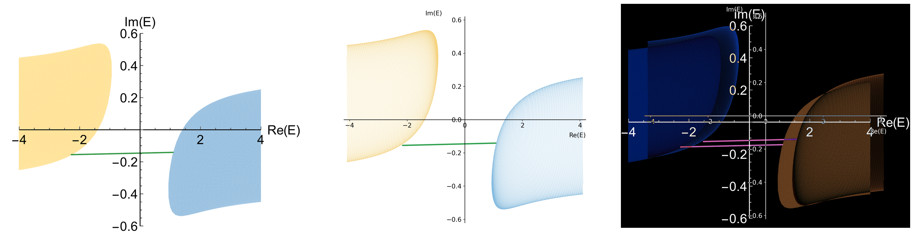

### main fig2 comparison comparison

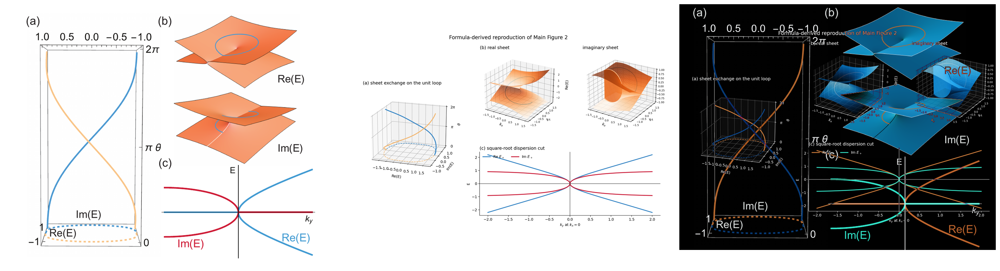

### main fig3 comparison comparison

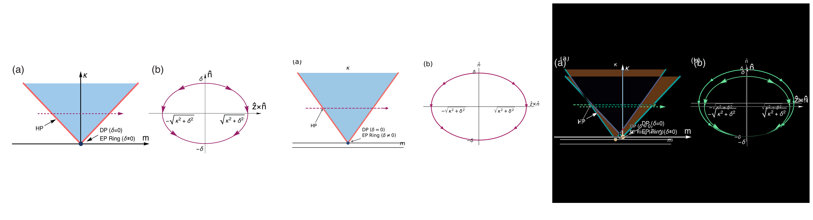

### supp fig2 comparison comparison

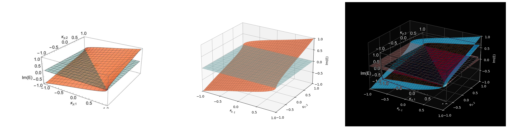

### supp fig3 comparison comparison

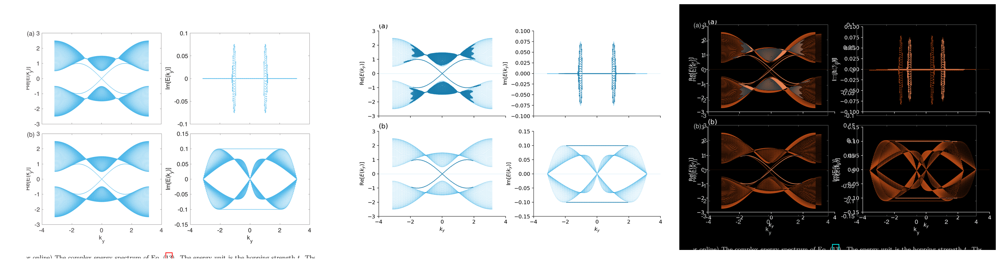

### supp fig4 comparison comparison

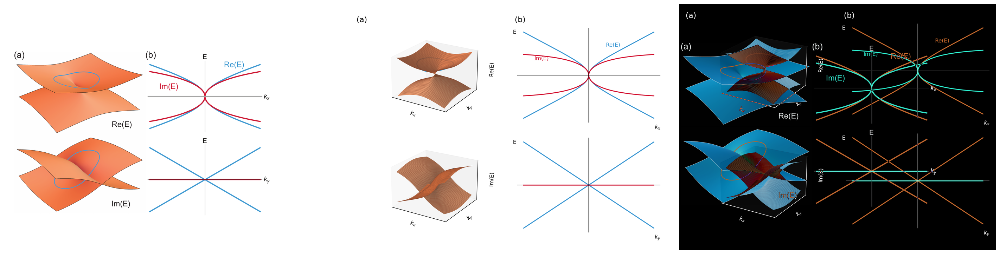

## Quick Run

```bash
python -m venv .venv
source .venv/bin/activate
pip install -r requirements.txt
cd cases/1706.07435/code
python scripts/run_reproduction.py --config config/independent_campaign.json
```

Published machine-readable artifacts are kept under [data](outputs/data/), [figures](outputs/figures/), [checks](outputs/checks/).

## Reproduction Boundary

This public case includes paper-derived code, generated data, generated figures, public validation checks, explanatory notes, and 6 limited comparison panels. Those panels use the minimum paper excerpts needed for validation and clearly separate the paper reference from the independent result. The case does not redistribute the paper PDF, arXiv source archive, standalone original figures, EPS paths, digitized source curves, or source-derived point sets.

Remaining limitation: All 15 visible theory-numerical panels are frozen in the reproduction scope. Source figures are validation-only; generated values must come from formulas or independent eigensolvers.

Final-parameter rule: final public figures use the paper parameters when feasible. Any reduced-scale, subset, proxy, or blocked target must be labeled explicitly and cannot be presented as a complete reproduction.

## Generated Figures

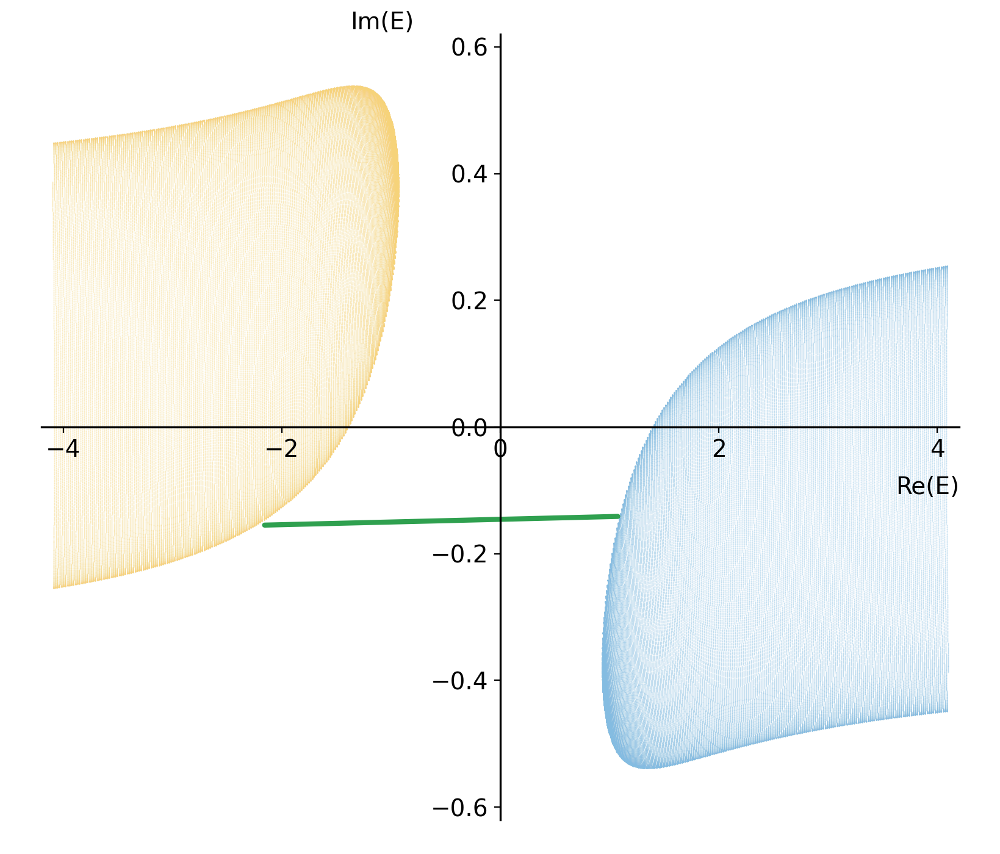

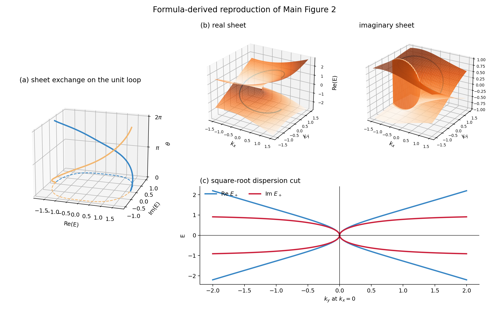

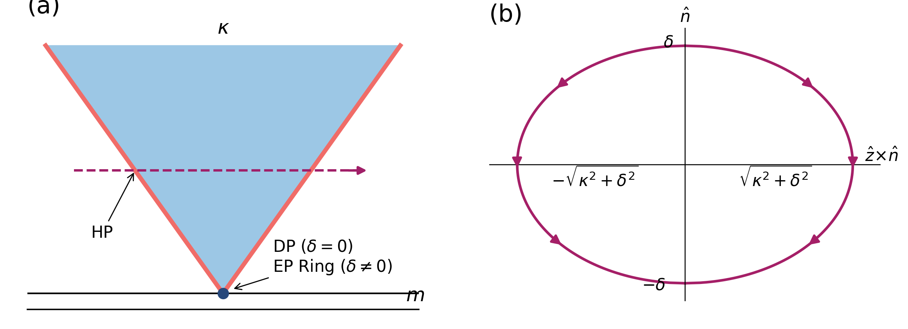

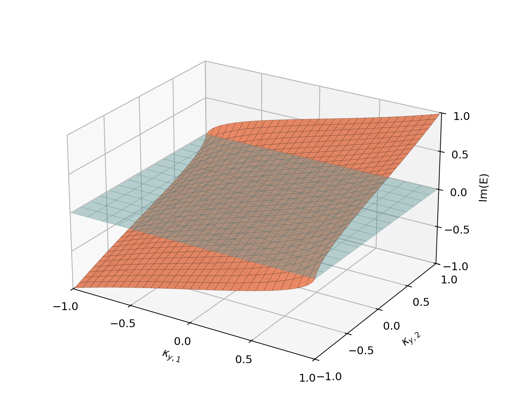

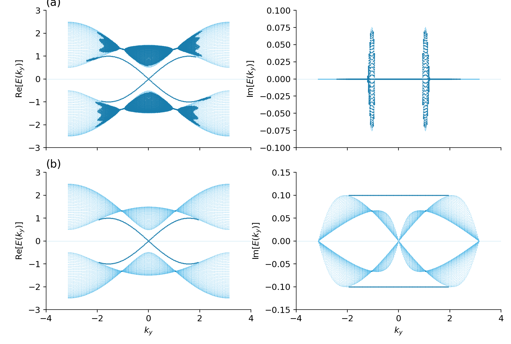

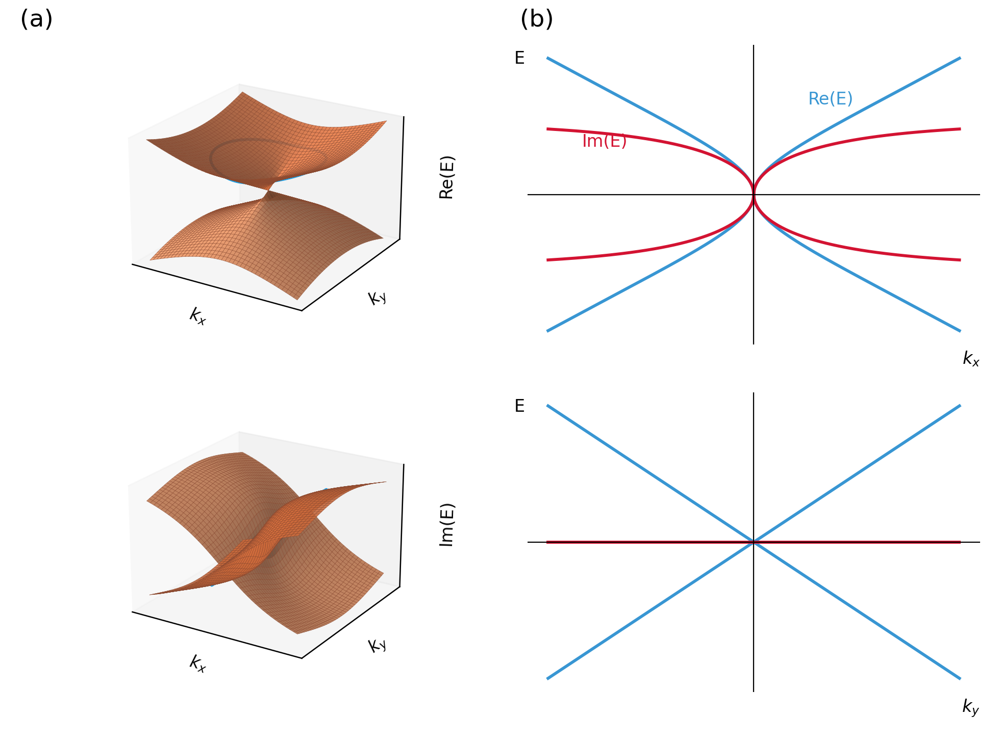
