# 1710.10890: Self-Bound Quantum Droplets of Atomic Mixtures in Free Space

Preprint: [arXiv:1710.10890 — Self-bound quantum droplets in atomic mixtures](https://arxiv.org/abs/1710.10890)

Published as: [Self-Bound Quantum Droplets of Atomic Mixtures in Free Space](https://doi.org/10.1103/PhysRevLett.120.235301)

Formal citation: Phys. Rev. Lett. 120, 235301 (2018) · DOI `10.1103/PhysRevLett.120.235301` · Locator `120, 235301`

Public status: **Partial scientific reproduction** · Audit score: **61.32/100**

All independently recoverable baseline targets are generated; Fig. 3(b) has an inconclusive method-equivalence gap, Supplement Fig. S2 is a declared proxy with a code-ready 3D rerun, and unpublished experimental arrays/curve-specific atom numbers remain deferred.

## Start Here / 从这里开始

- [中文复现 Note](note/reproduction-note.zh-CN.md)
- [English reproduction note](note/reproduction-note.en.md)
- [Equation-level derivation](docs/DERIVATION.md)
- [Numerical methods](docs/NUMERICAL_METHODS.md)
- [Public evidence index](docs/EVIDENCE_INDEX.md)
- [Comparison policy](docs/COMPARISON_POLICY.md)
- [Scientific consistency report](docs/CONSISTENCY_REPORT.md)
- [Code and run commands](code/README.md)
- [Machine-readable scorecard](outputs/checks/similarity_scorecard.json)
- [Machine-readable completion boundary](outputs/checks/completion_assessment.json)
- [Derivation (equations)](docs/DERIVATION.md)
- [Numerical methods](docs/NUMERICAL_METHODS.md)
- [Lessons learned](docs/LESSONS_LEARNED.md)

## Paper Reference vs Independent Reproduction

Each board contains only the minimum paper excerpt needed for validation and places it beside an independently generated result. Visual agreement is a scientific-region diagnostic, not author-data-level equivalence.

### T001 comparison comparison

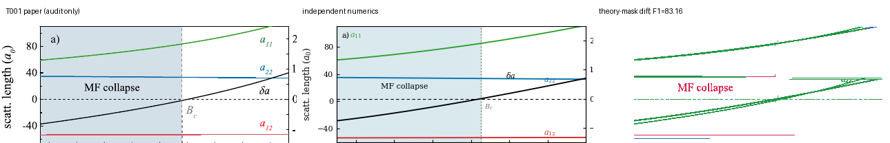

### T002 comparison comparison

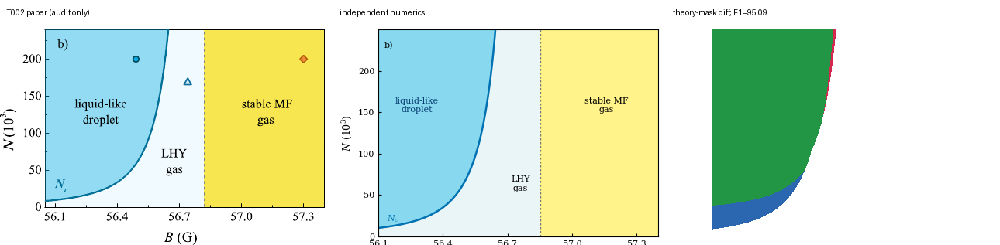

### T003 comparison comparison

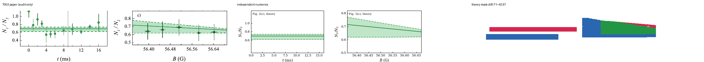

### T004 comparison comparison

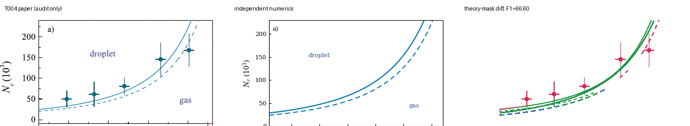

### T005 comparison comparison

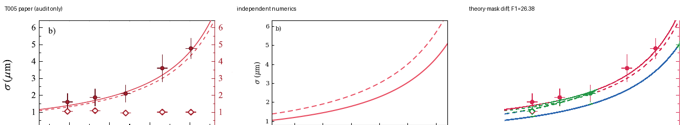

### T006 comparison comparison

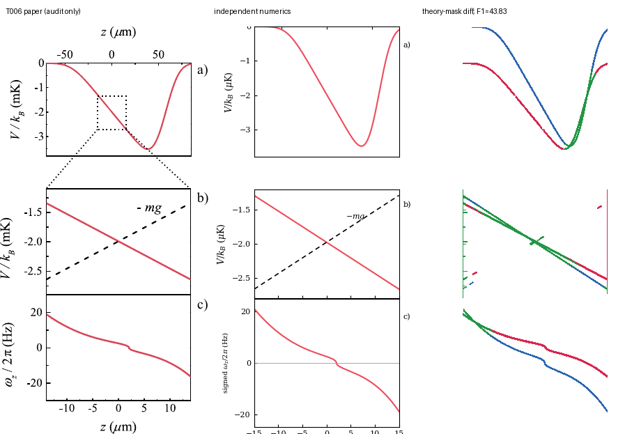

### T007 comparison comparison

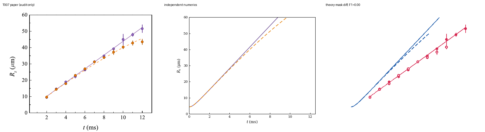

## Quick Run

```bash
python -m venv .venv
source .venv/bin/activate
pip install -r requirements.txt
cd cases/1710.10890/code
python scripts/run_reproduction.py
```

Generated files are kept under [data](outputs/data/), [figures](outputs/figures/), and [checks](outputs/checks/).

## Reproduction Boundary

This public case includes paper-derived code, generated data, generated figures, public validation checks, explanatory notes, and 7 limited comparison panels. Those panels use the minimum paper excerpts needed for validation and clearly separate the paper reference from the independent result. The case does not redistribute the paper PDF, arXiv source archive, standalone original figures, EPS paths, digitized source curves, or source-derived point sets.

Remaining limitation: T005 retains an unresolved Main Fig. 3(b) branch-order mismatch. T007's frozen baseline is a declared proxy; a method-faithful 3D paper-scale implementation is code-ready. Main Fig. 4 is code-ready under an explicit N=4e5 assumption but paper-exact agreement remains blocked by unpublished per-curve atom numbers.

Final-parameter rule: final public figures use the paper parameters when feasible. Any reduced-scale, subset, proxy, or blocked target must be labeled explicitly and cannot be presented as a complete reproduction.

## Generated Figures

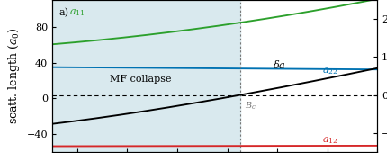

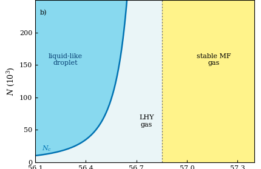

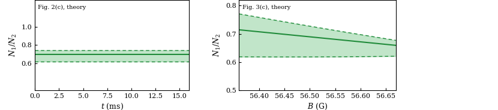

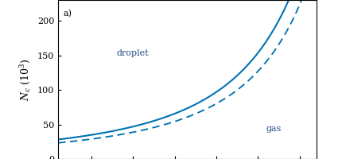

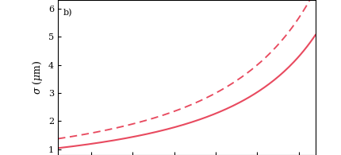

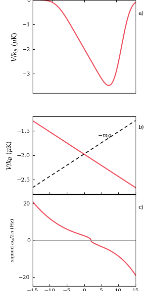

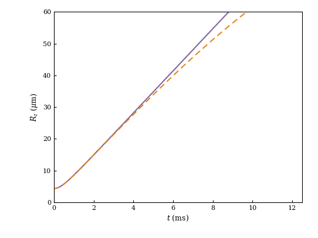
