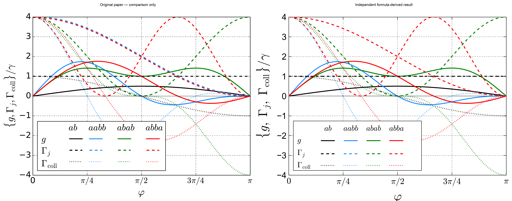
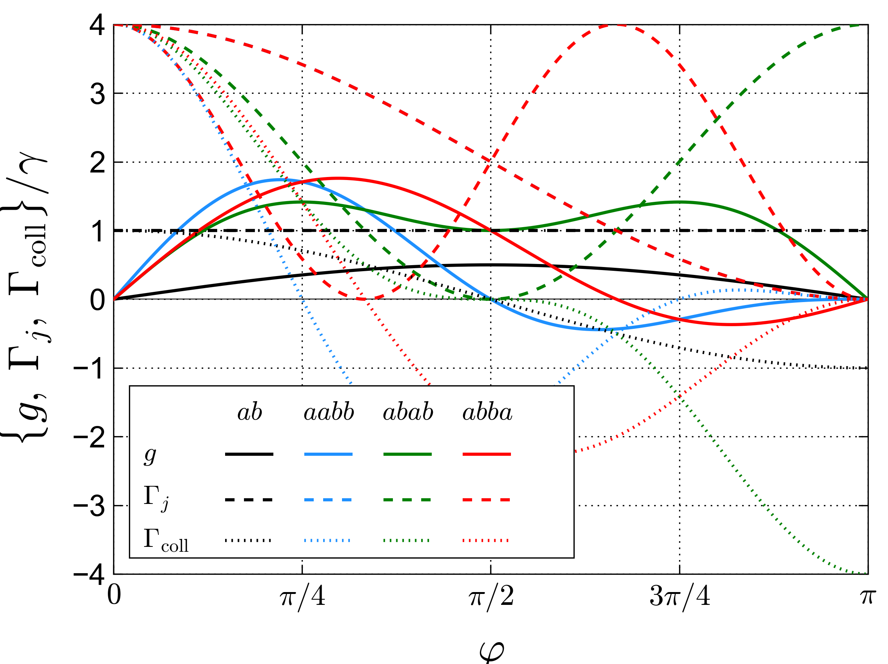

# 1711.08863: Decoherence-Free Interaction between Giant Atoms in Waveguide QED

Preprint: [arXiv:1711.08863 — Decoherence-Free Interaction between Giant Atoms in Waveguide QED](https://arxiv.org/abs/1711.08863)

Published as: [Decoherence-Free Interaction between Giant Atoms in Waveguide QED](https://doi.org/10.1103/PhysRevLett.120.140404)

Formal citation: 120, 140404 (2018) · DOI `10.1103/PhysRevLett.120.140404` · Locator `140404`

Public status: **Scientific reproduction — independent review pending** · Audit score: **87.66/100**

All 13 numerical curves in the paper's only numerical figure are independently formula-derived.

## Start Here / 从这里开始

- [中文复现 Note](note/reproduction-note.zh-CN.md)
- [English reproduction note](note/reproduction-note.en.md)
- [Equation-level derivation](docs/DERIVATION.md)
- [Numerical methods](docs/NUMERICAL_METHODS.md)
- [Public evidence index](docs/EVIDENCE_INDEX.md)
- [Comparison policy](docs/COMPARISON_POLICY.md)
- [Scientific consistency report](docs/CONSISTENCY_REPORT.md)
- [Paper review protocol](docs/PAPER_REVIEW_PROTOCOL_V2.md)
- [Code and run commands](code/README.md)
- [Machine-readable scorecard](outputs/checks/similarity_scorecard.json)
- [Machine-readable completion boundary](outputs/checks/completion_assessment.json)
- [Derivation (equations)](docs/DERIVATION.md)
- [Numerical methods](docs/NUMERICAL_METHODS.md)
- [Lessons learned](docs/LESSONS_LEARNED.md)

## Paper Reference vs Independent Reproduction

Each board contains only the minimum paper excerpt needed for validation and places it beside an independently generated result. Visual agreement is a scientific-region diagnostic, not author-data-level equivalence.

### T001 main fig2 comparison



## Quick Run

```bash
python -m venv .venv
source .venv/bin/activate
pip install -r requirements.txt
cd cases/1711.08863/code
python scripts/run_reproduction.py --config config/paper_exact.json
```

Published machine-readable artifacts are kept under [data](outputs/data/), [figures](outputs/figures/), [checks](outputs/checks/).

## Reproduction Boundary

This public case includes paper-derived code, generated data, generated figures, public validation checks, explanatory notes, and 1 limited comparison panels. Those panels use the minimum paper excerpts needed for validation and clearly separate the paper reference from the independent result. The case does not redistribute the paper PDF, arXiv source archive, standalone original figures, EPS paths, digitized source curves, or source-derived point sets.

Remaining limitation: Whole-paper atomic audit: 4 eligible items, 4 reproduced; coverage 100.00%, fidelity and degree 87.66. T002-T004 use exact all-size witnesses plus isolated numerical sanity checks and do not require raster targets. Artifact and scientific checks pass for T001-T004; fresh-context independent review remains a lifecycle gate.

Final-parameter rule: final public figures use the paper parameters when feasible. Any reduced-scale, subset, proxy, or blocked target must be labeled explicitly and cannot be presented as a complete reproduction.

## Generated Figures


