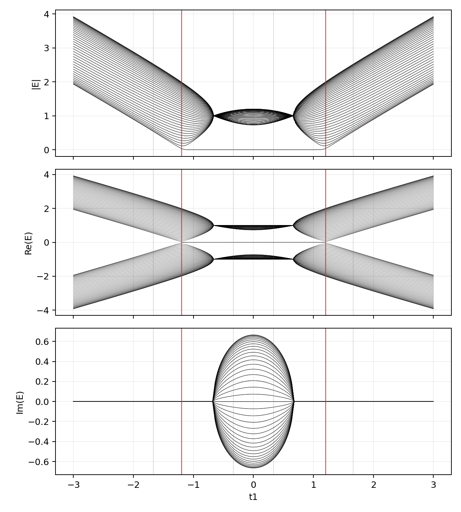
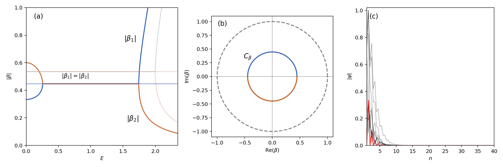
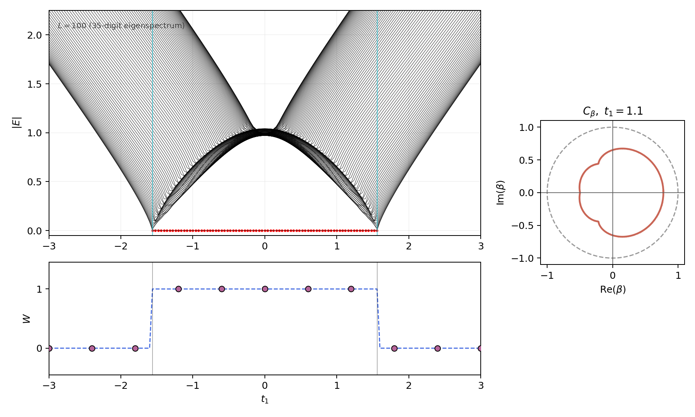
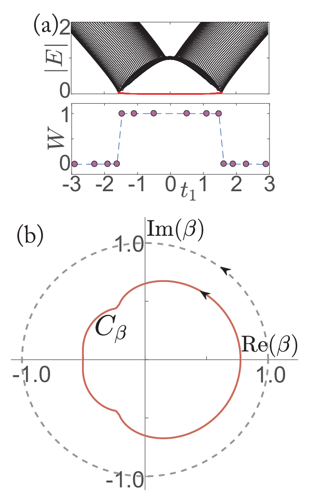
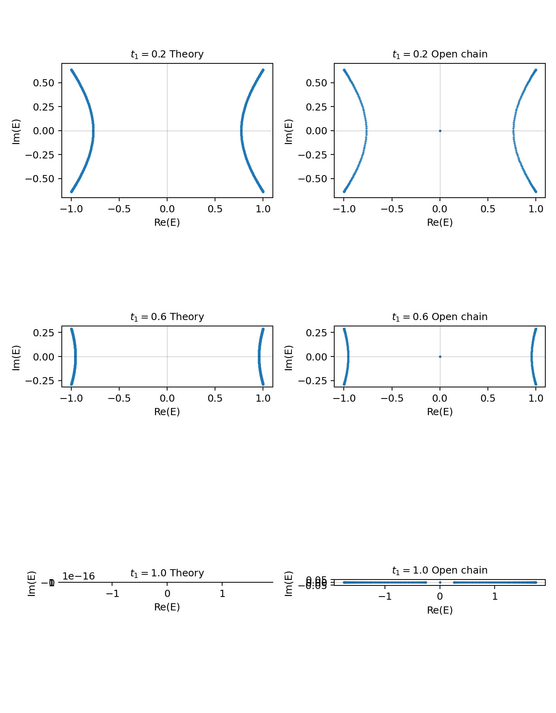
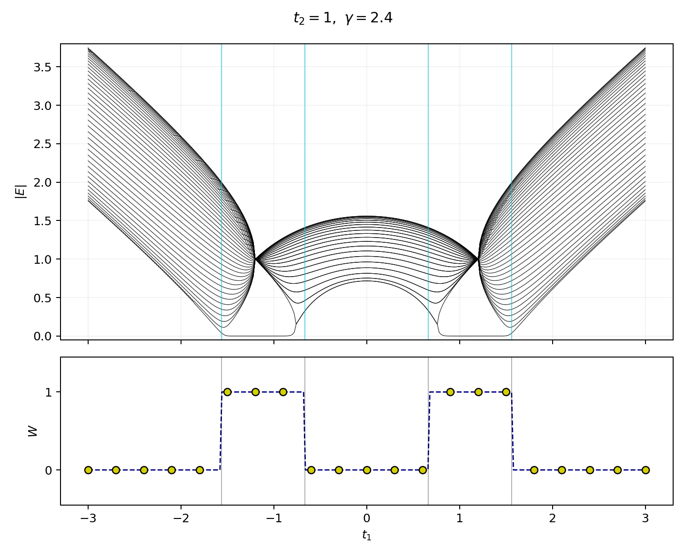

# 1803.01876: Edge states and topological invariants of non-Hermitian systems

Preprint: [arXiv:1803.01876 — Edge states and topological invariants of non-Hermitian systems](https://arxiv.org/abs/1803.01876)

Published as: [Edge States and Topological Invariants of Non-Hermitian Systems](https://doi.org/10.1103/PhysRevLett.121.086803)

Formal citation: Phys. Rev. Lett. 121, 086803 (2018) · DOI `10.1103/PhysRevLett.121.086803` · Locator `086803`

Public status: **Partial scientific reproduction** · Audit score: **94.00/100**

所有评分 target 已加入原文图源 digitization：Fig. 2、Fig. 3、Fig. 4、Fig. 5 和补充图均有 EPS/PNG reference CSV 与 generated data 对照。Fig. 2/Fig. 3 共用的开链实空间方程和补充图使用的开边界 bulk spectrum 均已升级为 source_and_symbolic 公式门禁；剩余边界是：这些仍不是作者原始 plotting data。

## Start Here / 从这里开始

- [中文复现 Note](note/reproduction-note.zh-CN.md)
- [English reproduction note](note/reproduction-note.en.md)
- [Equation-level derivation](docs/DERIVATION.md)
- [Numerical methods](docs/NUMERICAL_METHODS.md)
- [Public evidence index](docs/EVIDENCE_INDEX.md)
- [Comparison policy](docs/COMPARISON_POLICY.md)
- [Scientific consistency report](docs/CONSISTENCY_REPORT.md)
- [Independent paper assessment](docs/PAPER_ASSESSMENT.md)
- [Code and run commands](code/README.md)
- [Machine-readable scorecard](outputs/checks/similarity_scorecard.json)
- [Machine-readable completion boundary](outputs/checks/completion_assessment.json)
- [Derivation (equations)](docs/DERIVATION.md)
- [Numerical methods](docs/NUMERICAL_METHODS.md)
- [Lessons learned](docs/LESSONS_LEARNED.md)

## Quick Run

```bash
python -m venv .venv
source .venv/bin/activate
pip install -r requirements.txt
cd cases/1803.01876/code
python scripts/run_reproduction.py --config config/implementation_closure.json --output-root outputs/public_quick_run
```

Published machine-readable artifacts are kept under [data](outputs/data/), [figures](outputs/figures/), [checks](outputs/checks/).

## Reproduction Boundary

This public case includes paper-derived code, generated data, generated figures, public validation checks, explanatory notes. It does not redistribute the paper PDF, arXiv source archive, original figures, EPS paths, digitized source curves, source-derived point sets, or source-vs-generated composite panels.

Remaining limitation: Remaining lifecycle boundaries: parameters=mixed, causal_resolution=repair_required, science=failed, pixel=missing, paper_assessment=inconclusive.

Final-parameter rule: final public figures use the paper parameters when feasible. Any reduced-scale, subset, proxy, or blocked target must be labeled explicitly and cannot be presented as a complete reproduction.

## Generated Figures
















