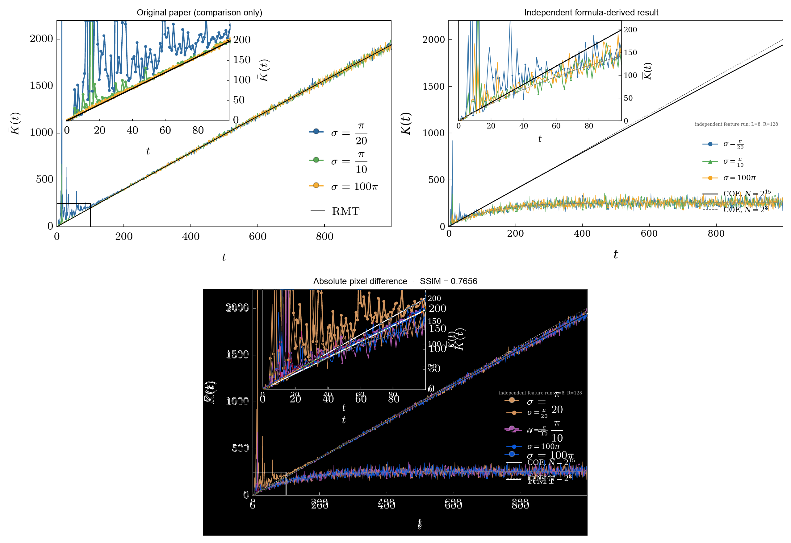
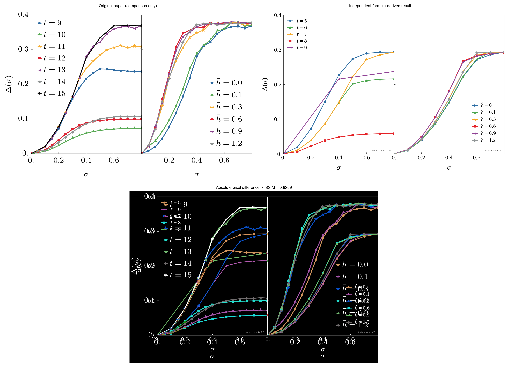
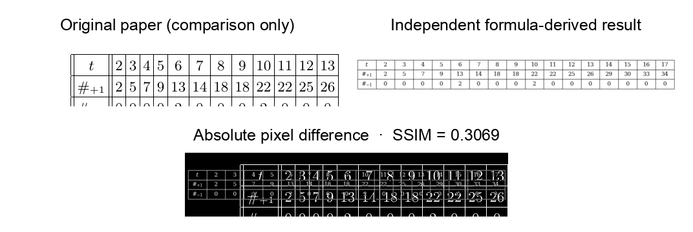
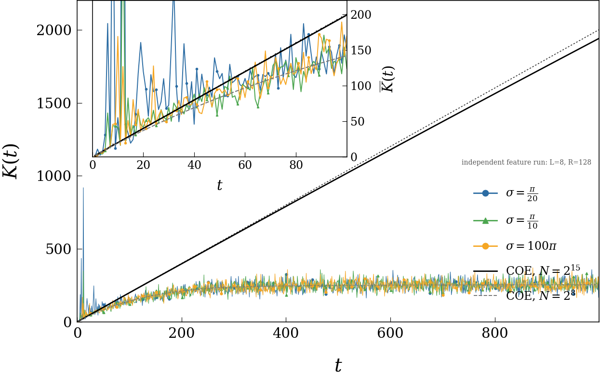
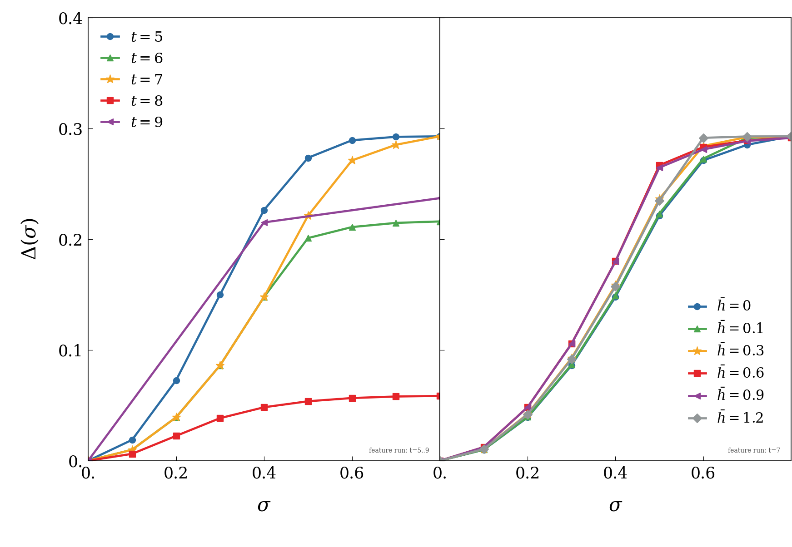
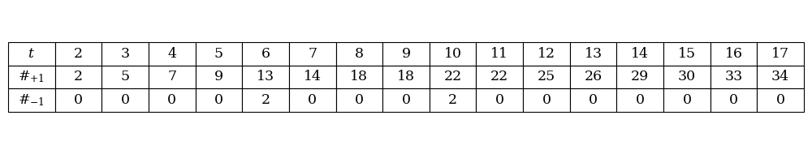

# 1805.00931: Exact Spectral Form Factor in a Minimal Model of Many-Body Quantum Chaos

Preprint: [arXiv:1805.00931 — Exact Spectral Form Factor in a Minimal Model of Many-Body Quantum Chaos](https://arxiv.org/abs/1805.00931)

Published as: [Exact Spectral Form Factor in a Minimal Model of Many-Body Quantum Chaos](https://doi.org/10.1103/PhysRevLett.121.264101)

Formal citation: Phys. Rev. Lett. 121, 264101 (2018) · DOI `10.1103/PhysRevLett.121.264101` · Locator `121, 264101`

Public status: **Partial scientific reproduction** · Audit score: **75.01/100**

All five numerical targets are formula-derived; Table I is paper-exact, while Figures 2 and 3 remain reduced-scale and therefore exploratory.

## Start Here / 从这里开始

- [中文复现 Note](note/reproduction-note.zh-CN.md)
- [English reproduction note](note/reproduction-note.en.md)
- [Equation-level derivation](docs/DERIVATION.md)
- [Numerical methods](docs/NUMERICAL_METHODS.md)
- [Public evidence index](docs/EVIDENCE_INDEX.md)
- [Comparison policy](docs/COMPARISON_POLICY.md)
- [Scientific consistency report](docs/CONSISTENCY_REPORT.md)
- [Code and run commands](code/README.md)
- [Machine-readable scorecard](outputs/checks/similarity_scorecard.json)
- [Machine-readable completion boundary](outputs/checks/completion_assessment.json)
- [Derivation (equations)](docs/DERIVATION.md)
- [Numerical methods](docs/NUMERICAL_METHODS.md)
- [Lessons learned](docs/LESSONS_LEARNED.md)

## Paper Reference vs Independent Reproduction

Each board contains only the minimum paper excerpt needed for validation and places it beside an independently generated result. Visual agreement is a scientific-region diagnostic, not author-data-level equivalence.

### main fig2 side by side comparison



### main fig3 side by side comparison



### table1 side by side comparison



## Quick Run

```bash
python -m venv .venv
source .venv/bin/activate
pip install -r requirements.txt
cd cases/1805.00931/code
python scripts/run_reproduction.py --config config/feature.json
```

Generated files are kept under [data](outputs/data/), [figures](outputs/figures/), and [checks](outputs/checks/).

## Reproduction Boundary

This public case includes paper-derived code, generated data, generated figures, public validation checks, explanatory notes, and 3 limited comparison panels. Those panels use the minimum paper excerpts needed for validation and clearly separate the paper reference from the independent result. The case does not redistribute the paper PDF, arXiv source archive, standalone original figures, EPS paths, digitized source curves, or source-derived point sets.

Remaining limitation: Table I is paper-exact; Figures 2 and 3 are reduced-scale exploratory artifacts. Fresh-context independent review and paper-scale Figure 2/3 runs remain pending.

Final-parameter rule: final public figures use the paper parameters when feasible. Any reduced-scale, subset, proxy, or blocked target must be labeled explicitly and cannot be presented as a complete reproduction.

## Generated Figures






