# 1807.01815: Periodic Orbits, Entanglement, and Quantum Many-Body Scars in Constrained Models: Matrix Product State Approach

Preprint: [arXiv:1807.01815 — Periodic Orbits, Entanglement, and Quantum Many-Body Scars in Constrained Models: Matrix Product State Approach](https://arxiv.org/abs/1807.01815)

Published as: [Periodic Orbits, Entanglement, and Quantum Many-Body Scars in Constrained Models: Matrix Product State Approach](https://doi.org/10.1103/PhysRevLett.122.040603)

Formal citation: 122, 040603 (2019) · DOI `10.1103/PhysRevLett.122.040603` · Locator `040603`

Public status: **Partial scientific reproduction** · Audit score: **67.08/100**

Thirteen of fifteen independently generated numerical subpanels reproduce their declared scientific feature; Supplement Fig. S2(a,b) has one shared stable difference currently classified as parameter_ambiguity; it is not eligible for paper_error_candidate.

## Start Here / 从这里开始

- [中文复现 Note](note/reproduction-note.zh-CN.md)
- [English reproduction note](note/reproduction-note.en.md)
- [Equation-level derivation](docs/DERIVATION.md)
- [Numerical methods](docs/NUMERICAL_METHODS.md)
- [Public evidence index](docs/EVIDENCE_INDEX.md)
- [Comparison policy](docs/COMPARISON_POLICY.md)
- [Scientific consistency report](docs/CONSISTENCY_REPORT.md)
- [Code and run commands](code/README.md)
- [Machine-readable scorecard](outputs/checks/similarity_scorecard.json)
- [Machine-readable completion boundary](outputs/checks/completion_assessment.json)
- [Derivation (equations)](docs/DERIVATION.md)
- [Numerical methods](docs/NUMERICAL_METHODS.md)
- [Lessons learned](docs/LESSONS_LEARNED.md)

## Paper Reference vs Independent Reproduction

Each board contains only the minimum paper excerpt needed for validation and places it beside an independently generated result. Visual agreement is a scientific-region diagnostic, not author-data-level equivalence.

### T FIG1A side by side comparison

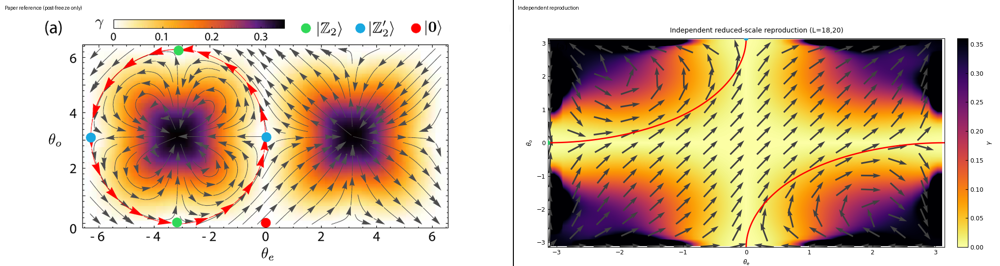

### T FIG1B side by side comparison

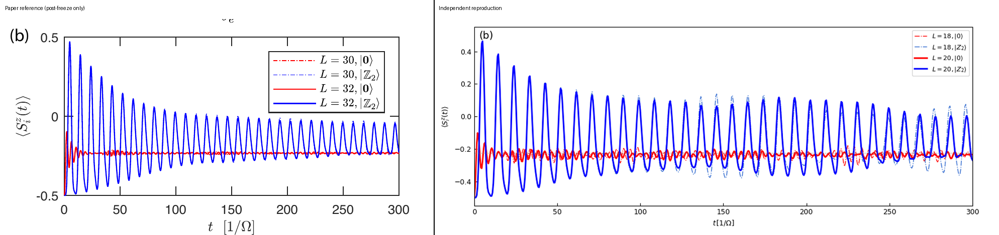

### T FIG1 side by side comparison

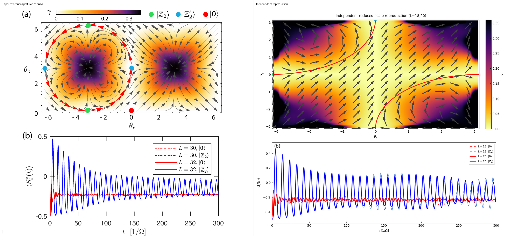

### T FIG2A side by side comparison

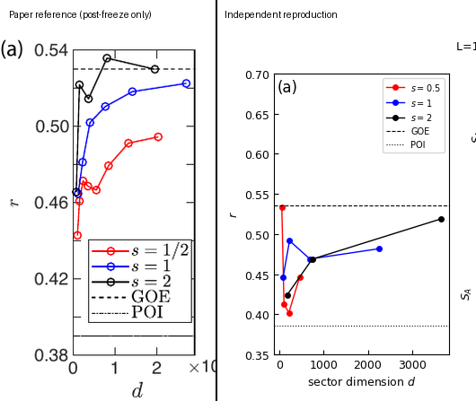

### T FIG2B side by side comparison

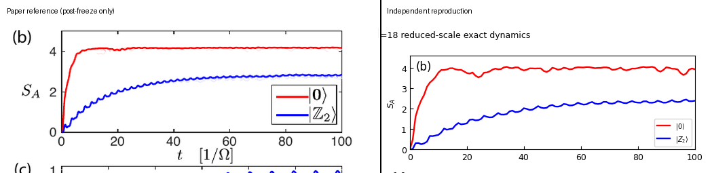

### T FIG2C side by side comparison

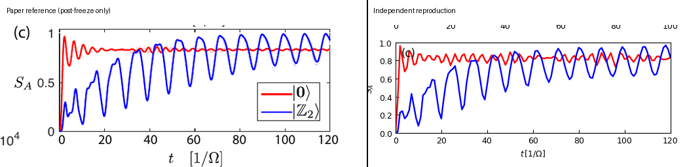

### T FIG2 side by side comparison

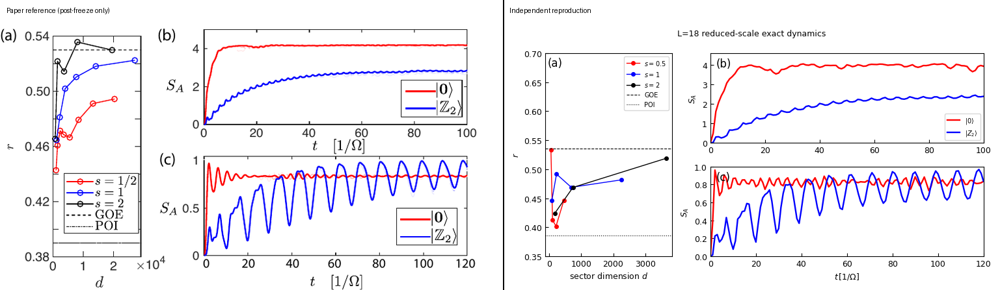

### T FIG4A side by side comparison

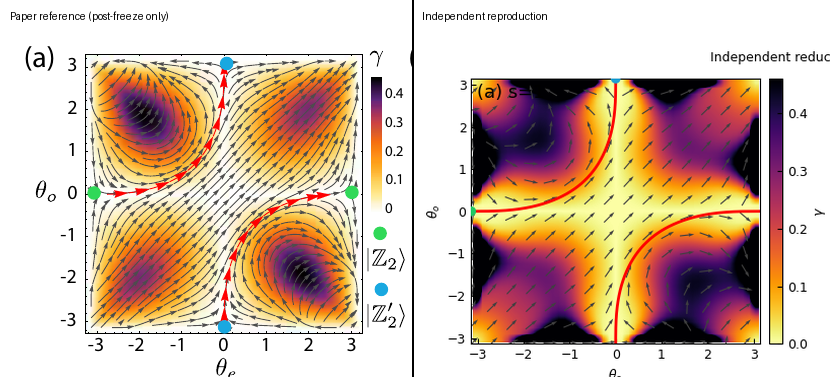

### T FIG4B side by side comparison

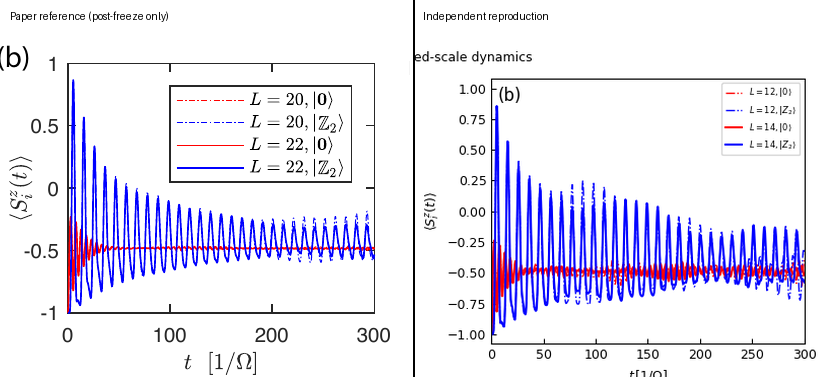

### T FIG4C side by side comparison

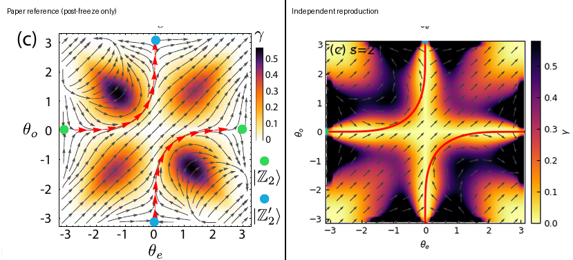

### T FIG4D side by side comparison

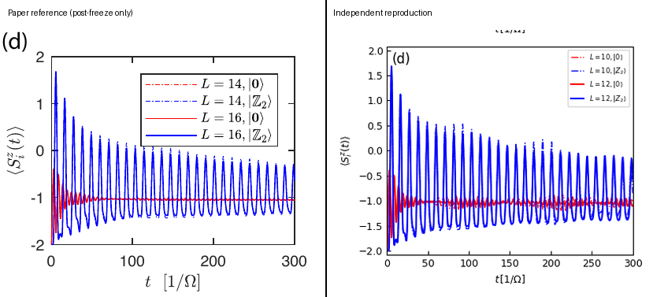

### T FIG4 side by side comparison

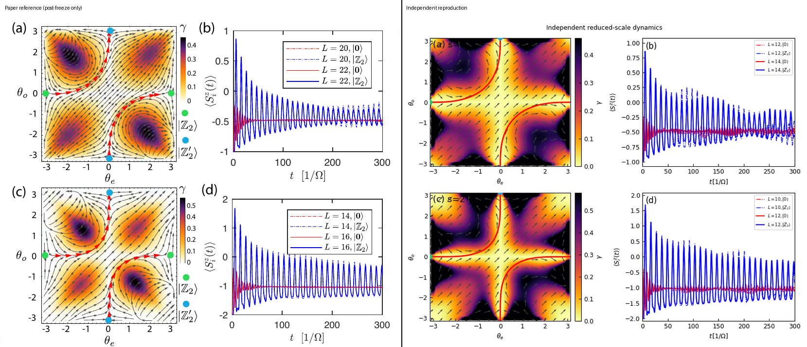

### T FIGS1 H000 side by side comparison

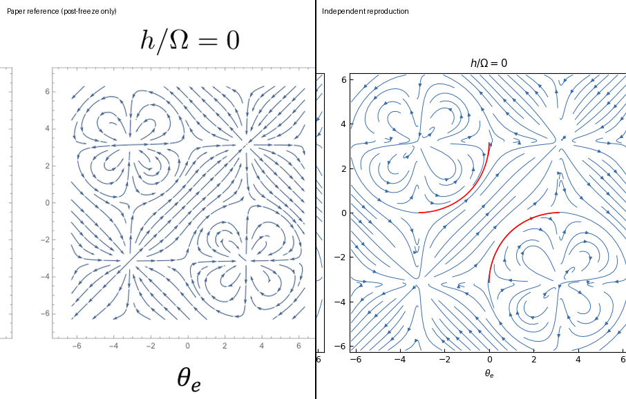

### T FIGS1 H020 side by side comparison

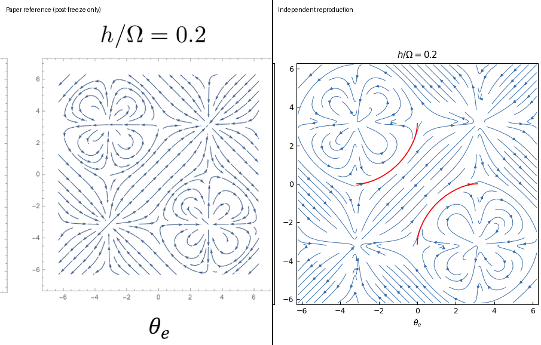

### T FIGS1 H040 side by side comparison

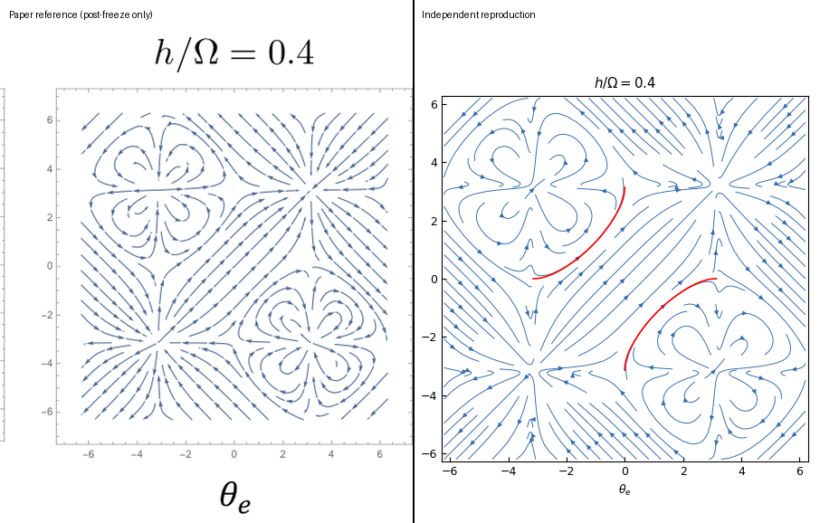

### T FIGS1 HM020 side by side comparison

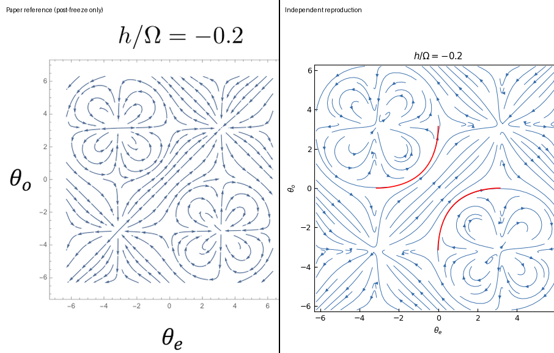

### T FIGS1 side by side comparison

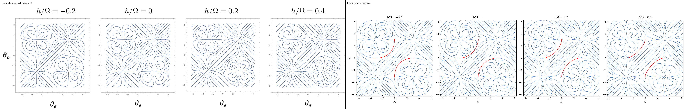

### T FIGS2A side by side comparison

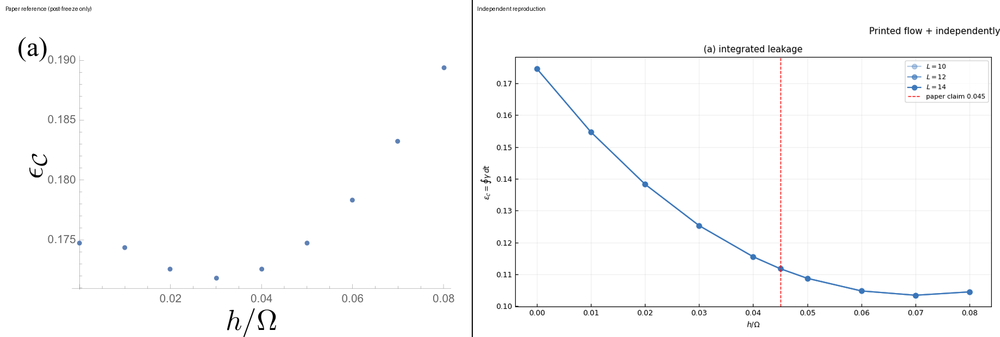

### T FIGS2B side by side comparison

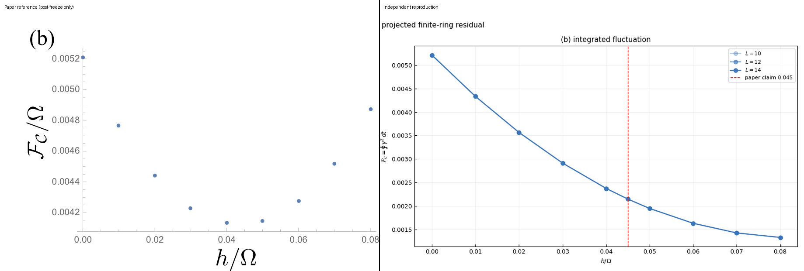

### T FIGS2 side by side comparison

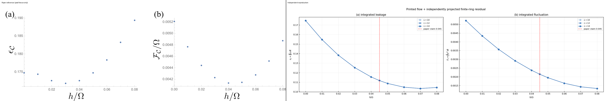

## Quick Run

```bash
python -m venv .venv
source .venv/bin/activate
pip install -r requirements.txt
cd cases/1807.01815/code
python scripts/run_reproduction.py
```

Generated files are kept under [data](outputs/data/), [figures](outputs/figures/), and [checks](outputs/checks/).

## Reproduction Boundary

This public case includes paper-derived code, generated data, generated figures, public validation checks, explanatory notes, and 20 limited comparison panels. Those panels use the minimum paper excerpts needed for validation and clearly separate the paper reference from the independent result. The case does not redistribute the paper PDF, arXiv source archive, standalone original figures, EPS paths, digitized source curves, or source-derived point sets.

Remaining limitation: Remaining lifecycle boundaries: artifact_integrity=artifact_valid_with_warnings, parameters=mixed, science=failed, pixel=not_applicable, independent_review=missing, paper_assessment=missing.

Final-parameter rule: final public figures use the paper parameters when feasible. Any reduced-scale, subset, proxy, or blocked target must be labeled explicitly and cannot be presented as a complete reproduction.

## Generated Figures

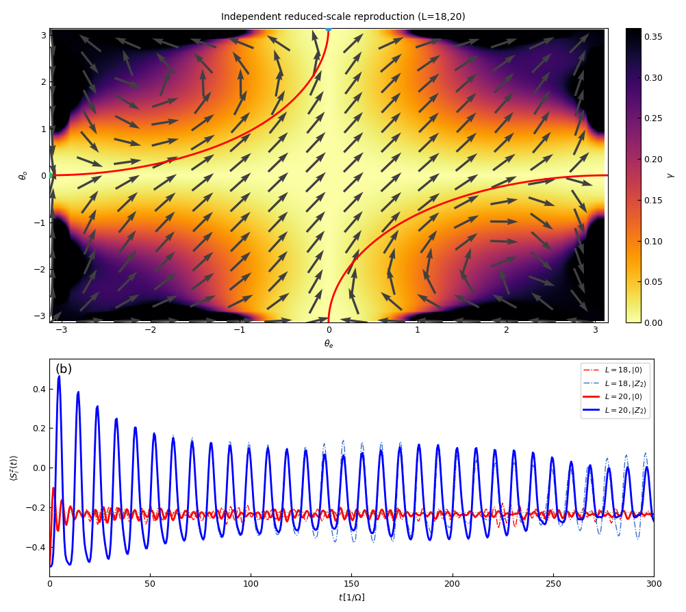

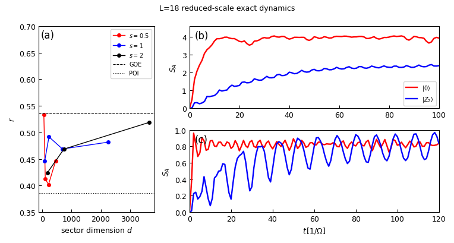

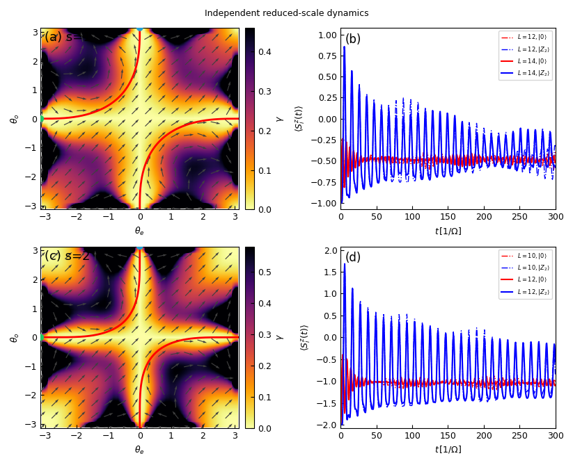

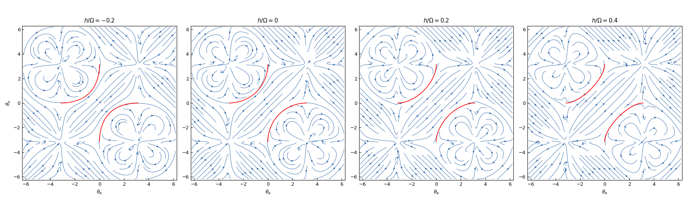

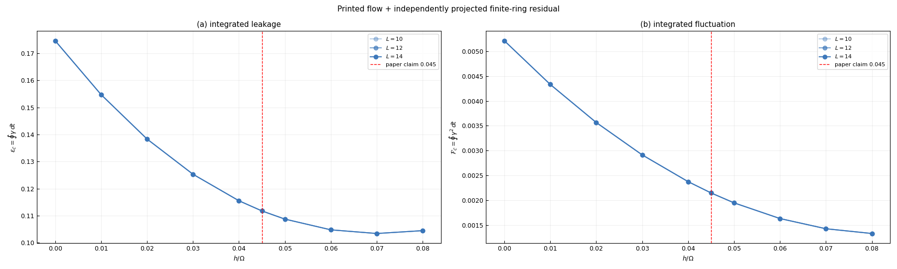
