# 1807.10676: All "Magic Angles" Are "Stable" Topological

Preprint: [arXiv:1807.10676v2 — All "Magic Angles" Are "Stable" Topological](https://arxiv.org/abs/1807.10676)

Published as: [All "Magic Angles" Are "Stable" Topological](https://doi.org/10.1103/PhysRevLett.123.036401)

Formal citation: 123, 036401 (2019) · DOI `10.1103/PhysRevLett.123.036401` · Locator `036401`

Public status: **Partial scientific reproduction** · Audit score: **69.77/100**

Forty-two executable numerical subpanels are formula-derived; the licensed DFT campaign remains explicitly deferred.

## Start Here / 从这里开始

- [中文复现 Note](note/reproduction-note.zh-CN.md)
- [English reproduction note](note/reproduction-note.en.md)
- [Equation-level derivation](docs/DERIVATION.md)
- [Numerical methods](docs/NUMERICAL_METHODS.md)
- [Public evidence index](docs/EVIDENCE_INDEX.md)
- [Comparison policy](docs/COMPARISON_POLICY.md)
- [Scientific consistency report](docs/CONSISTENCY_REPORT.md)
- [Code and run commands](code/README.md)
- [Machine-readable scorecard](outputs/checks/similarity_scorecard.json)
- [Machine-readable completion boundary](outputs/checks/completion_assessment.json)
- [Derivation (equations)](docs/DERIVATION.md)
- [Numerical methods](docs/NUMERICAL_METHODS.md)
- [Lessons learned](docs/LESSONS_LEARNED.md)

## Paper Reference vs Independent Reproduction

Each board contains only the minimum paper excerpt needed for validation and places it beside an independently generated result. Visual agreement is a scientific-region diagnostic, not author-data-level equivalence.

### T001 side by side comparison

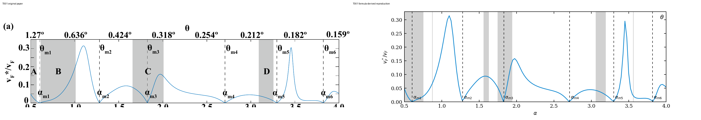

### T002 side by side comparison

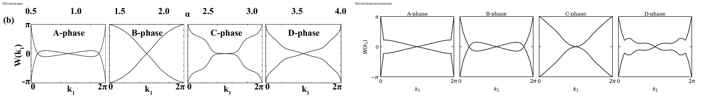

### T003 side by side comparison

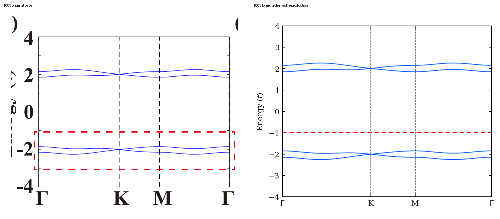

### T004 side by side comparison

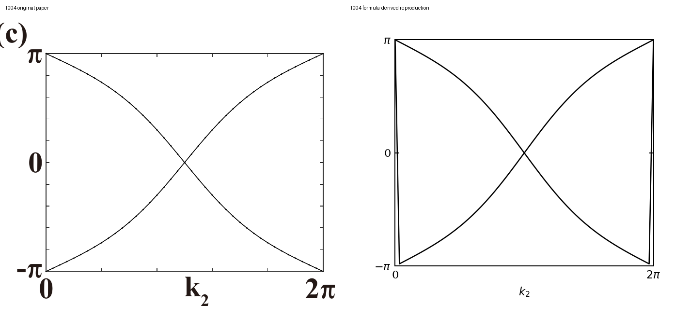

### T005 side by side comparison

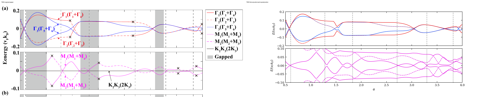

### T006 side by side comparison

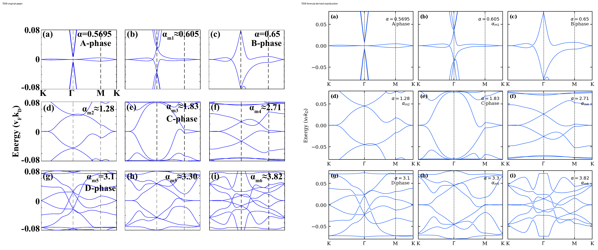

### T007 side by side comparison

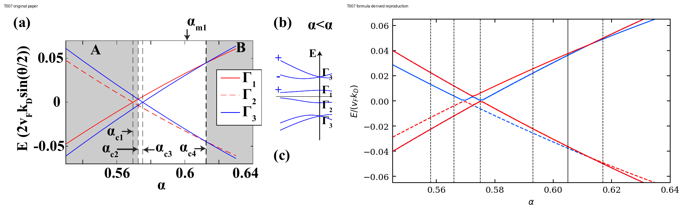

### T008 side by side comparison

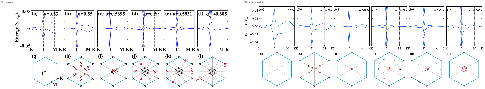

### T009 side by side comparison

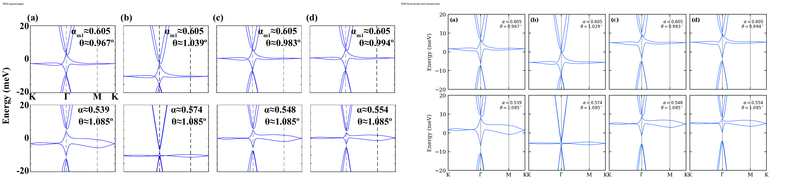

### T010 side by side comparison

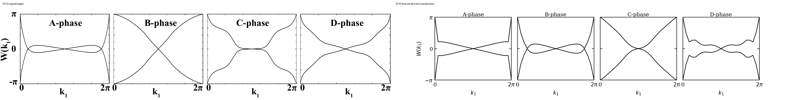

### T011 side by side comparison

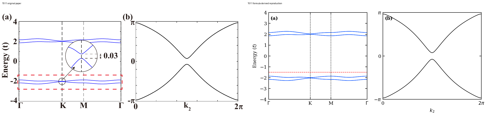

### T012 side by side comparison

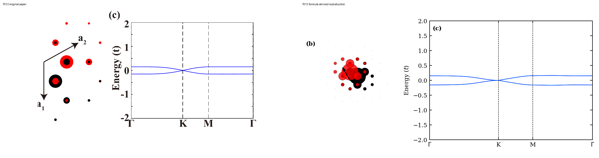

## Quick Run

```bash
python -m venv .venv
source .venv/bin/activate
pip install -r requirements.txt
cd cases/1807.10676/code
python scripts/run_reproduction.py
```

Generated files are kept under [data](outputs/data/), [figures](outputs/figures/), and [checks](outputs/checks/).

## Reproduction Boundary

This public case includes paper-derived code, generated data, generated figures, public validation checks, explanatory notes, and 12 limited comparison panels. Those panels use the minimum paper excerpts needed for validation and clearly separate the paper reference from the independent result. The case does not redistribute the paper PDF, arXiv source archive, standalone original figures, EPS paths, digitized source curves, or source-derived point sets.

Remaining limitation: Twelve DFT numerical entries are explicitly deferred for insufficient compute/license inputs. Fresh-context independent review remains pending.

Final-parameter rule: final public figures use the paper parameters when feasible. Any reduced-scale, subset, proxy, or blocked target must be labeled explicitly and cannot be presented as a complete reproduction.

## Generated Figures

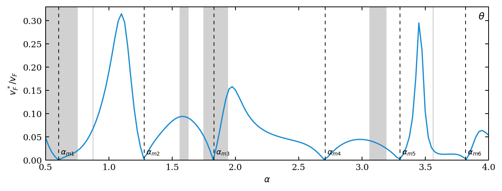


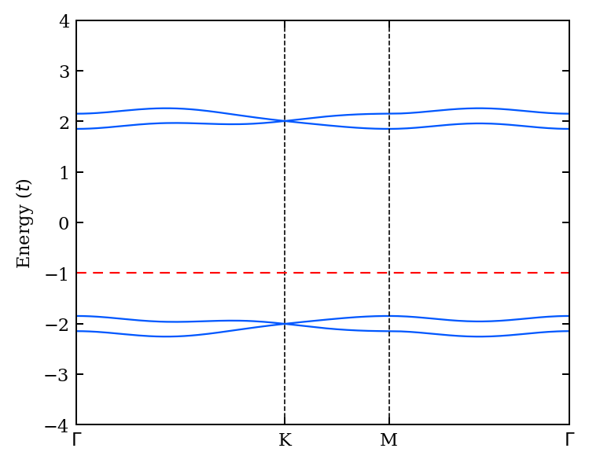

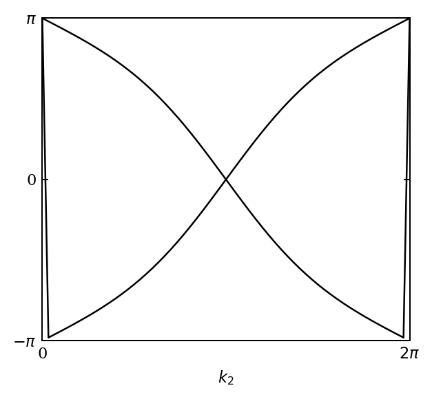

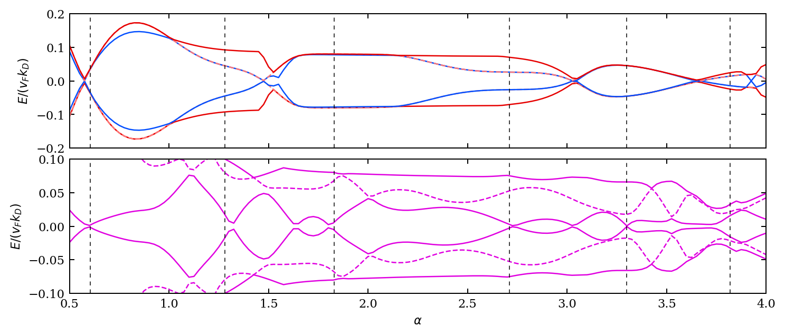

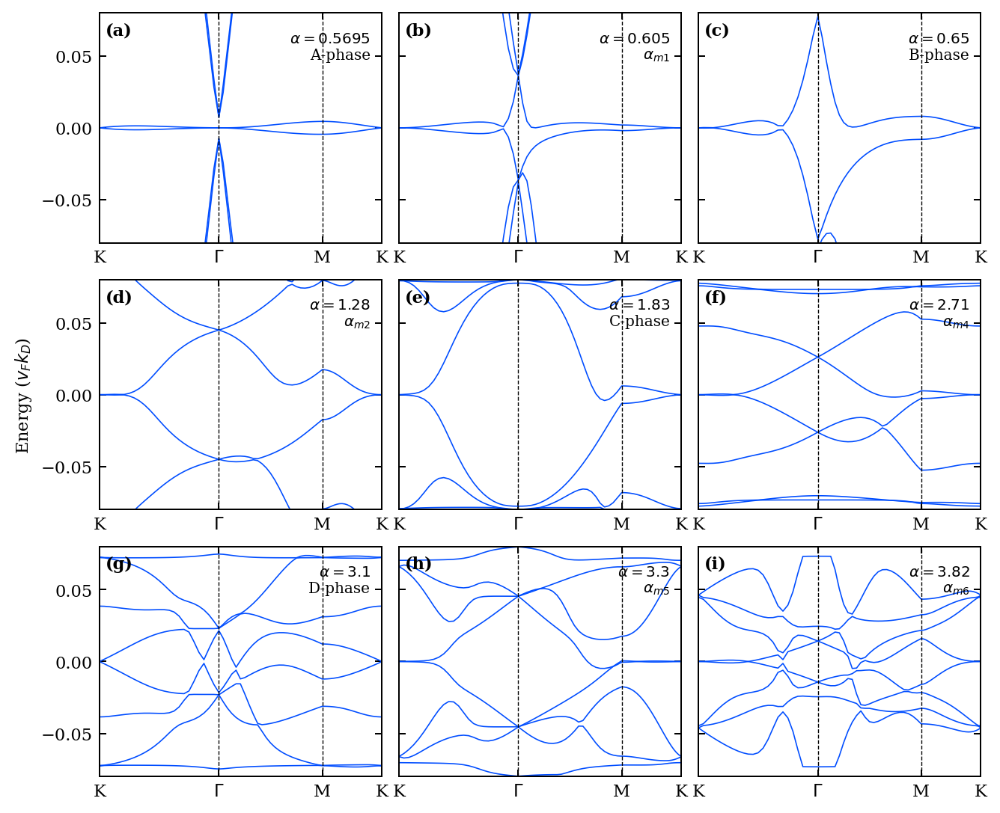

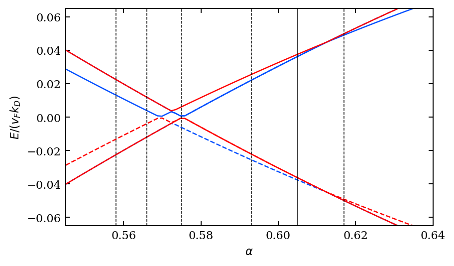

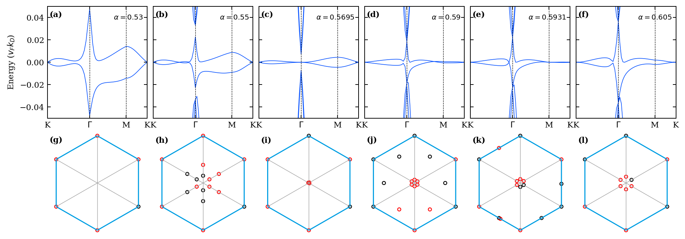

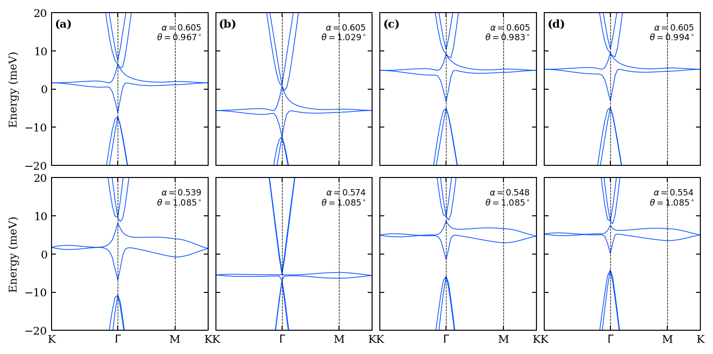

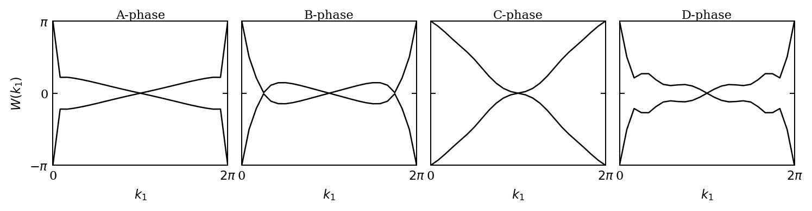

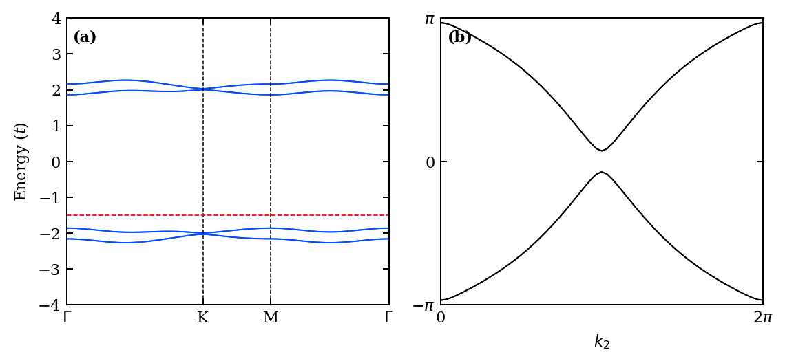

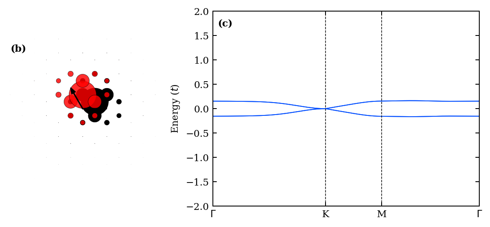

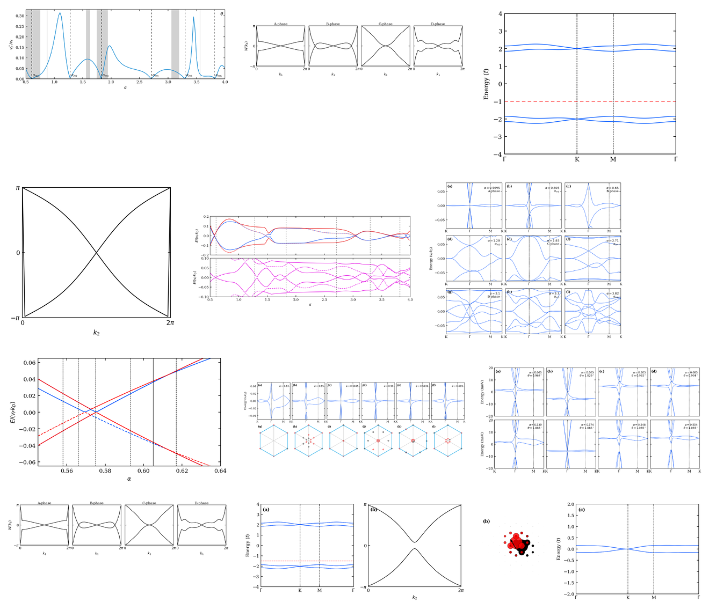
