# 1810.00888: Exact Quantum Many-Body Scar States in the Rydberg-Blockaded Atom Chain

Preprint: [arXiv:1810.00888 — Exact Quantum Many-Body Scar States in the Rydberg-Blockaded Atom Chain](https://arxiv.org/abs/1810.00888)

Published as: [Exact Quantum Many-Body Scar States in the Rydberg-Blockaded Atom Chain](https://doi.org/10.1103/PhysRevLett.122.173401)

Formal citation: Phys. Rev. Lett. 122, 173401 (2019) · DOI `10.1103/PhysRevLett.122.173401` · Locator `173401`

Public status: **Scientific reproduction — independent review pending** · Audit score: **80.33/100**

All nine numerical figure targets have a formula-derived paper-scale implementation.

## Start Here / 从这里开始

- [中文复现 Note](note/reproduction-note.zh-CN.md)
- [English reproduction note](note/reproduction-note.en.md)
- [Equation-level derivation](docs/DERIVATION.md)
- [Numerical methods](docs/NUMERICAL_METHODS.md)
- [Public evidence index](docs/EVIDENCE_INDEX.md)
- [Comparison policy](docs/COMPARISON_POLICY.md)
- [Scientific consistency report](docs/CONSISTENCY_REPORT.md)
- [Paper review protocol](docs/PAPER_REVIEW_PROTOCOL_V2.md)
- [Paper-error candidates](docs/PAPER_ERROR_CANDIDATES.md)
- [Code and run commands](code/README.md)
- [Machine-readable scorecard](outputs/checks/similarity_scorecard.json)
- [Machine-readable completion boundary](outputs/checks/completion_assessment.json)
- [Derivation (equations)](docs/DERIVATION.md)
- [Numerical methods](docs/NUMERICAL_METHODS.md)
- [Lessons learned](docs/LESSONS_LEARNED.md)

## Paper Reference vs Independent Reproduction

Each board contains only the minimum paper excerpt needed for validation and places it beside an independently generated result. Visual agreement is a scientific-region diagnostic, not author-data-level equivalence.

### MAIN FIG1 comparison

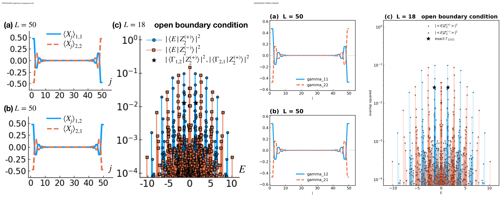

### MAIN FIG2 comparison

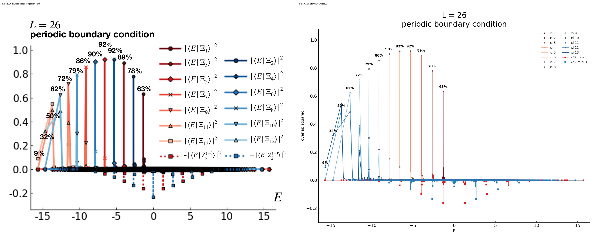

### SUPP BOND3 comparison

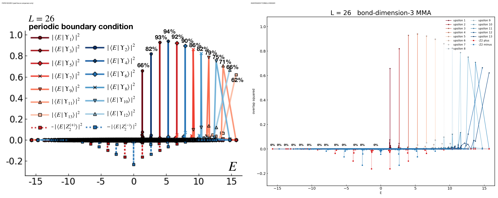

### SUPP ENTROPY comparison

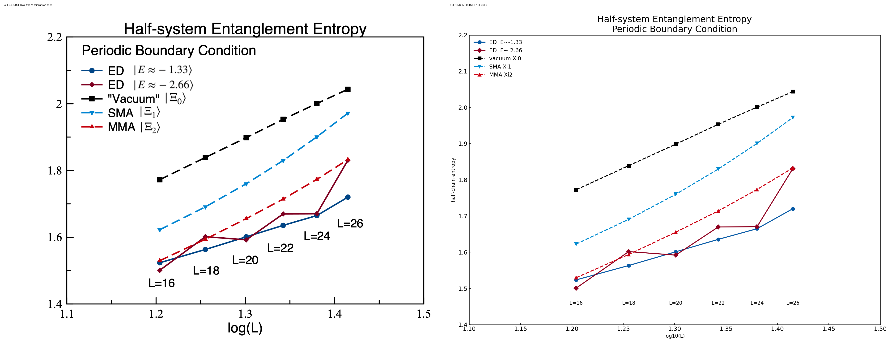

### SUPP FSA comparison

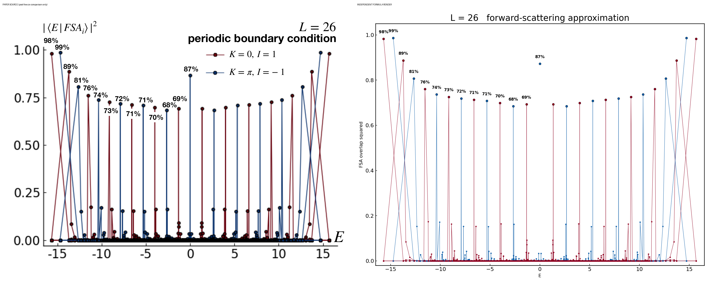

### SUPP REDIAG comparison

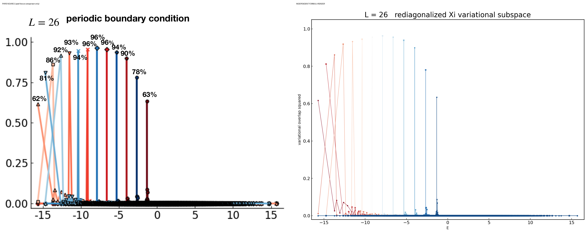

### SUPP SMA comparison

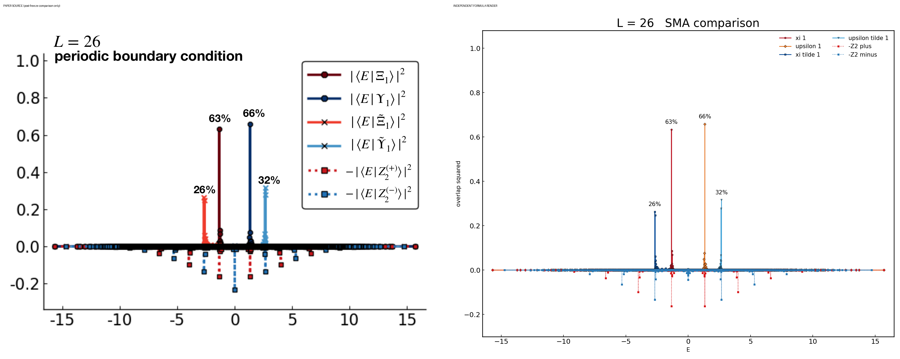

## Quick Run

```bash
python -m venv .venv
source .venv/bin/activate
pip install -r requirements.txt
cd cases/1810.00888/code
python scripts/run_reproduction.py --config config/smoke.json --output outputs/public_quick_run
```

Generated files are kept under [data](outputs/data/), [figures](outputs/figures/), and [checks](outputs/checks/).

## Reproduction Boundary

This public case includes paper-derived code, generated data, generated figures, public validation checks, explanatory notes, and 7 limited comparison panels. Those panels use the minimum paper excerpts needed for validation and clearly separate the paper reference from the independent result. The case does not redistribute the paper PDF, arXiv source archive, standalone original figures, EPS paths, digitized source curves, or source-derived point sets.

Remaining limitation: The isolated paper-scale run and fresh-context protocol-v2 review are recorded. T001/T002 and T006/T007 carry independently validated paper-error candidates; the remaining targets support the paper.

Final-parameter rule: final public figures use the paper parameters when feasible. Any reduced-scale, subset, proxy, or blocked target must be labeled explicitly and cannot be presented as a complete reproduction.

## Generated Figures

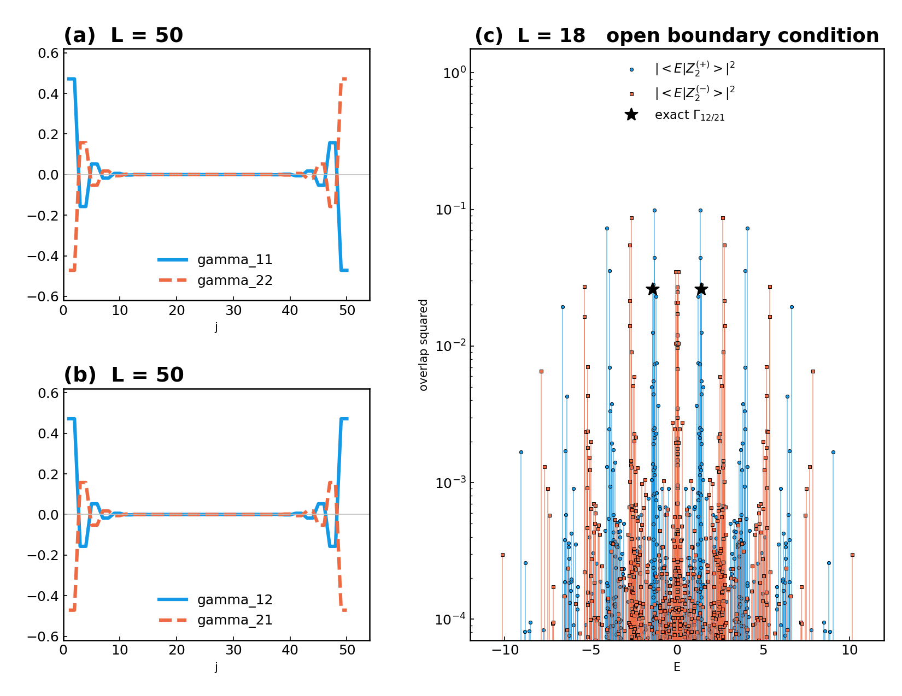

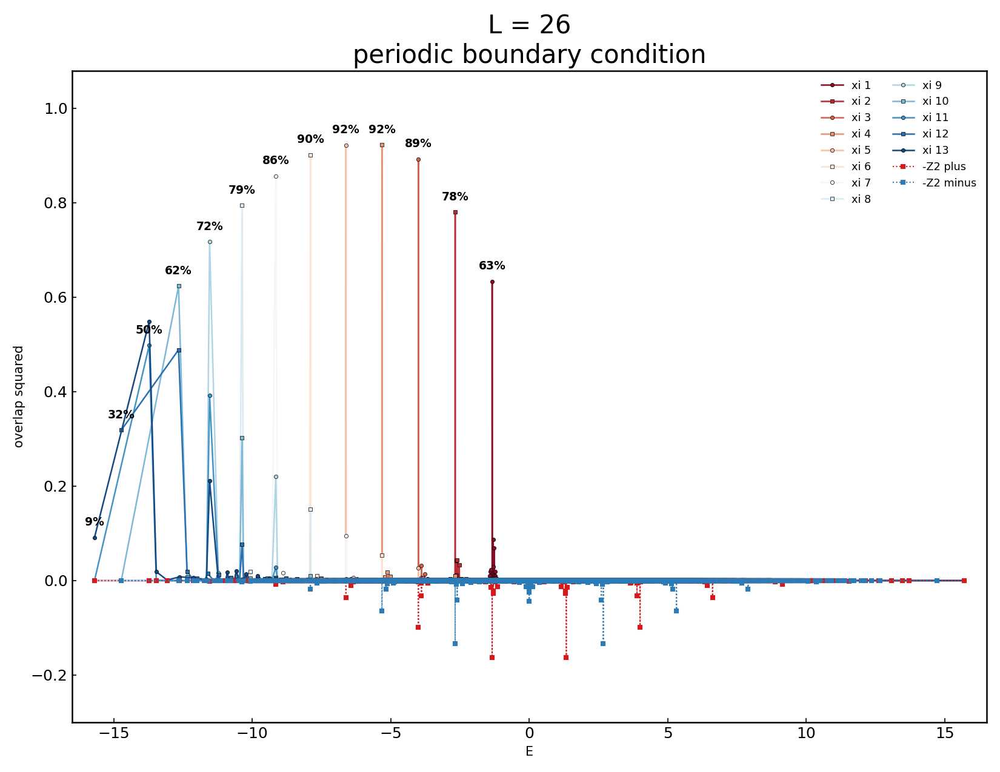

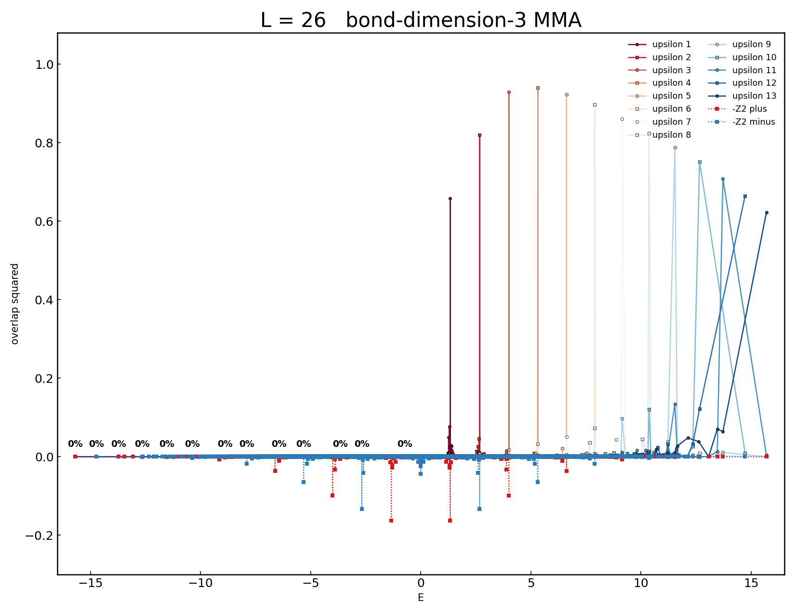

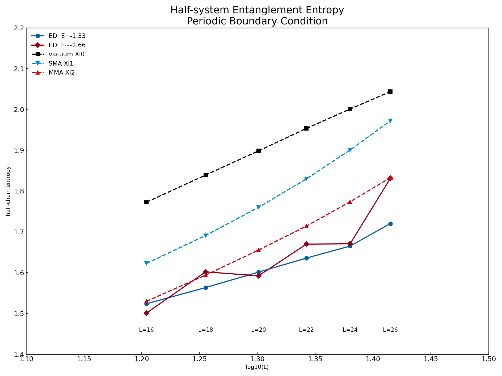

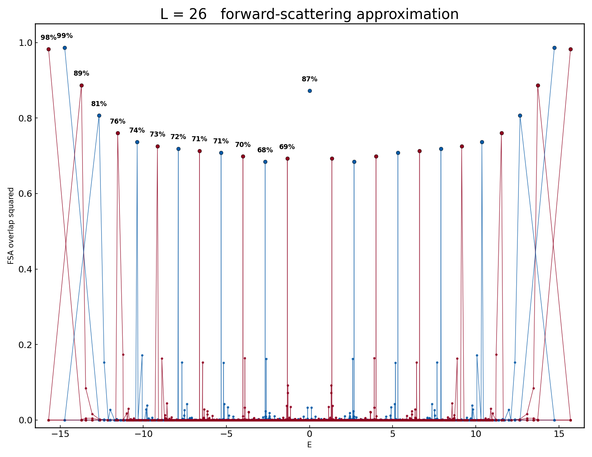

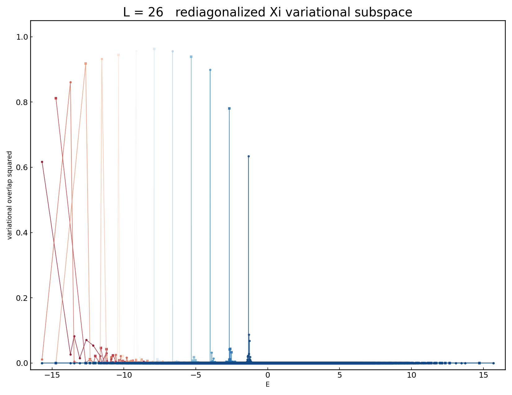

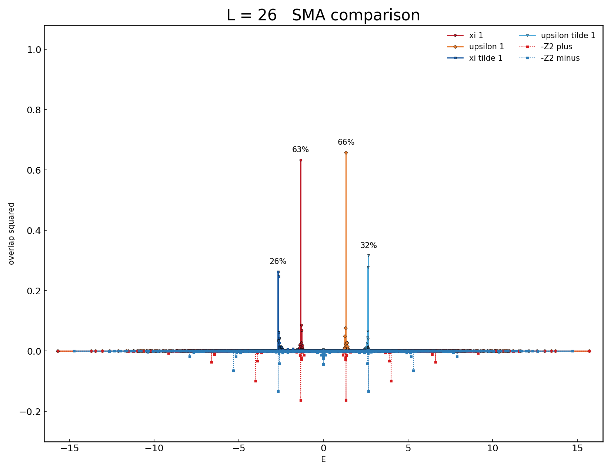
