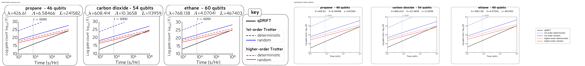
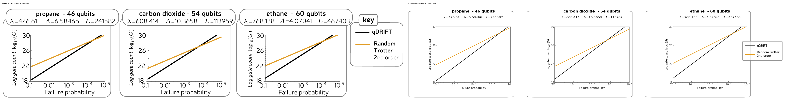
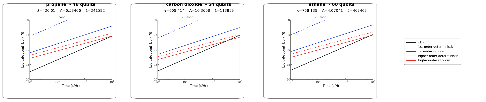
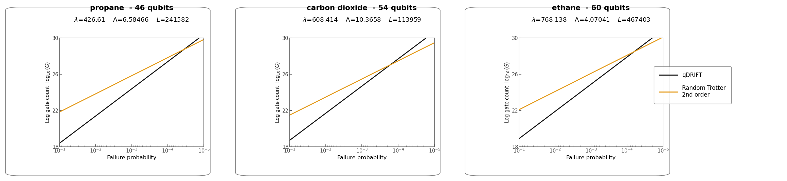

# 1811.08017: A random compiler for fast Hamiltonian simulation

Preprint: [arXiv:1811.08017 — A random compiler for fast Hamiltonian simulation](https://arxiv.org/abs/1811.08017)

Published as: [Random Compiler for Fast Hamiltonian Simulation](https://doi.org/10.1103/PhysRevLett.123.070503)

Formal citation: 123, 070503 (2019) · DOI `10.1103/PhysRevLett.123.070503` · Locator `070503`

Public status: **Scientific reproduction — independent review pending** · Audit score: **90.00/100**

All numerical figures and every numerical subpanel were reproduced from paper formulas at the declared scale.

## Start Here / 从这里开始

- [中文复现 Note](note/reproduction-note.zh-CN.md)
- [English reproduction note](note/reproduction-note.en.md)
- [Equation-level derivation](docs/DERIVATION.md)
- [Numerical methods](docs/NUMERICAL_METHODS.md)
- [Public evidence index](docs/EVIDENCE_INDEX.md)
- [Comparison policy](docs/COMPARISON_POLICY.md)
- [Scientific consistency report](docs/CONSISTENCY_REPORT.md)
- [Paper review protocol](docs/PAPER_REVIEW_PROTOCOL_V2.md)
- [Reported discrepancy assessment](docs/PROPANE_SPEEDUP_ERRATUM.md)
- [Code and run commands](code/README.md)
- [Machine-readable scorecard](outputs/checks/similarity_scorecard.json)
- [Machine-readable completion boundary](outputs/checks/completion_assessment.json)
- [Derivation (equations)](docs/DERIVATION.md)
- [Numerical methods](docs/NUMERICAL_METHODS.md)
- [Lessons learned](docs/LESSONS_LEARNED.md)

## Paper Reference vs Independent Reproduction

Each board contains only the minimum paper excerpt needed for validation and places it beside an independently generated result. Visual agreement is a scientific-region diagnostic, not author-data-level equivalence.

### T001 fig2 gate counts comparison



### T002 fig4 phase estimation comparison



## Quick Run

```bash
python -m venv .venv
source .venv/bin/activate
pip install -r requirements.txt
cd cases/1811.08017/code
python scripts/run_reproduction.py --config config/paper_exact.json
```

Published machine-readable artifacts are kept under [data](outputs/data/), [figures](outputs/figures/), [checks](outputs/checks/).

## Reproduction Boundary

This public case includes paper-derived code, generated data, generated figures, public validation checks, explanatory notes, and 2 limited comparison panels. Those panels use the minimum paper excerpts needed for validation and clearly separate the paper reference from the independent result. The case does not redistribute the paper PDF, arXiv source archive, standalone original figures, EPS paths, digitized source curves, or source-derived point sets.

Remaining limitation: The isolated runner recorded zero access to paper and original-figure paths. The body-text propane speedup 591x differs from the current formula result and abstract value 1591x; protocol-v2 keeps the discrepancy inconclusive. Fresh inventory-first independent scientific review is still pending; no paper_error_candidate is emitted.

Final-parameter rule: final public figures use the paper parameters when feasible. Any reduced-scale, subset, proxy, or blocked target must be labeled explicitly and cannot be presented as a complete reproduction.

## Generated Figures




