# 1812.05561: Emergent SU(2) dynamics and perfect quantum many-body scars

Preprint: [arXiv:1812.05561 — Emergent SU(2) Dynamics and Perfect Quantum Many-Body Scars](https://arxiv.org/abs/1812.05561)

Published as: [Emergent SU(2) Dynamics and Perfect Quantum Many-Body Scars](https://doi.org/10.1103/PhysRevLett.122.220603)

Formal citation: Phys. Rev. Lett. 122, 220603 (2019) · DOI `10.1103/PhysRevLett.122.220603` · Locator `122, 220603`

Public status: **Partial scientific reproduction** · Audit score: **66.65/100**

Historical T001-T009 scores are unchanged. The 17 review-localized implementation defects are repaired; their exact printed-scale adjudication remains externally compute-blocked and is not promoted to reproduced.

## Start Here / 从这里开始

- [中文复现 Note](note/reproduction-note.zh-CN.md)
- [English reproduction note](note/reproduction-note.en.md)
- [Equation-level derivation](docs/DERIVATION.md)
- [Numerical methods](docs/NUMERICAL_METHODS.md)
- [Public evidence index](docs/EVIDENCE_INDEX.md)
- [Comparison policy](docs/COMPARISON_POLICY.md)
- [Scientific consistency report](docs/CONSISTENCY_REPORT.md)
- [Independent paper assessment](docs/PAPER_ASSESSMENT.md)
- [Code and run commands](code/README.md)
- [Machine-readable scorecard](outputs/checks/similarity_scorecard.json)
- [Machine-readable completion boundary](outputs/checks/completion_assessment.json)
- [Derivation (equations)](docs/DERIVATION.md)
- [Numerical methods](docs/NUMERICAL_METHODS.md)
- [Lessons learned](docs/LESSONS_LEARNED.md)

## Paper Reference vs Independent Reproduction

Each board contains only the minimum paper excerpt needed for validation and places it beside an independently generated result. Visual agreement is a scientific-region diagnostic, not author-data-level equivalence.

### T001 side by side comparison

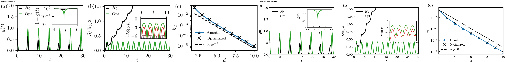

### T002 side by side comparison

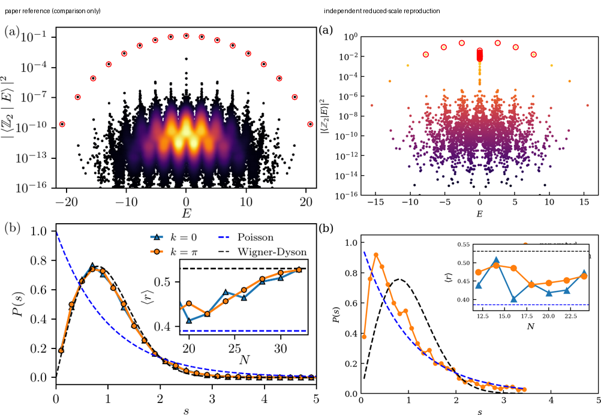

### T003 side by side comparison

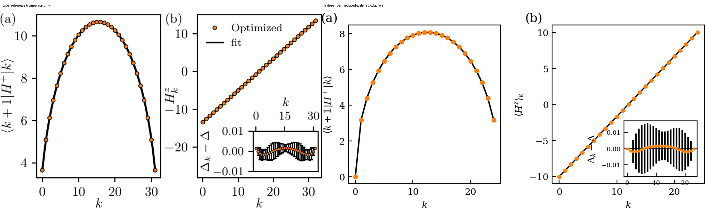

### T004 side by side comparison

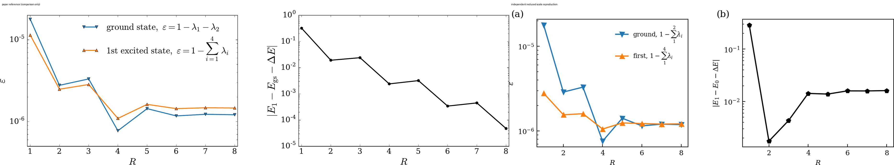

### T005 side by side comparison

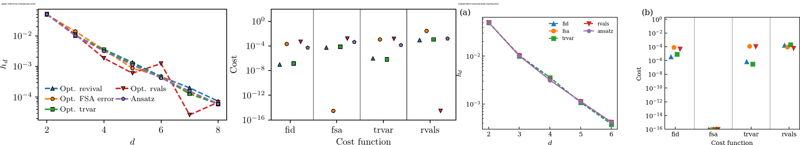

### T006 side by side comparison

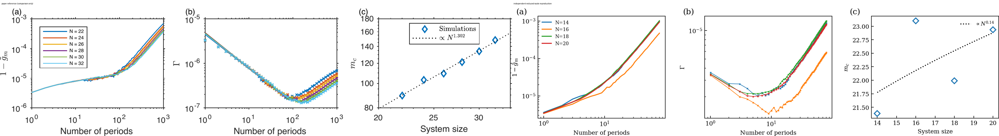

### T007 side by side comparison

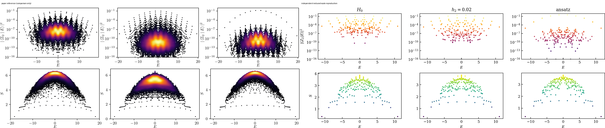

### T008 side by side comparison

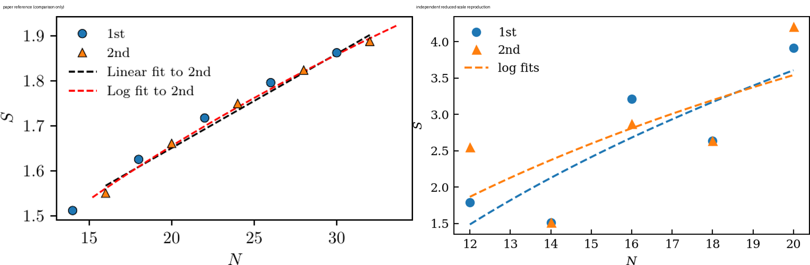

### T009 side by side comparison

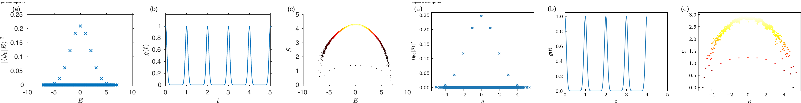

## Quick Run

```bash
python -m venv .venv
source .venv/bin/activate
pip install -r requirements.txt
cd cases/1812.05561/code
python scripts/run_reproduction.py
```

Published machine-readable artifacts are kept under [data](outputs/data/), [figures](outputs/figures/), [checks](outputs/checks/).

## Reproduction Boundary

This public case includes paper-derived code, generated data, generated figures, public validation checks, explanatory notes, and 9 limited comparison panels. Those panels use the minimum paper excerpts needed for validation and clearly separate the paper reference from the independent result. The case does not redistribute the paper PDF, arXiv source archive, standalone original figures, EPS paths, digitized source curves, or source-derived point sets.

Remaining limitation: Lifecycle status is derived only by project inspect.

Final-parameter rule: final public figures use the paper parameters when feasible. Any reduced-scale, subset, proxy, or blocked target must be labeled explicitly and cannot be presented as a complete reproduction.

## Generated Figures

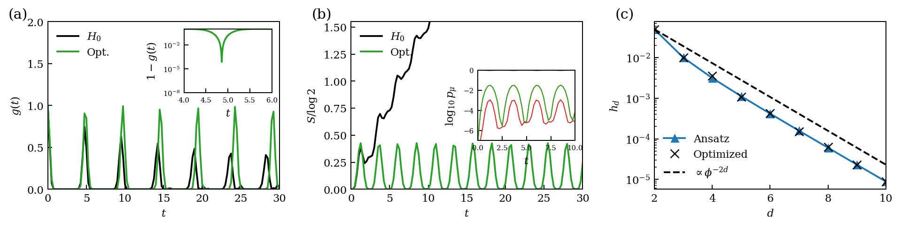

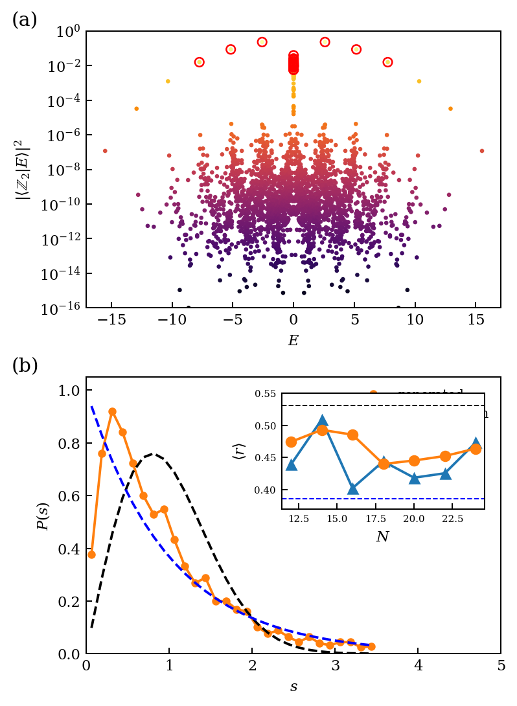

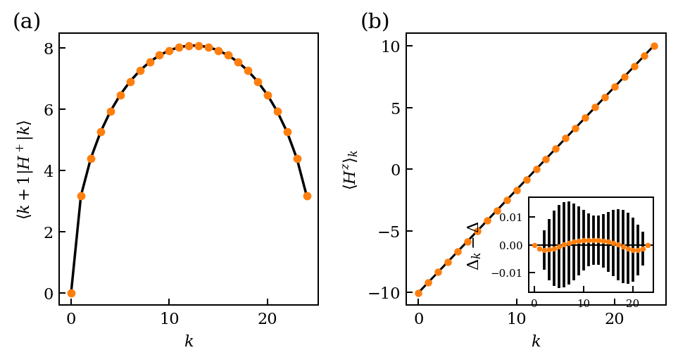

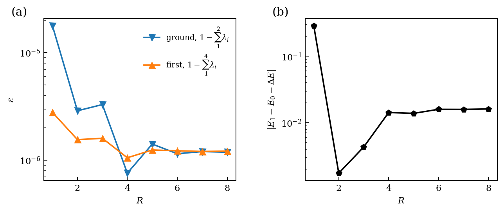

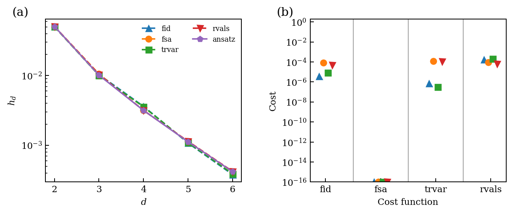

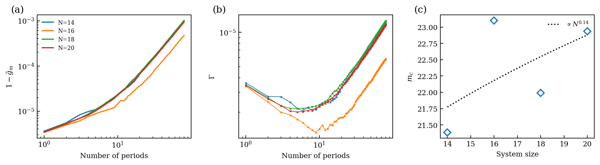

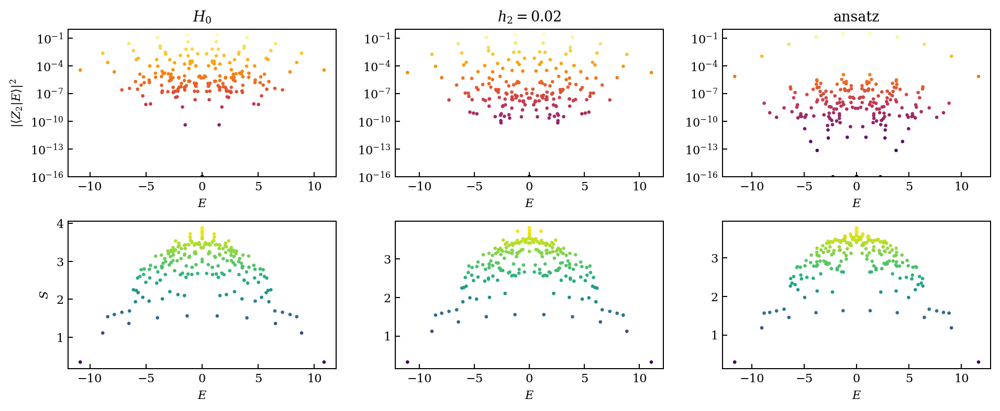

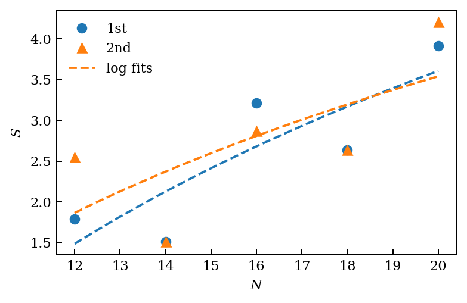

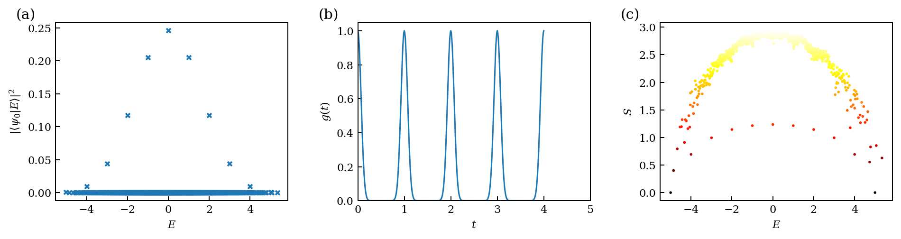
