# 1903.05124: Quantum Error Correction in Scrambling Dynamics and Measurement-Induced Phase Transition

Preprint: [arXiv:1903.05124 — Quantum Error Correction in Scrambling Dynamics and Measurement-Induced Phase Transition](https://arxiv.org/abs/1903.05124)

Published as: [Quantum Error Correction in Scrambling Dynamics and Measurement-Induced Phase Transition](https://doi.org/10.1103/PhysRevLett.125.030505)

Formal citation: Phys. Rev. Lett. 125, 030505 (2020) · DOI `10.1103/PhysRevLett.125.030505` · Locator `030505`

Public status: **Scientific reproduction — invalid** · Audit score: **78.41/100**

Independently derives the decoupling, Clifford frame-potential, stabilizer-entropy, channel-capacity, and finite-size-scaling formulas, then reproduces all 44 theory-numerical panels and insets across Main Fig. 2(b-e) and Supplement Figs. S2-S6. Twenty items are at paper scale and 24 are explicitly feature scale. Every generated value comes from formulas, fresh Clifford/stabilizer trajectories, or fits of those trajectories; paper pixels are downstream presentation-audit inputs only.

## Start Here / 从这里开始

- [中文复现 Note](note/reproduction-note.zh-CN.md)
- [English reproduction note](note/reproduction-note.en.md)
- [Code and run commands](code/README.md)
- [Machine-readable scorecard](outputs/checks/similarity_scorecard.json)
- [Machine-readable completion boundary](outputs/checks/completion_assessment.json)
- [Derivation (equations)](docs/DERIVATION.md)
- [Numerical methods](docs/NUMERICAL_METHODS.md)
- [Lessons learned](docs/LESSONS_LEARNED.md)

## Main Reproduced Results

| Paper item | Reproduced result | Figure | Check |
| --- | --- | --- | --- |
| Main Fig. 2(b-e) | Entropy dynamics, measurement protection, steady states, phase map, and transition markers | [PNG](outputs/figures/main_fig2_reproduction.png) | [JSON](outputs/checks/t001_scientific_checks.json) |
| Supplement Fig. S2(a-d) | Paper-scale first through fourth Clifford frame potentials | [PNG](outputs/figures/supp_fig_s2_reproduction.png) | [JSON](outputs/checks/t002_scientific_checks.json) |
| Supplement Fig. S3(a-h) | Paper-scale entropy and measurement-change trajectories in eight regimes | [PNG](outputs/figures/supp_fig_s3_reproduction.png) | [JSON](outputs/checks/t003_scientific_checks.json) |
| Supplement Fig. S4 | Half-chain scaling, three collapse insets, transition points, and exponent | [PNG](outputs/figures/supp_fig_s4_reproduction.png) | [JSON](outputs/checks/t004_scientific_checks.json) |
| Supplement Fig. S5 | Tripartite-information scans, collapses, transition points, and partial exponent evidence | [PNG](outputs/figures/supp_fig_s5_reproduction.png) | [JSON](outputs/checks/t005_scientific_checks.json) |
| Supplement Fig. S6(a-c) | Block-size dependence of critical probability, exponent, and logarithmic coefficient | [PNG](outputs/figures/supp_fig_s6_reproduction.png) | [JSON](outputs/checks/t006_scientific_checks.json) |

## Paper Reference vs Independent Reproduction

Each board contains only the numerical excerpt needed to audit the independent result against Choi, Bao, Qi, and Altman, Phys. Rev. Lett. 125, 030505 (2020). Reference and generated panels are clearly separated; the excerpt remains outside this repository's open-content license. The boards measure scientific structure and raster presentation after generation. No reference pixel or digitized point enters simulation, fitting, target selection, or scientific scoring.

### Main Fig. 2(b-e) comparison

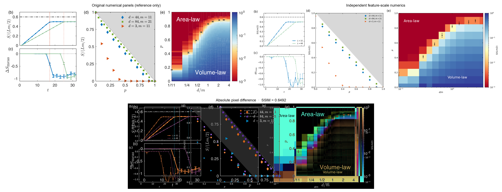

### Supplement Fig. S2(a-d) comparison

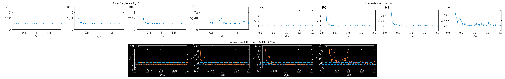

### Supplement Fig. S3(a-h) comparison

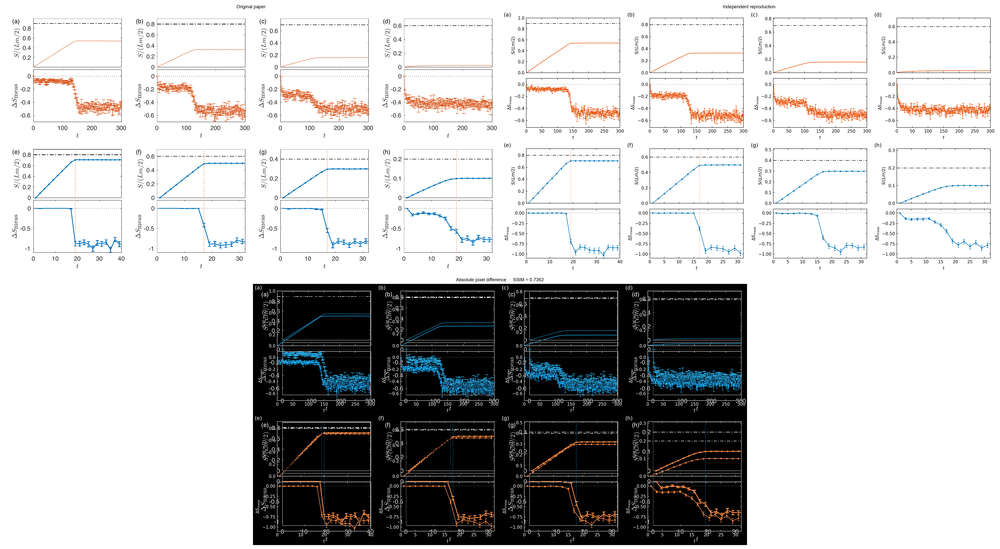

### Supplement Fig. S4 comparison

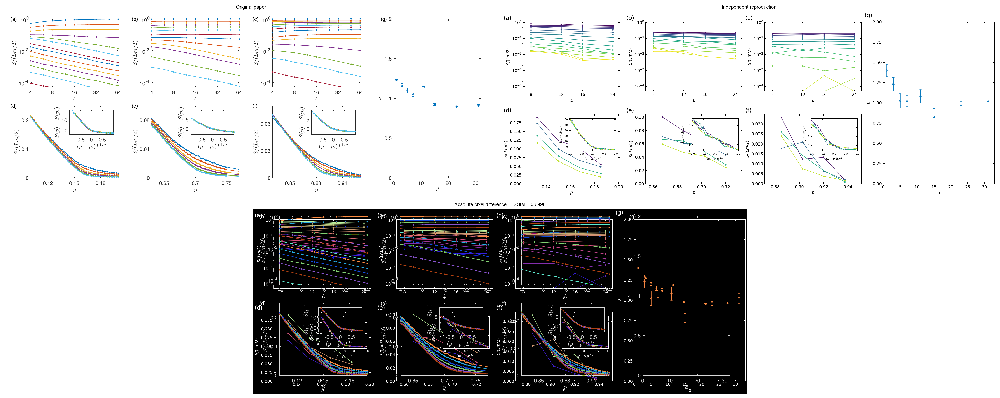

### Supplement Fig. S5 comparison

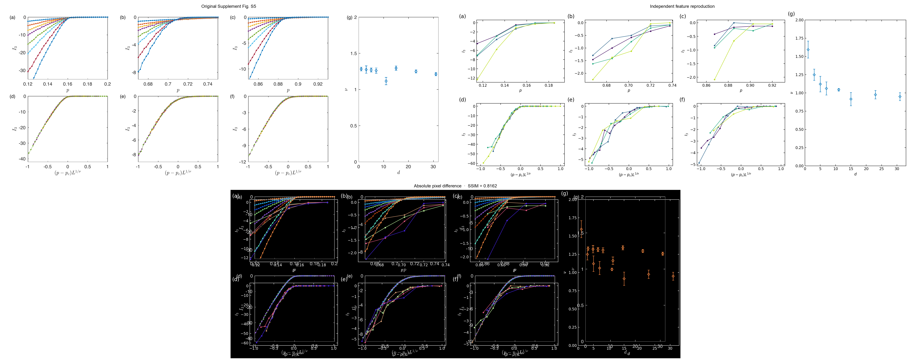

### Supplement Fig. S6(a-c) comparison

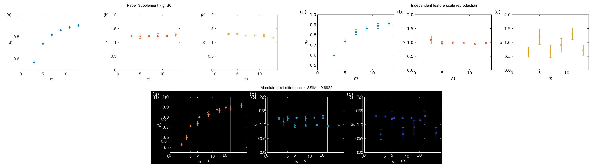

### Main Fig. 2(b-e): Entropy dynamics, measurement protection, steady states, phase map, and transition markers

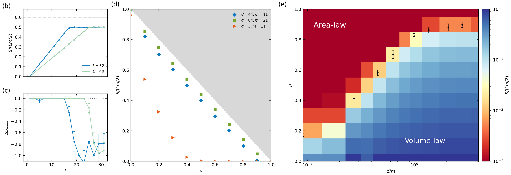

### Supplement Fig. S2(a-d): Paper-scale first through fourth Clifford frame potentials

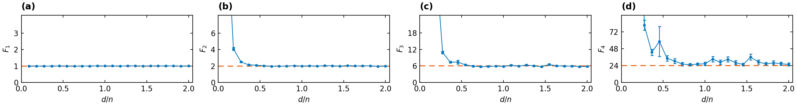

### Supplement Fig. S3(a-h): Paper-scale entropy and measurement-change trajectories in eight regimes

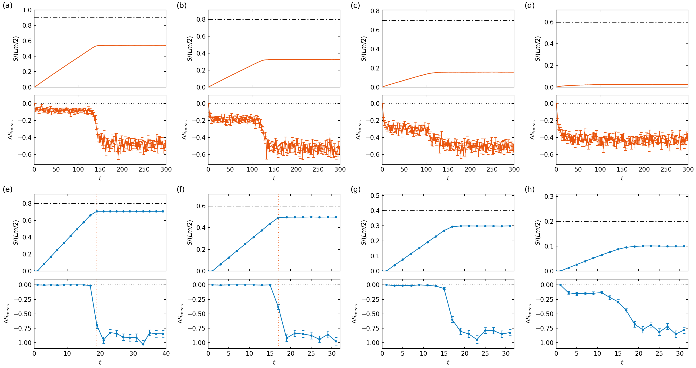

### Supplement Fig. S4: Half-chain scaling, three collapse insets, transition points, and exponent

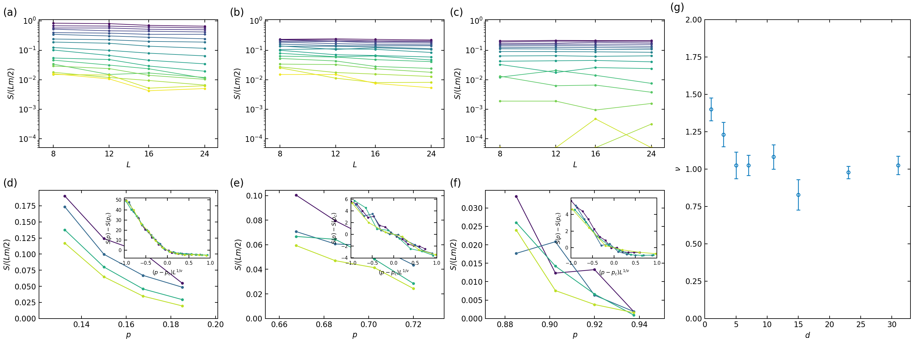

### Supplement Fig. S5: Tripartite-information scans, collapses, transition points, and partial exponent evidence

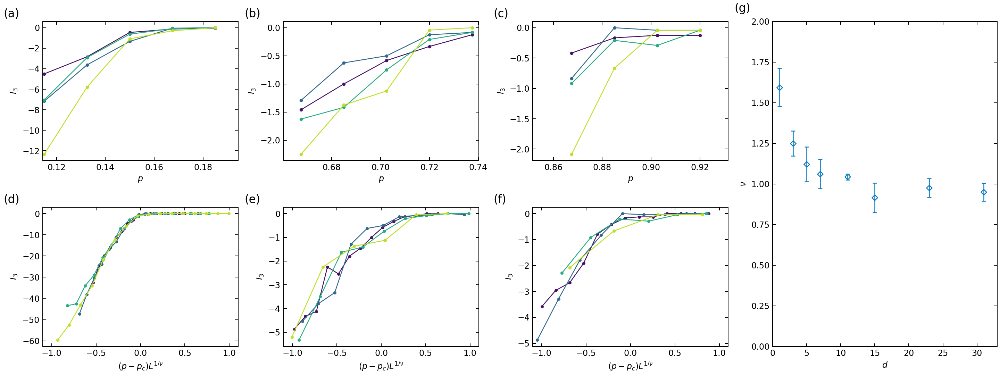

### Supplement Fig. S6(a-c): Block-size dependence of critical probability, exponent, and logarithmic coefficient

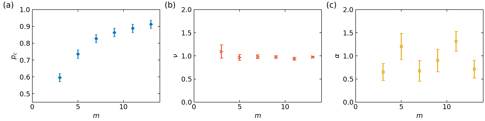

## Quick Run

```bash
python -m venv .venv
source .venv/bin/activate
pip install -r requirements.txt
cd cases/1903.05124/code
python scripts/run_supp_fig_s2.py --render-only
python scripts/run_supp_fig_s3.py --render-only
python scripts/run_supp_fig_s4.py --refinement-input ../outputs/data/supp_fig_s5_refinement_numerical_data.csv
python scripts/run_supp_fig_s5.py --refinement-input ../outputs/data/supp_fig_s5_refinement_numerical_data.csv
```

### Full mixed-scale rerun

The full mixed-scale campaign takes roughly 50 CPU wall-clock minutes with eight workers on the recorded machine. It reruns T002/T003 at paper scale and T001/T004/T005/T006 at their published feature scales, writes generated data and checks before figures, and never reads a paper image.

```bash
cd cases/1903.05124/code
python scripts/run_main_fig2.py --scale feature --workers 8
python scripts/run_supp_fig_s2.py --scale paper --workers 8
python scripts/run_supp_fig_s3.py --scale paper --workers 8
python scripts/run_supp_fig_s5_refinement.py --workers 8
python scripts/run_supp_fig_s4.py --refinement-input ../outputs/data/supp_fig_s5_refinement_numerical_data.csv
python scripts/run_supp_fig_s5.py --refinement-input ../outputs/data/supp_fig_s5_refinement_numerical_data.csv
python scripts/run_supp_fig_s6.py --scale feature --workers 8
```

Generated files are kept under [data](outputs/data/), [figures](outputs/figures/), and [checks](outputs/checks/).

## Reproduction Boundary

This public case includes paper-derived code, generated data, generated figures, public validation checks, explanatory notes, and 6 limited comparison panels. Those panels use the minimum paper excerpts needed for validation and clearly separate the paper reference from the independent result. The case does not redistribute the paper PDF, arXiv source archive, standalone original figures, EPS paths, digitized source curves, or source-derived point sets.

Remaining limitation: T001, T004, T005, and T006 use reduced statistics or system sizes through L=24, so the package does not claim paper-exact precision for all panels. T005 transition locations pass, but the fitted critical exponent remains too depth-sensitive for a full exponent claim. Author seeds and raw trajectories are unavailable, and the S3 caption/raster uncertainty-label inconsistency is recorded explicitly.

Final-parameter rule: final public figures use the paper parameters when feasible. Any reduced-scale, subset, proxy, or blocked target must be labeled explicitly and cannot be presented as a complete reproduction.
