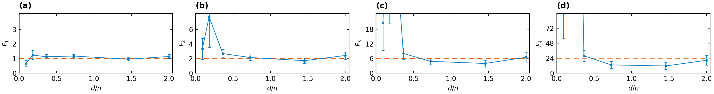
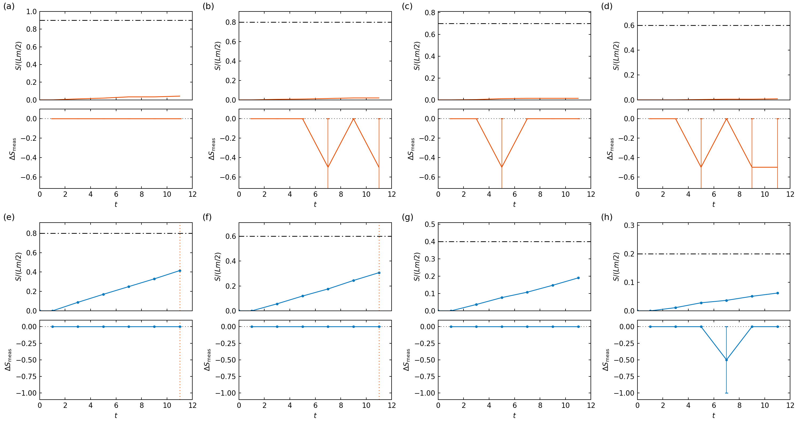
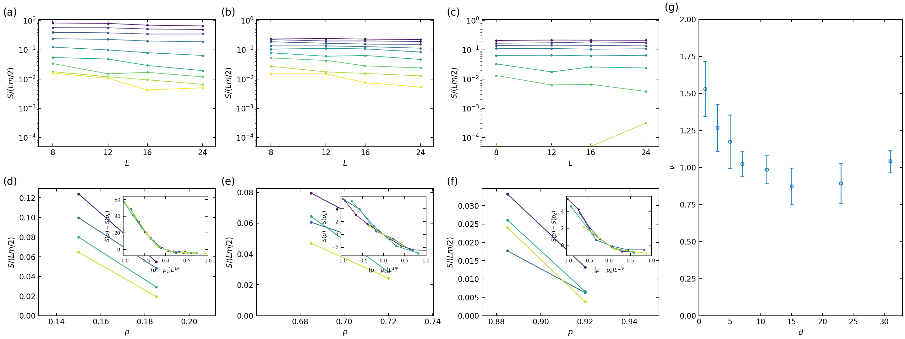
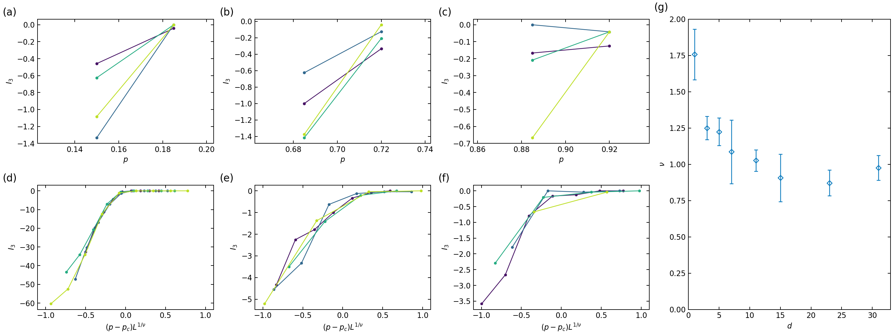
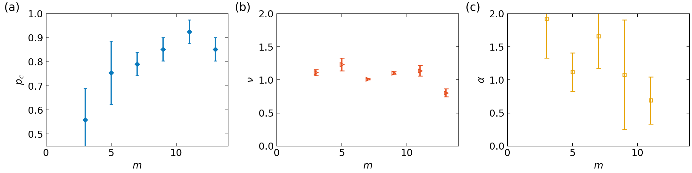

# 1903.05124: Quantum Error Correction in Scrambling Dynamics and Measurement-Induced Phase Transition

Preprint: [arXiv:1903.05124 — Quantum Error Correction in Scrambling Dynamics and Measurement-Induced Phase Transition](https://arxiv.org/abs/1903.05124)

Published as: [Quantum Error Correction in Scrambling Dynamics and Measurement-Induced Phase Transition](https://doi.org/10.1103/PhysRevLett.125.030505)

Formal citation: Phys. Rev. Lett. 125, 030505 (2020) · DOI `10.1103/PhysRevLett.125.030505` · Locator `030505`

Public status: **Partial scientific reproduction** · Audit score: **78.41/100**

Full twenty-page arXiv PDF and both TeX manuscripts read before target selection.

## Start Here / 从这里开始

- [中文复现 Note](note/reproduction-note.zh-CN.md)
- [English reproduction note](note/reproduction-note.en.md)
- [Equation-level derivation](docs/DERIVATION.md)
- [Numerical methods](docs/NUMERICAL_METHODS.md)
- [Public evidence index](docs/EVIDENCE_INDEX.md)
- [Comparison policy](docs/COMPARISON_POLICY.md)
- [Scientific consistency report](docs/CONSISTENCY_REPORT.md)
- [Code and run commands](code/README.md)
- [Machine-readable scorecard](outputs/checks/similarity_scorecard.json)
- [Machine-readable completion boundary](outputs/checks/completion_assessment.json)
- [Derivation (equations)](docs/DERIVATION.md)
- [Numerical methods](docs/NUMERICAL_METHODS.md)
- [Lessons learned](docs/LESSONS_LEARNED.md)

## Paper Reference vs Independent Reproduction

Each board contains only the minimum paper excerpt needed for validation and places it beside an independently generated result. Visual agreement is a scientific-region diagnostic, not author-data-level equivalence.

### main fig2 feature comparison comparison


### supp fig s2 comparison comparison


### supp fig s3 comparison comparison


### supp fig s4 feature comparison comparison


### supp fig s5 feature comparison comparison


### supp fig s6 feature comparison comparison


## Quick Run

```bash
python -m venv .venv
source .venv/bin/activate
pip install -r requirements.txt
cd cases/1903.05124/code
python scripts/run_reproduction.py --config config/isolation_smoke.json
```

Published machine-readable artifacts are kept under [data](outputs/data/), [figures](outputs/figures/), [checks](outputs/checks/).

## Reproduction Boundary

This public case includes paper-derived code, generated data, generated figures, public validation checks, explanatory notes, and 6 limited comparison panels. Those panels use the minimum paper excerpts needed for validation and clearly separate the paper reference from the independent result. The case does not redistribute the paper PDF, arXiv source archive, standalone original figures, EPS paths, digitized source curves, or source-derived point sets.

Remaining limitation: All 44 visible theory-numerical panels and insets are frozen in the reproduction scope. Nine schematic panels and one numerical summary table are inventoried but excluded from figure generation. Source figures are comparison-only; every generated value must come from formulas or an independent Clifford/stabilizer computation. T001 now has a feature-scale reproduction of all four Main Fig. 2 numerical panels; paper geometry is preserved while sampling and finite-size grids remain reduced and explicitly labeled. T004 now has all ten Supplement Fig. S4 numerical items from a fresh EQC007 half-chain fit over independent generated observations; every scientific check passes at feature scale. T005 now has all seven Supplement Fig. S5 panels from 4,352 independent periodic-chain trajectories; critical points pass, while exponent-depth stability remains partial at L<=24 and eight realizations per cell. T006 now has all three Supplement Fig. S6 panels from 2,880 independent trajectories over every paper block size at exact d/m=3; all frozen scientific checks pass at feature scale, with sizes limited to L<=24. All 44 theory-numerical items now have independent formula-based evidence; 20 are paper scale and 24 are explicitly feature scale.

Final-parameter rule: final public figures use the paper parameters when feasible. Any reduced-scale, subset, proxy, or blocked target must be labeled explicitly and cannot be presented as a complete reproduction.

## Generated Figures













