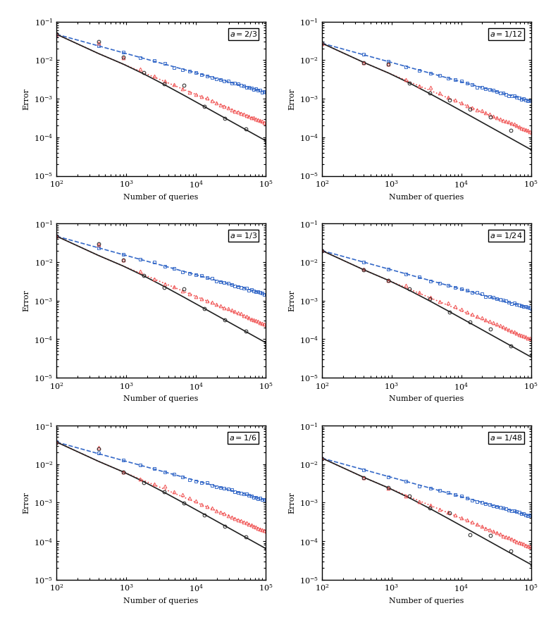
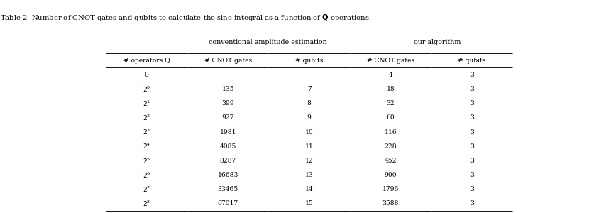
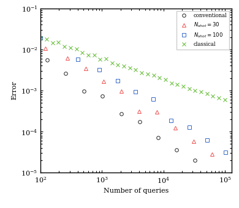

# 1904.10246: Amplitude Estimation without Phase Estimation

Preprint: [arXiv:1904.10246v2 — Amplitude Estimation without Phase Estimation](https://arxiv.org/abs/1904.10246v2)

Published as: [Amplitude estimation without phase estimation](https://doi.org/10.1007/s11128-019-2565-2)

Formal citation: Quantum Information Processing 19, 75 (2020) · DOI `10.1007/s11128-019-2565-2` · Locator `75`

Public status: **Scientific reproduction — invalid** · Audit score: **95.00/100**

Publishes the independently generated numerical artifacts retained by the historical case: 4 public generated data files, 4 public generated figures, and 4 declared numerical targets. The package preserves failed, partial, proxy, and unresolved outcomes instead of upgrading them to completion.

## Start Here / 从这里开始

- [中文复现 Note](note/reproduction-note.zh-CN.md)
- [English reproduction note](note/reproduction-note.en.md)
- [Code and run commands](code/README.md)
- [Machine-readable scorecard](outputs/checks/similarity_scorecard.json)
- [Machine-readable completion boundary](outputs/checks/completion_assessment.json)
- [Derivation (equations)](docs/DERIVATION.md)
- [Numerical methods](docs/NUMERICAL_METHODS.md)
- [Lessons learned](docs/LESSONS_LEARNED.md)

## Main Reproduced Results

| Paper item | Reproduced result | Figure | Check |
| --- | --- | --- | --- |
| FIG002 | RMSE of the amplitude MLE versus oracle-query count for classical, LIS, and EIS schedules. | [PNG](outputs/figures/fig2_error_curves.png) | [JSON](outputs/checks/similarity_scorecard.json) |
| TAB001 | Asymptotic query and classical post-processing costs versus target error. | [PNG](outputs/figures/table1_complexities.png) | [JSON](outputs/checks/similarity_scorecard.json) |
| TAB002 | CNOT and qubit resources for proposed and conventional circuits. | [PNG](outputs/figures/table2_resource_counts.png) | [JSON](outputs/checks/similarity_scorecard.json) |
| FIGA | 81-percentile absolute amplitude error for conventional QAE, EIS, and classical sampling. | [PNG](outputs/figures/figa_percentile_curves.png) | [JSON](outputs/checks/similarity_scorecard.json) |

### FIG002: RMSE of the amplitude MLE versus oracle-query count for classical, LIS, and EIS schedules.



### TAB001: Asymptotic query and classical post-processing costs versus target error.


### TAB002: CNOT and qubit resources for proposed and conventional circuits.



### FIGA: 81-percentile absolute amplitude error for conventional QAE, EIS, and classical sampling.



## Quick Run

```bash
python -m venv .venv
source .venv/bin/activate
pip install -r requirements.txt
cd cases/1904.10246/code
python scripts/verify_public_artifacts.py
```

Generated files are kept under [data](outputs/data/), [figures](outputs/figures/), and [checks](outputs/checks/).

## Reproduction Boundary

This public case includes paper-derived code, generated data, generated figures, public validation checks, and explanatory notes. It does not redistribute the paper PDF, arXiv source archive, original figures, EPS paths, digitized source curves, source-derived point sets, or source-vs-generated composite panels.

Remaining limitation: The legacy case has no machine-verifiable author-code isolation attestation. No source-image comparison panel or digitized source curve is published in this projection.

Final-parameter rule: final public figures use the paper parameters when feasible. Any reduced-scale, subset, proxy, or blocked target must be labeled explicitly and cannot be presented as a complete reproduction.
