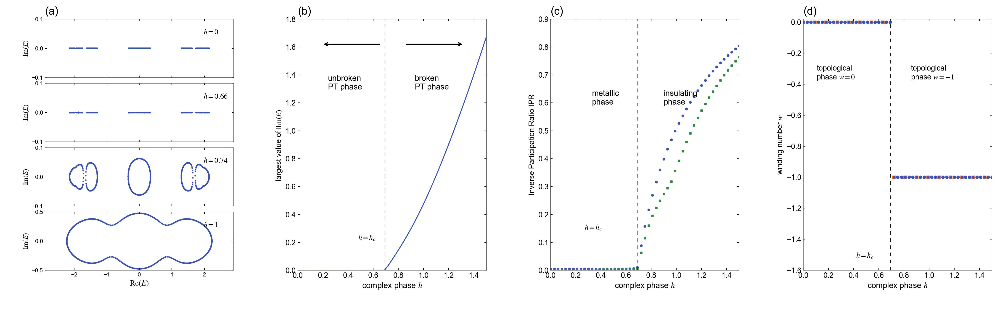
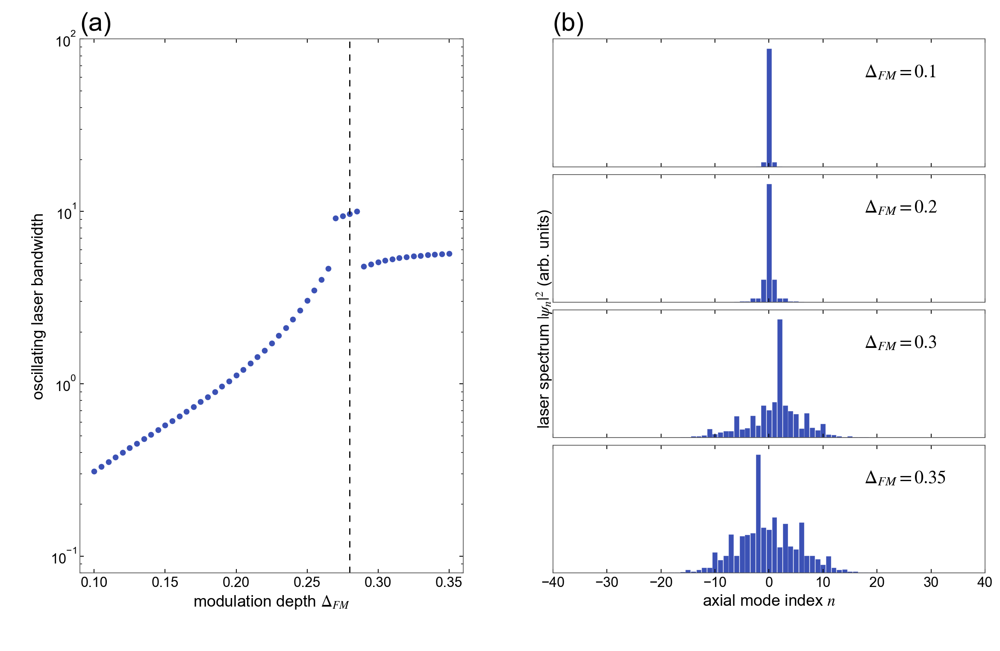
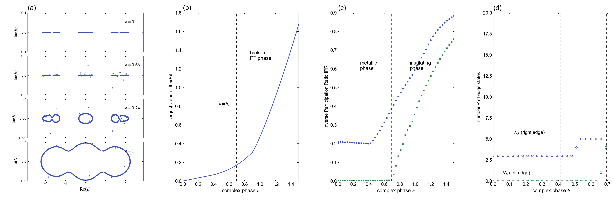
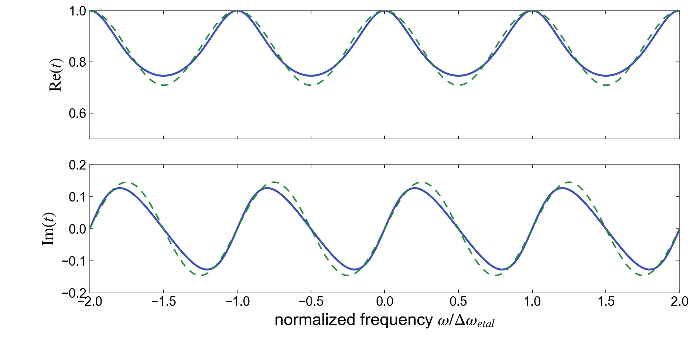

# 1905.09460: Topological Phase Transition in Non-Hermitian Quasicrystals

Preprint: [arXiv:1905.09460 — Topological Phase Transition in Non-Hermitian Quasicrystals](https://arxiv.org/abs/1905.09460)

Published as: [Topological Phase Transition in Non-Hermitian Quasicrystals](https://doi.org/10.1103/PhysRevLett.122.237601)

Formal citation: 122, 237601 (2019) · DOI `10.1103/PhysRevLett.122.237601` · Locator `237601`

Public status: **Partial scientific reproduction** · Audit score: **68.85/100**

Whole-paper atomic audit: 28 eligible items, 21 scientifically reproduced and 7 objectively blocked by publication underspecification.

## Start Here / 从这里开始

- [中文复现 Note](note/reproduction-note.zh-CN.md)
- [English reproduction note](note/reproduction-note.en.md)
- [Equation-level derivation](docs/DERIVATION.md)
- [Numerical methods](docs/NUMERICAL_METHODS.md)
- [Public evidence index](docs/EVIDENCE_INDEX.md)
- [Comparison policy](docs/COMPARISON_POLICY.md)
- [Scientific consistency report](docs/CONSISTENCY_REPORT.md)
- [Code and run commands](code/README.md)
- [Machine-readable scorecard](outputs/checks/similarity_scorecard.json)
- [Machine-readable completion boundary](outputs/checks/completion_assessment.json)
- [Derivation (equations)](docs/DERIVATION.md)
- [Numerical methods](docs/NUMERICAL_METHODS.md)
- [Lessons learned](docs/LESSONS_LEARNED.md)

## Quick Run

```bash
python -m venv .venv
source .venv/bin/activate
pip install -r requirements.txt
cd cases/1905.09460/code
python scripts/run_reproduction.py
```

Published machine-readable artifacts are kept under [data](outputs/data/), [figures](outputs/figures/), [checks](outputs/checks/).

## Reproduction Boundary

This public case includes paper-derived code, generated data, generated figures, public validation checks, explanatory notes. It does not redistribute the paper PDF, arXiv source archive, original figures, EPS paths, digitized source curves, source-derived point sets, or source-vs-generated composite panels.

Remaining limitation: The two Main Figure 2 schematic axes are context-only. Original source pixels are isolated to terminal evaluation and never feed numerical generation. Main Figure 3 and Supplement Figure S1 remain feature-level because the source omits transient controls and the edge-state classifier.

Final-parameter rule: final public figures use the paper parameters when feasible. Any reduced-scale, subset, proxy, or blocked target must be labeled explicitly and cannot be presented as a complete reproduction.

## Generated Figures








