# 1910.00020: Scalable probes of measurement-induced criticality

Preprint: [arXiv:1910.00020v2 — Scalable probes of measurement-induced criticality](https://arxiv.org/abs/1910.00020)

Published as: [Scalable Probes of Measurement-Induced Criticality](https://doi.org/10.1103/PhysRevLett.125.070606)

Formal citation: 125, 070606 (2020) · DOI `10.1103/PhysRevLett.125.070606` · Locator `070606`

Public status: **Partial scientific reproduction** · Audit score: **69.34/100**

All numerical panels are independently generated with an exact partial-record channel; reduced scale and unpublished sampling metadata prevent paper-exact status.

## Start Here / 从这里开始

- [中文复现 Note](note/reproduction-note.zh-CN.md)
- [English reproduction note](note/reproduction-note.en.md)
- [Equation-level derivation](docs/DERIVATION.md)
- [Numerical methods](docs/NUMERICAL_METHODS.md)
- [Public evidence index](docs/EVIDENCE_INDEX.md)
- [Comparison policy](docs/COMPARISON_POLICY.md)
- [Scientific consistency report](docs/CONSISTENCY_REPORT.md)
- [Code and run commands](code/README.md)
- [Machine-readable scorecard](outputs/checks/similarity_scorecard.json)
- [Machine-readable completion boundary](outputs/checks/completion_assessment.json)
- [Derivation (equations)](docs/DERIVATION.md)
- [Numerical methods](docs/NUMERICAL_METHODS.md)
- [Lessons learned](docs/LESSONS_LEARNED.md)

## Paper Reference vs Independent Reproduction

Each board contains only the minimum paper excerpt needed for validation and places it beside an independently generated result. Visual agreement is a scientific-region diagnostic, not author-data-level equivalence.

### T001 side by side comparison

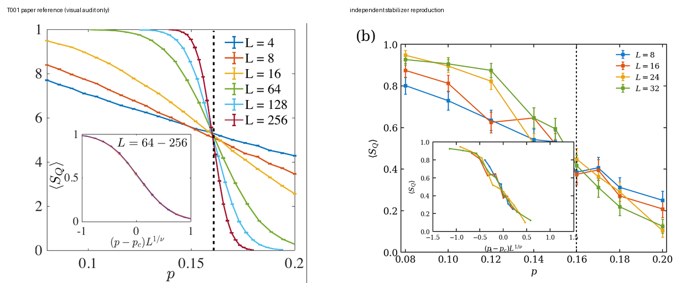

### T002 side by side comparison

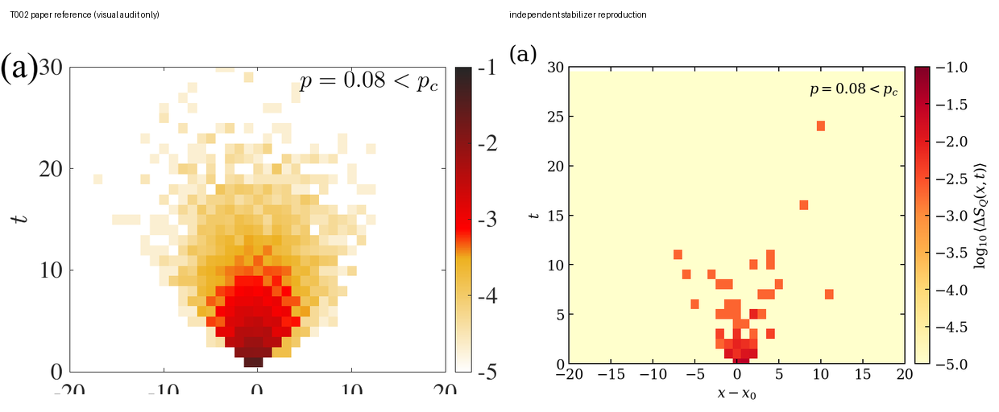

### T003 side by side comparison

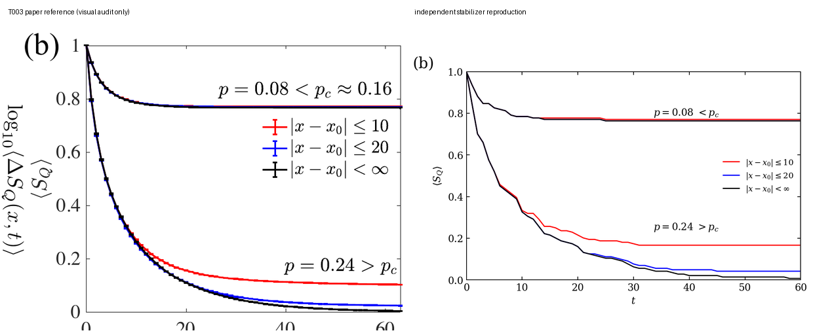

### T004 side by side comparison

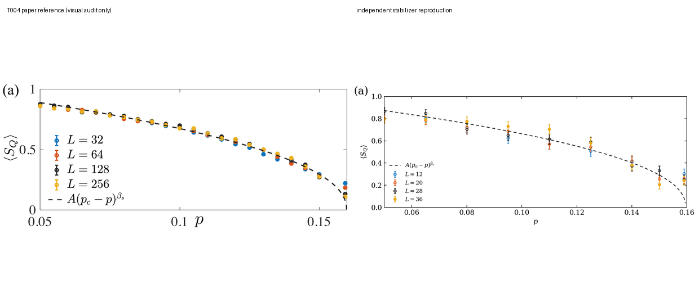

### T005 side by side comparison

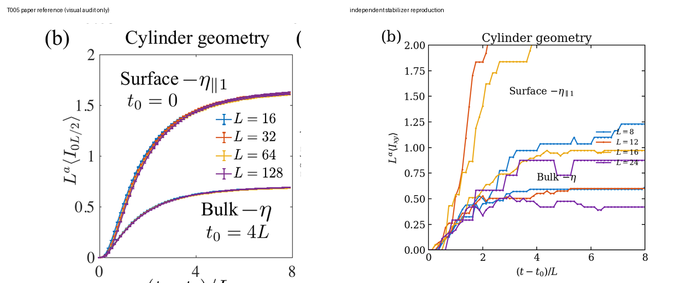

### T006 side by side comparison

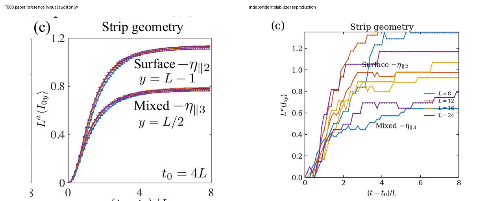

### T007 side by side comparison

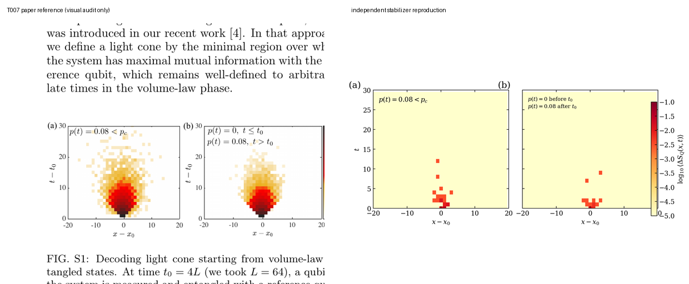

### T008 side by side comparison

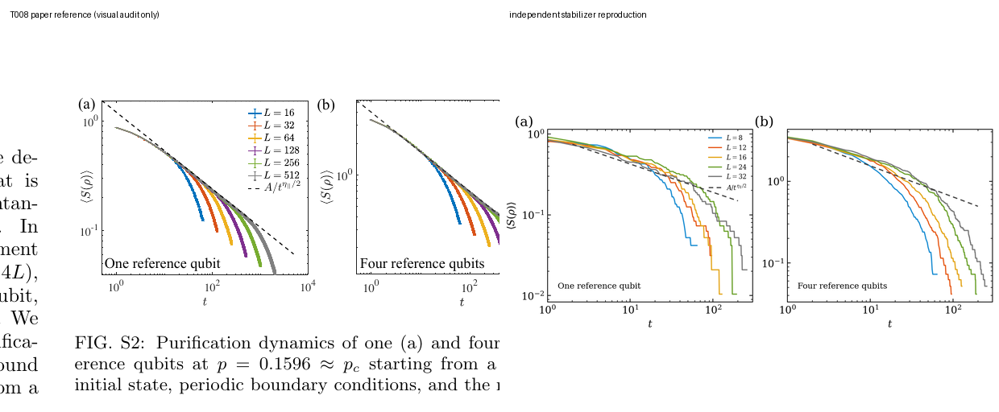

## Quick Run

```bash
python -m venv .venv
source .venv/bin/activate
pip install -r requirements.txt
cd cases/1910.00020/code
python scripts/run_reproduction.py
```

Generated files are kept under [data](outputs/data/), [figures](outputs/figures/), and [checks](outputs/checks/).

## Reproduction Boundary

This public case includes paper-derived code, generated data, generated figures, public validation checks, explanatory notes, and 8 limited comparison panels. Those panels use the minimum paper excerpts needed for validation and clearly separate the paper reference from the independent result. The case does not redistribute the paper PDF, arXiv source archive, standalone original figures, EPS paths, digitized source curves, or source-derived point sets.

Remaining limitation: Every target is independently generated from a phase-free binary stabilizer simulation; no author code, numerical arrays, or source pixels enter the runner. Published system sizes and unknown Monte Carlo metadata are reduced; Fig. 2(b) now uses exact mixed-stabilizer conditioning for an incomplete record. Fresh-context independent review remains pending.

Final-parameter rule: final public figures use the paper parameters when feasible. Any reduced-scale, subset, proxy, or blocked target must be labeled explicitly and cannot be presented as a complete reproduction.

## Generated Figures

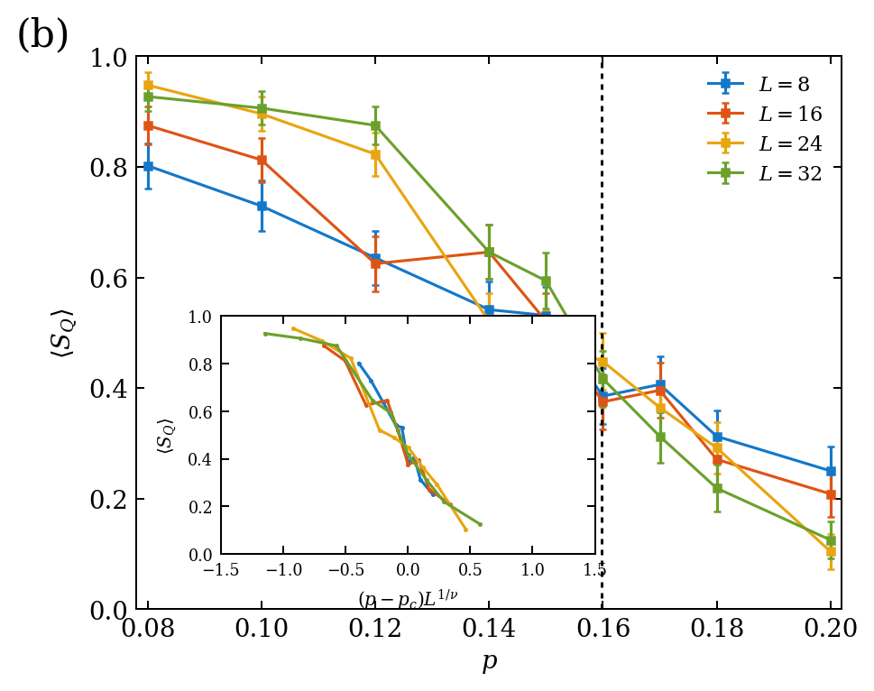

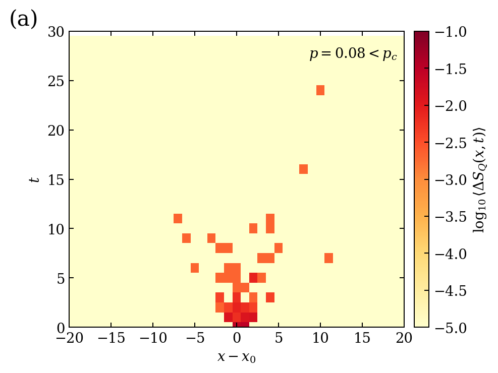

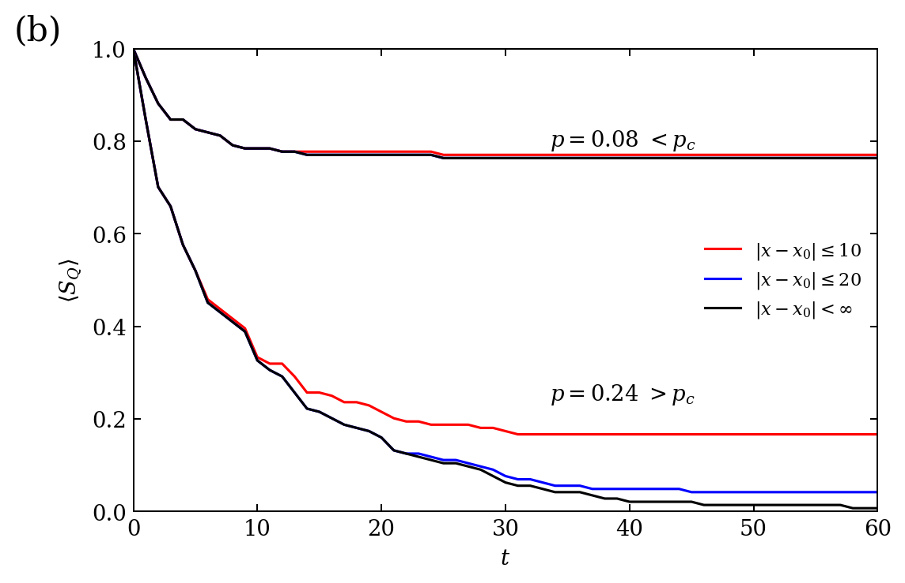

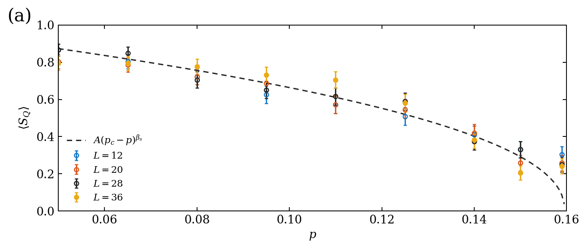

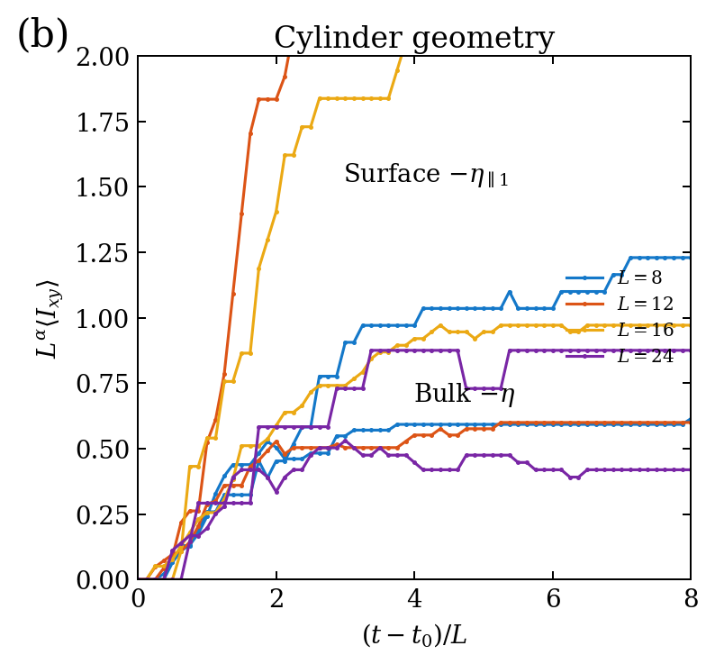

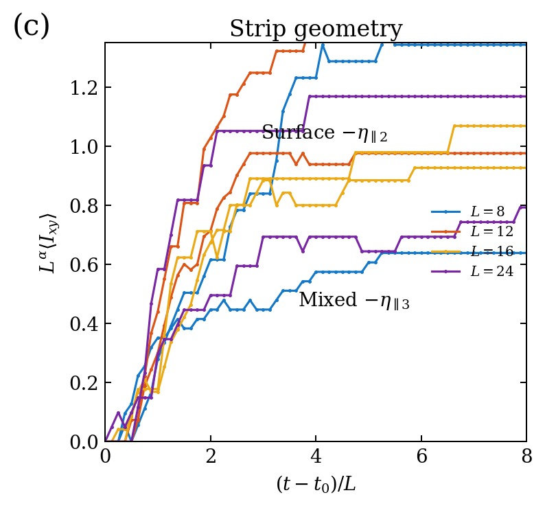

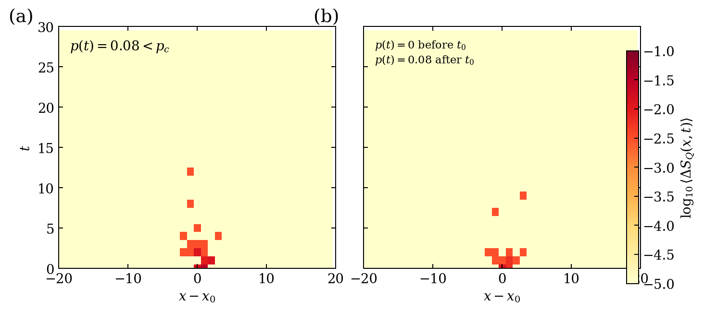

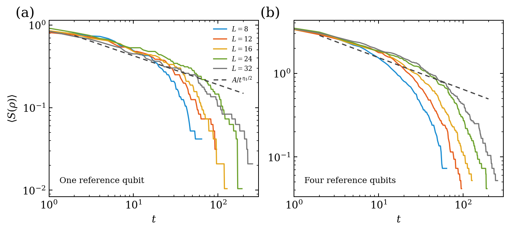
