# 2005.09722: Entanglement transition in a monitored free fermion chain -- from extended criticality to area law

Preprint: [arXiv:2005.09722 — Entanglement transition in a monitored free fermion chain -- from extended criticality to area law](https://arxiv.org/abs/2005.09722)

Published as: [Entanglement transition in a monitored free fermion chain -- from extended criticality to area law](https://doi.org/10.1103/PhysRevLett.126.170602)

Formal citation: Phys. Rev. Lett. 126, 170602 (2021) · DOI `10.1103/PhysRevLett.126.170602` · Locator `126, 170602`

Public status: **Partial scientific reproduction** · Audit score: **67.02/100**

All 31 numerical axes are independently generated and physically checked at L<=96; paper-scale finite-size and trajectory statistics remain outstanding.

## Start Here / 从这里开始

- [中文复现 Note](note/reproduction-note.zh-CN.md)
- [English reproduction note](note/reproduction-note.en.md)
- [Equation-level derivation](docs/DERIVATION.md)
- [Numerical methods](docs/NUMERICAL_METHODS.md)
- [Public evidence index](docs/EVIDENCE_INDEX.md)
- [Comparison policy](docs/COMPARISON_POLICY.md)
- [Scientific consistency report](docs/CONSISTENCY_REPORT.md)
- [Code and run commands](code/README.md)
- [Machine-readable scorecard](outputs/checks/similarity_scorecard.json)
- [Machine-readable completion boundary](outputs/checks/completion_assessment.json)
- [Derivation (equations)](docs/DERIVATION.md)
- [Numerical methods](docs/NUMERICAL_METHODS.md)
- [Lessons learned](docs/LESSONS_LEARNED.md)

## Paper Reference vs Independent Reproduction

Each board contains only the minimum paper excerpt needed for validation and places it beside an independently generated result. Visual agreement is a scientific-region diagnostic, not author-data-level equivalence.

### main fig1 numeric side by side comparison

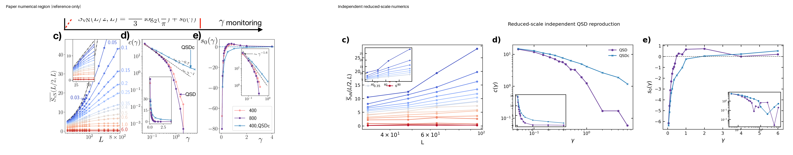

### main fig2 side by side comparison

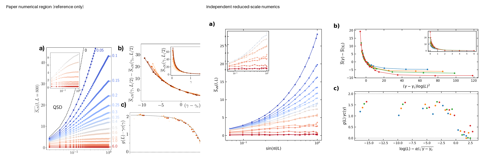

### main fig3 side by side comparison

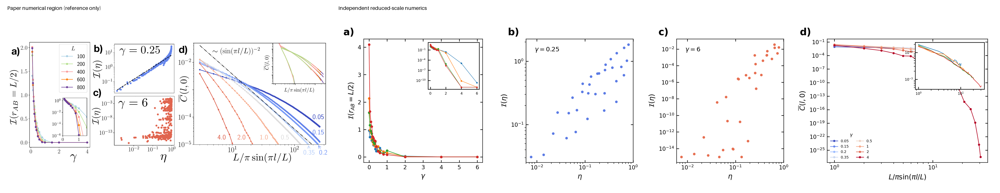

### supp autocorrelation side by side comparison

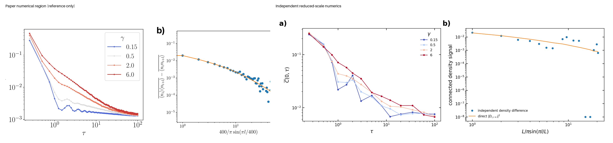

### supp qj side by side comparison

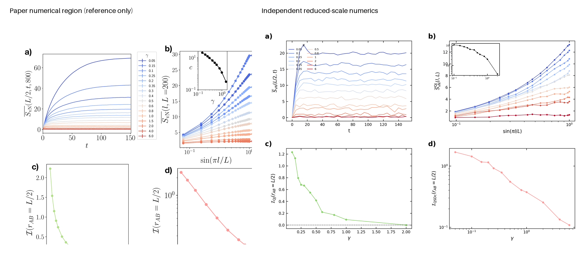

### supp random hopping side by side comparison

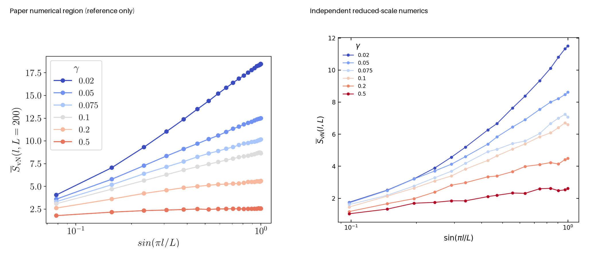

### supp statistics side by side comparison

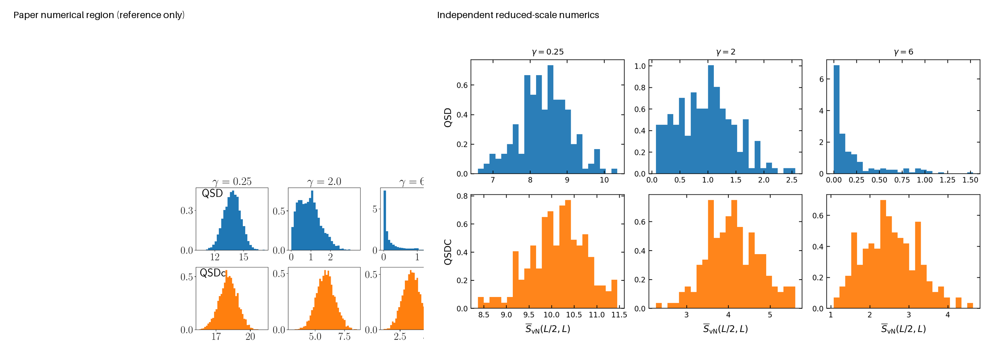

## Quick Run

```bash
python -m venv .venv
source .venv/bin/activate
pip install -r requirements.txt
cd cases/2005.09722/code
python scripts/run_reproduction.py
```

Generated files are kept under [data](outputs/data/), [figures](outputs/figures/), and [checks](outputs/checks/).

## Reproduction Boundary

This public case includes paper-derived code, generated data, generated figures, public validation checks, explanatory notes, and 7 limited comparison panels. Those panels use the minimum paper excerpts needed for validation and clearly separate the paper reference from the independent result. The case does not redistribute the paper PDF, arXiv source archive, standalone original figures, EPS paths, digitized source curves, or source-derived point sets.

Remaining limitation: The L=200-800 and 5000-trajectory paper-scale channel is code-ready and smoke-tested; the final A100 campaign remains unexecuted.

Final-parameter rule: final public figures use the paper parameters when feasible. Any reduced-scale, subset, proxy, or blocked target must be labeled explicitly and cannot be presented as a complete reproduction.

## Generated Figures

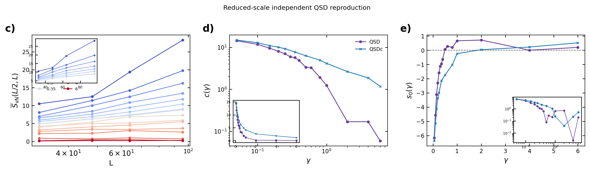

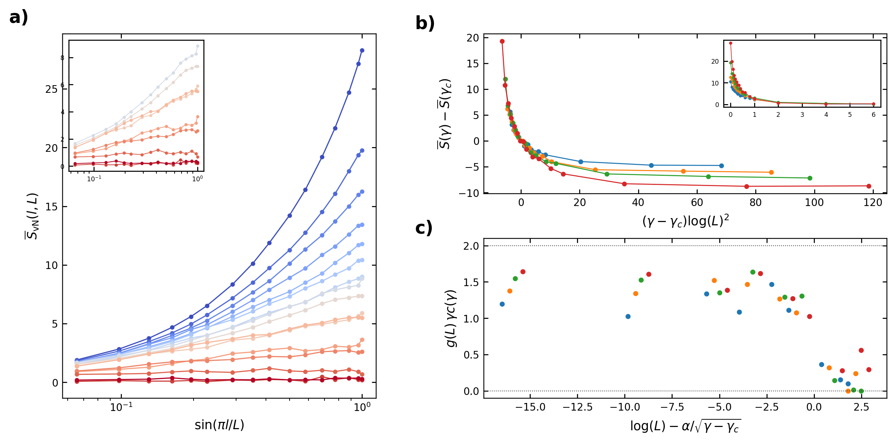

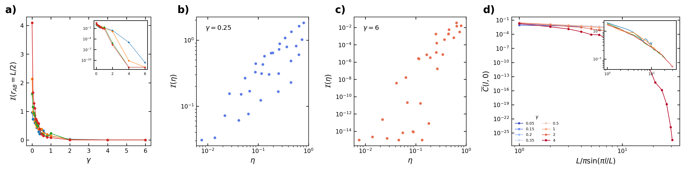

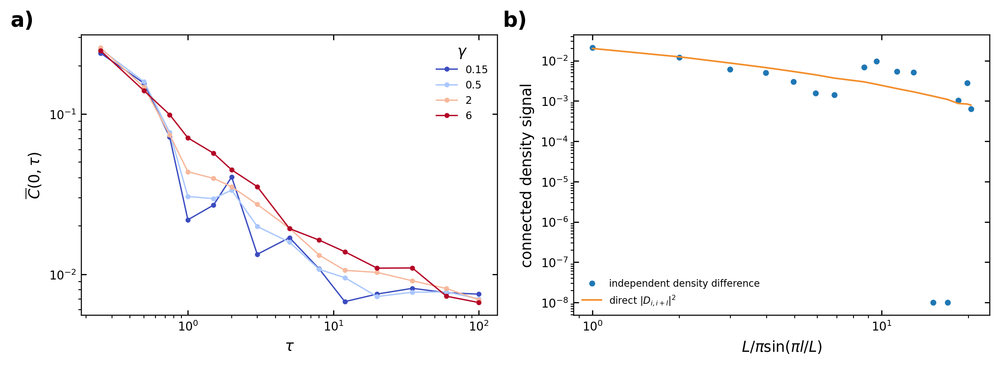

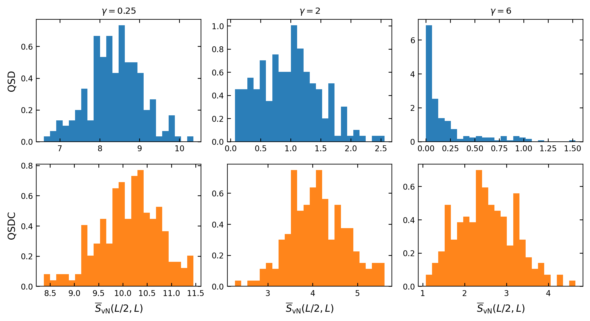

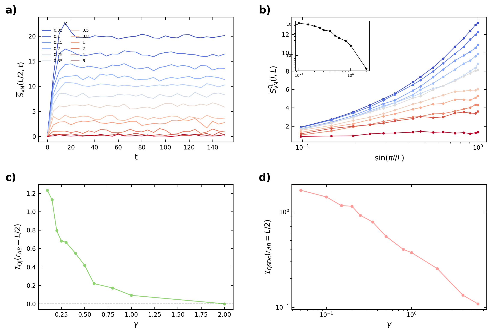

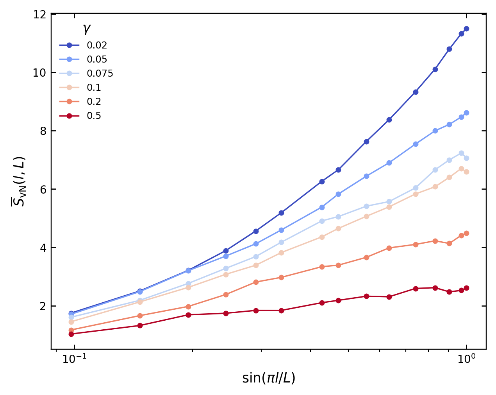
