# 2005.12667: Circuit Quantum Electrodynamics

Preprint: [arXiv:2005.12667v1 — Circuit Quantum Electrodynamics](https://arxiv.org/abs/2005.12667)

Published as: [Circuit quantum electrodynamics](https://doi.org/10.1103/RevModPhys.93.025005)

Formal citation: Rev. Mod. Phys. 93, 025005 (2021) · DOI `10.1103/RevModPhys.93.025005` · Locator `93:025005`

Public status: **Partial scientific reproduction** · Audit score: **89.88/100**

Whole-paper atomic adjudication: 93 of 107 non-duplicate eligible scientific items are reproduced from equations in one isolated campaign; the remaining 14 items have confirmed target-publication input boundaries. One supporting duplicate is retained outside the denominator.

## Start Here / 从这里开始

- [中文复现 Note](note/reproduction-note.zh-CN.md)
- [English reproduction note](note/reproduction-note.en.md)
- [Equation-level derivation](docs/DERIVATION.md)
- [Numerical methods](docs/NUMERICAL_METHODS.md)
- [Public evidence index](docs/EVIDENCE_INDEX.md)
- [Comparison policy](docs/COMPARISON_POLICY.md)
- [Scientific consistency report](docs/CONSISTENCY_REPORT.md)
- [Code and run commands](code/README.md)
- [Machine-readable scorecard](outputs/checks/similarity_scorecard.json)
- [Machine-readable completion boundary](outputs/checks/completion_assessment.json)
- [Derivation (equations)](docs/DERIVATION.md)
- [Numerical methods](docs/NUMERICAL_METHODS.md)
- [Lessons learned](docs/LESSONS_LEARNED.md)

## Paper Reference vs Independent Reproduction

Each board contains only the minimum paper excerpt needed for validation and places it beside an independently generated result. Visual agreement is a scientific-region diagnostic, not author-data-level equivalence.

### fig8 source vs reproduction comparison

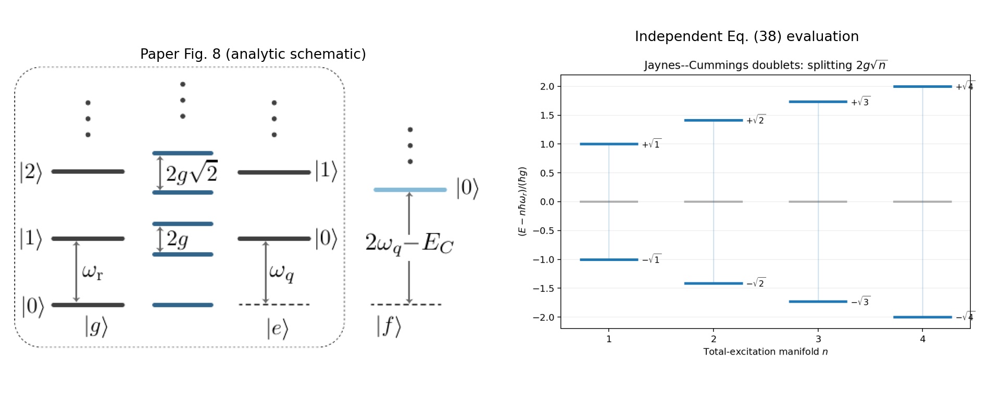

### fig9 source vs reproduction comparison

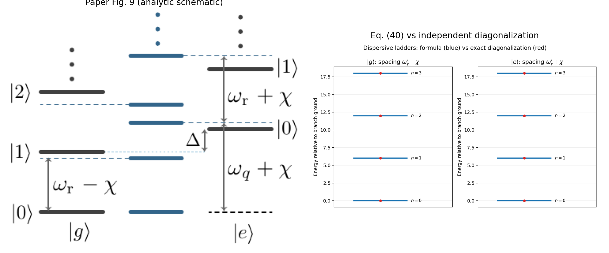

### t005 source vs reproduction comparison

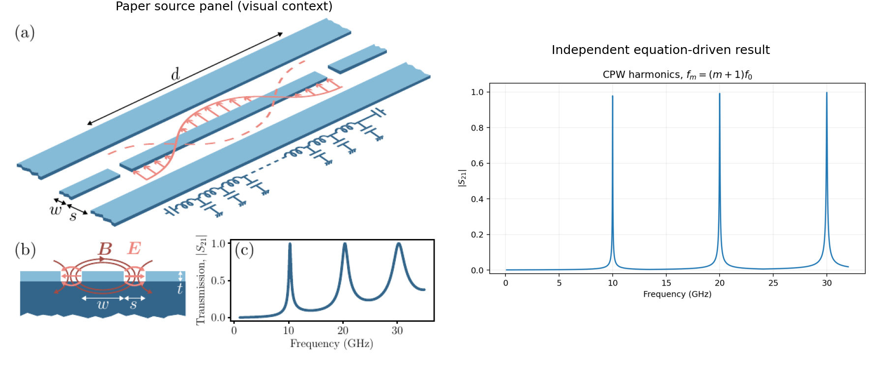

### t006 source vs reproduction comparison

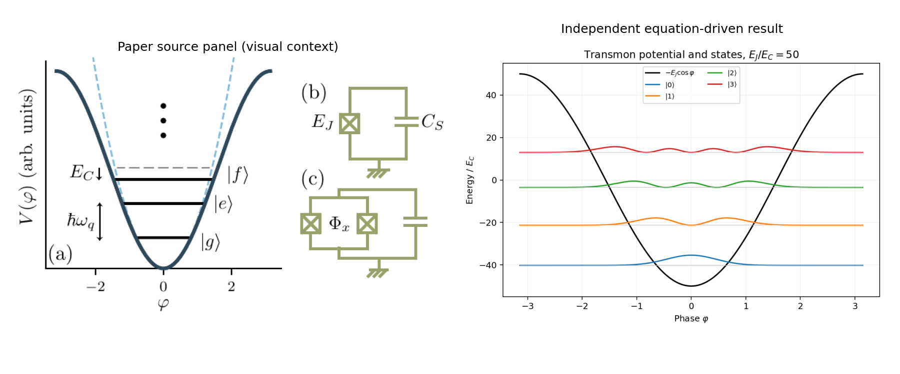

### t007 source vs reproduction comparison

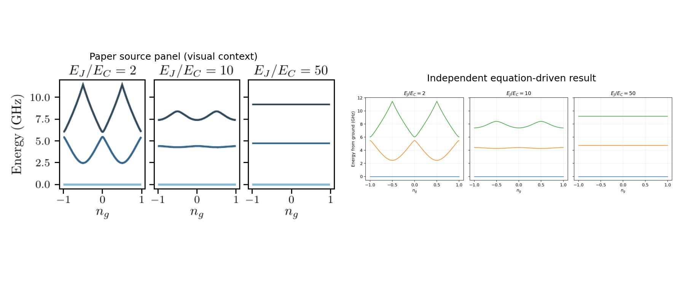

### t008 source vs reproduction comparison

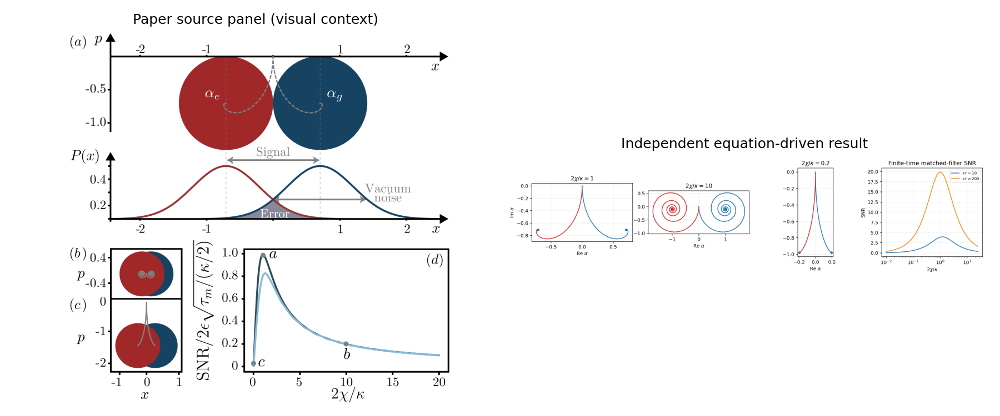

### t009 source vs reproduction comparison

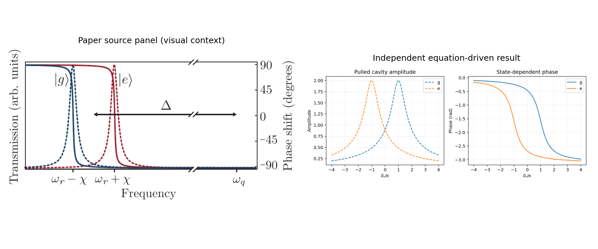

### t010 source vs reproduction comparison

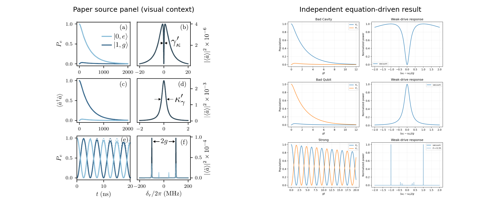

### t011 source vs reproduction comparison

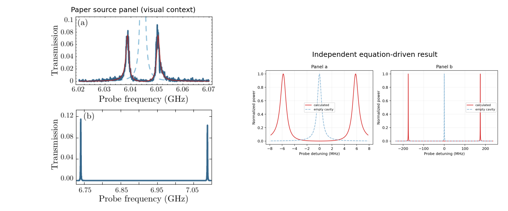

### t012 source vs reproduction comparison

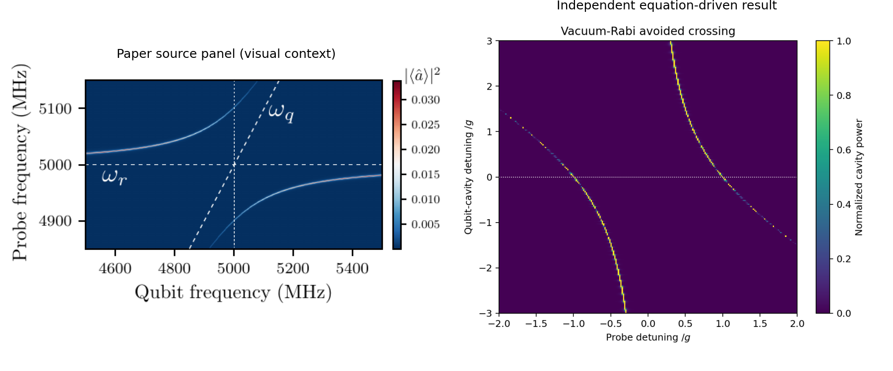

### t013 source vs reproduction comparison

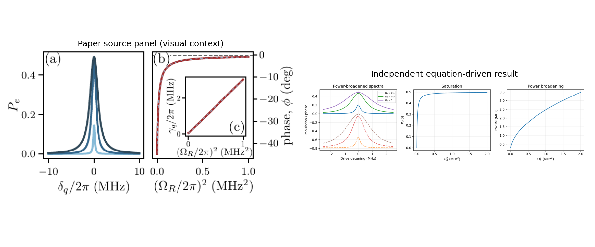

### t014 source vs reproduction comparison

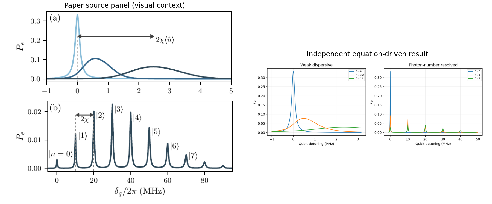

### t015 source vs reproduction comparison

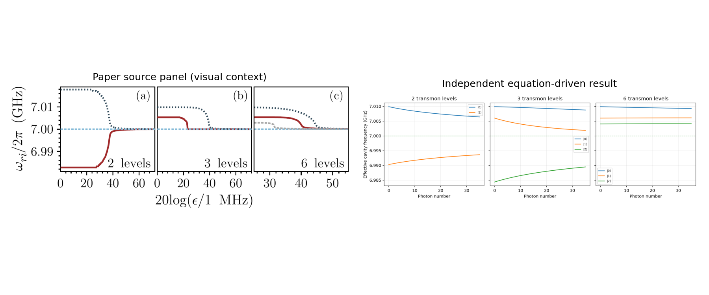

### t016 source vs reproduction comparison

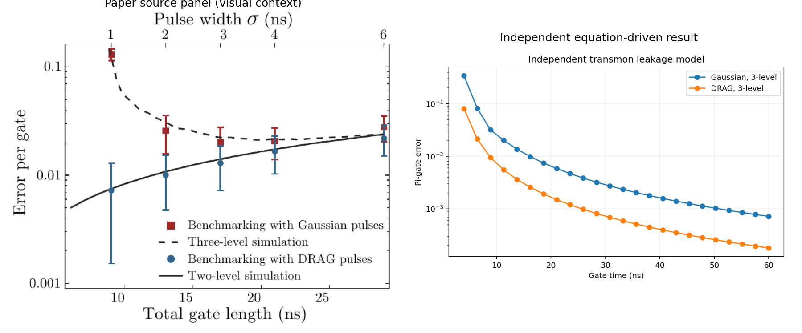

### t018 source vs reproduction comparison

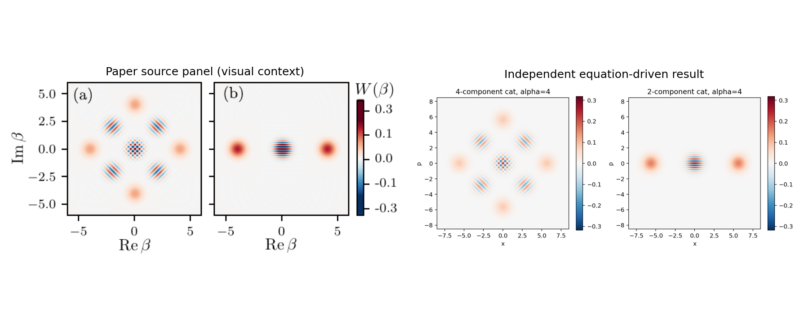

### t019 source vs reproduction comparison

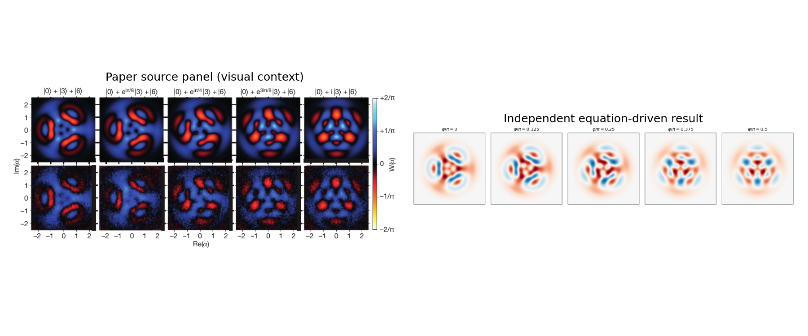

### t020 source vs reproduction comparison

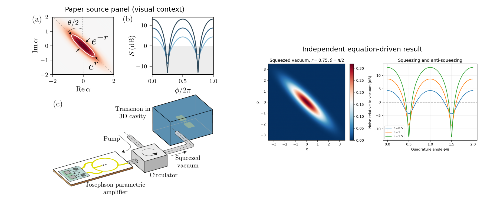

## Quick Run

```bash
python -m venv .venv
source .venv/bin/activate
pip install -r requirements.txt
cd cases/2005.12667/code
python scripts/run_reproduction.py
```

Published machine-readable artifacts are kept under [data](outputs/data/), [figures](outputs/figures/), [checks](outputs/checks/).

## Reproduction Boundary

This public case includes paper-derived code, generated data, generated figures, public validation checks, explanatory notes, and 17 limited comparison panels. Those panels use the minimum paper excerpts needed for validation and clearly separate the paper reference from the independent result. The case does not redistribute the paper PDF, arXiv source archive, standalone original figures, EPS paths, digitized source curves, or source-derived point sets.

Remaining limitation: Formal RMP publication is used to identify corrections to arXiv Eqs. 29, 51, and 67. Source spectral figures do not specify absolute plotting parameters; similarity is therefore feature-level, not exact-parameter reproduction.

Final-parameter rule: final public figures use the paper parameters when feasible. Any reduced-scale, subset, proxy, or blocked target must be labeled explicitly and cannot be presented as a complete reproduction.

## Generated Figures


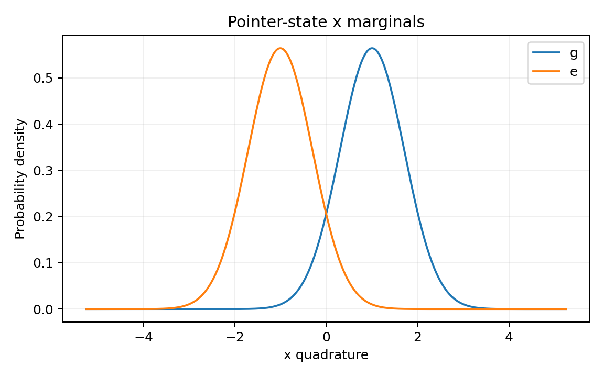


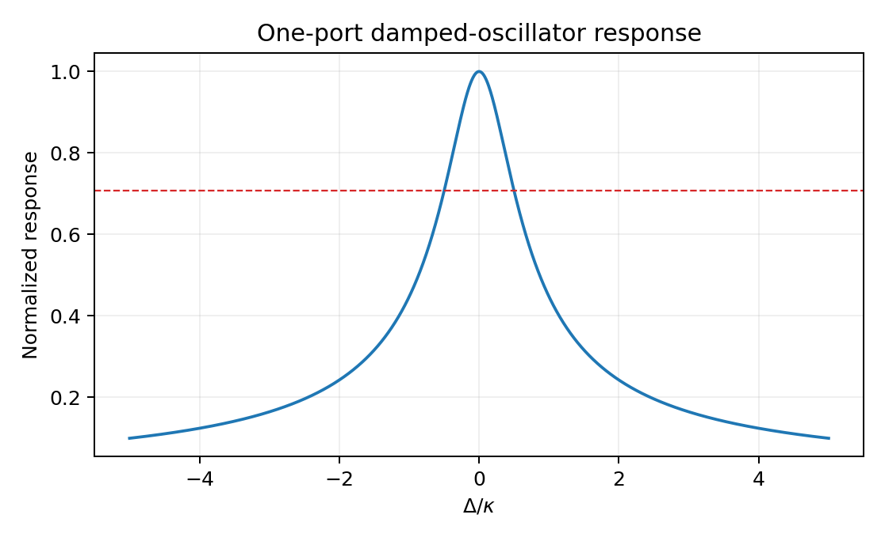

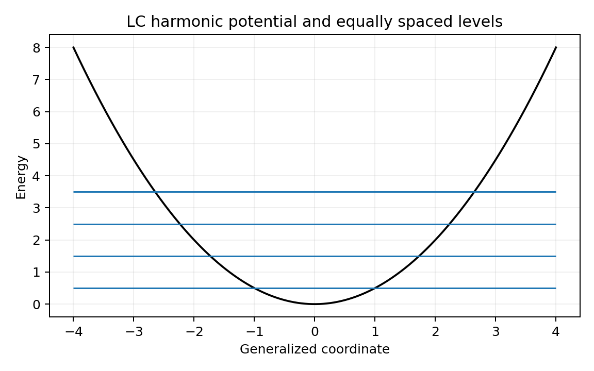


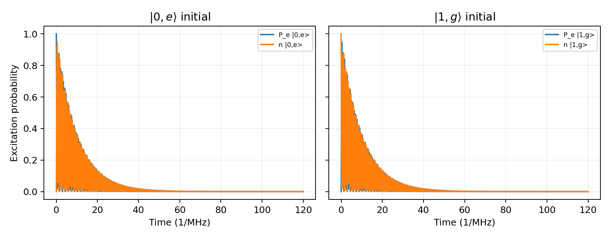


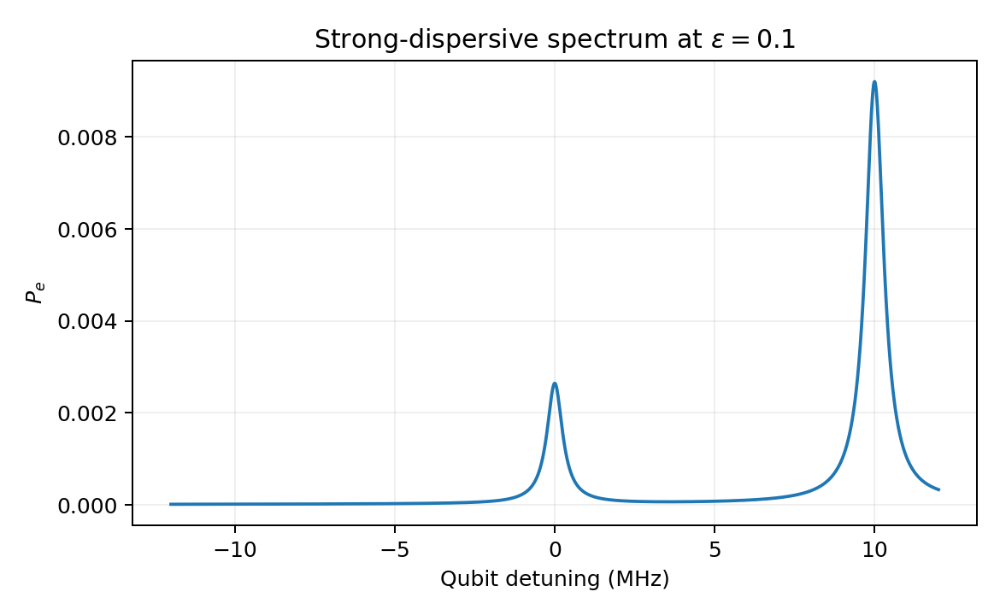


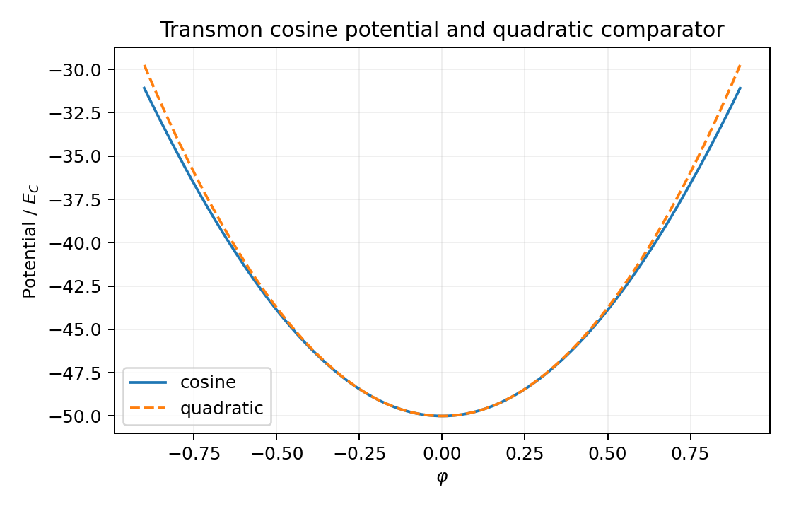


