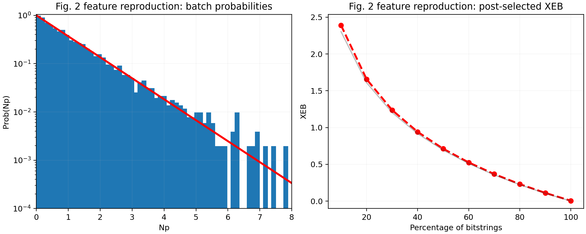
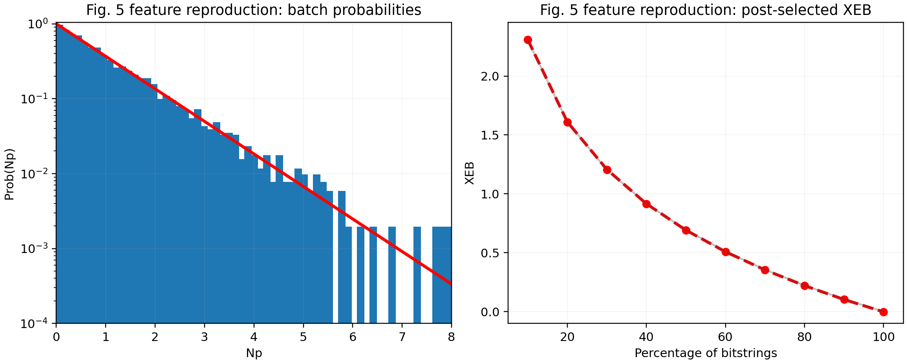
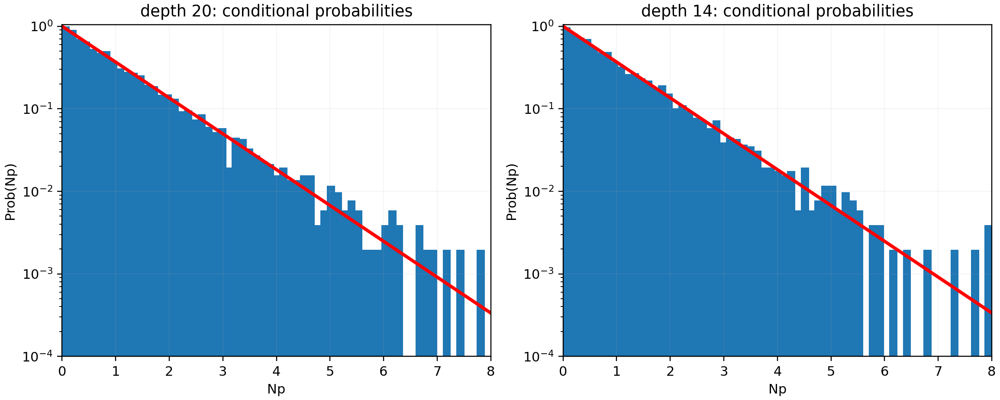
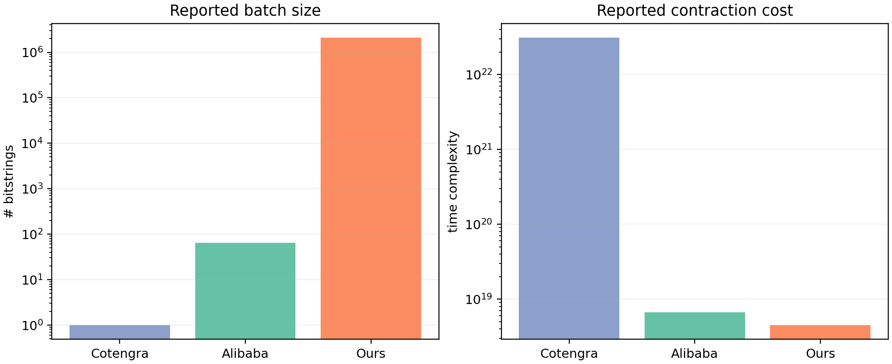

# 2103.03074: Simulating the Sycamore quantum supremacy circuits

Preprint: [arXiv:2103.03074 — Simulating the Sycamore quantum supremacy circuits](https://arxiv.org/abs/2103.03074)

Published as: [Simulation of Quantum Circuits Using the Big-Batch Tensor Network Method](https://doi.org/10.1103/PhysRevLett.128.030501)

Formal citation: Phys. Rev. Lett. 128, 030501 (2022) · DOI `10.1103/PhysRevLett.128.030501` · Locator `030501`

Public status: **Scientific reproduction — paper-error candidates identified** · Audit score: **55.00/100**

All 17 targets have a v6 clean-room author baseline from exact public circuit definitions, analytic rederivations, and a resource-guarded isolated run. T005/T009 now have complete publication-input audits, and T012/T013 have executable formula checks. No independent-review verdict is authored.

## Start Here / 从这里开始

- [中文复现 Note](note/reproduction-note.zh-CN.md)
- [English reproduction note](note/reproduction-note.en.md)
- [Equation-level derivation](docs/DERIVATION.md)
- [Numerical methods](docs/NUMERICAL_METHODS.md)
- [Public evidence index](docs/EVIDENCE_INDEX.md)
- [Comparison policy](docs/COMPARISON_POLICY.md)
- [Scientific consistency report](docs/CONSISTENCY_REPORT.md)
- [Independent paper assessment](docs/PAPER_ASSESSMENT.md)
- [Code and run commands](code/README.md)
- [Machine-readable scorecard](outputs/checks/similarity_scorecard.json)
- [Machine-readable completion boundary](outputs/checks/completion_assessment.json)
- [Derivation (equations)](docs/DERIVATION.md)
- [Numerical methods](docs/NUMERICAL_METHODS.md)
- [Lessons learned](docs/LESSONS_LEARNED.md)

## Quick Run

```bash
python -m venv .venv
source .venv/bin/activate
pip install -r requirements.txt
cd cases/2103.03074/code
python scripts/run_reproduction.py
```

Published machine-readable artifacts are kept under [data](outputs/data/), [figures](outputs/figures/), [checks](outputs/checks/).

## Reproduction Boundary

This public case includes paper-derived code, generated data, generated figures, public validation checks, explanatory notes. It does not redistribute the paper PDF, arXiv source archive, original figures, EPS paths, digitized source curves, source-derived point sets, or source-vs-generated composite panels.

Remaining limitation: Canonical source switched to arXiv because it includes TeX source and original figure assets. Local reproduction validates formulas and numerical features, not the full 53-qubit GPU-scale contraction.

Final-parameter rule: final public figures use the paper parameters when feasible. Any reduced-scale, subset, proxy, or blocked target must be labeled explicitly and cannot be presented as a complete reproduction.

## Generated Figures








