# 2404.08378: On-Chip Quantum Interference between Independent Lithium Niobate-on-Insulator Photon-Pair Sources

Preprint: [arXiv:2404.08378 — On-Chip Quantum Interference between Independent Lithium Niobate-on-Insulator Photon-Pair Sources](https://arxiv.org/abs/2404.08378)

Published as: [On-Chip Quantum Interference between Independent Lithium Niobate-on-Insulator Photon-Pair Sources](https://doi.org/10.1103/n2y3-2bmz)

Formal citation: Phys. Rev. Lett. 134, 223602 (2025) · DOI `10.1103/n2y3-2bmz` · Locator `volume 134, article 223602`

Public status: **Partial scientific reproduction** · Audit score: **65.00/100**

Eighteen formula-based targets are independently generated; exactness is capped for vector-mode, spectral-array, measurement-array, and convention gaps.

## Start Here / 从这里开始

- [中文复现 Note](note/reproduction-note.zh-CN.md)
- [English reproduction note](note/reproduction-note.en.md)
- [Equation-level derivation](docs/DERIVATION.md)
- [Numerical methods](docs/NUMERICAL_METHODS.md)
- [Public evidence index](docs/EVIDENCE_INDEX.md)
- [Comparison policy](docs/COMPARISON_POLICY.md)
- [Scientific consistency report](docs/CONSISTENCY_REPORT.md)
- [Paper review protocol](docs/PAPER_REVIEW_PROTOCOL_V2.md)
- [Code and run commands](code/README.md)
- [Machine-readable scorecard](outputs/checks/similarity_scorecard.json)
- [Machine-readable completion boundary](outputs/checks/completion_assessment.json)
- [Derivation (equations)](docs/DERIVATION.md)
- [Numerical methods](docs/NUMERICAL_METHODS.md)
- [Lessons learned](docs/LESSONS_LEARNED.md)

## Paper Reference vs Independent Reproduction

Each board contains only the minimum paper excerpt needed for validation and places it beside an independently generated result. Visual agreement is a scientific-region diagnostic, not author-data-level equivalence.

### T001 source vs reproduction comparison

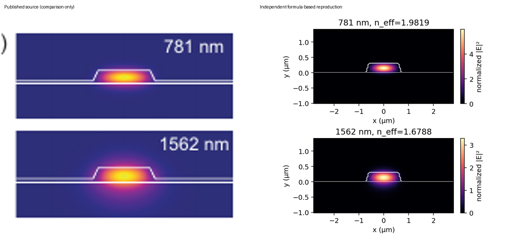

### T002 source vs reproduction comparison

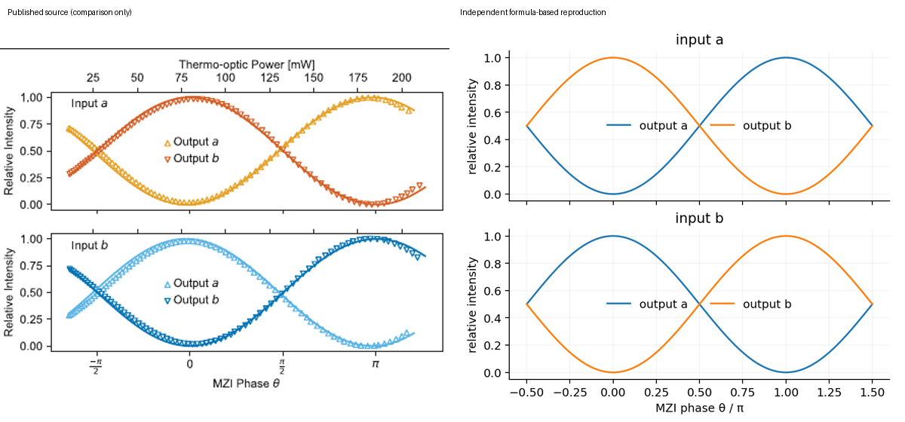

### T003 source vs reproduction comparison

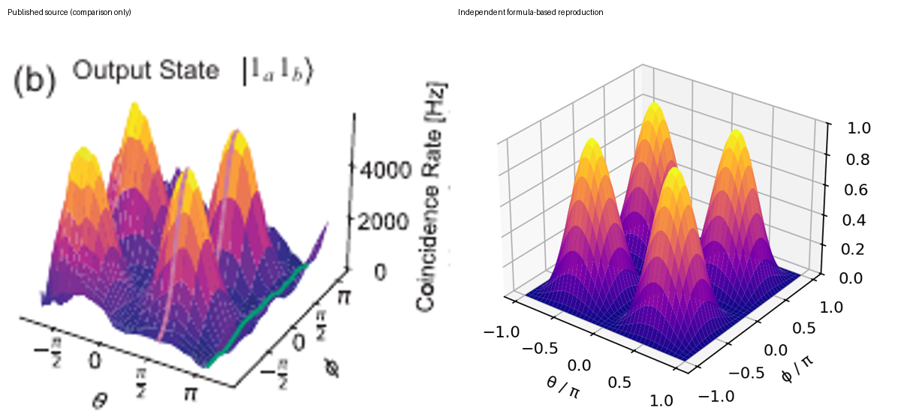

### T004 source vs reproduction comparison

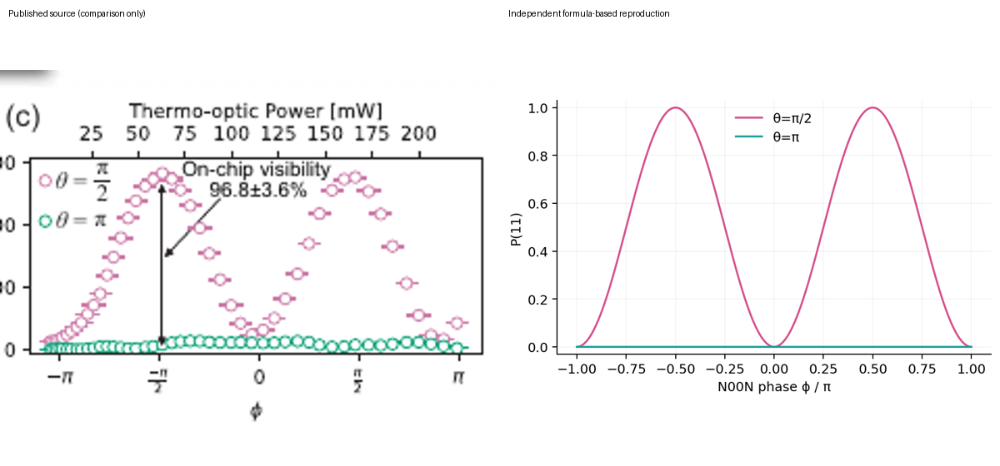

### T005 source vs reproduction comparison

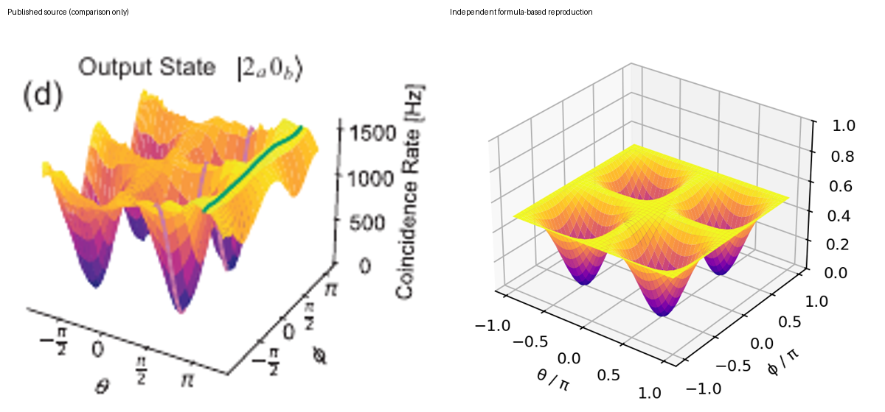

### T006 source vs reproduction comparison

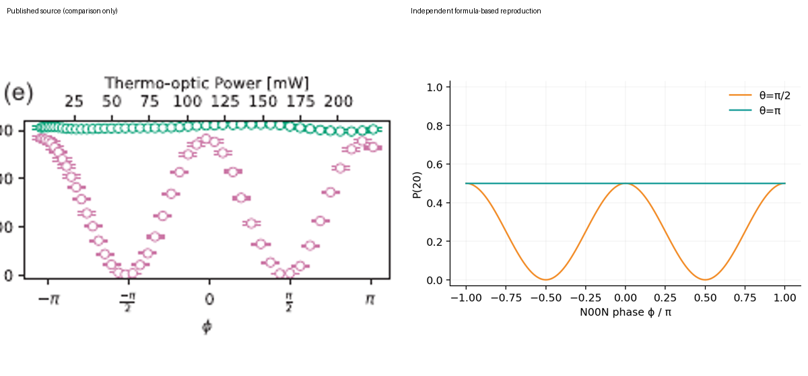

### T007 source vs reproduction comparison

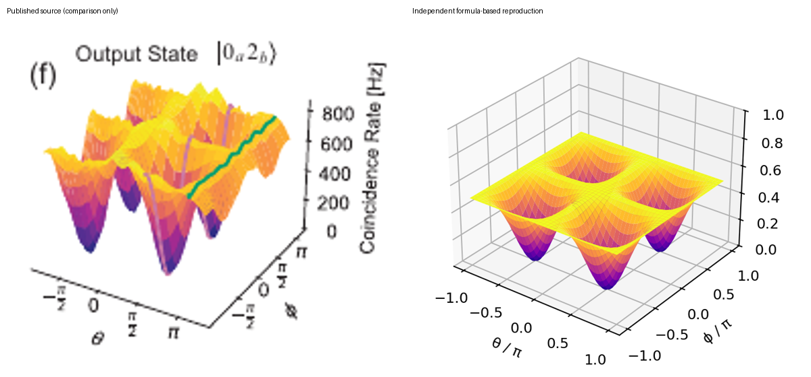

### T008 source vs reproduction comparison

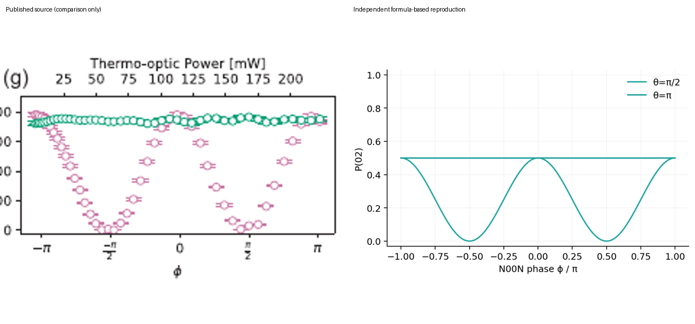

### T009 source vs reproduction comparison

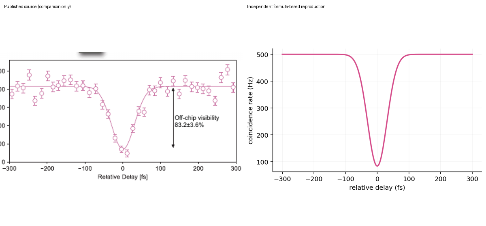

### T010 source vs reproduction comparison

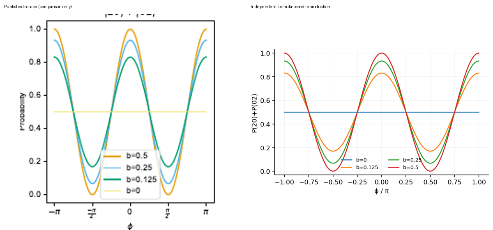

### T011 source vs reproduction comparison

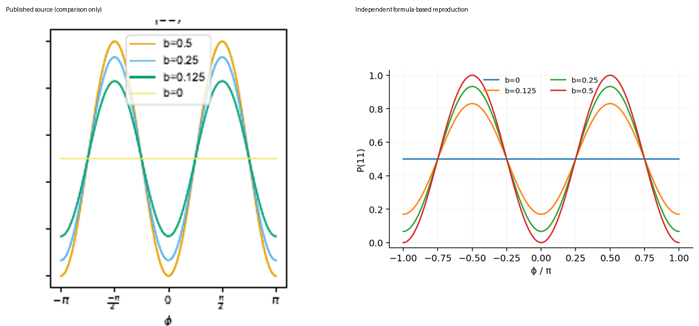

### T012 source vs reproduction comparison

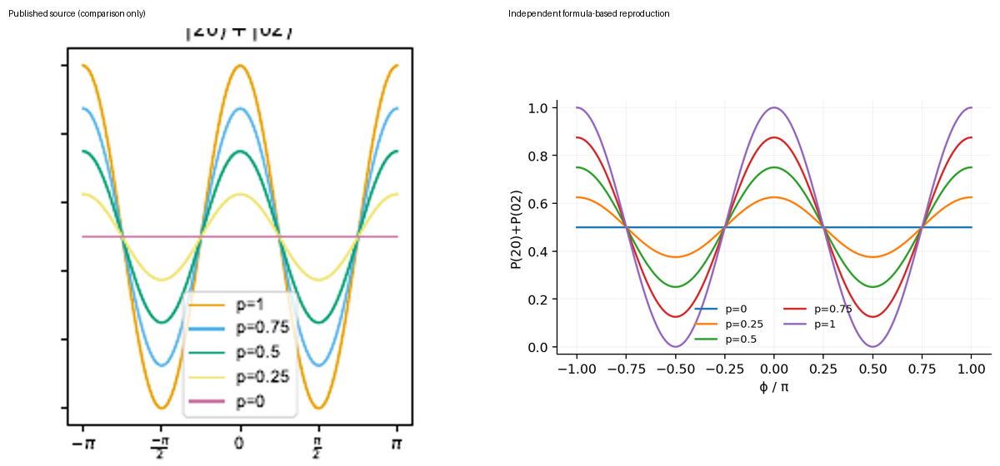

### T013 source vs reproduction comparison

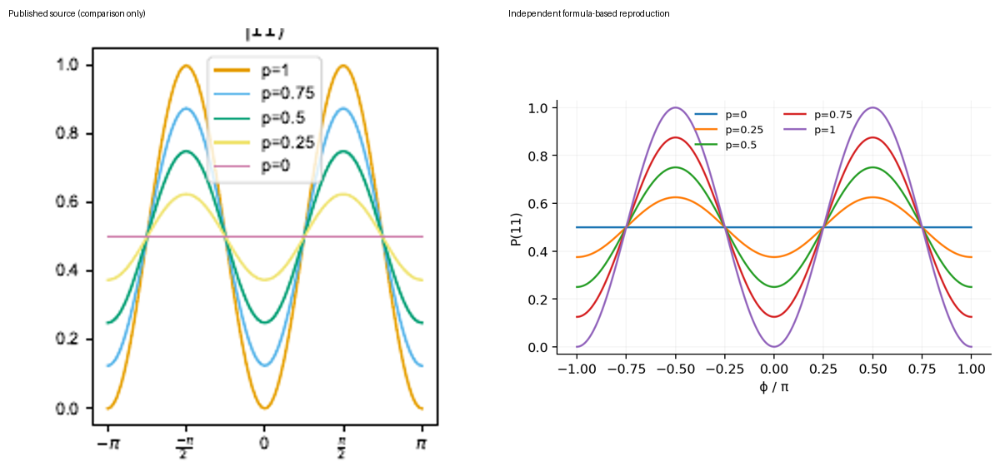

### T014 source vs reproduction comparison

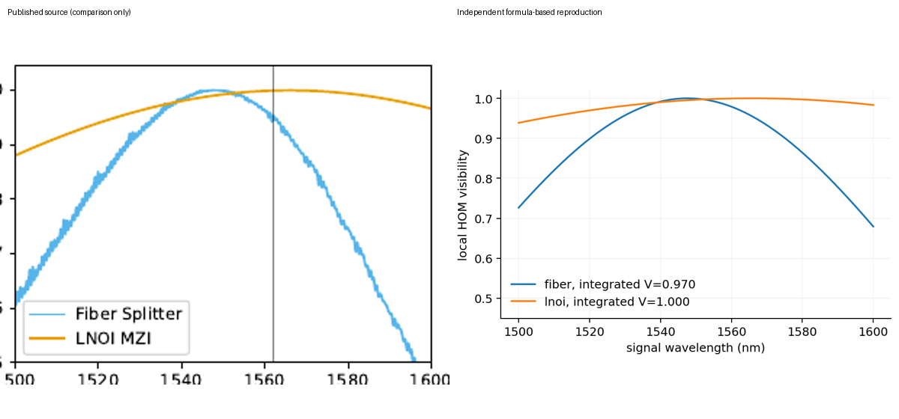

### T015 source vs reproduction comparison

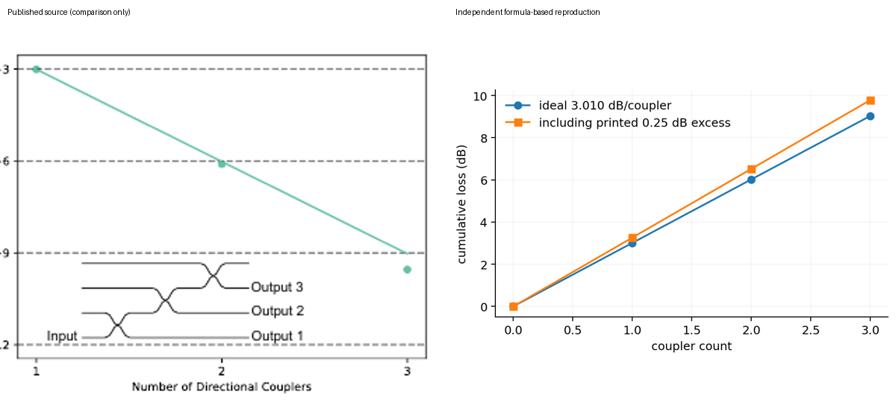

### T016 source vs reproduction comparison

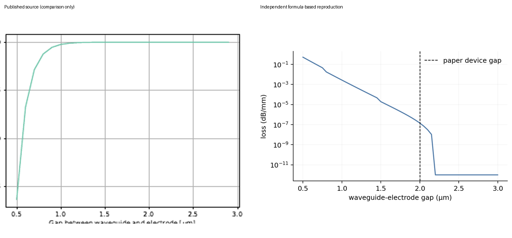

### T017 source vs reproduction comparison

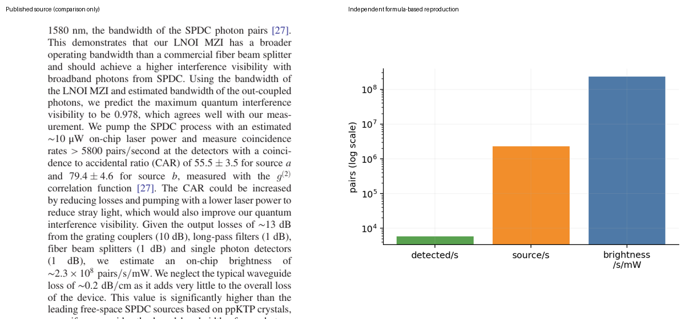

### T018 source vs reproduction comparison

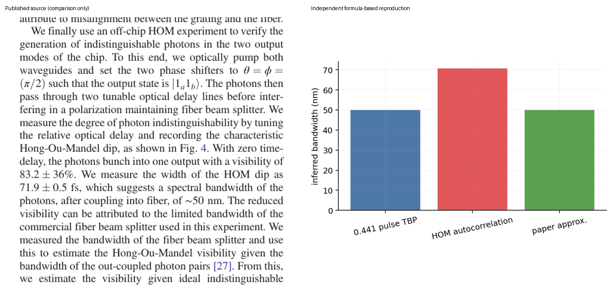

### all target comparisons comparison

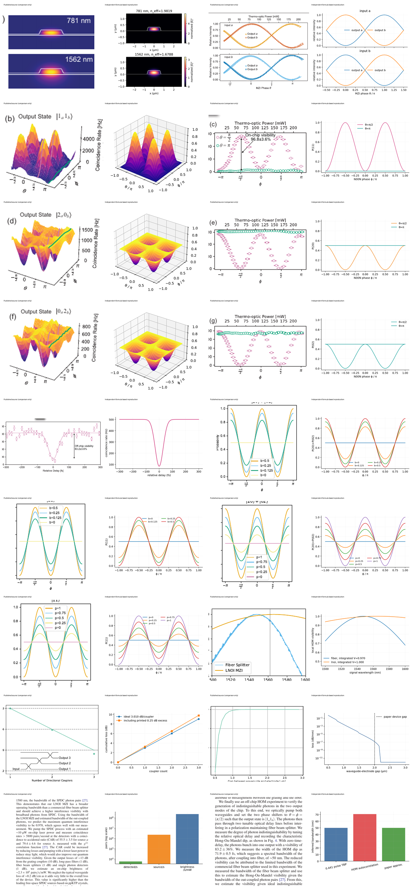

## Quick Run

```bash
python -m venv .venv
source .venv/bin/activate
pip install -r requirements.txt
cd cases/2404.08378/code
python scripts/run_reproduction.py
```

Generated files are kept under [data](outputs/data/), [figures](outputs/figures/), and [checks](outputs/checks/).

## Reproduction Boundary

This public case includes paper-derived code, generated data, generated figures, public validation checks, explanatory notes, and 19 limited comparison panels. Those panels use the minimum paper excerpts needed for validation and clearly separate the paper reference from the independent result. The case does not redistribute the paper PDF, arXiv source archive, standalone original figures, EPS paths, digitized source curves, or source-derived point sets.

Remaining limitation: Author raw data and evaluation code are available only upon reasonable request; no public author numerical implementation was found. The fail-closed experimental reanalysis implementation is ready and runs only when point-level author data are supplied; source-image digitization is forbidden. Fresh-context protocol-v2 independent review is still missing, so this case is not complete.

Final-parameter rule: final public figures use the paper parameters when feasible. Any reduced-scale, subset, proxy, or blocked target must be labeled explicitly and cannot be presented as a complete reproduction.

## Generated Figures
