# 2407.01296: Geometry-adaptive formulation of non-Bloch bands in arbitrary dimensions and spectral instability

Preprint: [arXiv:2407.01296 — Non-Hermitian skin effect in arbitrary dimensions: non-Bloch band theory and classification](https://arxiv.org/abs/2407.01296)

Published as: [Geometry-adaptive formulation of non-Bloch bands in arbitrary dimensions and spectral instability](https://doi.org/10.1038/s42005-026-02546-2)

Formal citation: 9, 127 (2026) · DOI `10.1038/s42005-026-02546-2` · Locator `Article 127`

Public status: **Partial scientific reproduction** · Audit score: **57.13/100**

Independent Python/SciPy reproduction of formal Fig. 2(a-c) and Fig. 4(d).

## Start Here / 从这里开始

- [中文复现 Note](note/reproduction-note.zh-CN.md)
- [English reproduction note](note/reproduction-note.en.md)
- [Equation-level derivation](docs/DERIVATION.md)
- [Numerical methods](docs/NUMERICAL_METHODS.md)
- [Public evidence index](docs/EVIDENCE_INDEX.md)
- [Comparison policy](docs/COMPARISON_POLICY.md)
- [Scientific consistency report](docs/CONSISTENCY_REPORT.md)
- [Code and run commands](code/README.md)
- [Machine-readable scorecard](outputs/checks/similarity_scorecard.json)
- [Machine-readable completion boundary](outputs/checks/completion_assessment.json)
- [Derivation (equations)](docs/DERIVATION.md)
- [Numerical methods](docs/NUMERICAL_METHODS.md)
- [Lessons learned](docs/LESSONS_LEARNED.md)

## Quick Run

```bash
python -m venv .venv
source .venv/bin/activate
pip install -r requirements.txt
cd cases/2407.01296/code
python scripts/run_reproduction.py --config config/final_resolution.json --profile attestation --output-root outputs/public_quick_run
```

Published machine-readable artifacts are kept under [data](outputs/data/), [figures](outputs/figures/), [checks](outputs/checks/).

## Reproduction Boundary

This public case includes paper-derived code, generated data, generated figures, public validation checks, explanatory notes. It does not redistribute the paper PDF, arXiv source archive, original figures, EPS paths, digitized source curves, source-derived point sets, or source-vs-generated composite panels.

Remaining limitation: Fig. 2(c) uses the paper 101x101 grid and 200 momentum samples; mean hierarchical-potential errors against finite OBC are 0.00667/0.00623. Author Zenodo outputs are reference comparators only; generated evidence is independent numerics.

Final-parameter rule: final public figures use the paper parameters when feasible. Any reduced-scale, subset, proxy, or blocked target must be labeled explicitly and cannot be presented as a complete reproduction.

## Generated Figures

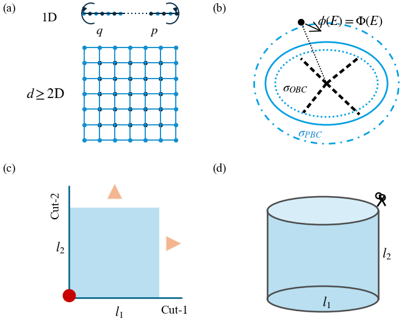


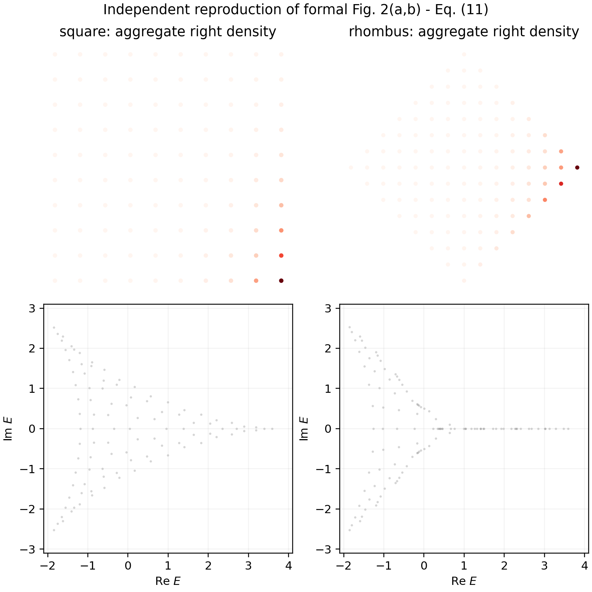


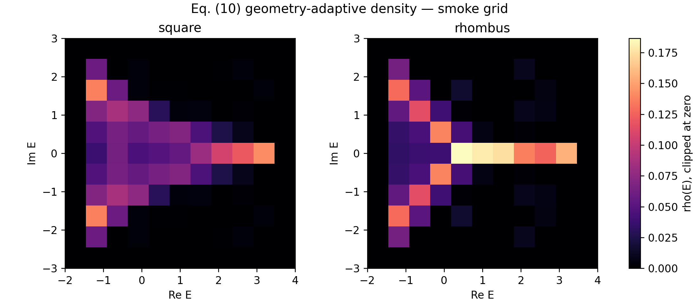

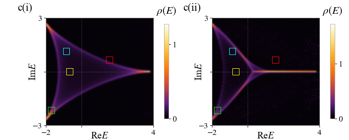


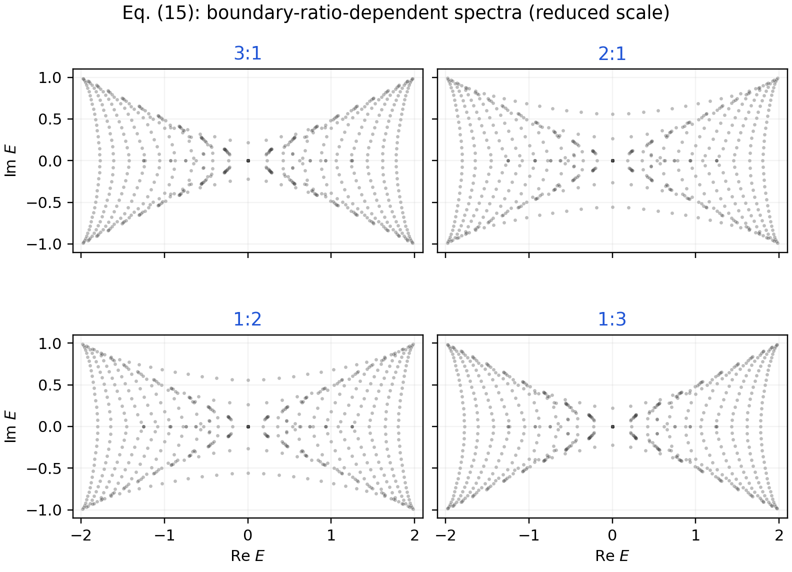

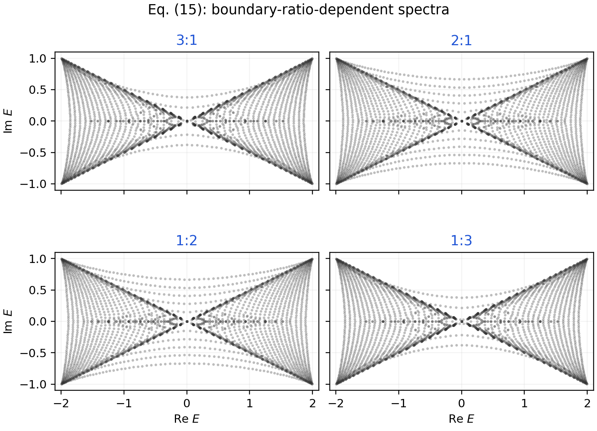

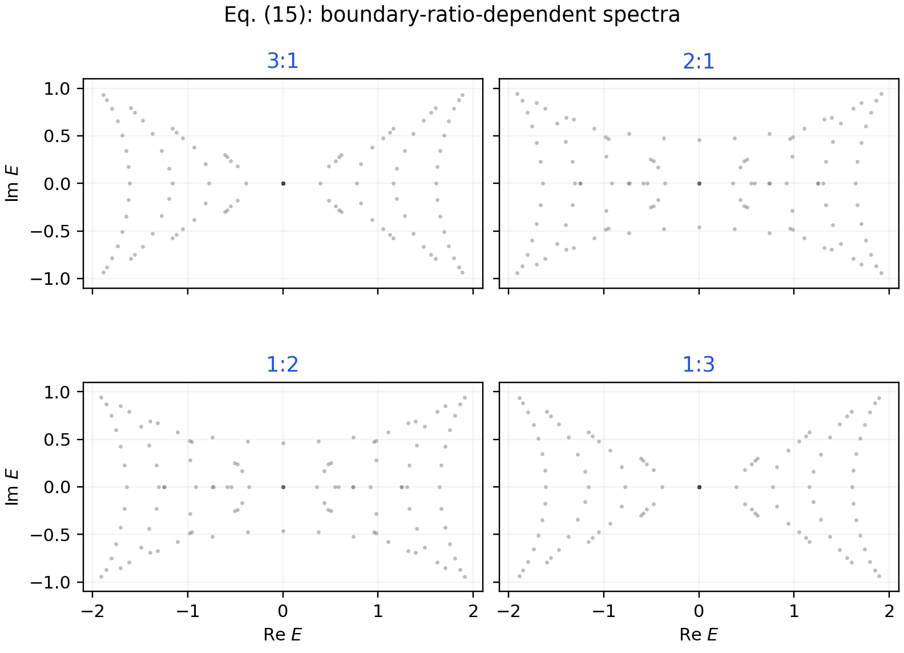


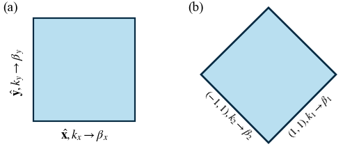


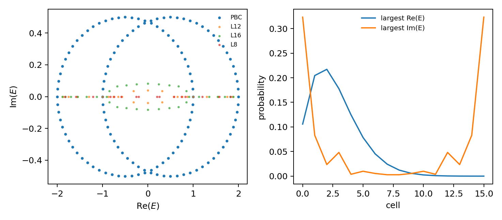

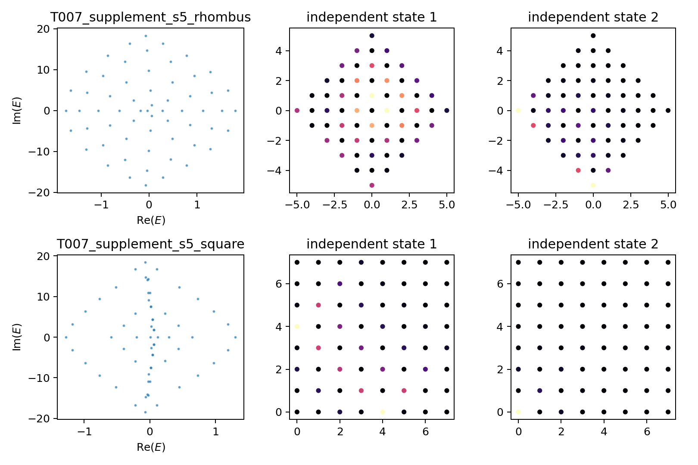


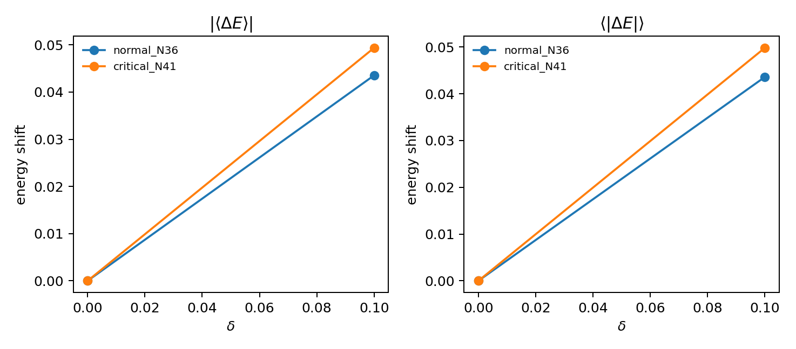

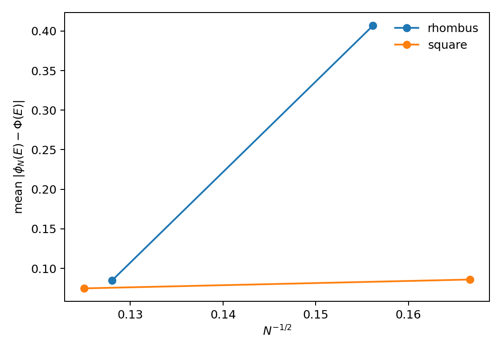


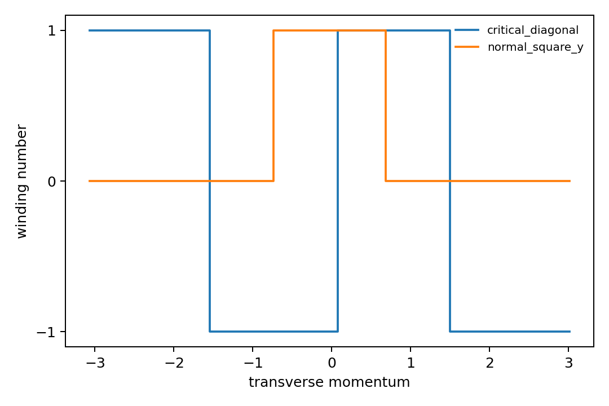


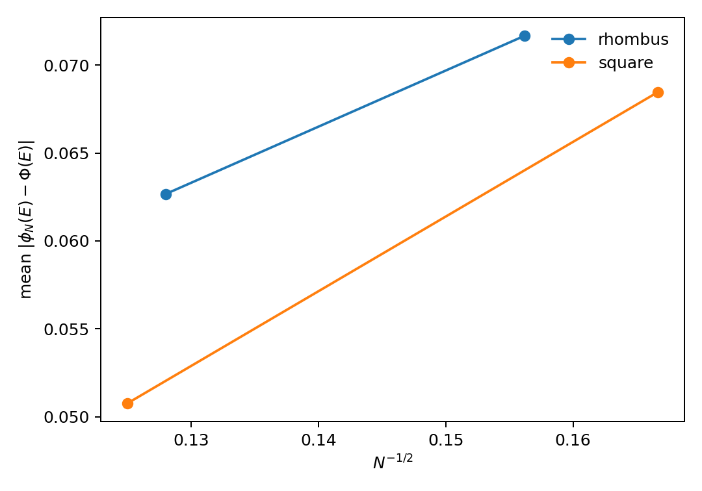

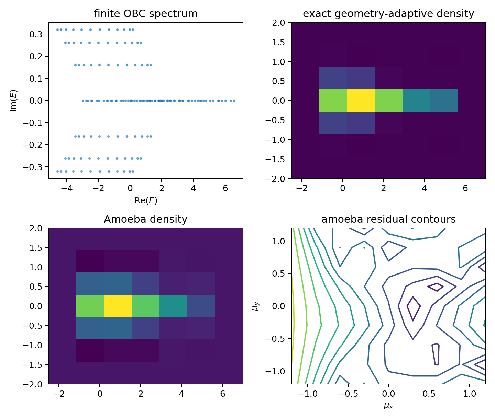


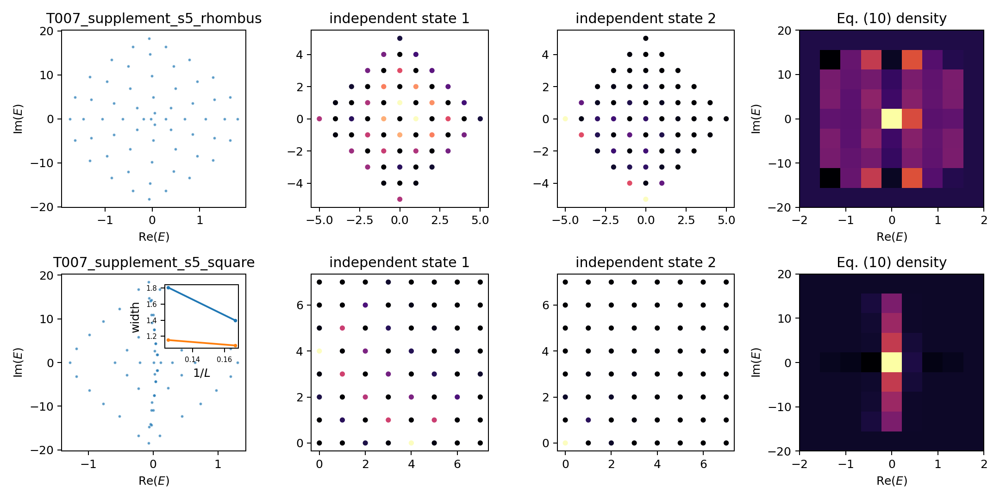


