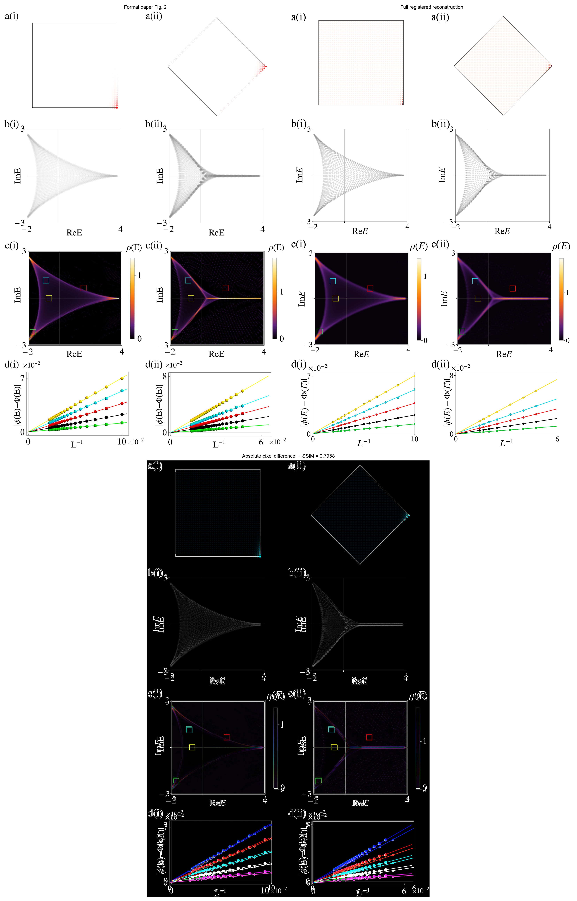
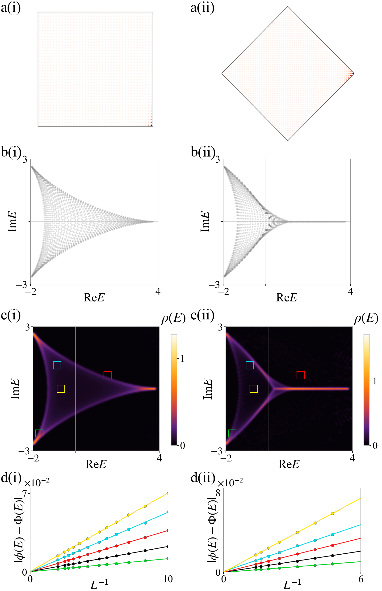
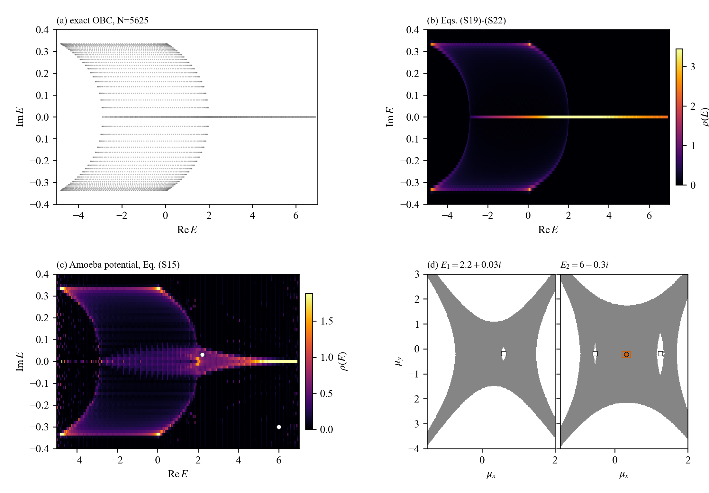
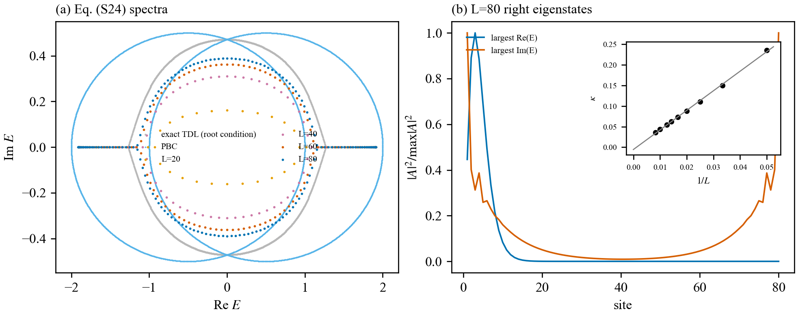
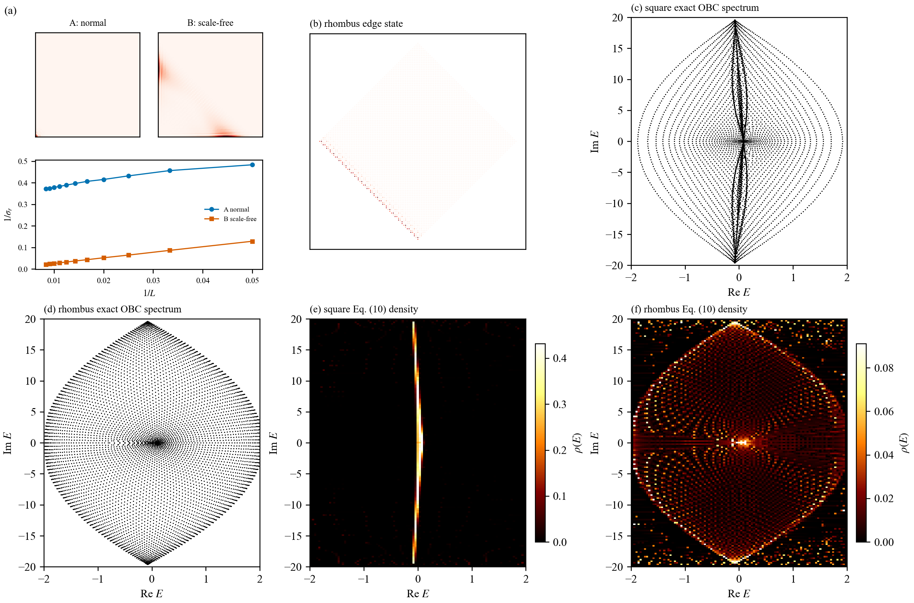
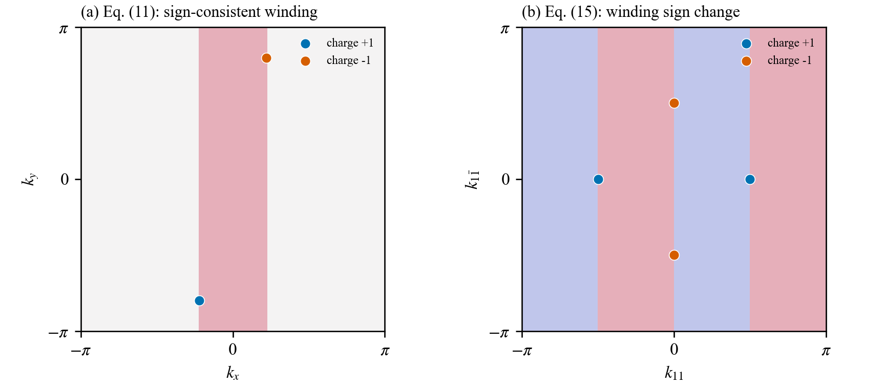
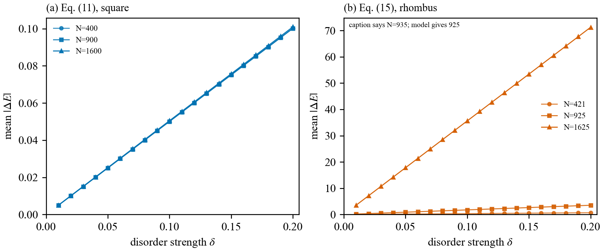

# 2407.01296: Geometry-adaptive formulation of non-Bloch bands in arbitrary dimensions and spectral instability

Preprint: [arXiv:2407.01296 — Non-Hermitian skin effect in arbitrary dimensions: non-Bloch band theory and classification](https://arxiv.org/abs/2407.01296)

Published as: [Geometry-adaptive formulation of non-Bloch bands in arbitrary dimensions and spectral instability](https://doi.org/10.1038/s42005-026-02546-2)

Formal citation: Communications Physics 9, 127 (2026) · DOI `10.1038/s42005-026-02546-2` · Locator `Article 127`

Public status: **Scientific contract complete: 35/35 numerical subplots and 8/8 claims; main-text pixel-registered, not identical** · Audit score: **89.27/100**

Completes the formula- and method-derived scientific evidence chain for all 35 declared main-text and supplementary numerical subplots. All 8 scoped claims, 15 formula cards, and 15 execution runs pass; every panel, including all 317 Fig. 2(d) finite-size probes and the exact Fig. S4 middle-root TDL continuum, is independently equation- or model-generated.

## Start Here / 从这里开始

- [中文复现 Note](note/reproduction-note.zh-CN.md)
- [English reproduction note](note/reproduction-note.en.md)
- [Code and run commands](code/README.md)
- [Machine-readable scorecard](outputs/checks/similarity_scorecard.json)
- [Machine-readable completion boundary](outputs/checks/completion_assessment.json)
- [Numerical methods](docs/NUMERICAL_METHODS.md)
- [Lessons learned](docs/LESSONS_LEARNED.md)

## Main Reproduced Results

| Paper item | Reproduced result | Figure | Check |
| --- | --- | --- | --- |
| Fig. 2 | Fully independent geometry-dependent spectra, skin density, potential, and finite-size convergence | [PNG](outputs/figures/fig2_full_pixel_registered.png) | [JSON](outputs/checks/fig2_full_pixel_similarity.json) |
| Fig. 3 | Geometry-dependent generalized Brillouin zones with corrected projection and view | [PNG](outputs/figures/fig3_gbz_pixel_registered.png) | [JSON](outputs/checks/fig3_gbz_pixel_similarity.json) |
| Fig. 4(a-f) | Critical boundary modes and spectral instability across all six panels | [PNG](outputs/figures/fig4_full_pixel_registered.png) | [JSON](outputs/checks/fig4_full_pixel_similarity.json) |
| Supplementary Fig. S2 | Exact and Amoeba spectra, densities, and winding-classified holes | [PNG](outputs/figures/supp_fig_s2_reproduction.png) | [JSON](outputs/checks/supp_fig_s2.json) |
| Supplementary Fig. S4 | Eq. (S24) finite spectra, exact middle-root TDL continuum, extremal-state profiles, and inverse-size localization scaling | [PNG](outputs/figures/supp_fig_s4_reproduction.png) | [JSON](outputs/checks/supp_fig_s4.json) |
| Supplementary Fig. S5 | Eq. (S27) paper-size spectra, normal/scale-free broadening, cut-edge state, and Eq. (10) densities | [PNG](outputs/figures/supp_fig_s5_reproduction.png) | [JSON](outputs/checks/supp_fig_s5.json) |
| Supplementary Fig. S6 | Eq. (S28) slice winding and independently solved charged Fermi points | [PNG](outputs/figures/supp_fig_s6_reproduction.png) | [JSON](outputs/checks/supp_fig_s6.json) |
| Supplementary Fig. S7 | Eq. (S29) biorthogonal disorder response for all six paper-size series | [PNG](outputs/figures/supp_fig_s7_reproduction.png) | [JSON](outputs/checks/supp_fig_s7.json) |

## Paper Reference vs Independent Reproduction

Each board contains a limited attributed excerpt from the formal paper beside the independently generated registered result. The excerpts are used only for presentation audit; no reference pixels enter numerical computation. The boards demonstrate remaining differences and do not assert pixel identity.

### Fig. 2 comparison



### Fig. 3 comparison


### Fig. 4 comparison


### Fig. 2: Fully independent geometry-dependent spectra, skin density, potential, and finite-size convergence



### Fig. 3: Geometry-dependent generalized Brillouin zones with corrected projection and view


### Fig. 4(a-f): Critical boundary modes and spectral instability across all six panels


### Supplementary Fig. S2: Exact and Amoeba spectra, densities, and winding-classified holes



### Supplementary Fig. S4: Eq. (S24) finite spectra, exact middle-root TDL continuum, extremal-state profiles, and inverse-size localization scaling



### Supplementary Fig. S5: Eq. (S27) paper-size spectra, normal/scale-free broadening, cut-edge state, and Eq. (10) densities



### Supplementary Fig. S6: Eq. (S28) slice winding and independently solved charged Fermi points



### Supplementary Fig. S7: Eq. (S29) biorthogonal disorder response for all six paper-size series



## Quick Run

```bash
python -m venv .venv
source .venv/bin/activate
pip install -r requirements.txt
cd cases/2407.01296/code
python scripts/run_reproduction_smoke.py
python scripts/run_fig2d_finite_size.py
python scripts/run_supplementary_fig2.py
python scripts/run_supplementary_fig4.py
python scripts/run_supplementary_fig5.py
python scripts/run_supplementary_fig6.py
python scripts/run_supplementary_fig7.py
```

Generated files are kept under [data](outputs/data/), [figures](outputs/figures/), and [checks](outputs/checks/).

## Reproduction Boundary

This public case includes paper-derived code, generated data, generated figures, public validation checks, explanatory notes, and 3 limited comparison panels. Those panels use the minimum paper excerpts needed for validation and clearly separate the paper reference from the independent result. The case does not redistribute the paper PDF, arXiv source archive, standalone original figures, EPS paths, digitized source curves, or source-derived point sets.

Remaining limitation: Strict SSIM 0.95 pixel identity is not claimed. Main-text pixel-layout evidence covers 18 subplots; 17 supplementary subplots are explicitly deferred until separately cropped reference panels are frozen. Supplementary Fig. S7 records the caption's N=935 versus equation- and runner-consistent N=925 source discrepancy. Large Fig. 2(d) sparse determinants retain a double-precision LU-ordering-sensitive tail, and the exact Fig. S4 continuum is numerically traced on two finite energy grids.

Final-parameter rule: final public figures use the paper parameters when feasible. Any reduced-scale, subset, proxy, or blocked target must be labeled explicitly and cannot be presented as a complete reproduction.
