# 2409.18176: Tuning Transport in Solid-State Bose-Fermi Mixtures by Feshbach Resonances

Preprint: [arXiv:2409.18176 — Tuning Transport in Solid-State Bose-Fermi Mixtures by Feshbach Resonances](https://arxiv.org/abs/2409.18176)

Published as: [Tuning Transport in Solid-State Bose-Fermi Mixtures by Feshbach Resonances](https://doi.org/10.1103/PhysRevLett.134.126502)

Formal citation: Phys. Rev. Lett. 134, 126502 (2025) · DOI `10.1103/PhysRevLett.134.126502` · Locator `126502`

Public status: **Partial scientific reproduction** · Audit score: **54.90/100**

The arXiv paper and source archive were frozen before implementation.

## Start Here / 从这里开始

- [中文复现 Note](note/reproduction-note.zh-CN.md)
- [English reproduction note](note/reproduction-note.en.md)
- [Equation-level derivation](docs/DERIVATION.md)
- [Numerical methods](docs/NUMERICAL_METHODS.md)
- [Public evidence index](docs/EVIDENCE_INDEX.md)
- [Comparison policy](docs/COMPARISON_POLICY.md)
- [Scientific consistency report](docs/CONSISTENCY_REPORT.md)
- [Paper review protocol](docs/PAPER_REVIEW_PROTOCOL_V2.md)
- [Code and run commands](code/README.md)
- [Machine-readable scorecard](outputs/checks/similarity_scorecard.json)
- [Machine-readable completion boundary](outputs/checks/completion_assessment.json)
- [Derivation (equations)](docs/DERIVATION.md)
- [Numerical methods](docs/NUMERICAL_METHODS.md)
- [Lessons learned](docs/LESSONS_LEARNED.md)

## Paper Reference vs Independent Reproduction

Each board contains only the minimum paper excerpt needed for validation and places it beside an independently generated result. Visual agreement is a scientific-region diagnostic, not author-data-level equivalence.

### T001 source vs reproduction comparison

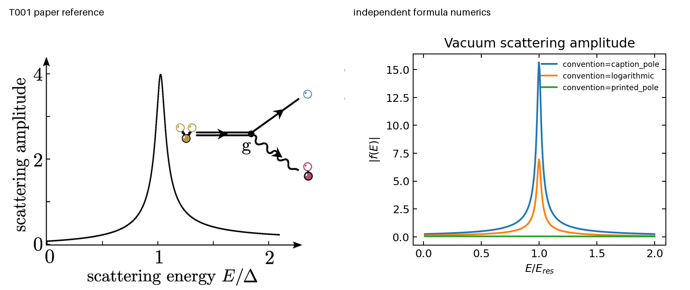

### T002 source vs reproduction comparison

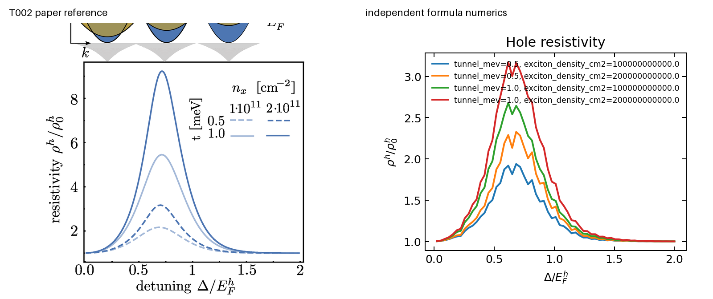

### T003 source vs reproduction comparison

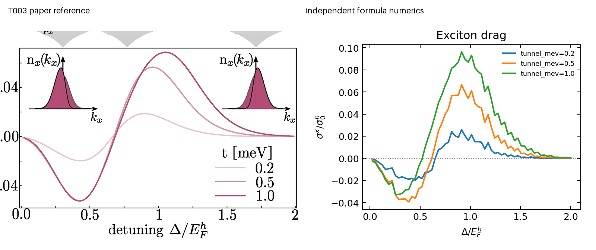

### T004 source vs reproduction comparison

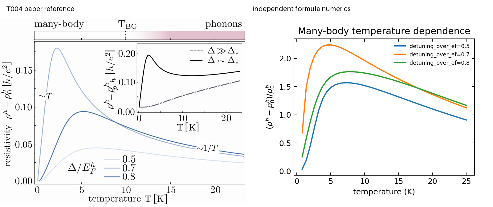

### T005 source vs reproduction comparison

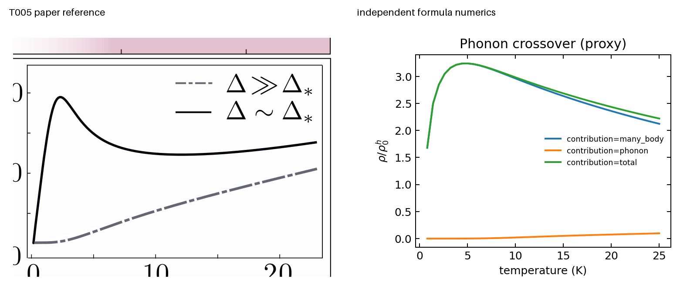

### T006 source vs reproduction comparison

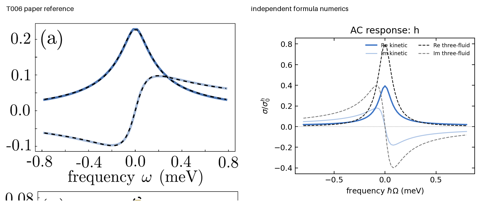

### T007 source vs reproduction comparison

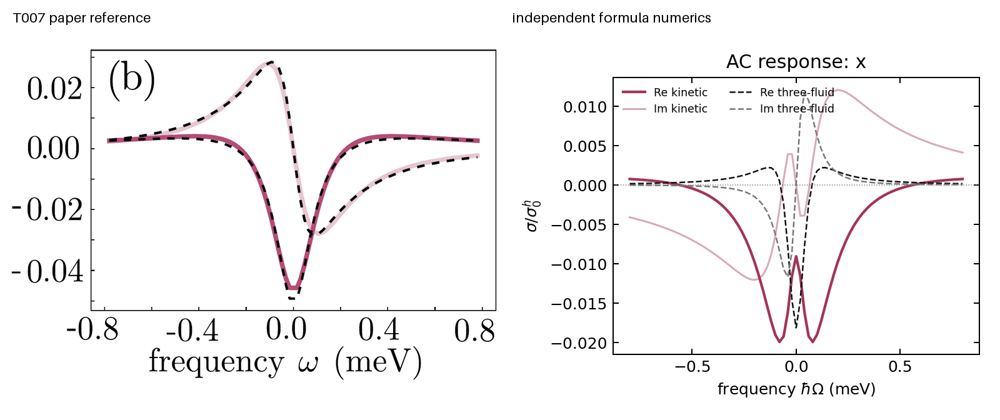

### T008 source vs reproduction comparison

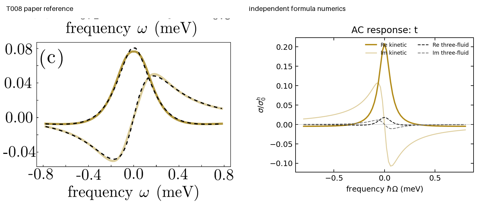

### T009 source vs reproduction comparison

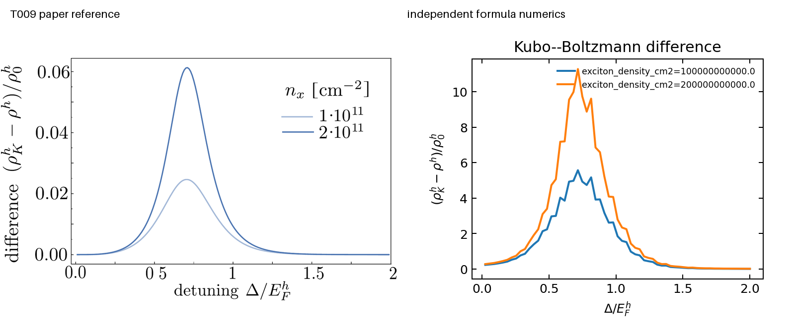

### T010 source vs reproduction comparison

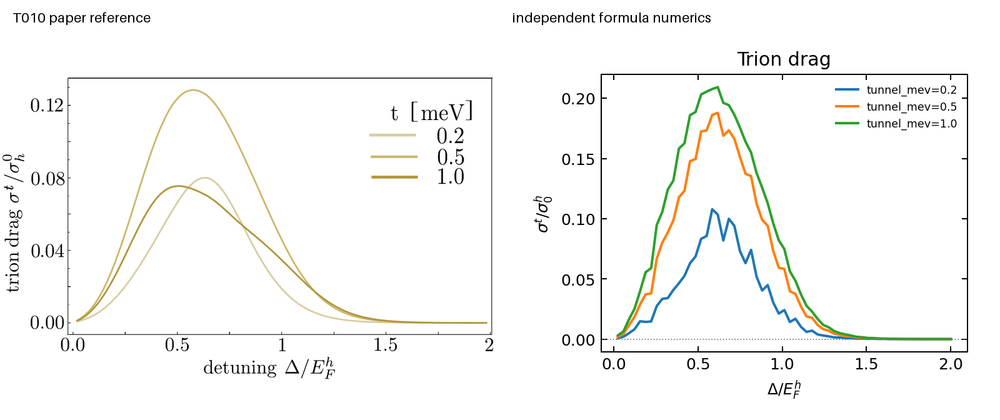

### comparison contact comparison

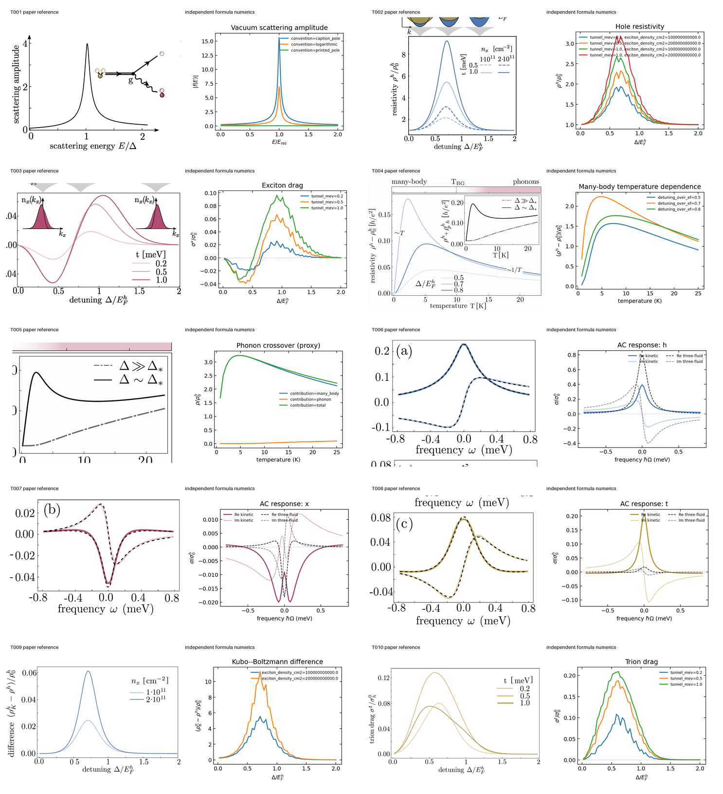

## Quick Run

```bash
python -m venv .venv
source .venv/bin/activate
pip install -r requirements.txt
cd cases/2409.18176/code
python scripts/run_reproduction.py
```

Generated files are kept under [data](outputs/data/), [figures](outputs/figures/), and [checks](outputs/checks/).

## Reproduction Boundary

This public case includes paper-derived code, generated data, generated figures, public validation checks, explanatory notes, and 11 limited comparison panels. Those panels use the minimum paper excerpts needed for validation and clearly separate the paper reference from the independent result. The case does not redistribute the paper PDF, arXiv source archive, standalone original figures, EPS paths, digitized source curves, or source-derived point sets.

Remaining limitation: Author numerical arrays and source pixels were not used as scientific inputs.

Final-parameter rule: final public figures use the paper parameters when feasible. Any reduced-scale, subset, proxy, or blocked target must be labeled explicitly and cannot be presented as a complete reproduction.

## Generated Figures

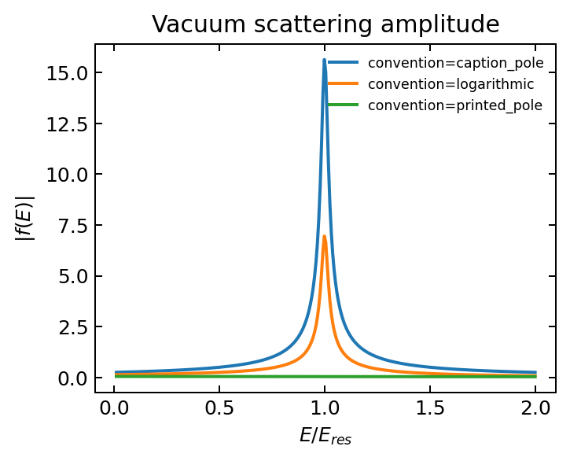

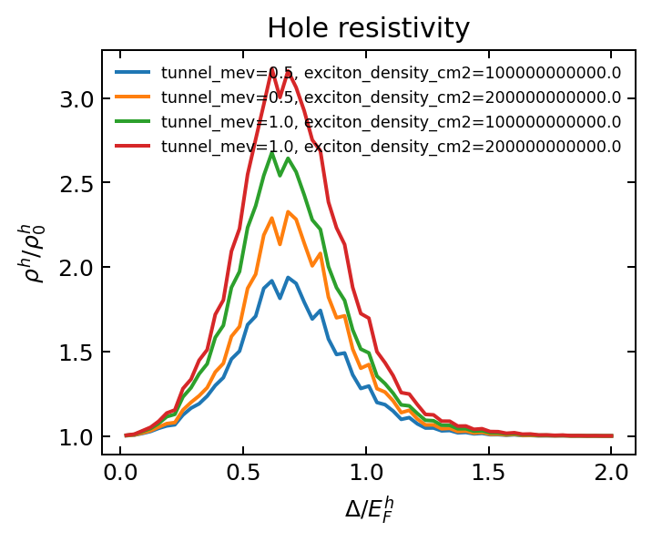

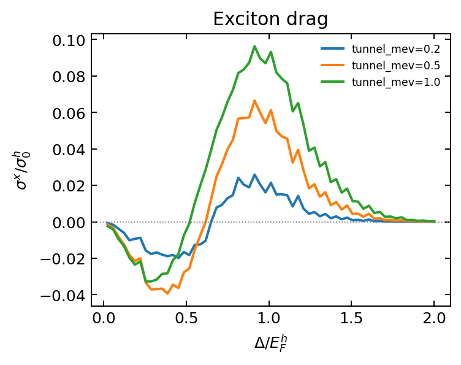

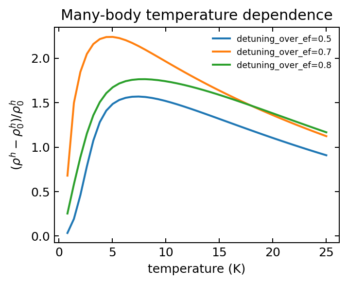

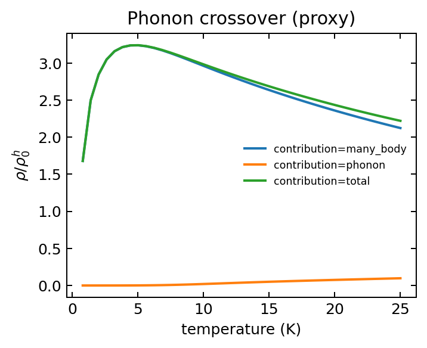

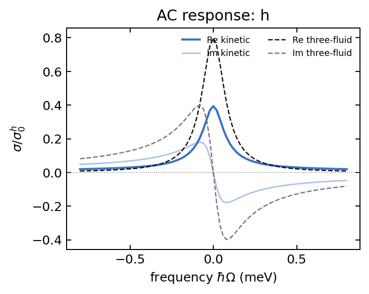

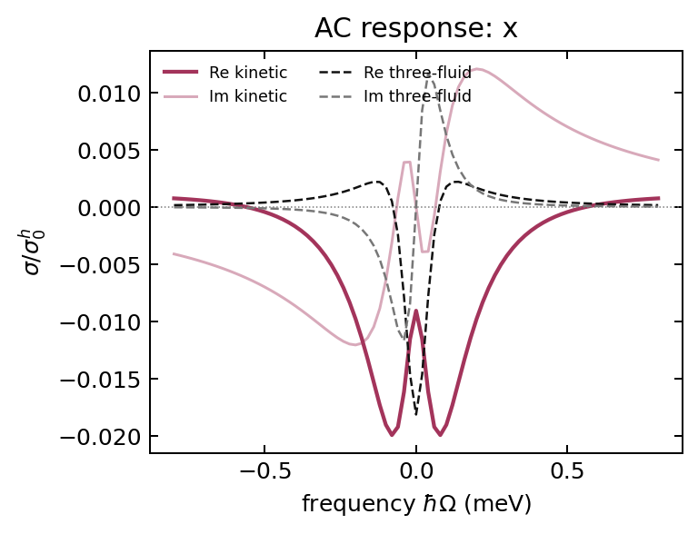

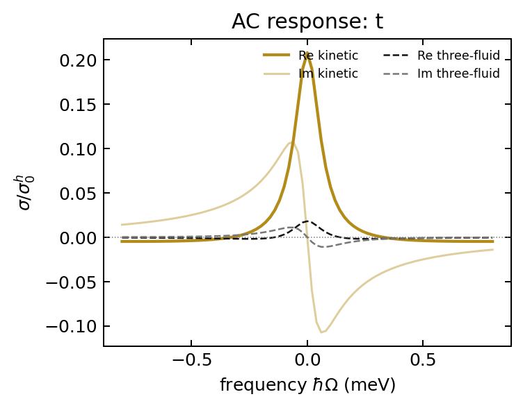

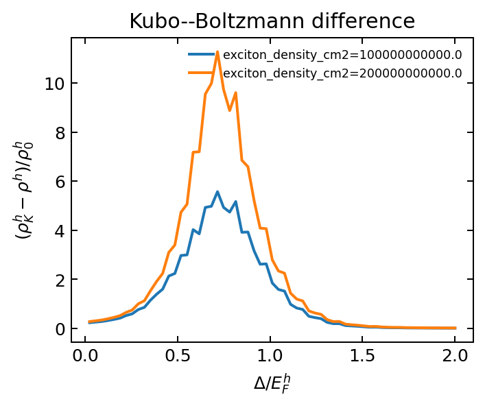

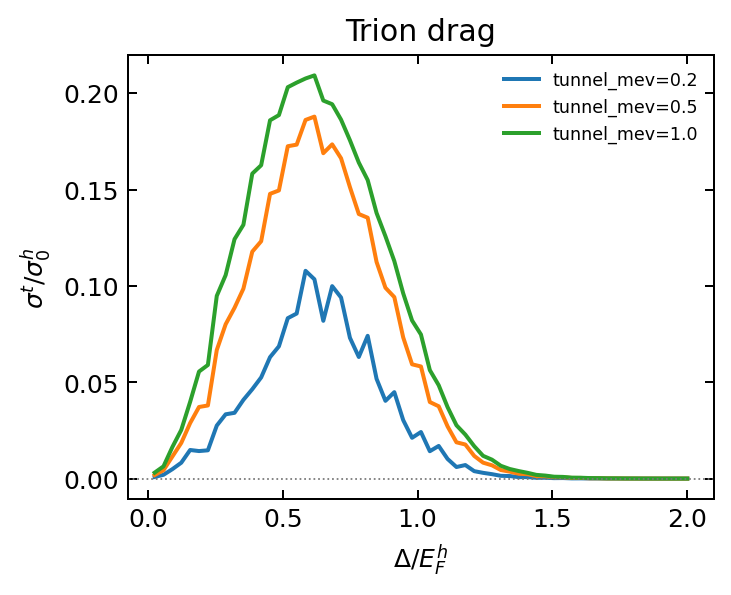
