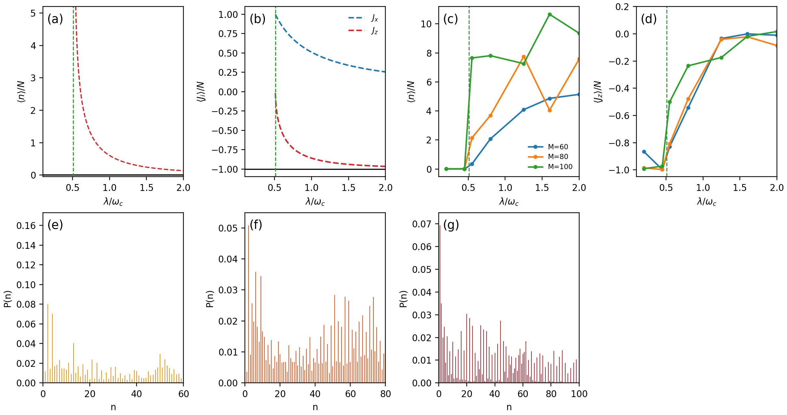
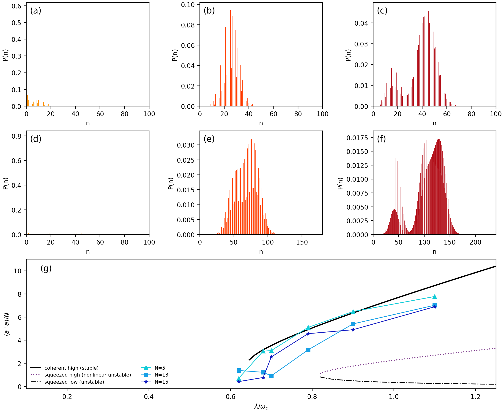
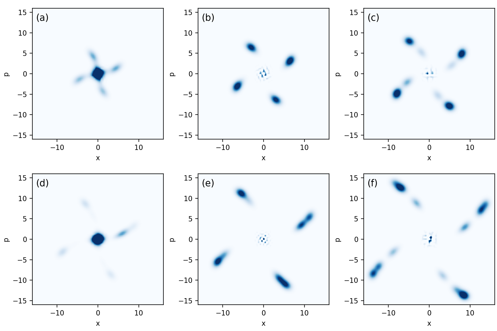
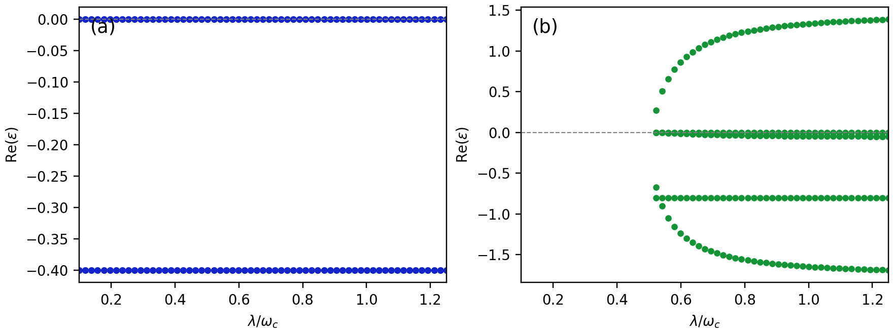
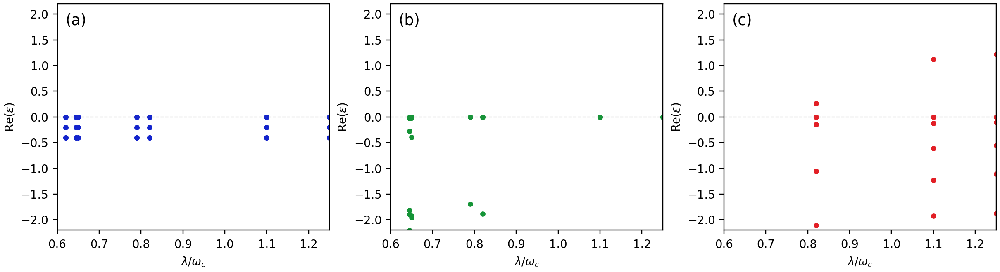
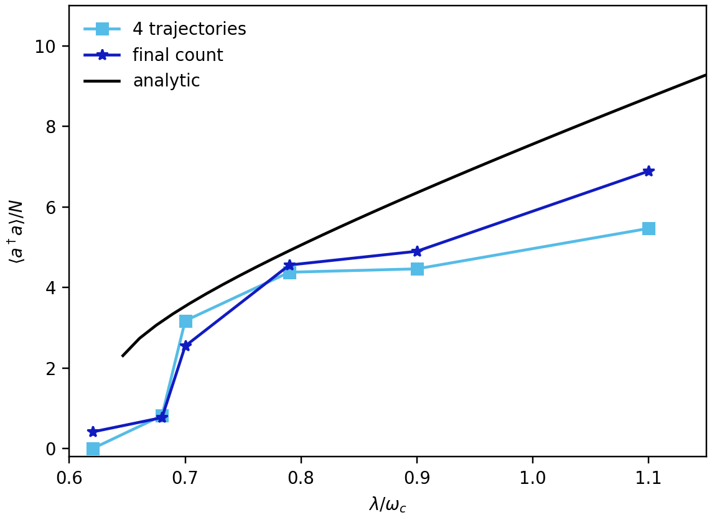
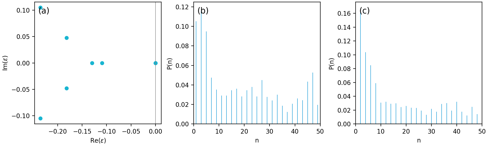

# 2412.14271: Dissipative Phase Transition in the Two-Photon Dicke Model

Preprint: [arXiv:2412.14271 — Dissipative Phase Transition in the Two-Photon Dicke Model](https://arxiv.org/abs/2412.14271)

Published as: [Dissipative Phase Transition in the Two-Photon Dicke Model](https://doi.org/10.1103/mz92-6l9g)

Formal citation: Physical Review Letters 135, 173602 (2025) · DOI `10.1103/mz92-6l9g` · Locator `173602`

Public status: **Feature-level numerical reproduction with a documented equation-level discrepancy** · Audit score: **46.71/100**

Independently reconstructs the analytic fixed points, stability spectra, seeded finite-size quantum trajectories, Wigner functions, and parity sectors for seven of eight numerical figure groups. The audit also identifies a reproducible branch-to-spectrum evidence discrepancy in Fig. 3(g)/Fig. S2.

## Start Here / 从这里开始

- [中文复现 Note](note/reproduction-note.zh-CN.md)
- [English reproduction note](note/reproduction-note.en.md)
- [Fig. 3(g) / Fig. S2 discrepancy report](docs/PAPER_DISCREPANCY.md)
- [Similarity scorecard](docs/SIMILARITY_SCORECARD.md)
- [Code and run commands](code/README.md)
- [Machine-readable scorecard](outputs/checks/similarity_scorecard.json)
- [Derivation (equations)](docs/DERIVATION.md)
- [Numerical methods](docs/NUMERICAL_METHODS.md)
- [Lessons learned](docs/LESSONS_LEARNED.md)

## Main Reproduced Results

| Paper item | Reproduced result | Figure | Check |
| --- | --- | --- | --- |
| Fig. 2 | One-photon analytic transition and finite-cutoff trajectory distributions | [PNG](outputs/figures/fig2.png) | [JSON](outputs/checks/fig2_science.json) |
| Fig. 3 | Two-photon finite-size distributions and thermodynamic branches | [PNG](outputs/figures/fig3.png) | [JSON](outputs/checks/fig3_analytic_science.json) |
| Fig. 4 | Wigner functions from generated reduced density matrices | [PNG](outputs/figures/fig4.png) | [JSON](outputs/checks/fig4_science.json) |
| Fig. S1 | One-photon fixed-point stability spectra | [PNG](outputs/figures/figS1.png) | [JSON](outputs/checks/figS1_science.json) |
| Fig. S2 | Both-loss stability audit with branch-specific discrepancy evidence | [PNG](outputs/figures/figS2.png) | [JSON](outputs/checks/figS2_science.json) |
| Fig. S5 | Reduced trajectory-count convergence | [PNG](outputs/figures/figS5.png) | [JSON](outputs/checks/figS5_science.json) |
| Parity supplement | Liouvillian near-zero kernel and parity-resolved distributions | [PNG](outputs/figures/figS_parity.png) | [JSON](outputs/checks/figS_parity_science.json) |

### Fig. 2: One-photon analytic transition and finite-cutoff trajectory distributions



### Fig. 3: Two-photon finite-size distributions and thermodynamic branches



### Fig. 4: Wigner functions from generated reduced density matrices



### Fig. S1: One-photon fixed-point stability spectra



### Fig. S2: Both-loss stability audit with branch-specific discrepancy evidence



### Fig. S5: Reduced trajectory-count convergence



### Parity supplement: Liouvillian near-zero kernel and parity-resolved distributions



## Quick Run

```bash
python -m venv .venv
source .venv/bin/activate
pip install -r requirements.txt
pip install qutip
cd cases/2412.14271/code
python scripts/run_analytic.py
python scripts/render_figures.py
```

### Full reduced-ensemble rerun

Regenerates all shipped analytic and quantum arrays with the declared public configurations. The quantum jobs take roughly ten-plus minutes on the reference CPU and remain reduced relative to the paper's trajectory counts.

```bash
cd cases/2412.14271/code
python scripts/run_analytic.py
python scripts/run_quantum_one_photon.py
python scripts/run_quantum_main.py
python scripts/run_quantum_parity.py
python scripts/render_figures.py
```

Generated files are kept under [data](outputs/data/), [figures](outputs/figures/), and [checks](outputs/checks/).

## Reproduction Boundary

This public case includes paper-derived code, generated data, generated figures, public validation checks, and explanatory notes. It does not redistribute the paper PDF, arXiv source archive, original figures, EPS paths, digitized source curves, source-derived point sets, or source-vs-generated composite panels.

Remaining limitation: Main quantum panels use reduced trajectory counts, formal supplemental Figs. S3–S4 remain blocked by unavailable defining parameters, and the Fig. 3(g)/Fig. S2 evidence discrepancy awaits independent review or author clarification.

Final-parameter rule: final public figures use the paper parameters when feasible. Any reduced-scale, subset, proxy, or blocked target must be labeled explicitly and cannot be presented as a complete reproduction.
