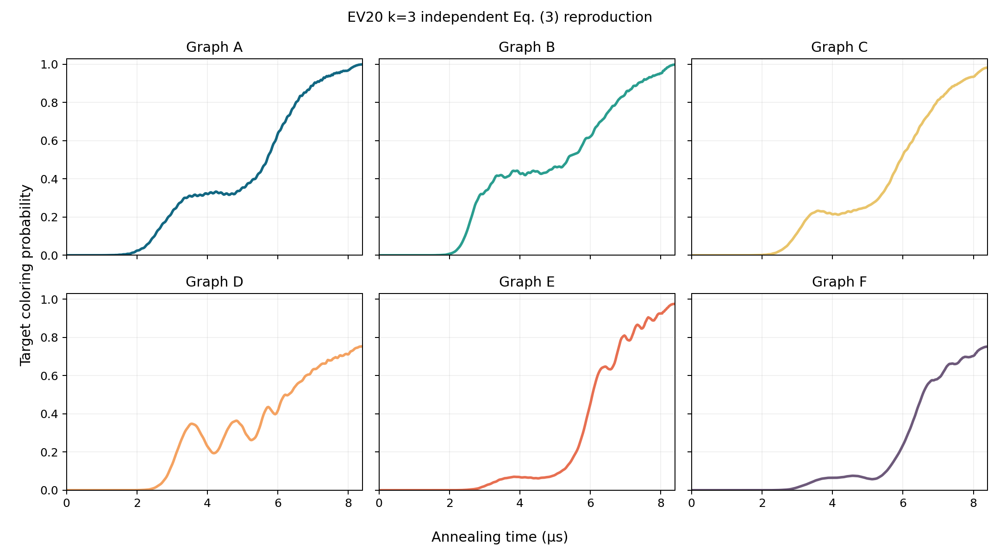

# 2504.08598: Graph coloring via quantum optimization on a Rydberg-qudit atom array

Preprint: [arXiv:2504.08598 — Graph coloring via quantum optimization on a Rydberg-qudit atom array](https://arxiv.org/abs/2504.08598)

Published as: [Graph coloring via quantum optimization on a Rydberg-qudit atom array](https://doi.org/10.1088/2058-9565/ae3b6d)

Formal citation: Quantum Science and Technology 11, 025012 (2026) · DOI `10.1088/2058-9565/ae3b6d` · Locator `025012`

Public status: **Scientific reproduction — invalid** · Audit score: **82.30/100**

Publishes the independently generated numerical artifacts retained by the historical case: 9 public generated data files, 1 public generated figures, and 4 declared numerical targets. The package preserves failed, partial, proxy, and unresolved outcomes instead of upgrading them to completion.

## Start Here / 从这里开始

- [中文复现 Note](note/reproduction-note.zh-CN.md)
- [English reproduction note](note/reproduction-note.en.md)
- [Code and run commands](code/README.md)
- [Machine-readable scorecard](outputs/checks/similarity_scorecard.json)
- [Machine-readable completion boundary](outputs/checks/completion_assessment.json)
- [Derivation (equations)](docs/DERIVATION.md)
- [Numerical methods](docs/NUMERICAL_METHODS.md)
- [Lessons learned](docs/LESSONS_LEARNED.md)

## Main Reproduced Results

| Paper item | Reproduced result | Figure | Check |
| --- | --- | --- | --- |
| FIG005 | k=3 target-coloring probability versus annealing time and final E/F basis distributions | [PNG](outputs/figures/fig5_k3_annealing_reproduction.png) | [JSON](outputs/checks/similarity_scorecard.json) |

### FIG005: k=3 target-coloring probability versus annealing time and final E/F basis distributions



## Quick Run

```bash
python -m venv .venv
source .venv/bin/activate
pip install -r requirements.txt
cd cases/2504.08598/code
python scripts/verify_public_artifacts.py
```

Generated files are kept under [data](outputs/data/), [figures](outputs/figures/), and [checks](outputs/checks/).

## Reproduction Boundary

This public case includes paper-derived code, generated data, generated figures, public validation checks, and explanatory notes. It does not redistribute the paper PDF, arXiv source archive, original figures, EPS paths, digitized source curves, source-derived point sets, or source-vs-generated composite panels.

Remaining limitation: Frozen non-final target states: T001=evidence_compared, T002=evidence_compared, T003A=partially_reproduced, T003B=partially_reproduced. The legacy case has no machine-verifiable author-code isolation attestation. No source-image comparison panel or digitized source curve is published in this projection.

Final-parameter rule: final public figures use the paper parameters when feasible. Any reduced-scale, subset, proxy, or blocked target must be labeled explicitly and cannot be presented as a complete reproduction.
