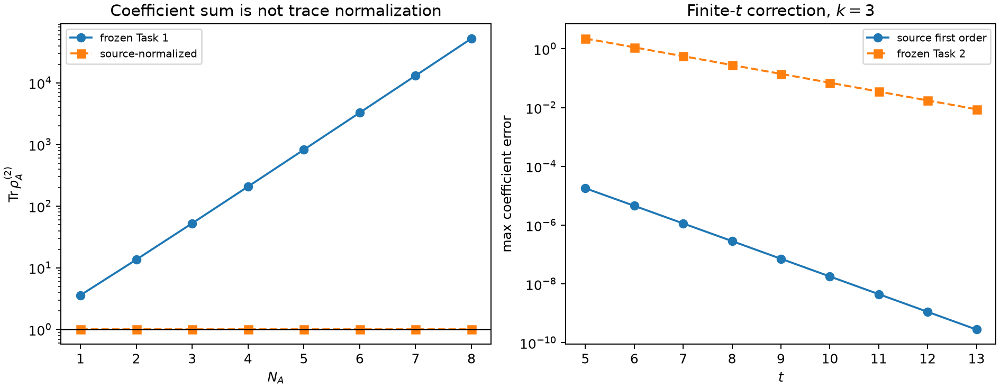

# 2505.07795: Mixed State Deep Thermalization

Preprint: [arXiv:2505.07795 — Mixed State Deep Thermalization](https://arxiv.org/abs/2505.07795)

Published as: [Mixed State Deep Thermalization](https://doi.org/10.1103/t6zs-3f8k)

Formal citation: Physical Review Letters 135, 260402 (2025) · DOI `10.1103/t6zs-3f8k` · Locator `260402`

Public status: **Historical scientific artifact (3 numerical targets; 2 blocked_missing_method, 1 reproduced)** · Audit score: **0.00/100**

Publishes the independently generated numerical artifacts retained by the historical case: 1 public generated data files, 1 public generated figures, and 3 declared numerical targets. The package preserves failed, partial, proxy, and unresolved outcomes instead of upgrading them to completion.

## Start Here / 从这里开始

- [中文复现 Note](note/reproduction-note.zh-CN.md)
- [English reproduction note](note/reproduction-note.en.md)
- [Code and run commands](code/README.md)
- [Machine-readable scorecard](outputs/checks/similarity_scorecard.json)
- [Derivation (equations)](docs/DERIVATION.md)
- [Numerical methods](docs/NUMERICAL_METHODS.md)
- [Lessons learned](docs/LESSONS_LEARNED.md)

## Main Reproduced Results

| Paper item | Reproduced result | Figure | Check |
| --- | --- | --- | --- |
| BENCH_EXT | Independent permutation enumeration and finite-t gold audit for frozen Tasks 1-4. | [PNG](outputs/figures/idx57_permutation_audit.png) | [JSON](outputs/checks/similarity_scorecard.json) |

### BENCH_EXT: Independent permutation enumeration and finite-t gold audit for frozen Tasks 1-4.



## Quick Run

```bash
python -m venv .venv
source .venv/bin/activate
pip install -r requirements.txt
cd cases/2505.07795/code
python scripts/verify_public_artifacts.py
```

Generated files are kept under [data](outputs/data/), [figures](outputs/figures/), and [checks](outputs/checks/).

## Reproduction Boundary

This public case includes paper-derived code, generated data, generated figures, public validation checks, and explanatory notes. It does not redistribute the paper PDF, arXiv source archive, original figures, EPS paths, digitized source curves, source-derived point sets, or source-vs-generated composite panels.

Remaining limitation: Frozen non-final target states: T_FIG2=blocked_missing_method, T_FIGS2=blocked_missing_method. The legacy case has no machine-verifiable author-code isolation attestation. No source-image comparison panel or digitized source curve is published in this projection.

Final-parameter rule: final public figures use the paper parameters when feasible. Any reduced-scale, subset, proxy, or blocked target must be labeled explicitly and cannot be presented as a complete reproduction.
