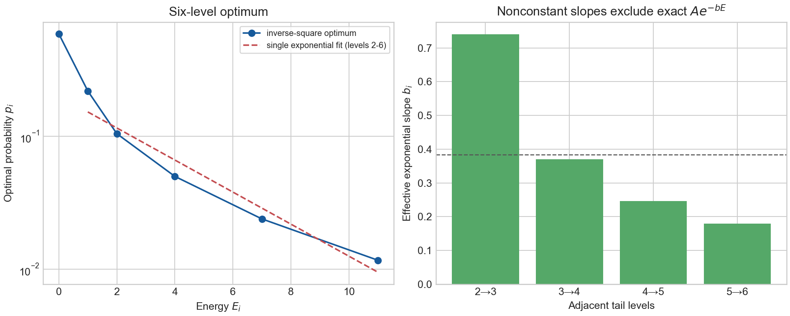
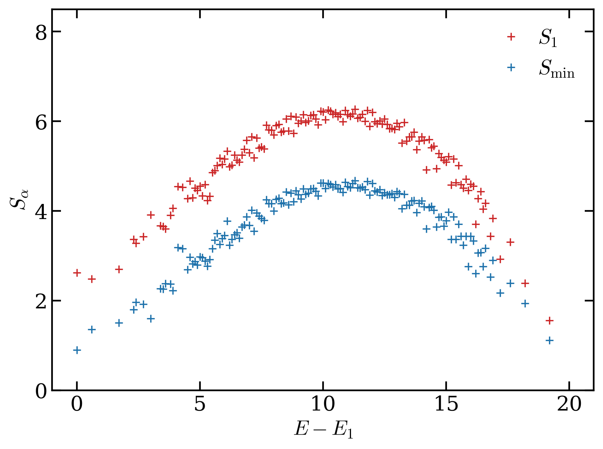

# 2507.07191: Energy Spectra of Compressed Quantum States

Preprint: [arXiv:2507.07191 — Energy Spectra of Compressed Quantum States](https://arxiv.org/abs/2507.07191)

Published as: [Energy Spectra of Compressed Quantum States](https://doi.org/10.1103/q5fz-4hzy)

Formal citation: Physical Review Letters 136, 070604 (2026) · DOI `10.1103/q5fz-4hzy` · Locator `070604`

Public status: **Historical scientific artifact (4 numerical targets; 4 reproduced)** · Audit score: **97.50/100**

Publishes the independently generated numerical artifacts retained by the historical case: 3 public generated data files, 2 public generated figures, and 4 declared numerical targets. The package preserves failed, partial, proxy, and unresolved outcomes instead of upgrading them to completion.

## Start Here / 从这里开始

- [中文复现 Note](note/reproduction-note.zh-CN.md)
- [English reproduction note](note/reproduction-note.en.md)
- [Code and run commands](code/README.md)
- [Machine-readable scorecard](outputs/checks/similarity_scorecard.json)
- [Derivation (equations)](docs/DERIVATION.md)
- [Numerical methods](docs/NUMERICAL_METHODS.md)
- [Lessons learned](docs/LESSONS_LEARNED.md)

## Main Reproduced Results

| Paper item | Reproduced result | Figure | Check |
| --- | --- | --- | --- |
| BENCH_IDX91 | The minimum-energy six-level spectrum allowed by the paper's convex-relaxed compression constraint. | [PNG](outputs/figures/idx91_inverse_square_spectrum.png) | [JSON](outputs/checks/similarity_scorecard.json) |
| FIG001 | Binned half-chain min-entropy and von Neumann entropy across the complete 4x4 AFHM spectrum. | [PNG](outputs/figures/afhm_figure1_reproduction.png) | [JSON](outputs/checks/similarity_scorecard.json) |

### BENCH_IDX91: The minimum-energy six-level spectrum allowed by the paper's convex-relaxed compression constraint.



### FIG001: Binned half-chain min-entropy and von Neumann entropy across the complete 4x4 AFHM spectrum.



## Quick Run

```bash
python -m venv .venv
source .venv/bin/activate
pip install -r requirements.txt
pip install torch
cd cases/2507.07191/code
python scripts/verify_public_artifacts.py
```

Generated files are kept under [data](outputs/data/), [figures](outputs/figures/), and [checks](outputs/checks/).

## Reproduction Boundary

This public case includes paper-derived code, generated data, generated figures, public validation checks, and explanatory notes. It does not redistribute the paper PDF, arXiv source archive, original figures, EPS paths, digitized source curves, source-derived point sets, or source-vs-generated composite panels.

Remaining limitation: The legacy case has no machine-verifiable author-code isolation attestation. No source-image comparison panel or digitized source curve is published in this projection.

Final-parameter rule: final public figures use the paper parameters when feasible. Any reduced-scale, subset, proxy, or blocked target must be labeled explicitly and cannot be presented as a complete reproduction.
