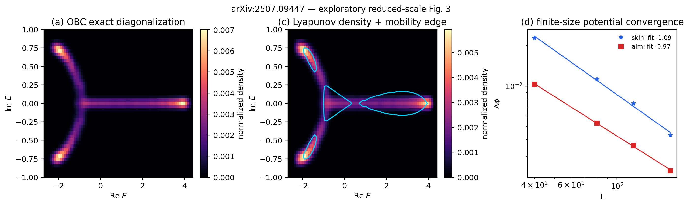
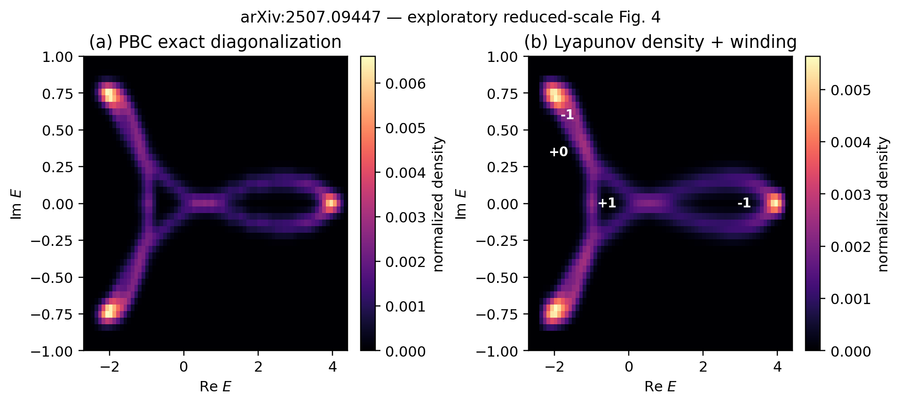
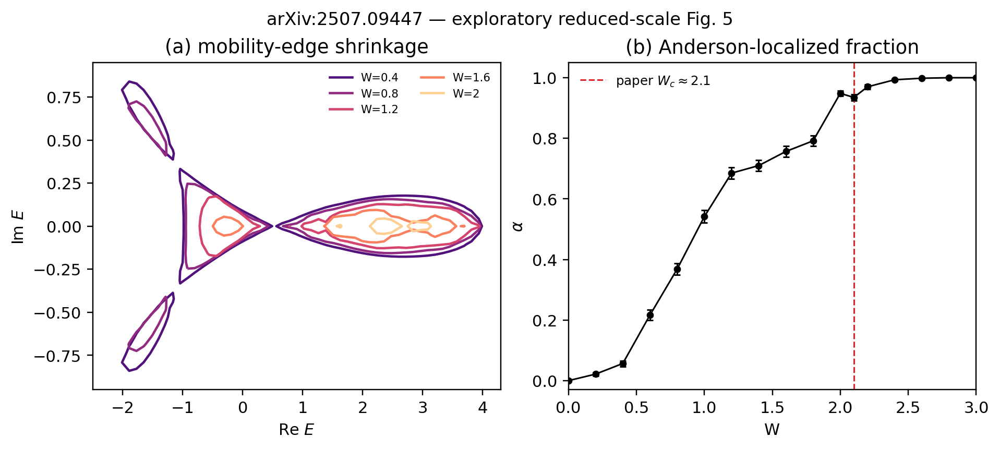
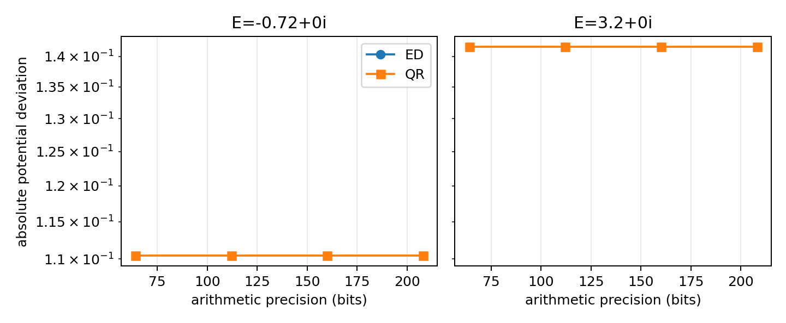
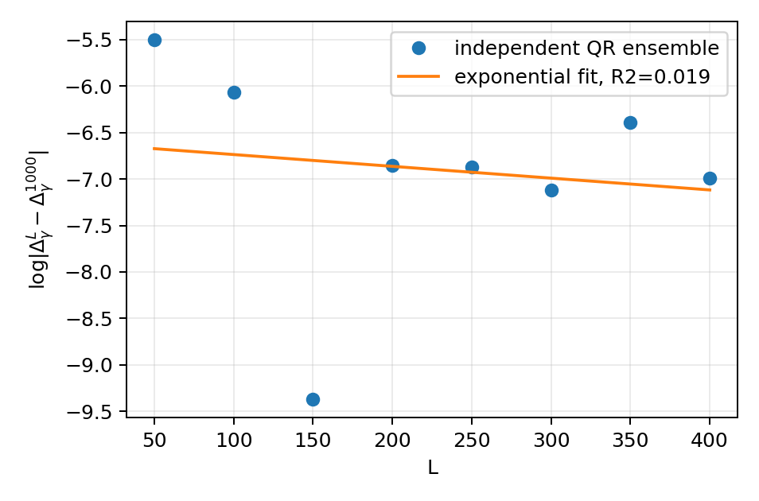

# 2507.09447: Lyapunov formulation of band theory for disordered non-Hermitian systems

Preprint: [arXiv:2507.09447 — Lyapunov formulation of band theory for disordered non-Hermitian systems](https://arxiv.org/abs/2507.09447)

Published as: [Universal Thouless relations for disordered non–Hermitian systems in one dimension](https://doi.org/10.1016/j.scib.2026.05.055)

Formal citation: Science Bulletin (2026), online first · DOI `10.1016/j.scib.2026.05.055` · Locator `PII S2095927326005839`

Public status: **Partial scientific reproduction** · Audit score: **83.08/100**

Figs. 3-5 remain paper-scale scientific reproductions.  Corrected S1/S2 targets pass isolated scientific checks; the one-way density identity is exact; Fig. S3 is code-ready but compute-blocked at paper scale; and Fig. S4 preserves a robust 18-protocol non-match for fresh-context scientific adjudication.

## Start Here / 从这里开始

- [中文复现 Note](note/reproduction-note.zh-CN.md)
- [English reproduction note](note/reproduction-note.en.md)
- [Equation-level derivation](docs/DERIVATION.md)
- [Numerical methods](docs/NUMERICAL_METHODS.md)
- [Public evidence index](docs/EVIDENCE_INDEX.md)
- [Comparison policy](docs/COMPARISON_POLICY.md)
- [Scientific consistency report](docs/CONSISTENCY_REPORT.md)
- [Independent paper assessment](docs/PAPER_ASSESSMENT.md)
- [Code and run commands](code/README.md)
- [Machine-readable scorecard](outputs/checks/similarity_scorecard.json)
- [Machine-readable completion boundary](outputs/checks/completion_assessment.json)
- [Derivation (equations)](docs/DERIVATION.md)
- [Numerical methods](docs/NUMERICAL_METHODS.md)
- [Lessons learned](docs/LESSONS_LEARNED.md)

## Quick Run

```bash
python -m venv .venv
source .venv/bin/activate
pip install -r requirements.txt
cd cases/2507.09447/code
python scripts/run_reproduction.py
```

Published machine-readable artifacts are kept under [data](outputs/data/), [figures](outputs/figures/), [checks](outputs/checks/).

## Reproduction Boundary

This public case includes paper-derived code, generated data, generated figures, public validation checks, explanatory notes. It does not redistribute the paper PDF, arXiv source archive, original figures, EPS paths, digitized source curves, source-derived point sets, or source-vs-generated composite panels.

Remaining limitation: Paper-scale L=1000 x 3200-realization OBC/PBC diagonalization completed locally. All nine scientific gates pass; strict source-pixel SSIM >=0.95 does not pass. Formal Science Bulletin supplementary material is method evidence only; reproduction targets remain arXiv v1.

Final-parameter rule: final public figures use the paper parameters when feasible. Any reduced-scale, subset, proxy, or blocked target must be labeled explicitly and cannot be presented as a complete reproduction.

## Generated Figures










