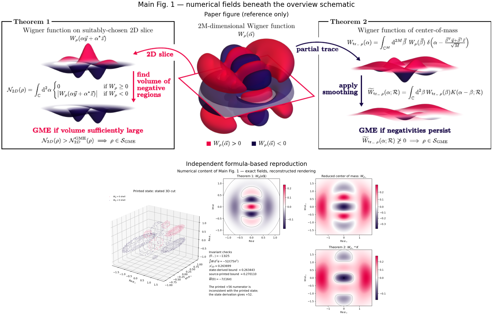
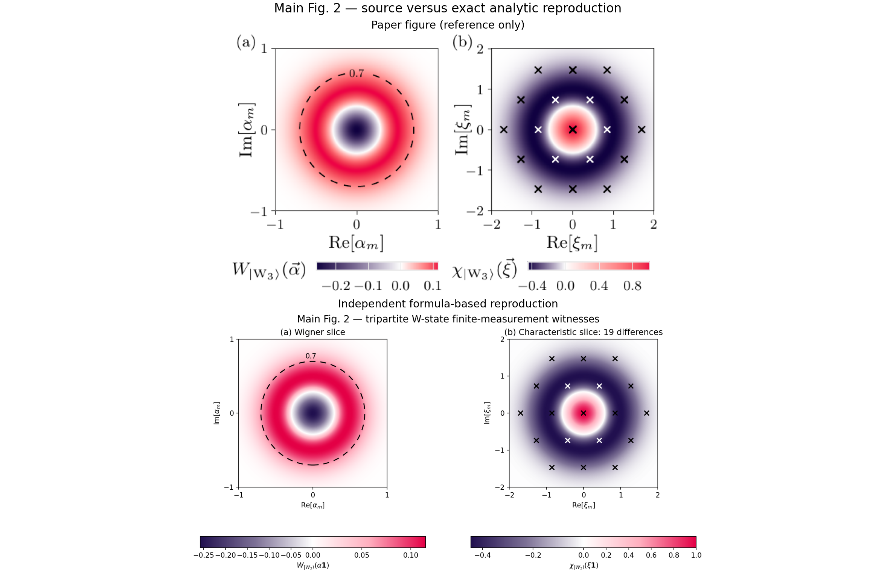

# 2510.26761: Sufficient Wigner Negativity Implies Genuine Multipartite Entanglement

Preprint: [arXiv:2510.26761 — Sufficient Wigner Negativity Implies Genuine Multipartite Entanglement](https://arxiv.org/abs/2510.26761)

Published as: [Sufficient Wigner Negativity Implies Genuine Multipartite Entanglement](https://doi.org/10.1103/bftw-qnbf)

Formal citation: Physical Review Letters 137, 040202 (2026) · DOI `10.1103/bftw-qnbf` · Locator `040202`

Public status: **Numerical feature reproduction; exact W-state witnesses** · Audit score: **85.00/100**

Derives the phase-space witnesses before numericalization, independently reproduces both W-state panels and the numerical fields behind the theorem overview, and verifies the finite-disk and finite-characteristic-function witnesses. The derivation also exposes an internal source inconsistency in the Fig. 1 state-dependent threshold.

## Start Here / 从这里开始

- [中文复现 Note](note/reproduction-note.zh-CN.md)
- [English reproduction note](note/reproduction-note.en.md)
- [Derivation](docs/DERIVATION.md)
- [Formula verification](docs/FORMULA_VERIFICATION.md)
- [Similarity scorecard](docs/SIMILARITY_SCORECARD.md)
- [Code and run commands](code/README.md)
- [Machine-readable scorecard](outputs/checks/similarity_scorecard.json)
- [Derivation (equations)](docs/DERIVATION.md)
- [Numerical methods](docs/NUMERICAL_METHODS.md)
- [Lessons learned](docs/LESSONS_LEARNED.md)

## Main Reproduced Results

| Paper item | Reproduced result | Figure | Check |
| --- | --- | --- | --- |
| Main Fig. 1 | State-derived Wigner fields, converged negativity volume, smoothed center-of-mass witness, and explicit source-threshold inconsistency | [PNG](outputs/figures/overview_numeric_surfaces.png) | [JSON](outputs/checks/illustrative_state_validation.json) |
| Main Fig. 2 | Exact W-state finite-disk and finite-characteristic-function witnesses | [PNG](outputs/figures/w_state_wigner_characteristic.png) | [JSON](outputs/checks/characteristic_witness_validation.json) |

## Paper Reference vs Independent Reproduction

Each panel contains a limited excerpt from Zaw et al., Physical Review Letters 137, 040202 (2026), beside an independently generated result. The comparison validates the field topology, witness geometry, and quoted numerical features; it does not claim author-data-level or pixel-level equivalence.

### Main Fig. 1 comparison



### Main Fig. 2 comparison



### Main Fig. 1: State-derived Wigner fields, converged negativity volume, smoothed center-of-mass witness, and explicit source-threshold inconsistency


### Main Fig. 2: Exact W-state finite-disk and finite-characteristic-function witnesses


## Quick Run

```bash
python -m venv .venv
source .venv/bin/activate
pip install -r requirements.txt
cd cases/2510.26761/code
python scripts/run_reproduction.py
python scripts/render_figures.py
```

Generated files are kept under [data](outputs/data/), [figures](outputs/figures/), and [checks](outputs/checks/).

## Reproduction Boundary

This public case includes paper-derived code, generated data, generated figures, public validation checks, explanatory notes, and 2 limited comparison panels. Those panels use the minimum paper excerpts needed for validation and clearly separate the paper reference from the independent result. The case does not redistribute the paper PDF, arXiv source archive, standalone original figures, EPS paths, digitized source curves, or source-derived point sets.

Remaining limitation: Main Fig. 2 is an analytic-reference reproduction. Main Fig. 1 uses exact state-derived fields but reconstructed three-dimensional presentation because the source omits isosurface levels and camera settings. The printed state implies a threshold numerator of 52 while the End Matter prints 56; the numerical negativity clears only the state-derived bound.

Final-parameter rule: final public figures use the paper parameters when feasible. Any reduced-scale, subset, proxy, or blocked target must be labeled explicitly and cannot be presented as a complete reproduction.
