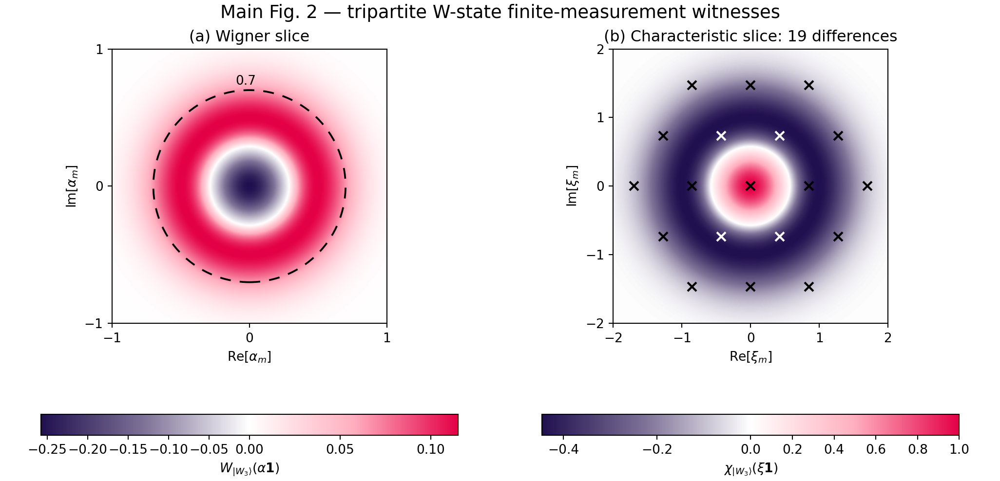
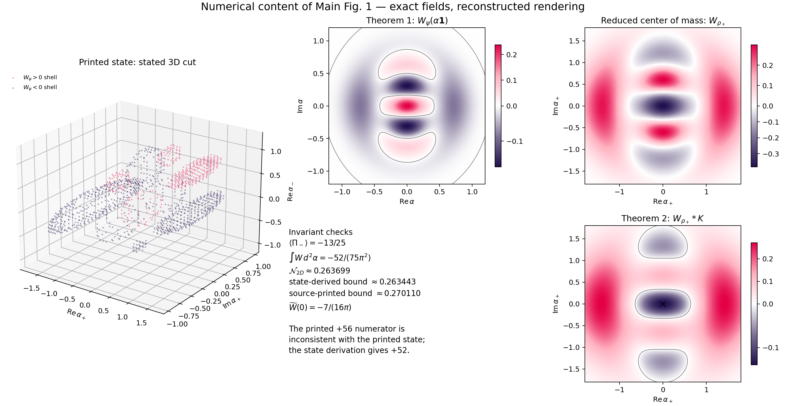

# Reproducing Wigner-negativity witnesses for genuine multipartite entanglement

Paper: *Sufficient Wigner Negativity Implies Genuine Multipartite
Entanglement*, Physical Review Letters 137, 040202 (2026).

## Result

The reproduction derives the phase-space witnesses before numericalization.
For the tripartite W state, the finite-disk witness has the exact critical
radius \(r_{\mathrm{crit}}=0.6991953293\). At the paper's \(r=0.7\), the
negative volume is 0.3541354750, above the GME threshold 0.3535533906. Seven
characteristic-function points generate 19 distinct differences and require
ten independent measurements; the resulting negative eigenvalue gives the
witness 0.01758037565, matching the paper's 0.0176.

## Why the derivation matters

On the equal-coordinate three-mode slice, only the center-of-mass mode is
excited. The W state reduces to one center-of-mass Fock excitation multiplied
by vacuum parity in the two relative modes. This gives the Wigner function,
disk integral, and characteristic matrix directly, without fitting source
pixels.

The same calculation exposes an internal inconsistency in Fig. 1. The six
printed Fock amplitudes imply relative parity \(-13/25\), and the theorem then
gives a threshold numerator of 52. The End Matter prints 56. Independent
quadrature gives a negativity volume of 0.2636995707: it exceeds the
state-derived threshold 0.2634433620 but not the separately printed threshold
0.2701100286. Both values are preserved rather than tuning the numerical method
to one of them.

The second Fig. 1 witness is unaffected. Gaussian smoothing of the
center-of-mass Wigner function gives the exact origin value
\(-7/(16\pi)\), reproduced by the numerical convolution to about
\(2.8\times10^{-15}\).

## Reproduction extent

- Main Fig. 2: complete analytic-reference reproduction, 90/100.
- Main Fig. 1: exact state-derived fields and invariants, but reconstructed 3D
  presentation and one source-level threshold contradiction, 80/100.
- Overall: 85/100, numerical feature reproduction.

The score measures physical objects, parameter fidelity, numerical agreement,
and evidence provenance. It is not a style or pixel-similarity score. See the
[derivation](../docs/DERIVATION.md) and [run instructions](../code/README.md).

## Boundary

The public case contains independent code, generated data, generated figures,
and machine-readable checks. It does not redistribute the paper PDF, author
source archive, or standalone source figures. Limited comparison panels are
included only to audit the reproduction and do not imply access to author data.
