# 2511.11394: Relaxation toward an Ideal Chern Band through Coupling to a Markovian Bath

Preprint: [arXiv:2511.11394 — Relaxation toward an Ideal Chern Band through Coupling to a Markovian Bath](https://arxiv.org/abs/2511.11394)

Published as: [Relaxation toward an Ideal Chern Band through Coupling to a Markovian Bath](https://doi.org/10.1103/d766-sns5)

Formal citation: Physical Review Letters 137, 046601 (2026) · DOI `10.1103/d766-sns5` · Locator `046601`

Public status: **Historical scientific artifact (6 numerical targets; 5 evidence_compared, 1 partially_reproduced)** · Audit score: **67.10/100**

Publishes the independently generated numerical artifacts retained by the historical case: 14 public generated data files, 11 public generated figures, and 6 declared numerical targets. The package preserves failed, partial, proxy, and unresolved outcomes instead of upgrading them to completion.

## Start Here / 从这里开始

- [中文复现 Note](note/reproduction-note.zh-CN.md)
- [English reproduction note](note/reproduction-note.en.md)
- [Code and run commands](code/README.md)
- [Machine-readable scorecard](outputs/checks/similarity_scorecard.json)
- [Derivation (equations)](docs/DERIVATION.md)
- [Numerical methods](docs/NUMERICAL_METHODS.md)
- [Lessons learned](docs/LESSONS_LEARNED.md)

## Main Reproduced Results

| Paper item | Reproduced result | Figure | Check |
| --- | --- | --- | --- |
| FIG001 | Small-q dissipative approach toward the Dirichlet/Chern bound. | [PNG](outputs/figures/llg_geometry_flow.png) | [JSON](outputs/checks/similarity_scorecard.json) |
| VALIDATION001 | Go/no-go validation of the calibrated geometric jump sum rule. | [PNG](outputs/figures/jump_sum_rule.png) | [JSON](outputs/checks/similarity_scorecard.json) |
| VALIDATION002 | Detector-level go/pivot/stop decision for the Chern-band click idea. | [PNG](outputs/figures/detector_sum_rule_go_no_go.png) | [JSON](outputs/checks/similarity_scorecard.json) |
| FIG001 | Small-q dissipative approach toward the Dirichlet/Chern bound. | [PNG](outputs/figures/fig1_small_q_energy.png) | [JSON](outputs/checks/similarity_scorecard.json) |
| FIG002 | Exact versus small-q extended-Hubbard Dirichlet energy. | [PNG](outputs/figures/fig2_exact_vs_small_q.png) | [JSON](outputs/checks/similarity_scorecard.json) |
| FIG003 | Momentum-resolved trace-condition deviation. | [PNG](outputs/figures/fig3_trace_deviation_maps.png) | [JSON](outputs/checks/similarity_scorecard.json) |
| FIG001 | Small-q dissipative approach toward the Dirichlet/Chern bound. | [PNG](outputs/figures/sm_fig1_trace_deviation_initial_final.png) | [JSON](outputs/checks/similarity_scorecard.json) |
| FIG001 | Small-q dissipative approach toward the Dirichlet/Chern bound. | [PNG](outputs/figures/sm_fig2_geometry_profiles_initial_final.png) | [JSON](outputs/checks/similarity_scorecard.json) |
| FIG003 | Momentum-resolved trace-condition deviation. | [PNG](outputs/figures/sm_fig4_geometry_profiles.png) | [JSON](outputs/checks/similarity_scorecard.json) |
| FIG002 | Exact versus small-q extended-Hubbard Dirichlet energy. | [PNG](outputs/figures/sm_fig5_long_time_geometry.png) | [JSON](outputs/checks/similarity_scorecard.json) |
| SMFIG006 | Robustness of near-ideal relaxation and the finite-mesh topological transition under U and V sweeps. | [PNG](outputs/figures/sm_fig6_parameter_sweeps.png) | [JSON](outputs/checks/similarity_scorecard.json) |

### FIG001: Small-q dissipative approach toward the Dirichlet/Chern bound.

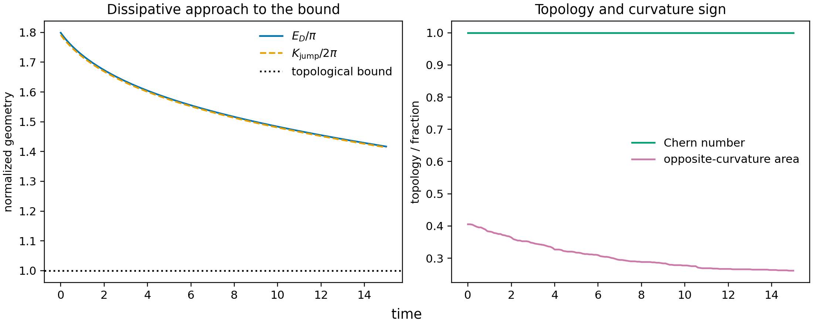

### VALIDATION001: Go/no-go validation of the calibrated geometric jump sum rule.

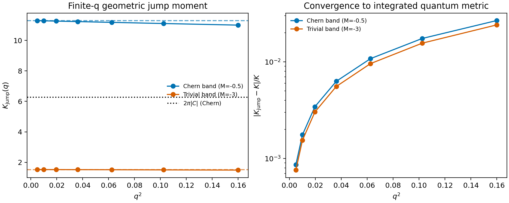

### VALIDATION002: Detector-level go/pivot/stop decision for the Chern-band click idea.

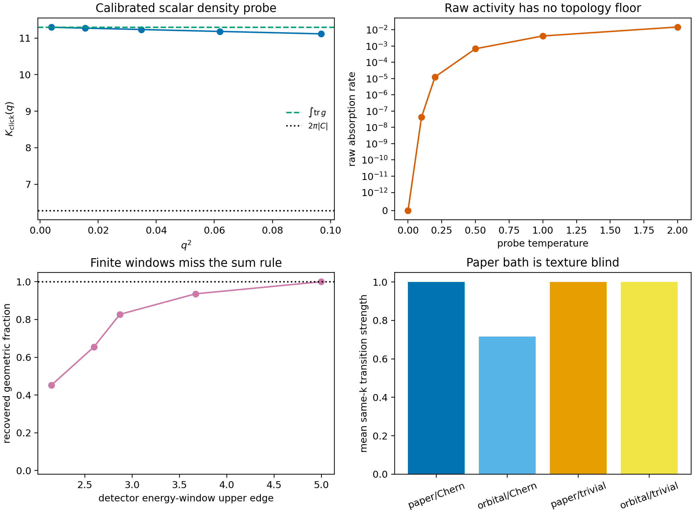

### FIG001: Small-q dissipative approach toward the Dirichlet/Chern bound.

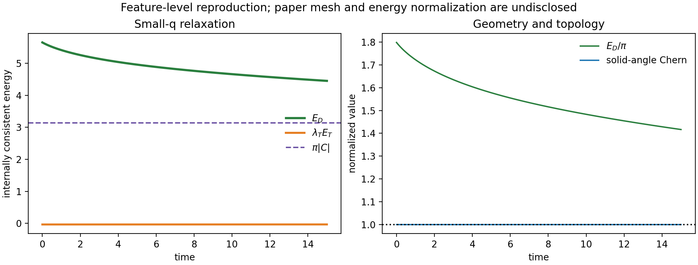

### FIG002: Exact versus small-q extended-Hubbard Dirichlet energy.

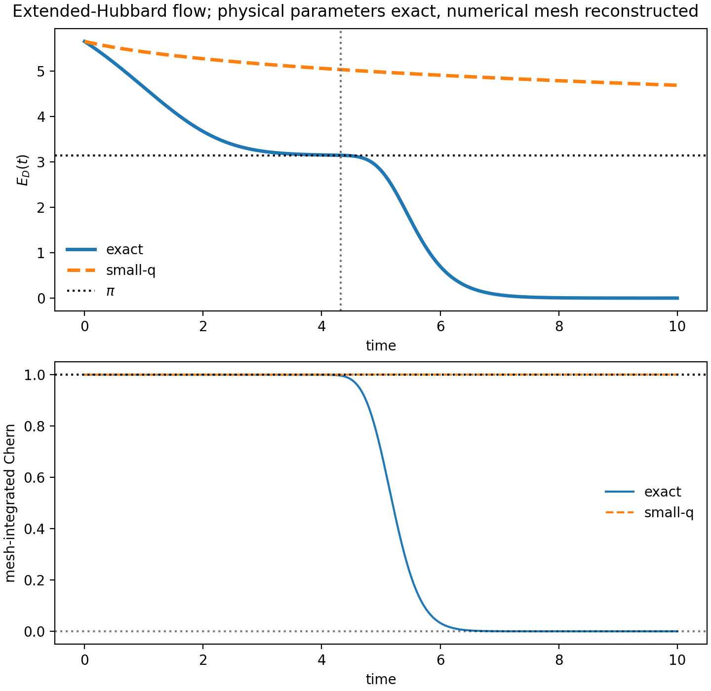

### FIG003: Momentum-resolved trace-condition deviation.

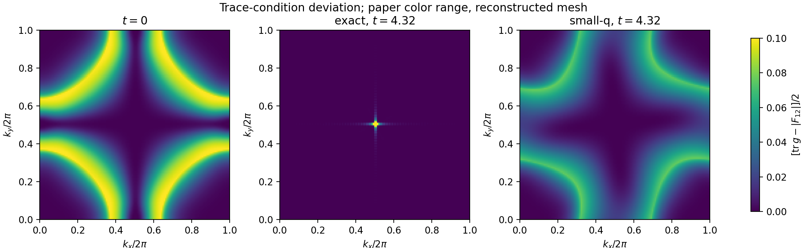

### FIG001: Small-q dissipative approach toward the Dirichlet/Chern bound.

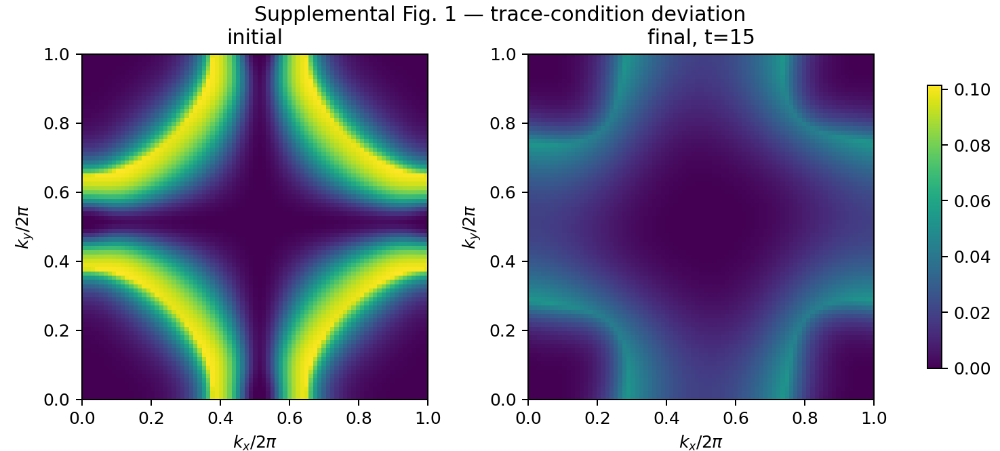

### FIG001: Small-q dissipative approach toward the Dirichlet/Chern bound.

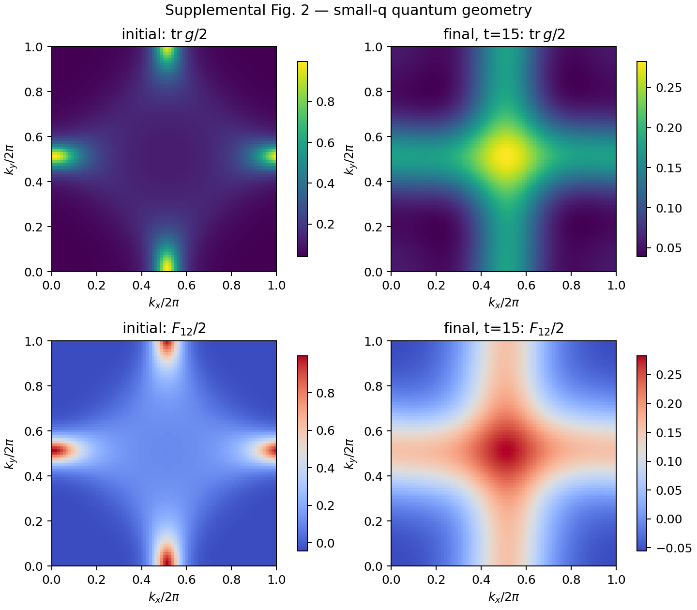

### FIG003: Momentum-resolved trace-condition deviation.

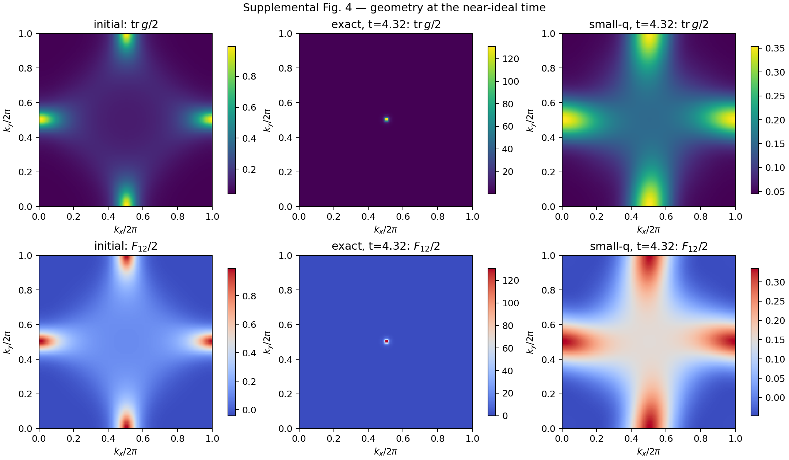

### FIG002: Exact versus small-q extended-Hubbard Dirichlet energy.

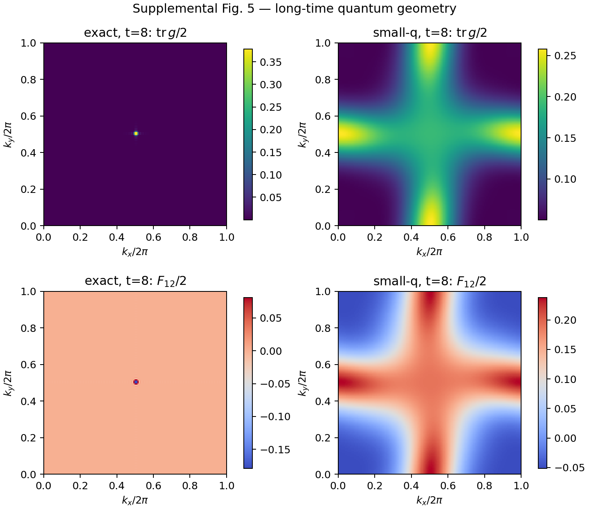

### SMFIG006: Robustness of near-ideal relaxation and the finite-mesh topological transition under U and V sweeps.

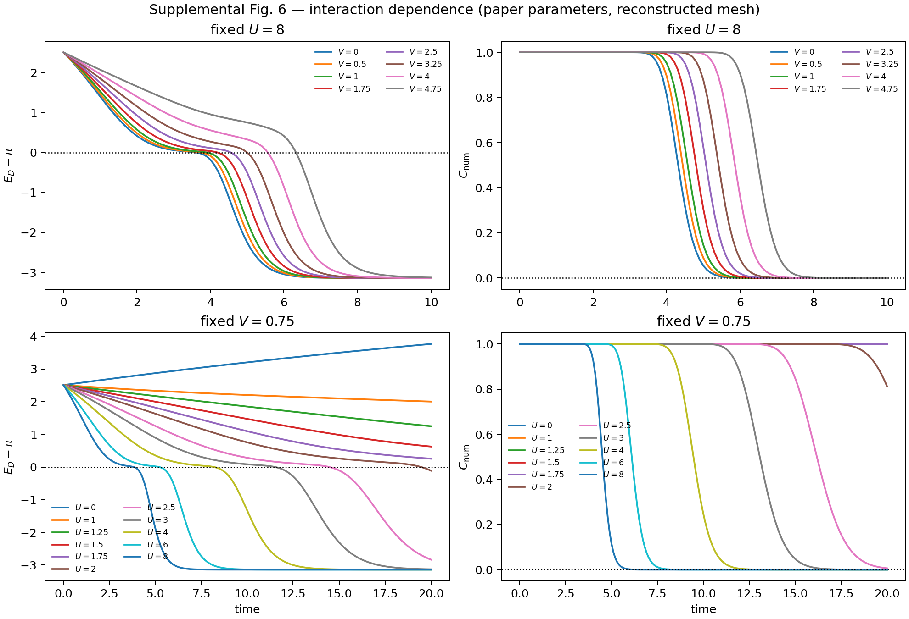

## Quick Run

```bash
python -m venv .venv
source .venv/bin/activate
pip install -r requirements.txt
cd cases/2511.11394/code
python scripts/verify_public_artifacts.py
```

Generated files are kept under [data](outputs/data/), [figures](outputs/figures/), and [checks](outputs/checks/).

## Reproduction Boundary

This public case includes paper-derived code, generated data, generated figures, public validation checks, and explanatory notes. It does not redistribute the paper PDF, arXiv source archive, original figures, EPS paths, digitized source curves, source-derived point sets, or source-vs-generated composite panels.

Remaining limitation: Frozen non-final target states: T001=partially_reproduced, V001=evidence_compared, V002=evidence_compared, T002=evidence_compared, T003=evidence_compared, T004=evidence_compared. The legacy case has no machine-verifiable author-code isolation attestation. No source-image comparison panel or digitized source curve is published in this projection.

Final-parameter rule: final public figures use the paper parameters when feasible. Any reduced-scale, subset, proxy, or blocked target must be labeled explicitly and cannot be presented as a complete reproduction.
