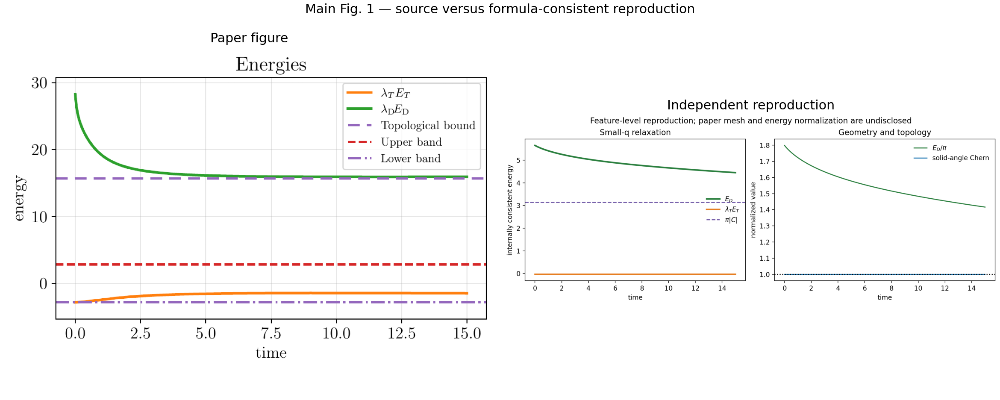
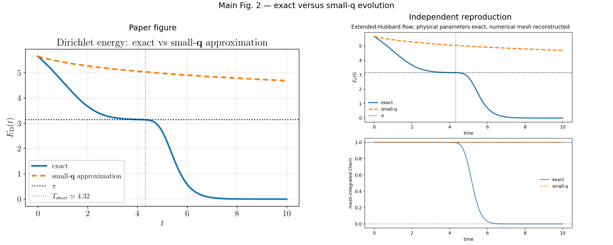
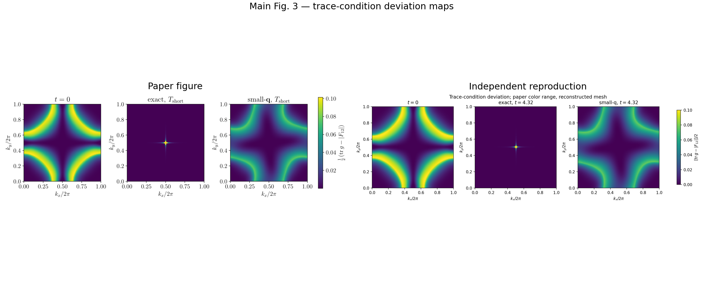

# 2511.11394: Relaxation toward an Ideal Chern Band through Coupling to a Markovian Bath

Preprint: [arXiv:2511.11394 — Relaxation toward an Ideal Chern Band through Coupling to a Markovian Bath](https://arxiv.org/abs/2511.11394)

Published as: [Relaxation toward an Ideal Chern Band through Coupling to a Markovian Bath](https://doi.org/10.1103/d766-sns5)

Formal citation: Phys. Rev. Lett. 137, 046601 (2026) · DOI `10.1103/d766-sns5` · Locator `046601`

Public status: **Partial scientific reproduction** · Audit score: **67.10/100**

The exact extended-Hubbard flow, near-ideal time, local geometry, topological transition, and interaction trends are reproduced. The standalone small-q figure remains partial because the paper's plotted normalization and t=15 rate conflict with its own formulas and exact-comparison curve.

## Start Here / 从这里开始

- [中文复现 Note](note/reproduction-note.zh-CN.md)
- [English reproduction note](note/reproduction-note.en.md)
- [Equation-level derivation](docs/DERIVATION.md)
- [Numerical methods](docs/NUMERICAL_METHODS.md)
- [Public evidence index](docs/EVIDENCE_INDEX.md)
- [Comparison policy](docs/COMPARISON_POLICY.md)
- [Scientific consistency report](docs/CONSISTENCY_REPORT.md)
- [Code and run commands](code/README.md)
- [Machine-readable scorecard](outputs/checks/similarity_scorecard.json)
- [Machine-readable completion boundary](outputs/checks/completion_assessment.json)
- [Derivation (equations)](docs/DERIVATION.md)
- [Numerical methods](docs/NUMERICAL_METHODS.md)
- [Lessons learned](docs/LESSONS_LEARNED.md)

## Paper Reference vs Independent Reproduction

Each board contains only the minimum paper excerpt needed for validation and places it beside an independently generated result. Visual agreement is a scientific-region diagnostic, not author-data-level equivalence.

### fig1 source vs reproduction comparison



### fig2 source vs reproduction comparison



### fig3 source vs reproduction comparison



## Quick Run

```bash
python -m venv .venv
source .venv/bin/activate
pip install -r requirements.txt
cd cases/2511.11394/code
python scripts/run_reproduction.py --config config/exploratory_targets.json --target T001 --mode smoke --no-render --attested-stage exploratory
```

Published machine-readable artifacts are kept under [data](outputs/data/), [figures](outputs/figures/), [checks](outputs/checks/).

## Reproduction Boundary

This public case includes paper-derived code, generated data, generated figures, public validation checks, explanatory notes, and 3 limited comparison panels. Those panels use the minimum paper excerpts needed for validation and clearly separate the paper reference from the independent result. The case does not redistribute the paper PDF, arXiv source archive, standalone original figures, EPS paths, digitized source curves, or source-derived point sets.

Remaining limitation: Exact extended-Hubbard targets reproduce the paper at numerical-feature level. Main Fig. 1 remains partial because its energy normalization and t=15 rate conflict with the printed model.

Final-parameter rule: final public figures use the paper parameters when feasible. Any reduced-scale, subset, proxy, or blocked target must be labeled explicitly and cannot be presented as a complete reproduction.

## Generated Figures


