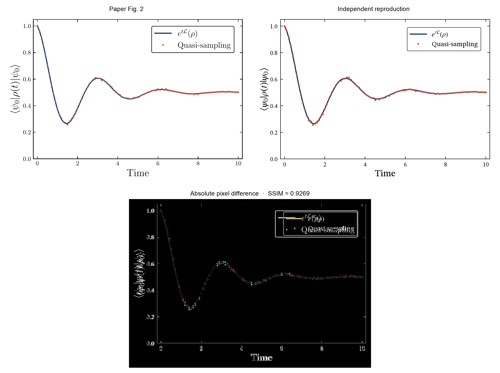
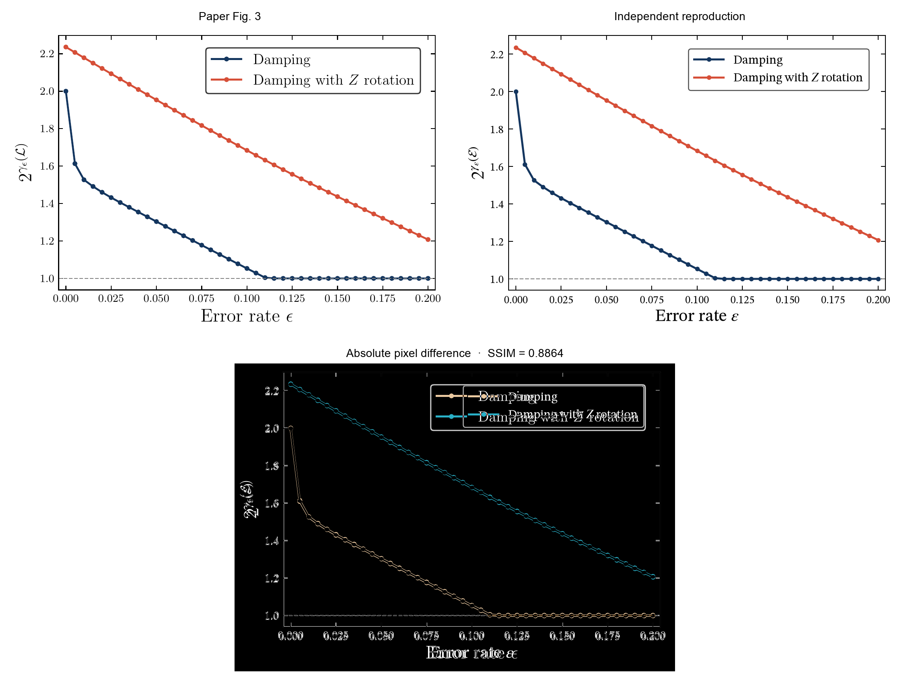
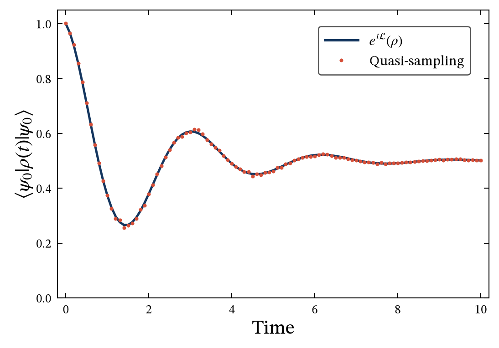
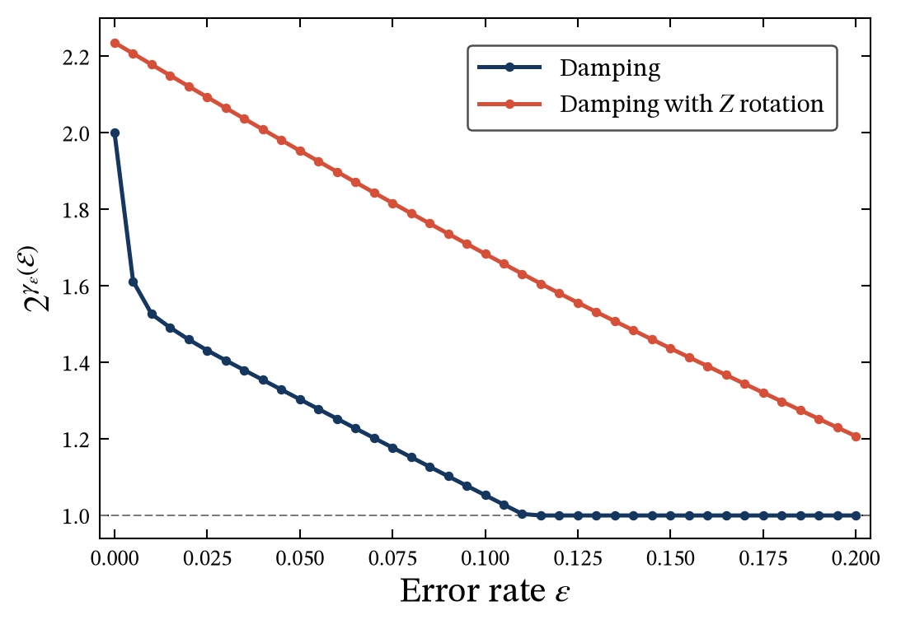

# 2512.08279: Programmable Open Quantum Systems

Preprint: [arXiv:2512.08279 — Programmable Open Quantum Systems](https://arxiv.org/abs/2512.08279)

Published as: [Programmable Open Quantum Systems](https://doi.org/10.1103/yqlr-2dhr)

Formal citation: Physical Review Letters 137, 040403 (2026) · DOI `10.1103/yqlr-2dhr` · Locator `040403`

Public status: **Partial scientific reproduction** · Audit score: **95.00/100**

Derives the programmable-Lindbladian formulas before numericalization, independently reconstructs the fixed HPTP processor, reproduces the 101-point signed quasi-sampling curve, and solves both 41-point programming-cost sweeps while certifying all 1000 source-script times.

## Start Here / 从这里开始

- [中文复现 Note](note/reproduction-note.zh-CN.md)
- [English reproduction note](note/reproduction-note.en.md)
- [Derivation](docs/DERIVATION.md)
- [Formula verification](docs/FORMULA_VERIFICATION.md)
- [Similarity scorecard](docs/SIMILARITY_SCORECARD.md)
- [Performance profile](docs/PERFORMANCE_PROFILE.md)
- [Code and run commands](code/README.md)
- [Machine-readable scorecard](outputs/checks/similarity_scorecard.json)
- [Machine-readable completion boundary](outputs/checks/completion_assessment.json)
- [Derivation (equations)](docs/DERIVATION.md)
- [Numerical methods](docs/NUMERICAL_METHODS.md)
- [Lessons learned](docs/LESSONS_LEARNED.md)

## Main Reproduced Results

| Paper item | Reproduced result | Figure | Check |
| --- | --- | --- | --- |
| Main Fig. 2 | Exact SWAP-dephasing overlap, independently decomposed fixed HPTP processor with kappa=2, and statistically consistent signed quasi-sampling | [PNG](outputs/figures/fig2_swap_dephasing.png) | [JSON](outputs/checks/t001_final_run.json) |
| Main Fig. 3 | Both 41-point programming-overhead curves with all 1000 source times and the omitted t=10 endpoint certified | [PNG](outputs/figures/fig3_programming_cost.png) | [JSON](outputs/checks/t002_final_run.json) |

## Paper Reference vs Independent Reproduction

Each board contains a limited excerpt from Jing et al., Physical Review Letters 137, 040403 (2026), beside an independently generated result. Source pixels were used only after numerical generation for validation.

### Main Fig. 2 comparison



### Main Fig. 3 comparison



### Main Fig. 2: Exact SWAP-dephasing overlap, independently decomposed fixed HPTP processor with kappa=2, and statistically consistent signed quasi-sampling



### Main Fig. 3: Both 41-point programming-overhead curves with all 1000 source times and the omitted t=10 endpoint certified



## Quick Run

```bash
python -m venv .venv
source .venv/bin/activate
pip install -r requirements.txt
pip install numpy scipy cvxpy scs matplotlib Pillow
cd cases/2512.08279/code
python scripts/run_reproduction.py
python scripts/render_figures.py
```

Generated files are kept under [data](outputs/data/), [figures](outputs/figures/), and [checks](outputs/checks/).

## Reproduction Boundary

This public case includes paper-derived code, generated data, generated figures, public validation checks, explanatory notes, and 2 limited comparison panels. Those panels use the minimum paper excerpts needed for validation and clearly separate the paper reference from the independent result. The case does not redistribute the paper PDF, arXiv source archive, standalone original figures, EPS paths, digitized source curves, or source-derived point sets.

Remaining limitation: The paper publishes no machine-readable curve arrays or Monte Carlo seed. Source comparison therefore uses post-generation digitization; the stochastic Fig. 2 points are statistically equivalent rather than point-identical.

Final-parameter rule: final public figures use the paper parameters when feasible. Any reduced-scale, subset, proxy, or blocked target must be labeled explicitly and cannot be presented as a complete reproduction.
