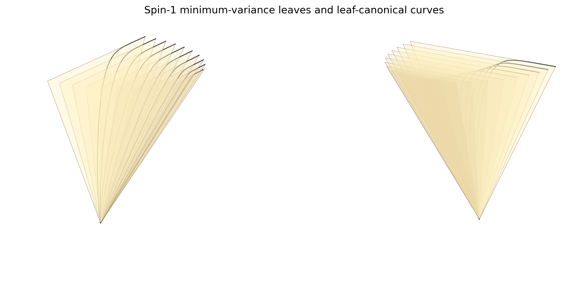
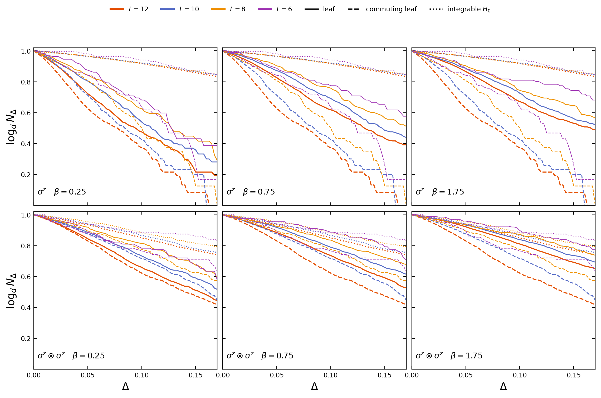
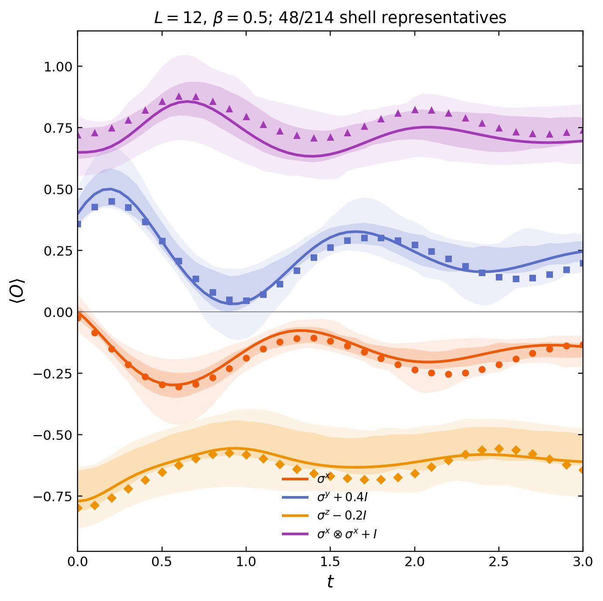
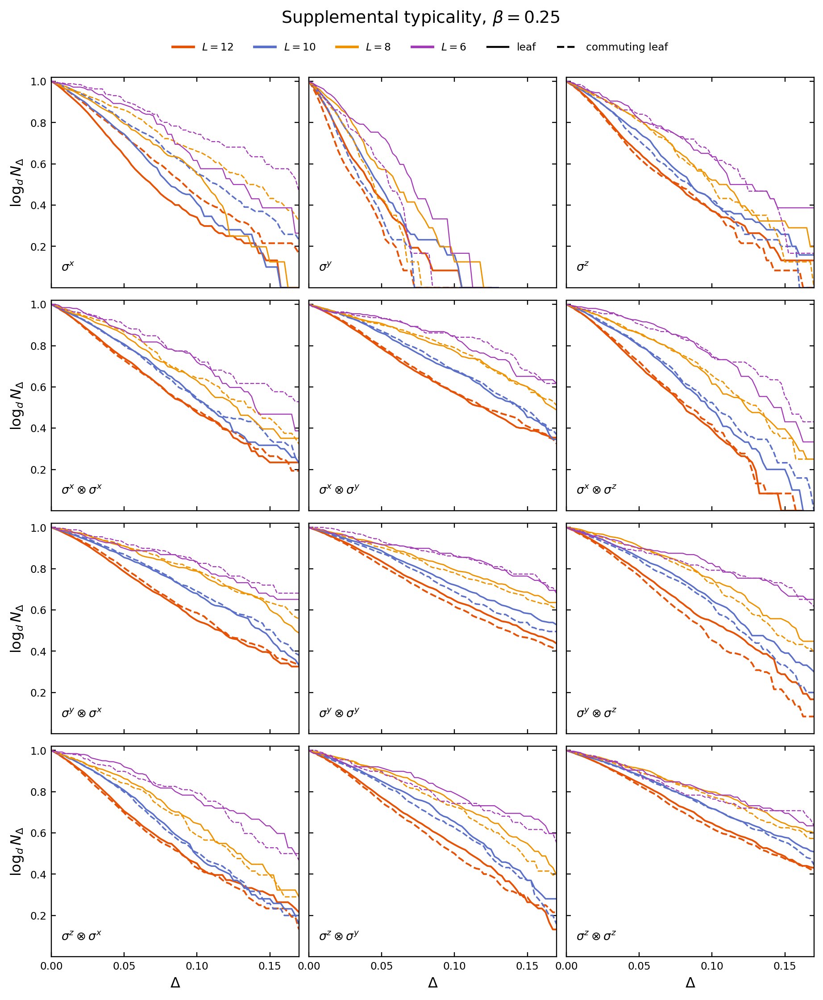
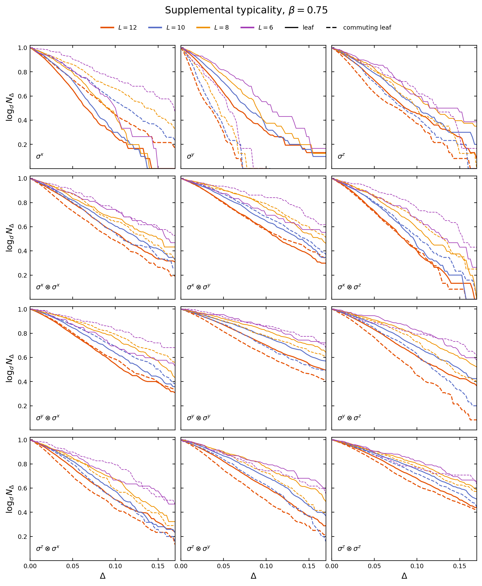
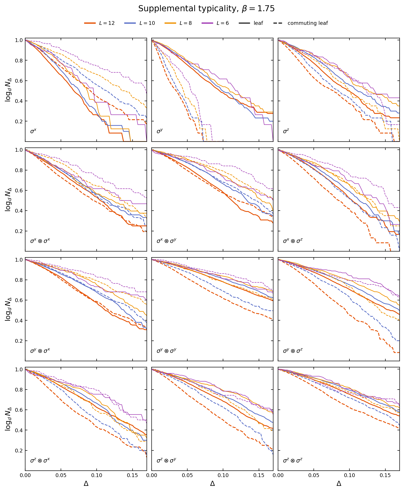
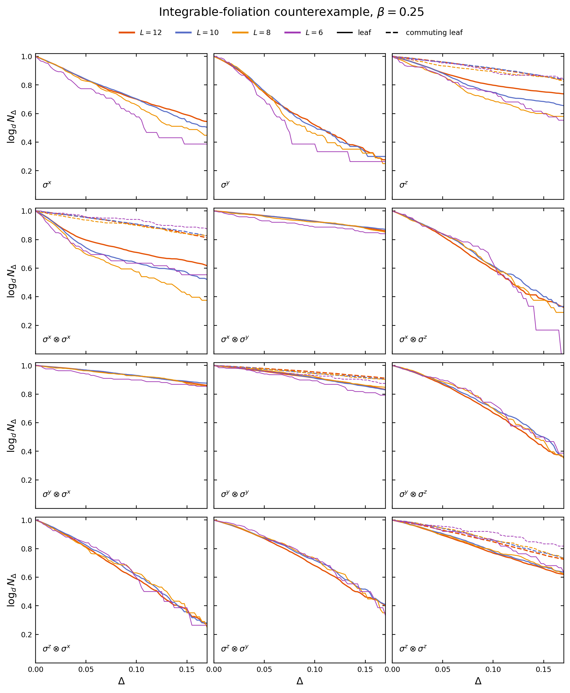
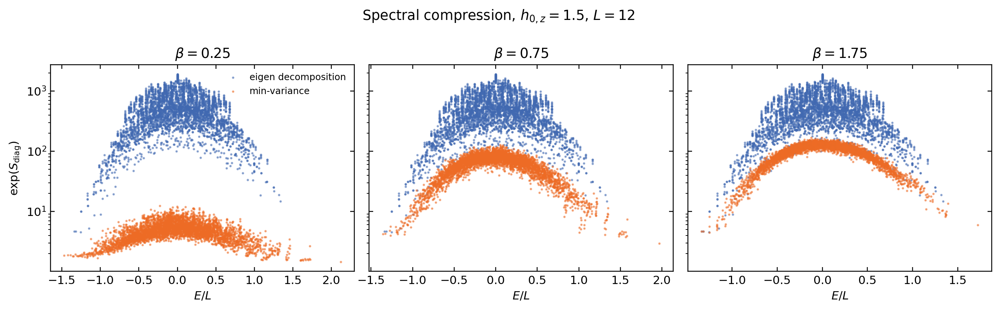
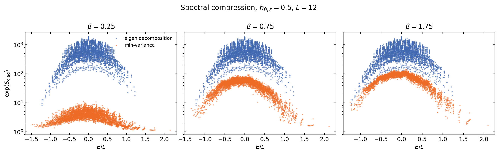
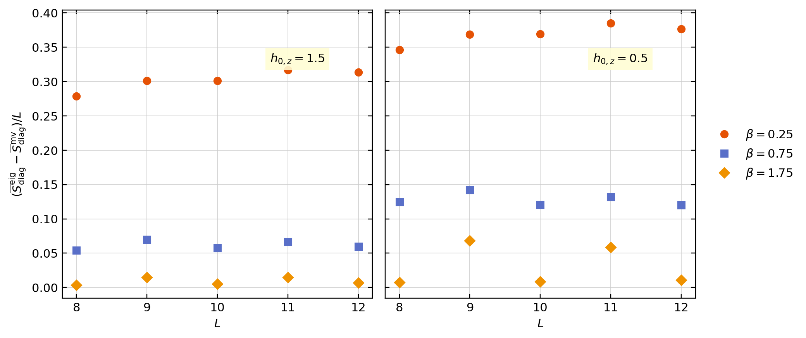

# 2602.12212: Quantum-Coherent Thermodynamics: Leaf Typicality via Minimum-Variance Foliation

Preprint: [arXiv:2602.12212 — Quantum-Coherent Thermodynamics: Leaf Typicality via Minimum-Variance Foliation](https://arxiv.org/abs/2602.12212)

Formal publication: **Not recorded as of 2026-08-04**

Public status: **Partial scientific reproduction** · Audit score: **72.05/100**

Publishes the independently generated numerical artifacts retained by the historical case: 8 public generated data files, 10 public generated figures, and 10 declared numerical targets. The package preserves failed, partial, proxy, and unresolved outcomes instead of upgrading them to completion.

## Start Here / 从这里开始

- [中文复现 Note](note/reproduction-note.zh-CN.md)
- [English reproduction note](note/reproduction-note.en.md)
- [Code and run commands](code/README.md)
- [Machine-readable scorecard](outputs/checks/similarity_scorecard.json)
- [Machine-readable completion boundary](outputs/checks/completion_assessment.json)
- [Derivation (equations)](docs/DERIVATION.md)
- [Numerical methods](docs/NUMERICAL_METHODS.md)
- [Lessons learned](docs/LESSONS_LEARNED.md)

## Main Reproduced Results

| Paper item | Reproduced result | Figure | Check |
| --- | --- | --- | --- |
| MAIN_FIG_1 | Spin-1 minimum-variance leaf geometry and leaf-canonical curves. | [PNG](outputs/figures/t001_spin1_foliation.png) | [JSON](outputs/checks/similarity_scorecard.json) |
| MAIN_FIG_2_LEFT | Finite-size leaf-typicality outlier diagnostics. | [PNG](outputs/figures/t002_main_typicality.png) | [JSON](outputs/checks/similarity_scorecard.json) |
| MAIN_FIG_2_RIGHT | Exact mixed-state dynamics compared with one delta-selected optimal representative. | [PNG](outputs/figures/t003_dynamics.png) | [JSON](outputs/checks/similarity_scorecard.json) |
| FIG_S1 | Full local-observable typicality at beta=0.25. | [PNG](outputs/figures/t004_s1_beta025.png) | [JSON](outputs/checks/similarity_scorecard.json) |
| FIG_S2 | Full local-observable typicality at beta=0.75. | [PNG](outputs/figures/t005_s2_beta075.png) | [JSON](outputs/checks/similarity_scorecard.json) |
| FIG_S3 | Full local-observable typicality at beta=1.75. | [PNG](outputs/figures/t006_s3_beta175.png) | [JSON](outputs/checks/similarity_scorecard.json) |
| FIG_S4 | Integrable-foliation counterexample with H and H0 interchanged. | [PNG](outputs/figures/t007_s4_integrable.png) | [JSON](outputs/checks/similarity_scorecard.json) |
| FIG_S5 | Spectral-compression clouds for h0,z=1.5. | [PNG](outputs/figures/t008a_main_compression.png) | [JSON](outputs/checks/similarity_scorecard.json) |
| FIG_S5 | Spectral-compression clouds for h0,z=0.5. | [PNG](outputs/figures/t008b_supp_compression.png) | [JSON](outputs/checks/similarity_scorecard.json) |
| FIG_S6 | Population-weighted diagonal-entropy gain per site. | [PNG](outputs/figures/t009_entropy_gain.png) | [JSON](outputs/checks/similarity_scorecard.json) |

### MAIN_FIG_1: Spin-1 minimum-variance leaf geometry and leaf-canonical curves.



### MAIN_FIG_2_LEFT: Finite-size leaf-typicality outlier diagnostics.



### MAIN_FIG_2_RIGHT: Exact mixed-state dynamics compared with one delta-selected optimal representative.



### FIG_S1: Full local-observable typicality at beta=0.25.



### FIG_S2: Full local-observable typicality at beta=0.75.



### FIG_S3: Full local-observable typicality at beta=1.75.



### FIG_S4: Integrable-foliation counterexample with H and H0 interchanged.



### FIG_S5: Spectral-compression clouds for h0,z=1.5.



### FIG_S5: Spectral-compression clouds for h0,z=0.5.



### FIG_S6: Population-weighted diagonal-entropy gain per site.



## Quick Run

```bash
python -m venv .venv
source .venv/bin/activate
pip install -r requirements.txt
cd cases/2602.12212/code
python scripts/verify_public_artifacts.py
```

Generated files are kept under [data](outputs/data/), [figures](outputs/figures/), and [checks](outputs/checks/).

## Reproduction Boundary

This public case includes paper-derived code, generated data, generated figures, public validation checks, and explanatory notes. It does not redistribute the paper PDF, arXiv source archive, original figures, EPS paths, digitized source curves, source-derived point sets, or source-vs-generated composite panels.

Remaining limitation: Frozen non-final target states: T002=evidence_compared, T003=evidence_compared, T004=evidence_compared, T005=evidence_compared, T006=evidence_compared, T007=evidence_compared, T008A=evidence_compared, T008B=evidence_compared, T009=evidence_compared. No source-image comparison panel or digitized source curve is published in this projection.

Final-parameter rule: final public figures use the paper parameters when feasible. Any reduced-scale, subset, proxy, or blocked target must be labeled explicitly and cannot be presented as a complete reproduction.
