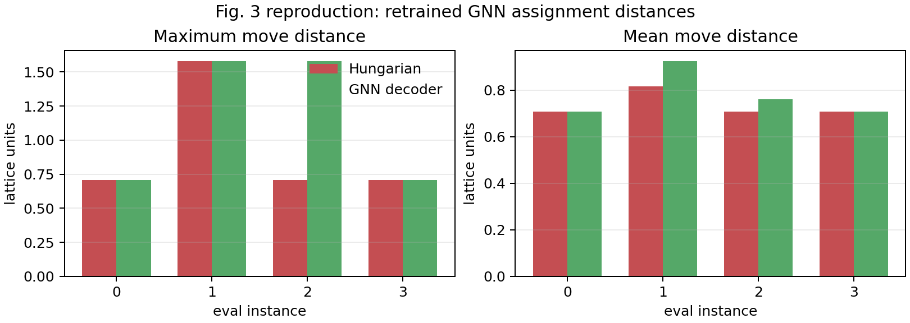
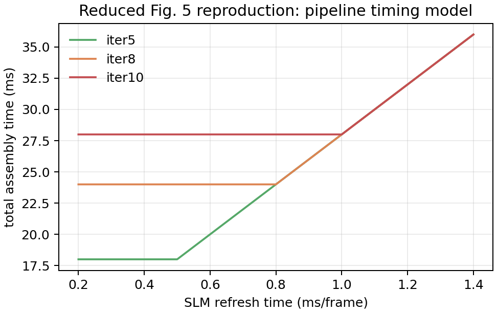

# 2604.08669: An Algorithm for Fast Assembling Large-Scale Defect-Free Atom Arrays

Preprint: [arXiv:2604.08669 — An Algorithm for Fast Assembling Large-Scale Defect-Free Atom Arrays](https://arxiv.org/abs/2604.08669)

Formal publication: **Not recorded as of 2026-07-14**

Public status: **Partial scientific reproduction** · Audit score: **61.60/100**

Reduced-scale two-stage reproduction has started. It now treats Fig. 3 as a retrained model artifact with checkpoint, training history, and evaluation metrics; P2WGS continuity and pipelined timing remain reduced-scale/model targets.

## Start Here / 从这里开始

- [中文复现 Note](note/reproduction-note.zh-CN.md)
- [English reproduction note](note/reproduction-note.en.md)
- [Equation-level derivation](docs/DERIVATION.md)
- [Numerical methods](docs/NUMERICAL_METHODS.md)
- [Public evidence index](docs/EVIDENCE_INDEX.md)
- [Comparison policy](docs/COMPARISON_POLICY.md)
- [Scientific consistency report](docs/CONSISTENCY_REPORT.md)
- [Code and run commands](code/README.md)
- [Machine-readable scorecard](outputs/checks/similarity_scorecard.json)
- [Machine-readable completion boundary](outputs/checks/completion_assessment.json)
- [Derivation (equations)](docs/DERIVATION.md)
- [Numerical methods](docs/NUMERICAL_METHODS.md)
- [Lessons learned](docs/LESSONS_LEARNED.md)

## Quick Run

```bash
python -m venv .venv
source .venv/bin/activate
pip install -r requirements.txt
cd cases/2604.08669/code
python scripts/run_reproduction.py
```

Published machine-readable artifacts are kept under [data](outputs/data/), [figures](outputs/figures/), [checks](outputs/checks/).

## Reproduction Boundary

This public case includes paper-derived code, generated data, generated figures, public validation checks, explanatory notes. It does not redistribute the paper PDF, arXiv source archive, original figures, EPS paths, digitized source curves, source-derived point sets, or source-vs-generated composite panels.

Remaining limitation: Remaining lifecycle boundaries: numerical_scope=incomplete, parameters=mixed, parameter_provenance=missing, causal_resolution=attempted_not_reproduced, science=failed, execution=missing, pixel=missing, independent_review=missing, review_scope=missing, paper_assessment=missing.

Final-parameter rule: final public figures use the paper parameters when feasible. Any reduced-scale, subset, proxy, or blocked target must be labeled explicitly and cannot be presented as a complete reproduction.

## Generated Figures





