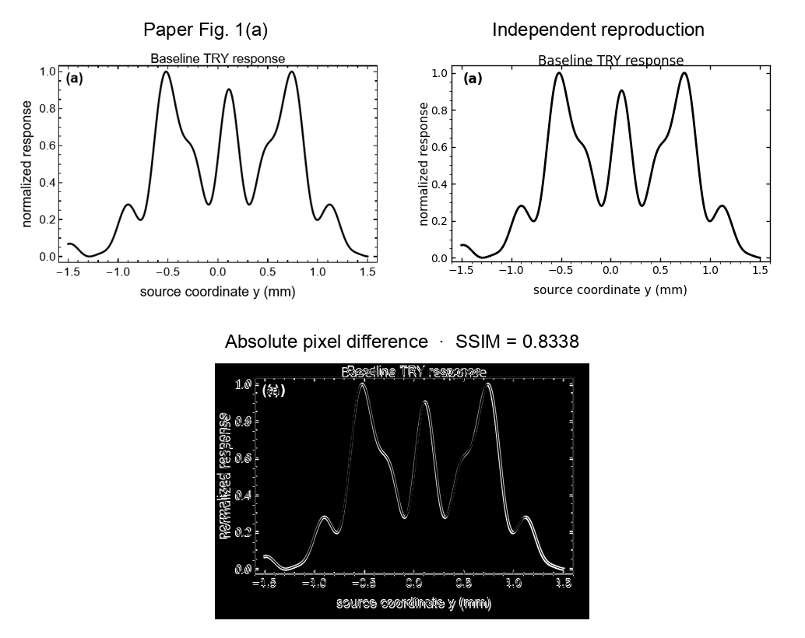
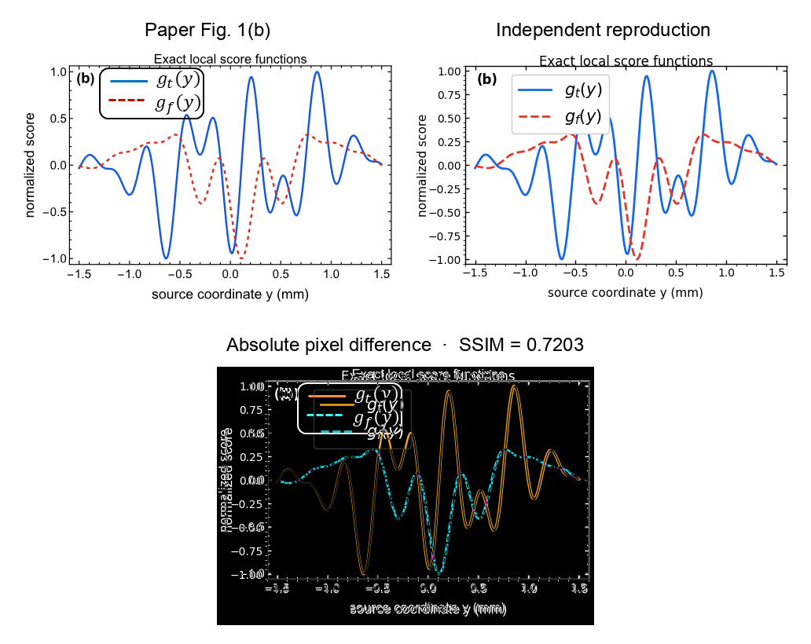
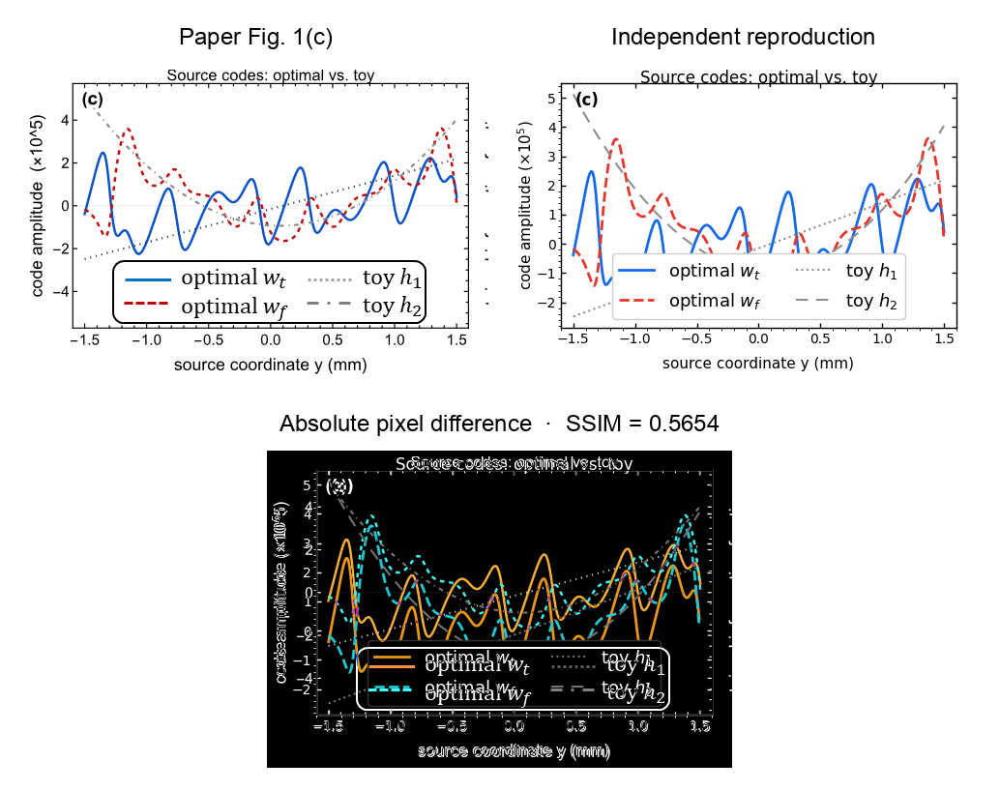
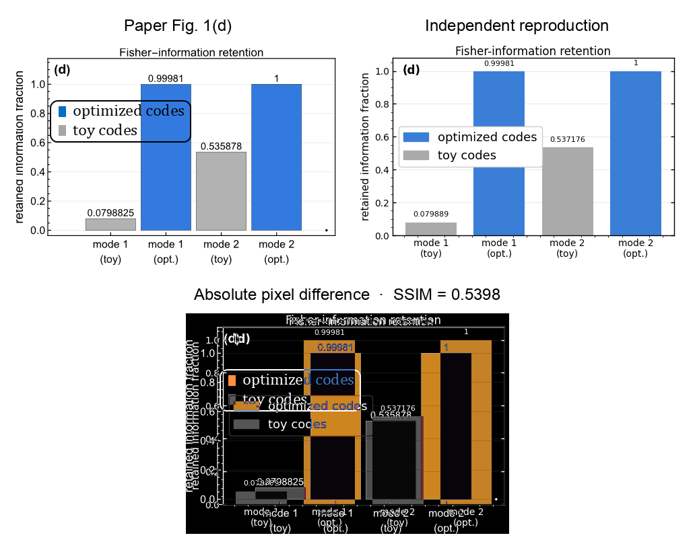
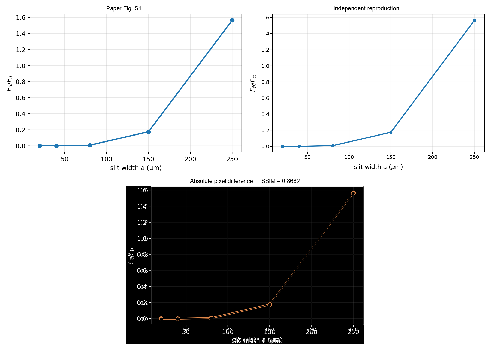
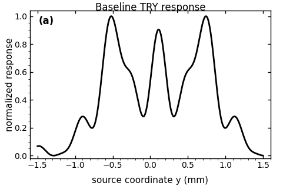
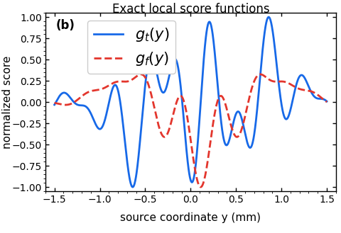
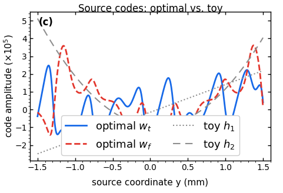
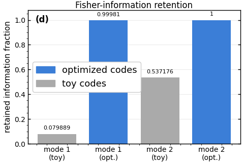

# 2605.02873: Fixed-detector tilt--defocus sensing by upstream source coding in a time-reversed Young interferometer

Preprint: [arXiv:2605.02873v1 — Fixed-detector tilt--defocus sensing by upstream source coding in a time-reversed Young interferometer](https://arxiv.org/abs/2605.02873v1)

Formal publication: **Not recorded as of 2026-07-30**

Public status: **Scientific reproduction — independent review pending** · Audit score: **91.60/100**

All five frozen theory-numerical targets were independently regenerated at paper-exact physical parameters. Four main panels use analytic/textual references and are capped at 90; Fig. S1 uses the exact supplementary table and scores 98 with its near-null first-row deviation disclosed.

## Start Here / 从这里开始

- [中文复现 Note](note/reproduction-note.zh-CN.md)
- [English reproduction note](note/reproduction-note.en.md)
- [Equation-level derivation](docs/DERIVATION.md)
- [Numerical methods](docs/NUMERICAL_METHODS.md)
- [Public evidence index](docs/EVIDENCE_INDEX.md)
- [Comparison policy](docs/COMPARISON_POLICY.md)
- [Scientific consistency report](docs/CONSISTENCY_REPORT.md)
- [Code and run commands](code/README.md)
- [Machine-readable scorecard](outputs/checks/similarity_scorecard.json)
- [Machine-readable completion boundary](outputs/checks/completion_assessment.json)
- [Derivation (equations)](docs/DERIVATION.md)
- [Numerical methods](docs/NUMERICAL_METHODS.md)
- [Lessons learned](docs/LESSONS_LEARNED.md)

## Paper Reference vs Independent Reproduction

Each board contains only the minimum paper excerpt needed for validation and places it beside an independently generated result. Visual agreement is a scientific-region diagnostic, not author-data-level equivalence.

### fig001a comparison comparison



### fig001b comparison comparison



### fig001c comparison comparison



### fig001d comparison comparison



### figs001 comparison comparison



## Quick Run

```bash
python -m venv .venv
source .venv/bin/activate
pip install -r requirements.txt
cd cases/2605.02873/code
python scripts/run_reproduction.py --config config/final_science.json --output-root outputs/public_quick_run
```

Published machine-readable artifacts are kept under [data](outputs/data/), [figures](outputs/figures/), [checks](outputs/checks/).

## Reproduction Boundary

This public case includes paper-derived code, generated data, generated figures, public validation checks, explanatory notes, and 5 limited comparison panels. Those panels use the minimum paper excerpts needed for validation and clearly separate the paper reference from the independent result. The case does not redistribute the paper PDF, arXiv source archive, standalone original figures, EPS paths, digitized source curves, or source-derived point sets.

Remaining limitation: Remaining lifecycle boundaries: artifact_integrity=artifact_valid_with_warnings, parameters=paper_exact, causal_resolution=not_required, independent_review=missing, review_scope=missing, paper_assessment=missing.

Final-parameter rule: final public figures use the paper parameters when feasible. Any reduced-scale, subset, proxy, or blocked target must be labeled explicitly and cannot be presented as a complete reproduction.

## Generated Figures










