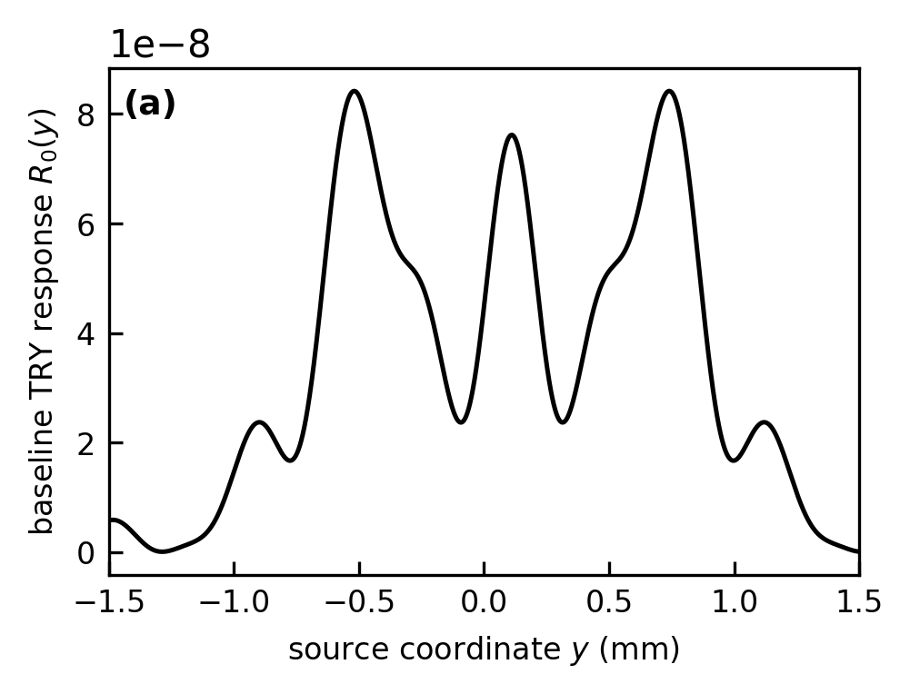
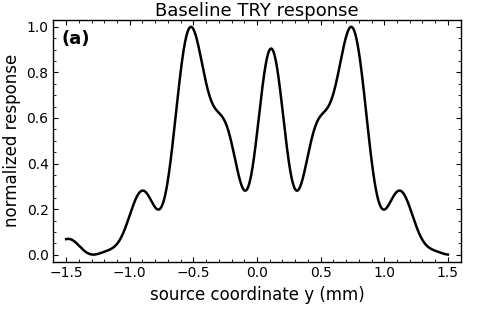
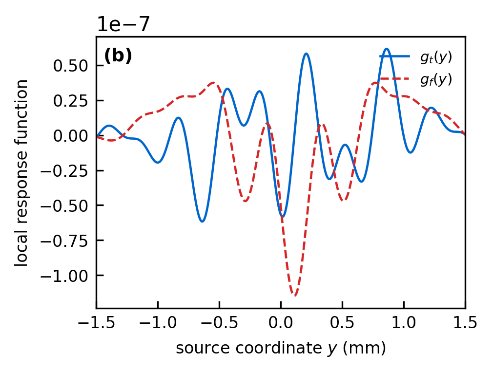
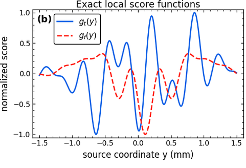
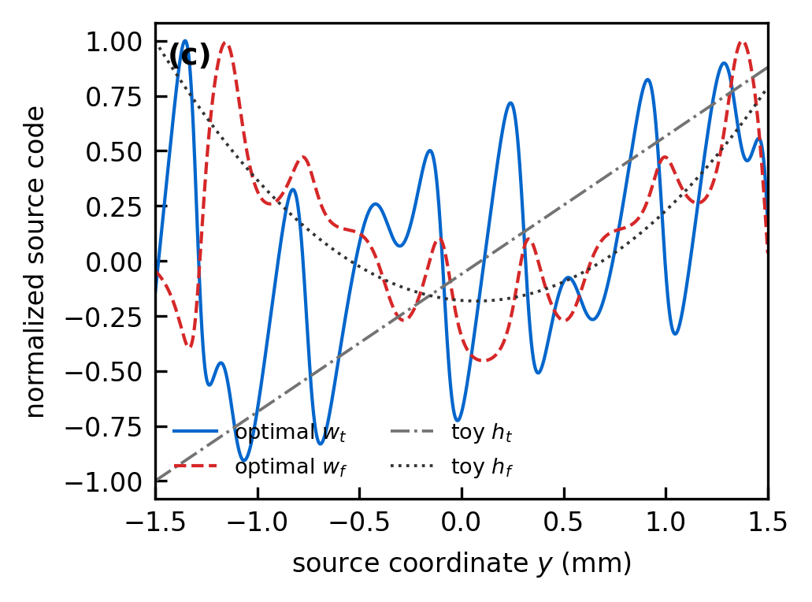
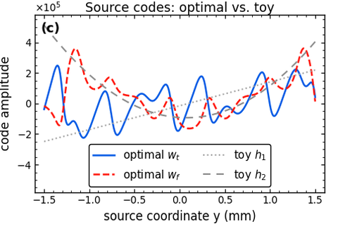
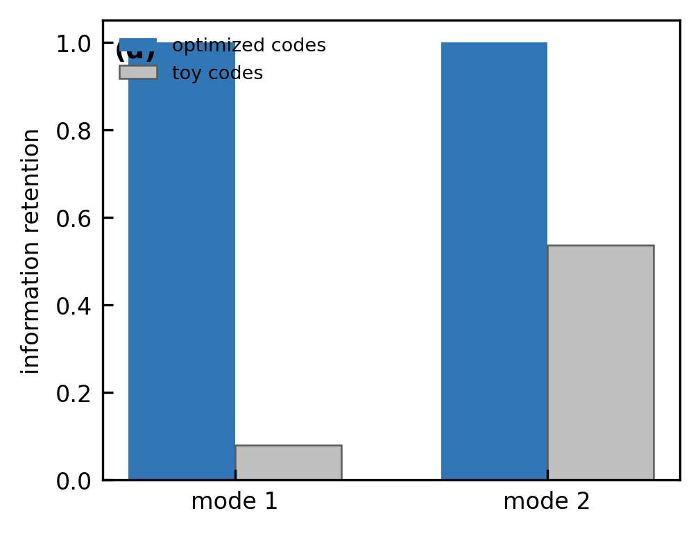
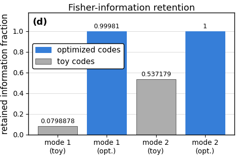
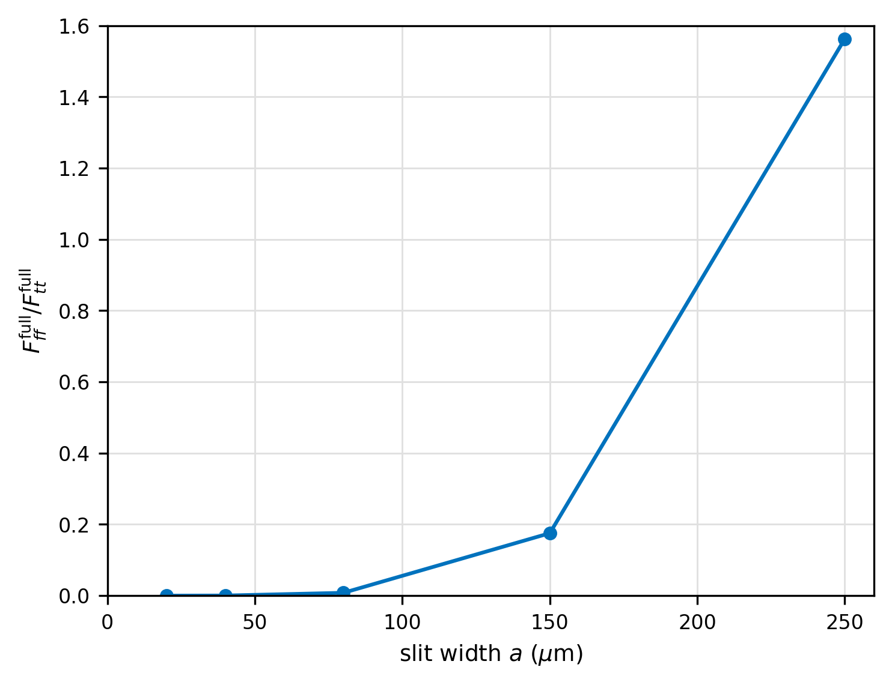
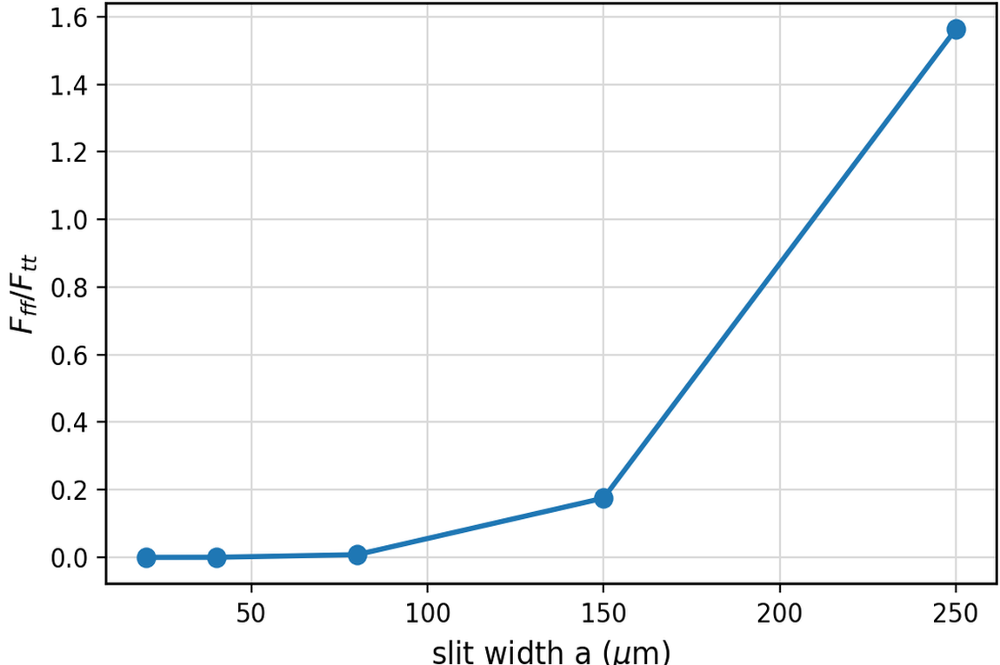

# 2605.02873: Fixed-detector tilt--defocus sensing by upstream source coding in a time-reversed Young interferometer

Preprint: [arXiv:2605.02873v1 — Fixed-detector tilt--defocus sensing by upstream source coding in a time-reversed Young interferometer](https://arxiv.org/abs/2605.02873v1)

Formal publication: **Not recorded as of 2026-08-04**

Public status: **Historical scientific artifact (5 numerical targets; 5 reproduced)** · Audit score: **90.00/100**

Publishes the independently generated numerical artifacts retained by the historical case: 5 public generated data files, 10 public generated figures, and 5 declared numerical targets. The package preserves failed, partial, proxy, and unresolved outcomes instead of upgrading them to completion.

## Start Here / 从这里开始

- [中文复现 Note](note/reproduction-note.zh-CN.md)
- [English reproduction note](note/reproduction-note.en.md)
- [Code and run commands](code/README.md)
- [Machine-readable scorecard](outputs/checks/similarity_scorecard.json)
- [Derivation (equations)](docs/DERIVATION.md)
- [Numerical methods](docs/NUMERICAL_METHODS.md)
- [Lessons learned](docs/LESSONS_LEARNED.md)

## Main Reproduced Results

| Paper item | Reproduced result | Figure | Check |
| --- | --- | --- | --- |
| FIG001A | Unaberrated fixed-detector response across the upstream source coordinate. | [PNG](outputs/figures/FIG001A.png) | [JSON](outputs/checks/similarity_scorecard.json) |
| FIG001A | Unaberrated fixed-detector response across the upstream source coordinate. | [PNG](outputs/figures/T-FIG001A_FIG001A.png) | [JSON](outputs/checks/similarity_scorecard.json) |
| FIG001B | Exact first-order tilt and defocus intensity-response functions. | [PNG](outputs/figures/FIG001B.png) | [JSON](outputs/checks/similarity_scorecard.json) |
| FIG001B | Exact first-order tilt and defocus intensity-response functions. | [PNG](outputs/figures/T-FIG001B_FIG001B.png) | [JSON](outputs/checks/similarity_scorecard.json) |
| FIG001C | Optimized fringe-locked source codes and smooth Gaussian toy-code comparison. | [PNG](outputs/figures/FIG001C.png) | [JSON](outputs/checks/similarity_scorecard.json) |
| FIG001C | Optimized fringe-locked source codes and smooth Gaussian toy-code comparison. | [PNG](outputs/figures/T-FIG001C_FIG001C.png) | [JSON](outputs/checks/similarity_scorecard.json) |
| FIG001D | Principal information-retention fractions for optimized and Gaussian toy two-channel receivers. | [PNG](outputs/figures/FIG001D.png) | [JSON](outputs/checks/similarity_scorecard.json) |
| FIG001D | Principal information-retention fractions for optimized and Gaussian toy two-channel receivers. | [PNG](outputs/figures/T-FIG001D_FIG001D.png) | [JSON](outputs/checks/similarity_scorecard.json) |
| FIGS001 | Relative first-order defocus information as finite slit width increases. | [PNG](outputs/figures/FIGS001.png) | [JSON](outputs/checks/similarity_scorecard.json) |
| FIGS001 | Relative first-order defocus information as finite slit width increases. | [PNG](outputs/figures/T-FIGS001_FIGS001.png) | [JSON](outputs/checks/similarity_scorecard.json) |

### FIG001A: Unaberrated fixed-detector response across the upstream source coordinate.



### FIG001A: Unaberrated fixed-detector response across the upstream source coordinate.



### FIG001B: Exact first-order tilt and defocus intensity-response functions.



### FIG001B: Exact first-order tilt and defocus intensity-response functions.



### FIG001C: Optimized fringe-locked source codes and smooth Gaussian toy-code comparison.



### FIG001C: Optimized fringe-locked source codes and smooth Gaussian toy-code comparison.



### FIG001D: Principal information-retention fractions for optimized and Gaussian toy two-channel receivers.



### FIG001D: Principal information-retention fractions for optimized and Gaussian toy two-channel receivers.



### FIGS001: Relative first-order defocus information as finite slit width increases.



### FIGS001: Relative first-order defocus information as finite slit width increases.



## Quick Run

```bash
python -m venv .venv
source .venv/bin/activate
pip install -r requirements.txt
cd cases/2605.02873/code
python scripts/verify_public_artifacts.py
```

Generated files are kept under [data](outputs/data/), [figures](outputs/figures/), and [checks](outputs/checks/).

## Reproduction Boundary

This public case includes paper-derived code, generated data, generated figures, public validation checks, and explanatory notes. It does not redistribute the paper PDF, arXiv source archive, original figures, EPS paths, digitized source curves, source-derived point sets, or source-vs-generated composite panels.

Remaining limitation: The legacy case has no machine-verifiable author-code isolation attestation. No source-image comparison panel or digitized source curve is published in this projection.

Final-parameter rule: final public figures use the paper parameters when feasible. Any reduced-scale, subset, proxy, or blocked target must be labeled explicitly and cannot be presented as a complete reproduction.
