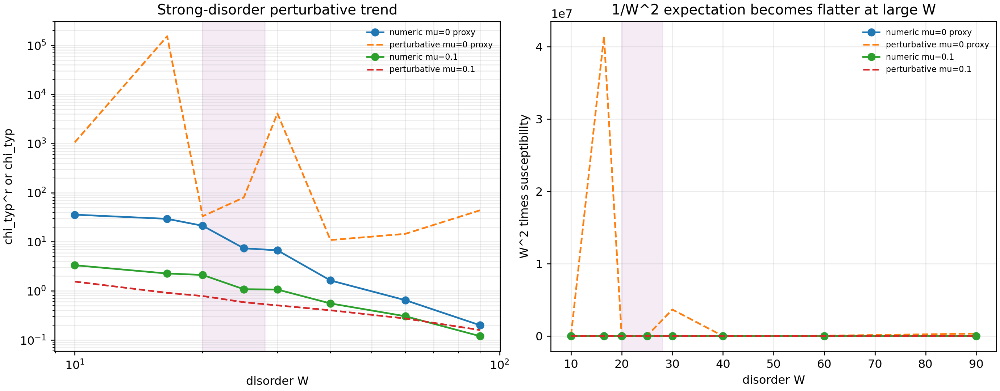
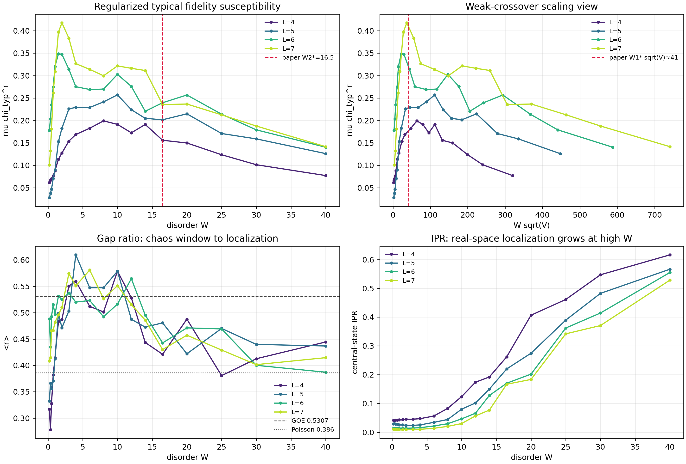
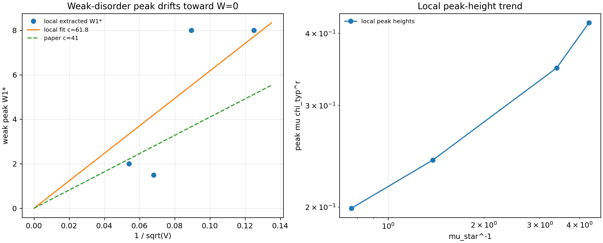
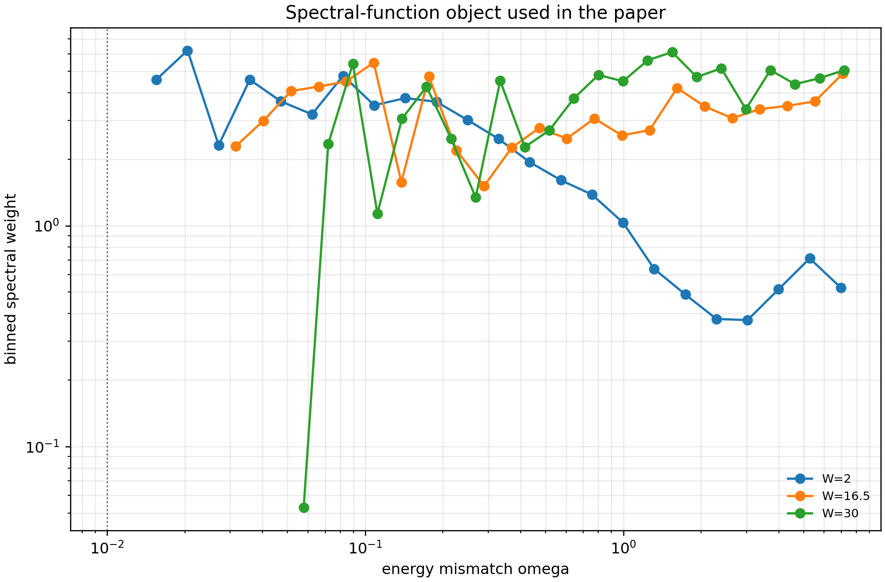
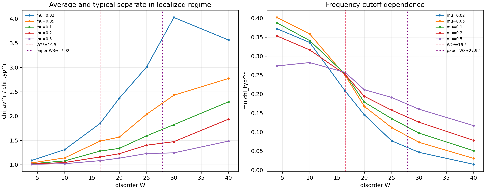
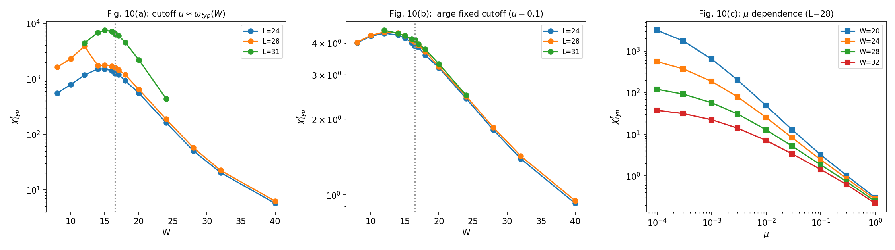

# 2605.25594: Sensitivity to perturbations in the three-dimensional Anderson model

Preprint: [arXiv:2605.25594 — Sensitivity to perturbations in the three-dimensional Anderson model](https://arxiv.org/abs/2605.25594)

Formal publication: **Not recorded as of 2026-07-14**

Public status: **Partial scientific reproduction** · Audit score: **34.19/100**

The complete 20-page paper contains 73 eligible atomic scientific items: 24 have partial independent evidence and 49 are explicitly uncovered.

## Start Here / 从这里开始

- [中文复现 Note](note/reproduction-note.zh-CN.md)
- [English reproduction note](note/reproduction-note.en.md)
- [Equation-level derivation](docs/DERIVATION.md)
- [Numerical methods](docs/NUMERICAL_METHODS.md)
- [Public evidence index](docs/EVIDENCE_INDEX.md)
- [Comparison policy](docs/COMPARISON_POLICY.md)
- [Scientific consistency report](docs/CONSISTENCY_REPORT.md)
- [Code and run commands](code/README.md)
- [Machine-readable scorecard](outputs/checks/similarity_scorecard.json)
- [Machine-readable completion boundary](outputs/checks/completion_assessment.json)
- [Derivation (equations)](docs/DERIVATION.md)
- [Numerical methods](docs/NUMERICAL_METHODS.md)
- [Lessons learned](docs/LESSONS_LEARNED.md)

## Quick Run

```bash
python -m venv .venv
source .venv/bin/activate
pip install -r requirements.txt
cd cases/2605.25594/code
python scripts/run_reproduction.py
```

Published machine-readable artifacts are kept under [data](outputs/data/), [figures](outputs/figures/), [checks](outputs/checks/).

## Reproduction Boundary

This public case includes paper-derived code, generated data, generated figures, public validation checks, explanatory notes. It does not redistribute the paper PDF, arXiv source archive, original figures, EPS paths, digitized source curves, source-derived point sets, or source-vs-generated composite panels.

Remaining limitation: Seven figure items have exploratory independent evidence; nine are compute-deferred with executable paper-scale contracts. Legacy fig9 artifacts are Main Fig. 10; legacy fig11 artifacts are Appendix Fig. A00. No result is accepted as paper-exact until production compute, convergence, falsification, and fresh-context review pass.

Final-parameter rule: final public figures use the paper parameters when feasible. Any reduced-scale, subset, proxy, or blocked target must be labeled explicitly and cannot be presented as a complete reproduction.

## Generated Figures














