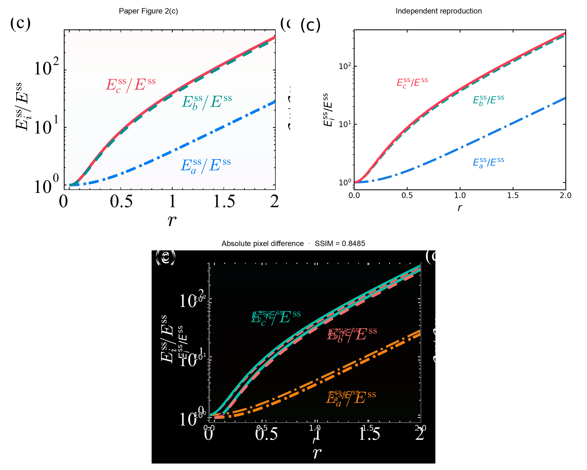
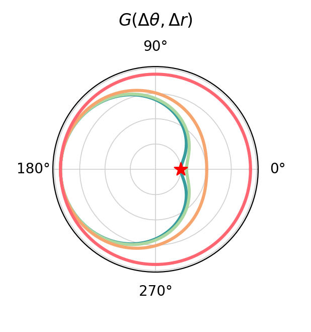
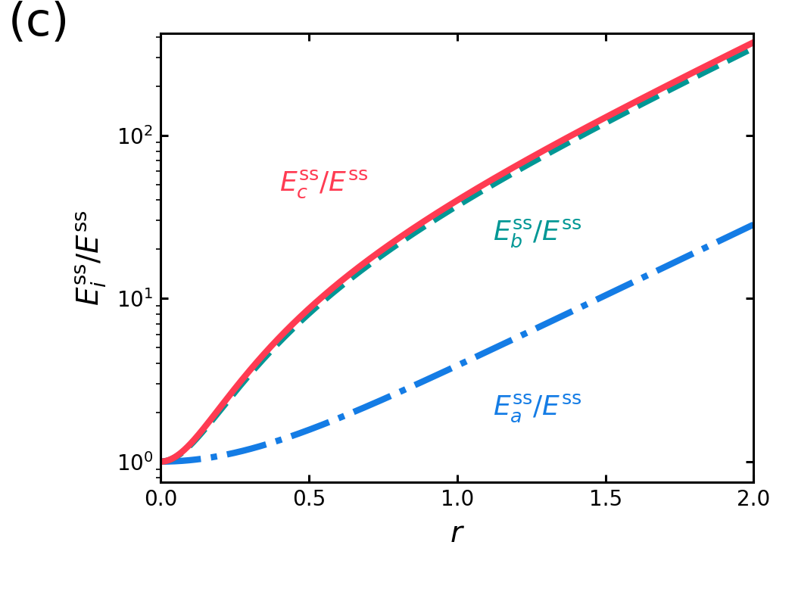
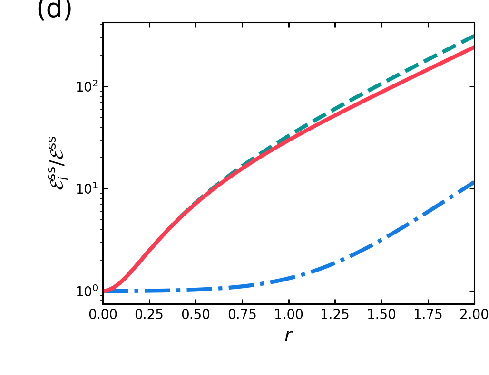
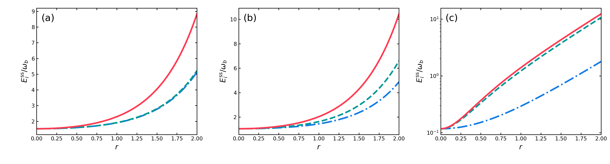
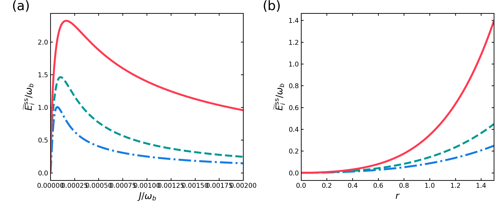

# 2607.00718: Enhancing Nonreciprocity through Squeezing-Induced Symmetry Breaking

Preprint: [arXiv:2607.00718 — Enhancing Nonreciprocity through Squeezing-Induced Symmetry Breaking](https://arxiv.org/abs/2607.00718)

Published as: [Enhancing Nonreciprocity through Squeezing-Induced Symmetry Breaking](https://doi.org/10.1103/kh36-7z76)

Formal citation: Phys. Rev. Lett. 136, 253602 (2026) · DOI `10.1103/kh36-7z76` · Locator `253602`

Public status: **Partial scientific reproduction** · Audit score: **90.31/100**

All ten target bundles were executed; Figure S1 is scientifically adjudicated with a rejected quantitative cutoff claim.

## Start Here / 从这里开始

- [中文复现 Note](note/reproduction-note.zh-CN.md)
- [English reproduction note](note/reproduction-note.en.md)
- [Equation-level derivation](docs/DERIVATION.md)
- [Numerical methods](docs/NUMERICAL_METHODS.md)
- [Public evidence index](docs/EVIDENCE_INDEX.md)
- [Comparison policy](docs/COMPARISON_POLICY.md)
- [Scientific consistency report](docs/CONSISTENCY_REPORT.md)
- [Code and run commands](code/README.md)
- [Machine-readable scorecard](outputs/checks/similarity_scorecard.json)
- [Machine-readable completion boundary](outputs/checks/completion_assessment.json)
- [Derivation (equations)](docs/DERIVATION.md)
- [Numerical methods](docs/NUMERICAL_METHODS.md)
- [Lessons learned](docs/LESSONS_LEARNED.md)

## Paper Reference vs Independent Reproduction

Each board contains only the minimum paper excerpt needed for validation and places it beside an independently generated result. Visual agreement is a scientific-region diagnostic, not author-data-level equivalence.

### fig1c source vs reproduction comparison


### fig2c source vs reproduction comparison



### fig3 source vs reproduction comparison


### fig4 source vs reproduction comparison


## Quick Run

```bash
python -m venv .venv
source .venv/bin/activate
pip install -r requirements.txt
cd cases/2607.00718/code
python scripts/run_reproduction.py T001 --device cpu
```

Published machine-readable artifacts are kept under [data](outputs/data/), [figures](outputs/figures/), [checks](outputs/checks/).

## Reproduction Boundary

This public case includes paper-derived code, generated data, generated figures, public validation checks, explanatory notes, and 4 limited comparison panels. Those panels use the minimum paper excerpts needed for validation and clearly separate the paper reference from the independent result. The case does not redistribute the paper PDF, arXiv source archive, standalone original figures, EPS paths, digitized source curves, or source-derived point sets.

Remaining limitation: First milestone targets T001, T002C, T003, and T004. Zenodo transmission arrays appear to belong to an older manuscript version.

Final-parameter rule: final public figures use the paper parameters when feasible. Any reduced-scale, subset, proxy, or blocked target must be labeled explicitly and cannot be presented as a complete reproduction.

## Generated Figures












