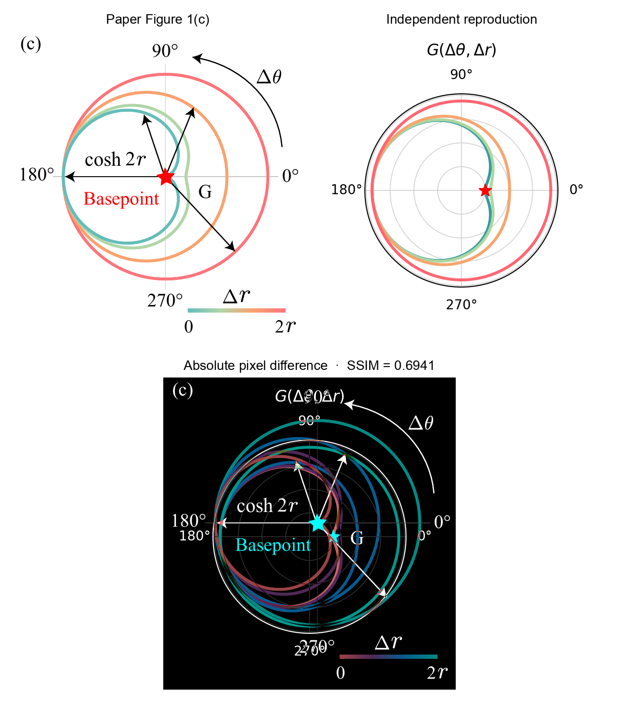
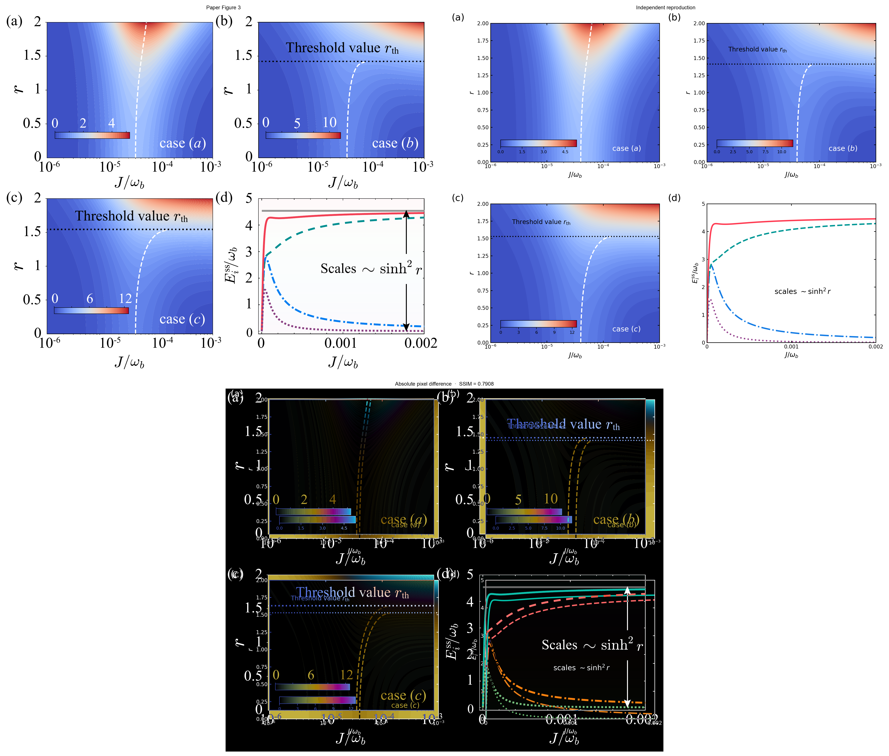
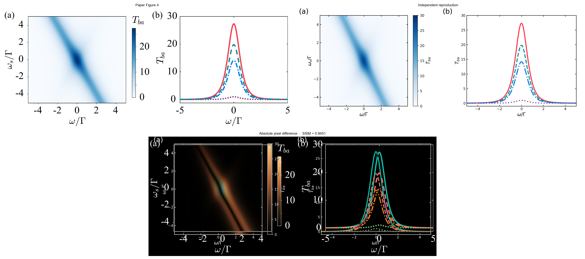
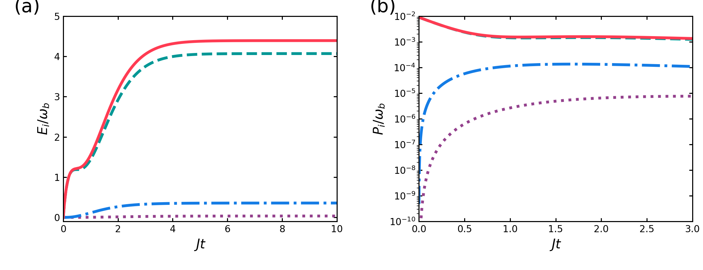
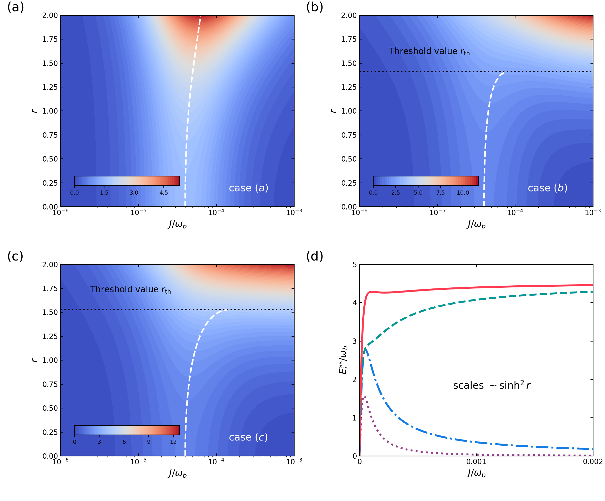
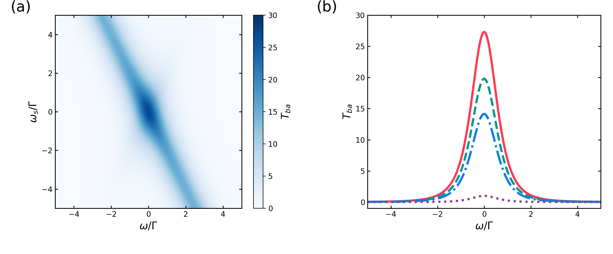
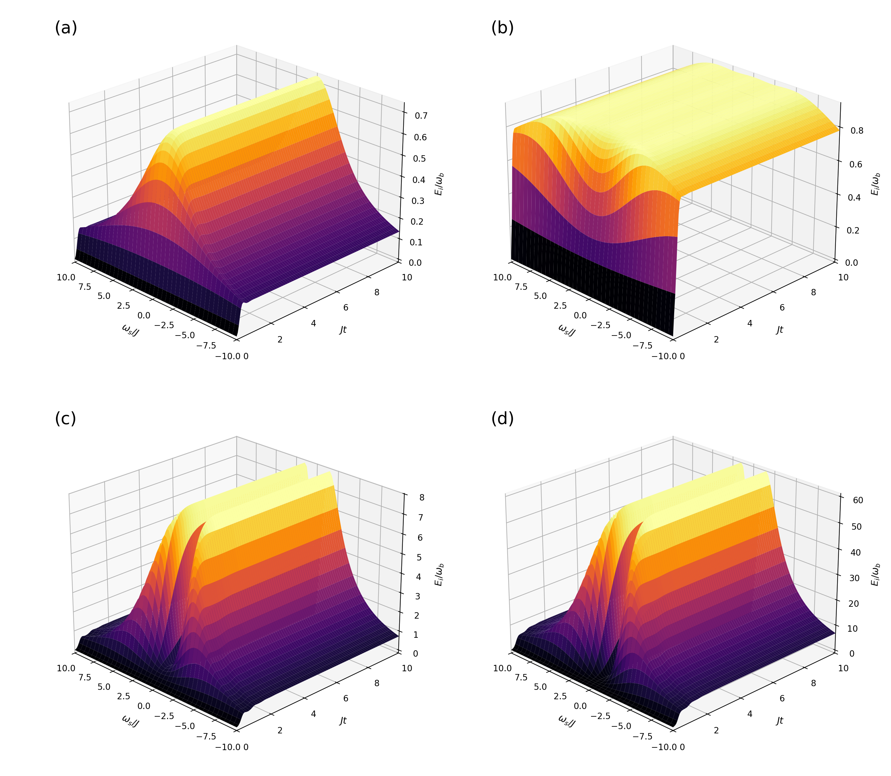
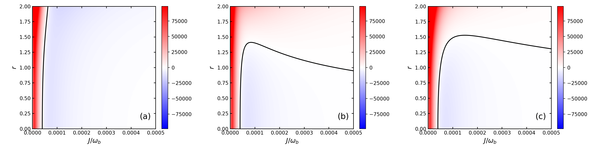

# 2607.00718: Enhancing Nonreciprocity through Squeezing-Induced Symmetry Breaking

Preprint: [arXiv:2607.00718 — Enhancing Nonreciprocity through Squeezing-Induced Symmetry Breaking](https://arxiv.org/abs/2607.00718)

Published as: [Enhancing Nonreciprocity through Squeezing-Induced Symmetry Breaking](https://doi.org/10.1103/kh36-7z76)

Formal citation: Physical Review Letters 136, 253602 (2026) · DOI `10.1103/kh36-7z76` · Locator `253602`

Public status: **Scientific contract complete: 23/23 numerical panels; 4 claims verified and 1 published cutoff claim rejected** · Audit score: **90.31/100**

Independently generates every theory-numerical panel from the paper's coupling, Gaussian moment, steady-state, passive-energy, derivative, and scattering equations. Eight of ten target bundles are fully reproduced. The audit verifies four central claims, rejects the published quantitative Figure S1 cutoff claim, and corrects Figure S3's printed absolute-energy label to the formula- and curve-consistent normalized enhancement.

## Start Here / 从这里开始

- [中文复现 Note](note/reproduction-note.zh-CN.md)
- [English reproduction note](note/reproduction-note.en.md)
- [Code and run commands](code/README.md)
- [Machine-readable scorecard](outputs/checks/similarity_scorecard.json)
- [Derivation (equations)](docs/DERIVATION.md)
- [Numerical methods](docs/NUMERICAL_METHODS.md)
- [Lessons learned](docs/LESSONS_LEARNED.md)

## Main Reproduced Results

| Paper item | Reproduced result | Figure | Check |
| --- | --- | --- | --- |
| Figure 2(a-d) | Gaussian battery energy, power, steady enhancement, and ergotropy | [PNG](outputs/figures/fig2ab_dynamics.png) | [JSON](outputs/checks/scientific_verdict.json) |
| Figure 3(a-d) | Steady-energy landscapes, optimal branches, and exact author-array cuts | [PNG](outputs/figures/fig3_steady_energies.png) | [JSON](outputs/checks/scientific_verdict.json) |
| Figure 4(a-b) | Final-formula forward transmission with an explicitly stale released-data comparison | [PNG](outputs/figures/fig4_transmission.png) | [JSON](outputs/checks/scientific_verdict.json) |
| Figure S1(a-d) | Exact Gaussian detuning dynamics and finite-Fock cutoff discrepancy | [PNG](outputs/figures/figs1_detuned_dynamics.png) | [JSON](outputs/checks/scientific_verdict.json) |
| Figures S2-S4 | Analytic derivative, squeezing, passive-energy, and ergotropy checks | [PNG](outputs/figures/figs2_energy_derivatives.png) | [JSON](outputs/checks/scientific_verdict.json) |

## Paper Reference vs Independent Reproduction

Each board contains a limited attributed source excerpt beside an independently generated numerical render. Source pixels are post-generation presentation evidence only and never enter the equations, numerical arrays, or generated figures.

### Figure 1(c) comparison



### Figure 2(c) comparison


### Figure 3 comparison



### Figure 4 comparison



### Figure 2(a-d): Gaussian battery energy, power, steady enhancement, and ergotropy



### Figure 3(a-d): Steady-energy landscapes, optimal branches, and exact author-array cuts



### Figure 4(a-b): Final-formula forward transmission with an explicitly stale released-data comparison



### Figure S1(a-d): Exact Gaussian detuning dynamics and finite-Fock cutoff discrepancy



### Figures S2-S4: Analytic derivative, squeezing, passive-energy, and ergotropy checks



## Quick Run

```bash
python -m venv .venv
source .venv/bin/activate
pip install -r requirements.txt
pip install torch (optional, only for the TS01 truncation probe)
cd cases/2607.00718/code
python scripts/run_target.py
```

Generated files are kept under [data](outputs/data/), [figures](outputs/figures/), and [checks](outputs/checks/).

## Reproduction Boundary

This public case includes paper-derived code, generated data, generated figures, public validation checks, explanatory notes, and 4 limited comparison panels. Those panels use the minimum paper excerpts needed for validation and clearly separate the paper reference from the independent result. The case does not redistribute the paper PDF, arXiv source archive, standalone original figures, EPS paths, digitized source curves, or source-derived point sets.

Remaining limitation: Figure 1(c) leaves the absolute representative squeezing unspecified. The released Figure 4 transmission arrays belong to an earlier manuscript and peak at 10.07 rather than the final-formula 27.31. Figure S1 does not disclose its finite-Hilbert cutoff or convergence study. Figure S3 has no released array and its printed axis conflicts with the visible unit intercepts, so author confirmation remains open. Scientific visual fidelity is 90.31; the secondary presentation diagnostic is 66.23 and contributes no scientific credit.

Final-parameter rule: final public figures use the paper parameters when feasible. Any reduced-scale, subset, proxy, or blocked target must be labeled explicitly and cannot be presented as a complete reproduction.
