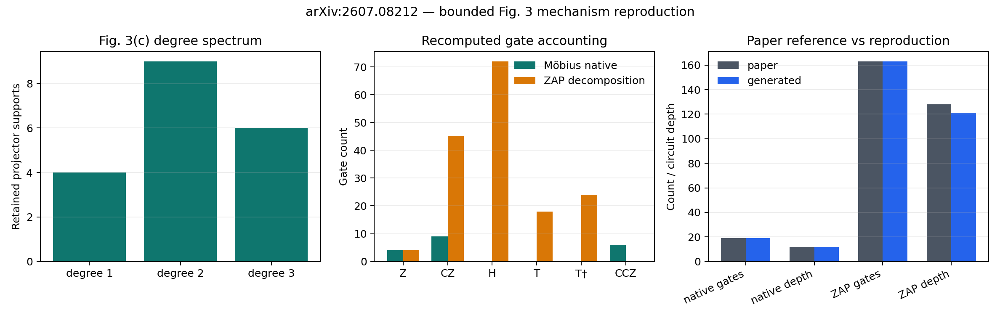
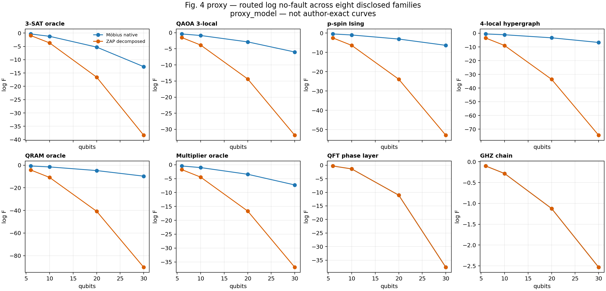
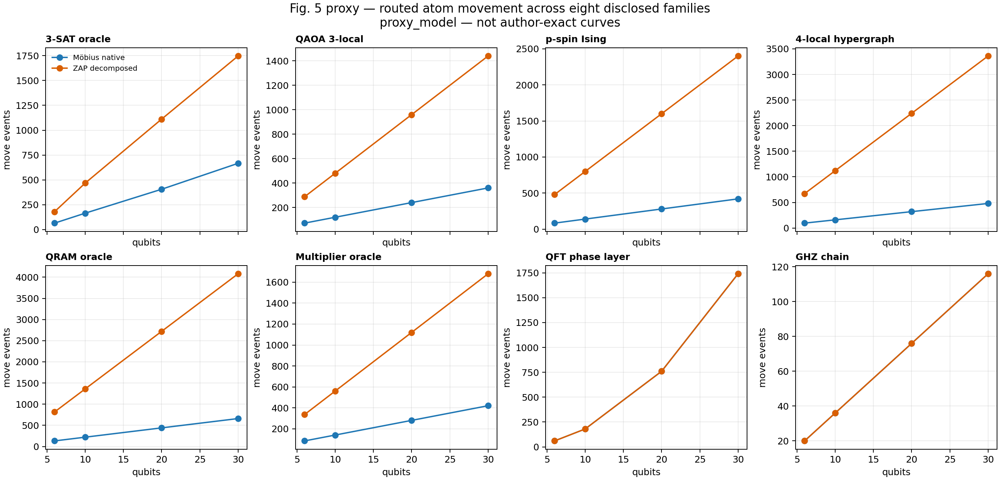
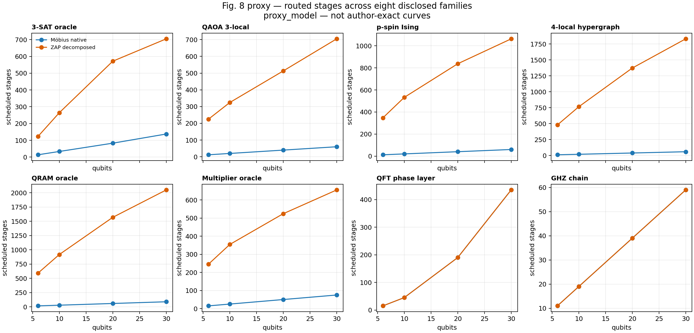
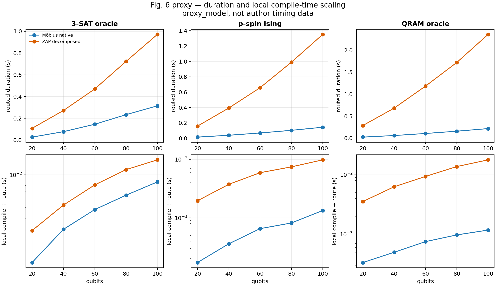
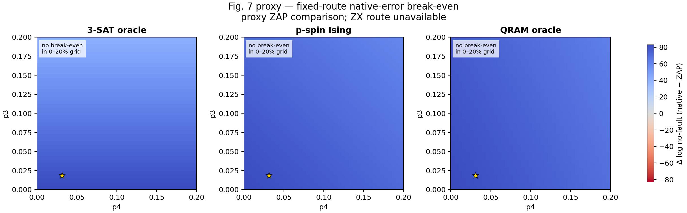

# 2607.08212: Möbius-Guided Diagonal-Gate Compilation with Native Multiqubit Controlled-Phase Gates on Neutral-Atom Processors

Preprint: [arXiv:2607.08212 — Möbius-Guided Diagonal-Gate Compilation with Native Multiqubit Controlled-Phase Gates on Neutral-Atom Processors](https://arxiv.org/abs/2607.08212)

Formal publication: **Not recorded as of 2026-08-04**

Public status: **Partial scientific reproduction** · Audit score: **70.85/100**

Publishes the independently generated numerical artifacts retained by the historical case: 5 public generated data files, 6 public generated figures, and 6 declared numerical targets. The package preserves failed, partial, proxy, and unresolved outcomes instead of upgrading them to completion.

## Start Here / 从这里开始

- [中文复现 Note](note/reproduction-note.zh-CN.md)
- [English reproduction note](note/reproduction-note.en.md)
- [Code and run commands](code/README.md)
- [Machine-readable scorecard](outputs/checks/similarity_scorecard.json)
- [Machine-readable completion boundary](outputs/checks/completion_assessment.json)
- [Derivation (equations)](docs/DERIVATION.md)
- [Numerical methods](docs/NUMERICAL_METHODS.md)
- [Lessons learned](docs/LESSONS_LEARNED.md)

## Main Reproduced Results

| Paper item | Reproduced result | Figure | Check |
| --- | --- | --- | --- |
| FIG003C | Many-body projector phases remain visible as native CCZ operations. | [PNG](outputs/figures/fig3_gate_accounting_reproduction.png) | [JSON](outputs/checks/similarity_scorecard.json) |
| FIG004_008 | Preserving native three- and four-body supports reduces serialized routed work across six disclosed many-body proxy families, without creating an artificial advantage for pairwise controls. | [PNG](outputs/figures/proxy_fidelity_all_families.png) | [JSON](outputs/checks/similarity_scorecard.json) |
| FIG004_008 | Preserving native three- and four-body supports reduces serialized routed work across six disclosed many-body proxy families, without creating an artificial advantage for pairwise controls. | [PNG](outputs/figures/proxy_moves_all_families.png) | [JSON](outputs/checks/similarity_scorecard.json) |
| FIG004_008 | Preserving native three- and four-body supports reduces serialized routed work across six disclosed many-body proxy families, without creating an artificial advantage for pairwise controls. | [PNG](outputs/figures/proxy_stages_all_families.png) | [JSON](outputs/checks/similarity_scorecard.json) |
| FIG006 | Compact native support streams reduce routed quantum duration and classical compilation/routing work as size grows. | [PNG](outputs/figures/proxy_duration_compile_scaling.png) | [JSON](outputs/checks/similarity_scorecard.json) |
| FIG007 | Fixed routed streams isolate how assumed native three- and four-qubit errors alter the native-vs-ZAP decision. | [PNG](outputs/figures/proxy_native_error_sensitivity.png) | [JSON](outputs/checks/similarity_scorecard.json) |

### FIG003C: Many-body projector phases remain visible as native CCZ operations.



### FIG004_008: Preserving native three- and four-body supports reduces serialized routed work across six disclosed many-body proxy families, without creating an artificial advantage for pairwise controls.



### FIG004_008: Preserving native three- and four-body supports reduces serialized routed work across six disclosed many-body proxy families, without creating an artificial advantage for pairwise controls.



### FIG004_008: Preserving native three- and four-body supports reduces serialized routed work across six disclosed many-body proxy families, without creating an artificial advantage for pairwise controls.



### FIG006: Compact native support streams reduce routed quantum duration and classical compilation/routing work as size grows.



### FIG007: Fixed routed streams isolate how assumed native three- and four-qubit errors alter the native-vs-ZAP decision.



## Quick Run

```bash
python -m venv .venv
source .venv/bin/activate
pip install -r requirements.txt
cd cases/2607.08212/code
python scripts/verify_public_artifacts.py
```

Generated files are kept under [data](outputs/data/), [figures](outputs/figures/), and [checks](outputs/checks/).

## Reproduction Boundary

This public case includes paper-derived code, generated data, generated figures, public validation checks, and explanatory notes. It does not redistribute the paper PDF, arXiv source archive, original figures, EPS paths, digitized source curves, source-derived point sets, or source-vs-generated composite panels.

Remaining limitation: Frozen non-final target states: FIG3C_NATIVE=evidence_compared, FIG3A_ZAP=evidence_compared, ROUTING_PROXY=evidence_compared, ROUTING_PROXY_SCALING=evidence_compared, ROUTING_PROXY_SENSITIVITY=partially_reproduced. The legacy case has no machine-verifiable author-code isolation attestation. No source-image comparison panel or digitized source curve is published in this projection.

Final-parameter rule: final public figures use the paper parameters when feasible. Any reduced-scale, subset, proxy, or blocked target must be labeled explicitly and cannot be presented as a complete reproduction.
