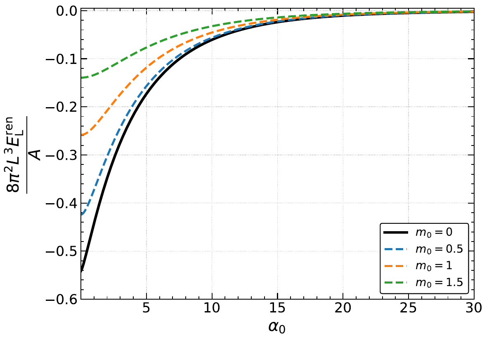
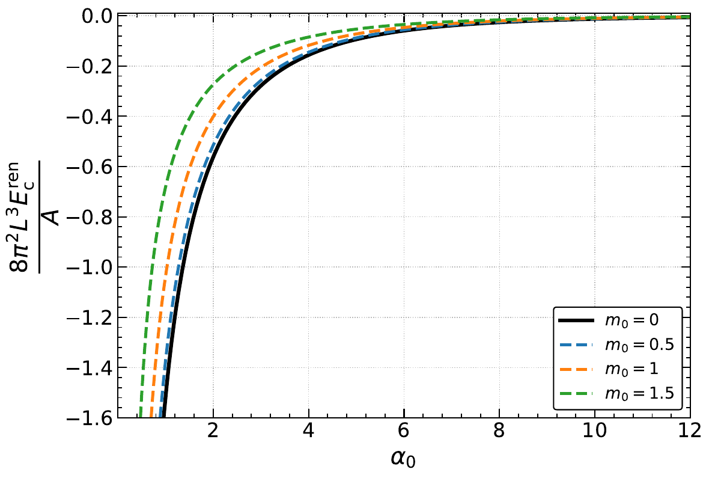
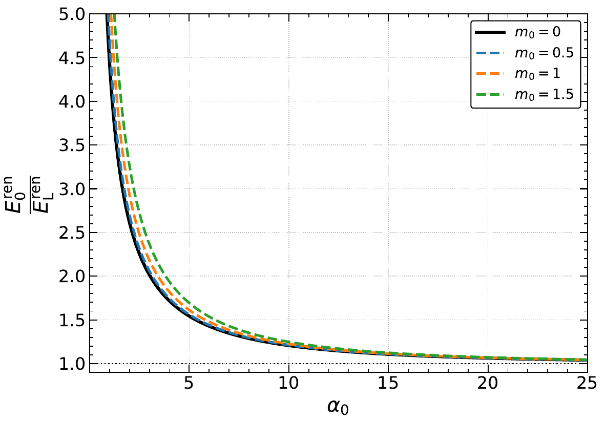

# 2607.15070: Casimir effect for a massive scalar field confined between parallel plates with a spatially varying effective mass

Preprint: [arXiv:2607.15070v1 — Casimir effect for a massive scalar field confined between parallel plates with a spatially varying effective mass](https://arxiv.org/abs/2607.15070v1)

Formal publication: **Not recorded as of 2026-08-04**

Public status: **Scientific reproduction — invalid** · Audit score: **90.00/100**

Publishes the independently generated numerical artifacts retained by the historical case: 2 public generated data files, 3 public generated figures, and 2 declared numerical targets. The package preserves failed, partial, proxy, and unresolved outcomes instead of upgrading them to completion.

## Start Here / 从这里开始

- [中文复现 Note](note/reproduction-note.zh-CN.md)
- [English reproduction note](note/reproduction-note.en.md)
- [Code and run commands](code/README.md)
- [Machine-readable scorecard](outputs/checks/similarity_scorecard.json)
- [Machine-readable completion boundary](outputs/checks/completion_assessment.json)
- [Derivation (equations)](docs/DERIVATION.md)
- [Numerical methods](docs/NUMERICAL_METHODS.md)
- [Lessons learned](docs/LESSONS_LEARNED.md)

## Main Reproduced Results

| Paper item | Reproduced result | Figure | Check |
| --- | --- | --- | --- |
| FIG002 | Normalized Landau-like and additional renormalized vacuum-energy contributions. | [PNG](outputs/figures/fig2_landau.png) | [JSON](outputs/checks/similarity_scorecard.json) |
| FIG002 | Normalized Landau-like and additional renormalized vacuum-energy contributions. | [PNG](outputs/figures/fig2_correction.png) | [JSON](outputs/checks/similarity_scorecard.json) |
| FIG003 | Ratio of total renormalized energy to the Landau-like contribution. | [PNG](outputs/figures/fig3_ratio.png) | [JSON](outputs/checks/similarity_scorecard.json) |

### FIG002: Normalized Landau-like and additional renormalized vacuum-energy contributions.



### FIG002: Normalized Landau-like and additional renormalized vacuum-energy contributions.



### FIG003: Ratio of total renormalized energy to the Landau-like contribution.



## Quick Run

```bash
python -m venv .venv
source .venv/bin/activate
pip install -r requirements.txt
cd cases/2607.15070/code
python scripts/verify_public_artifacts.py
```

Generated files are kept under [data](outputs/data/), [figures](outputs/figures/), and [checks](outputs/checks/).

## Reproduction Boundary

This public case includes paper-derived code, generated data, generated figures, public validation checks, and explanatory notes. It does not redistribute the paper PDF, arXiv source archive, original figures, EPS paths, digitized source curves, source-derived point sets, or source-vs-generated composite panels.

Remaining limitation: The legacy case has no machine-verifiable author-code isolation attestation. No source-image comparison panel or digitized source curve is published in this projection.

Final-parameter rule: final public figures use the paper parameters when feasible. Any reduced-scale, subset, proxy, or blocked target must be labeled explicitly and cannot be presented as a complete reproduction.
