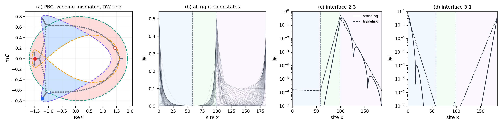
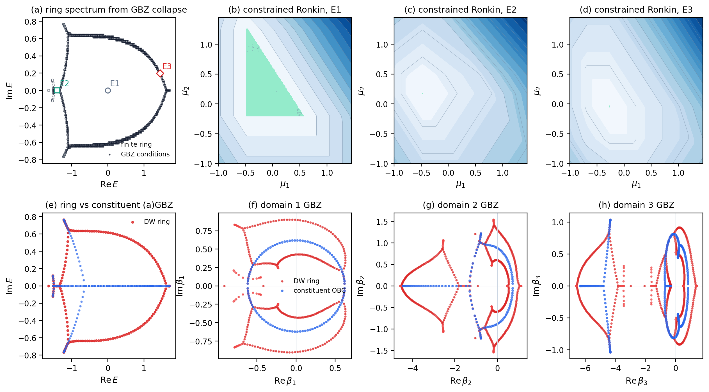
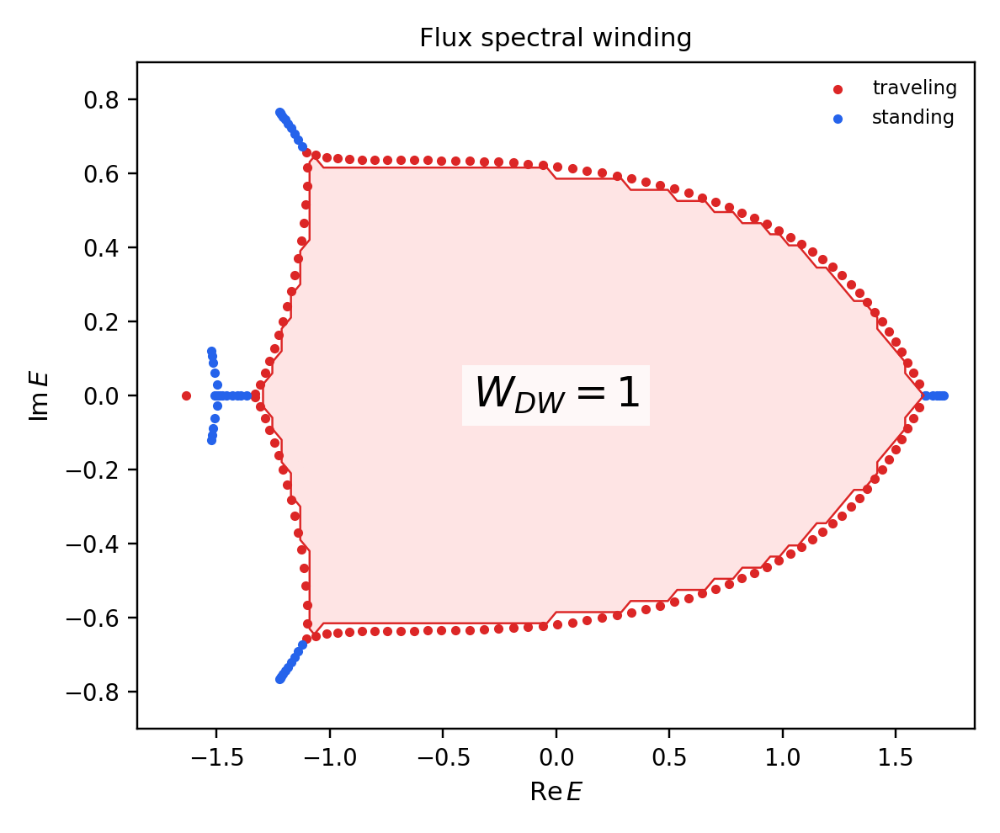
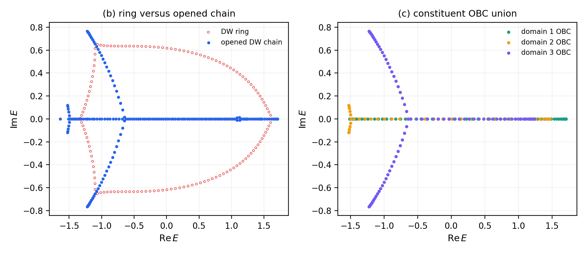
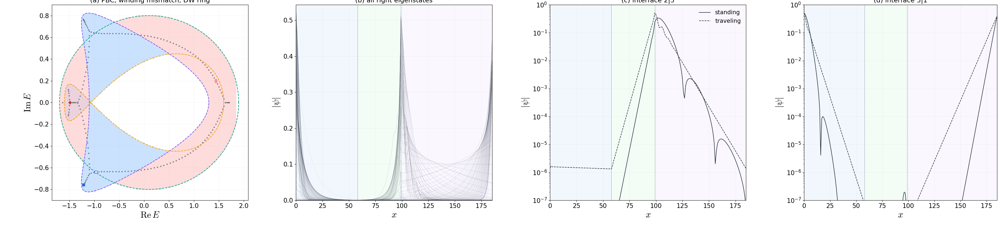
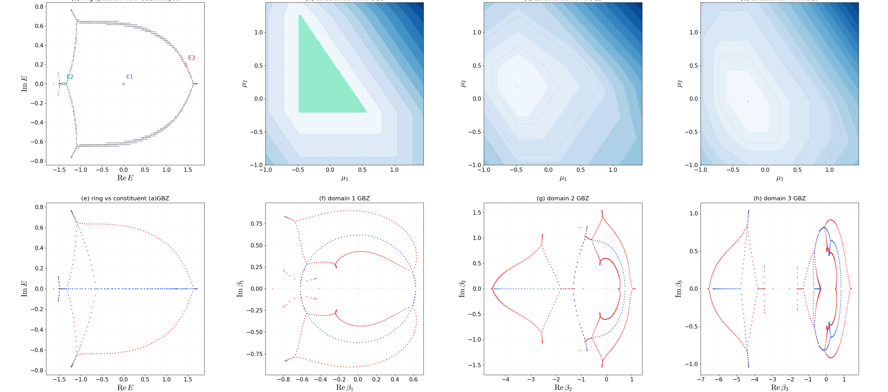
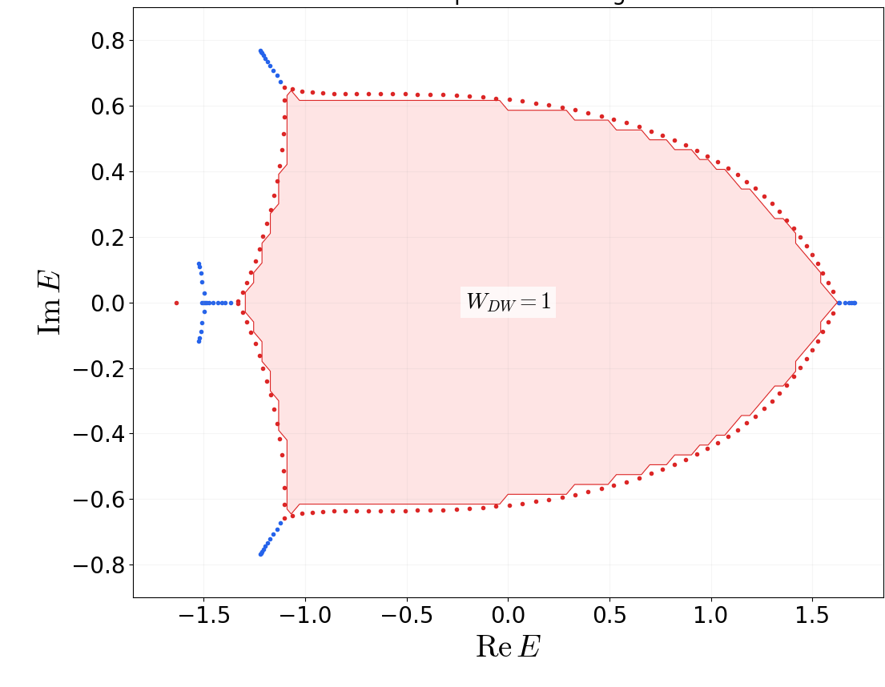
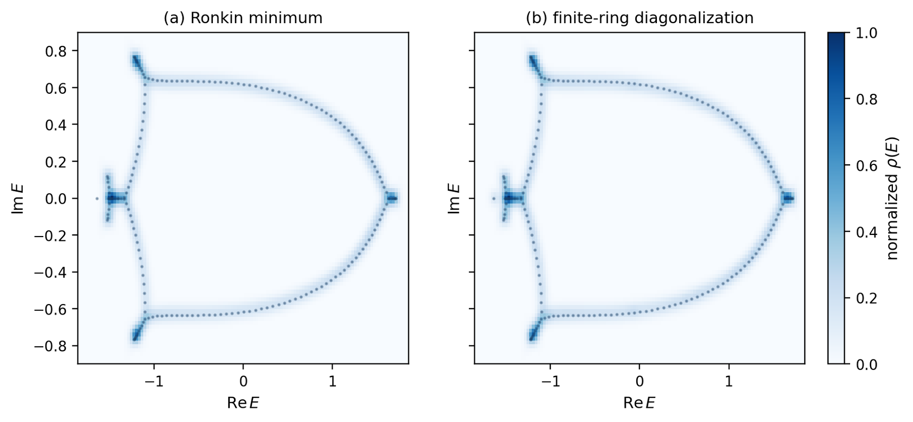
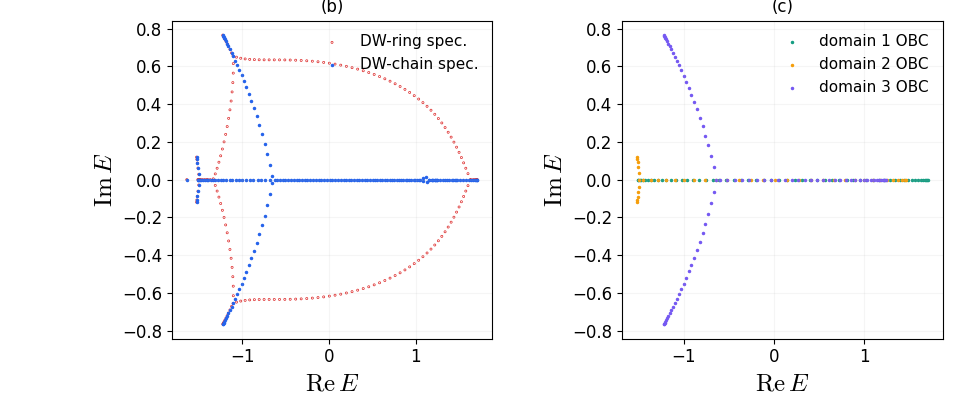

# 2607.22976: Spectral Topology and Non-Bloch Band Theory for Domain-Wall Systems

Preprint: [arXiv:2607.22976 — Spectral Topology and Non-Bloch Band Theory for Domain-Wall Systems](https://arxiv.org/abs/2607.22976)

Formal publication: **Not recorded as of 2026-08-04**

Public status: **Partial scientific reproduction** · Audit score: **84.84/100**

Publishes the independently generated numerical artifacts retained by the historical case: 5 public generated data files, 10 public generated figures, and 5 declared numerical targets. The package preserves failed, partial, proxy, and unresolved outcomes instead of upgrading them to completion.

## Start Here / 从这里开始

- [中文复现 Note](note/reproduction-note.zh-CN.md)
- [English reproduction note](note/reproduction-note.en.md)
- [Code and run commands](code/README.md)
- [Machine-readable scorecard](outputs/checks/similarity_scorecard.json)
- [Machine-readable completion boundary](outputs/checks/completion_assessment.json)
- [Derivation (equations)](docs/DERIVATION.md)
- [Numerical methods](docs/NUMERICAL_METHODS.md)
- [Lessons learned](docs/LESSONS_LEARNED.md)

## Main Reproduced Results

| Paper item | Reproduced result | Figure | Check |
| --- | --- | --- | --- |
| FIG2 | Topological interface localization and standing/traveling profiles. | [PNG](outputs/figures/fig2.png) | [JSON](outputs/checks/similarity_scorecard.json) |
| FIG3 | Ronkin flat-region collapse and multi-valued domain GBZs. | [PNG](outputs/figures/fig3.png) | [JSON](outputs/checks/similarity_scorecard.json) |
| FIG4 | Nonzero flux winding bounded by traveling modes. | [PNG](outputs/figures/fig4.png) | [JSON](outputs/checks/similarity_scorecard.json) |
| FIGS1 | Ronkin and finite-diagonalization density agreement. | [PNG](outputs/figures/figS1.png) | [JSON](outputs/checks/similarity_scorecard.json) |
| FIGS2BC | Boundary-sensitive change from ring to open chain and constituent OBC union. | [PNG](outputs/figures/figS2.png) | [JSON](outputs/checks/similarity_scorecard.json) |
| FIG2 | Topological interface localization and standing/traveling profiles. | [PNG](outputs/figures/fig2_pixel_registered.png) | [JSON](outputs/checks/similarity_scorecard.json) |
| FIG3 | Ronkin flat-region collapse and multi-valued domain GBZs. | [PNG](outputs/figures/fig3_pixel_registered.png) | [JSON](outputs/checks/similarity_scorecard.json) |
| FIG4 | Nonzero flux winding bounded by traveling modes. | [PNG](outputs/figures/fig4_pixel_registered.png) | [JSON](outputs/checks/similarity_scorecard.json) |
| FIGS1 | Ronkin and finite-diagonalization density agreement. | [PNG](outputs/figures/figS1_pixel_registered.png) | [JSON](outputs/checks/similarity_scorecard.json) |
| FIGS2BC | Boundary-sensitive change from ring to open chain and constituent OBC union. | [PNG](outputs/figures/figS2_pixel_registered.png) | [JSON](outputs/checks/similarity_scorecard.json) |

### FIG2: Topological interface localization and standing/traveling profiles.



### FIG3: Ronkin flat-region collapse and multi-valued domain GBZs.



### FIG4: Nonzero flux winding bounded by traveling modes.



### FIGS1: Ronkin and finite-diagonalization density agreement.


### FIGS2BC: Boundary-sensitive change from ring to open chain and constituent OBC union.



### FIG2: Topological interface localization and standing/traveling profiles.



### FIG3: Ronkin flat-region collapse and multi-valued domain GBZs.



### FIG4: Nonzero flux winding bounded by traveling modes.



### FIGS1: Ronkin and finite-diagonalization density agreement.



### FIGS2BC: Boundary-sensitive change from ring to open chain and constituent OBC union.



## Quick Run

```bash
python -m venv .venv
source .venv/bin/activate
pip install -r requirements.txt
cd cases/2607.22976/code
python scripts/verify_public_artifacts.py
```

### Independent numerical rerun

This command recomputes the scientific numerical arrays from the public equation-based implementation. It does not read a paper image, digitized source curve, or author numerical code; runtime varies from seconds to CPU minutes.

```bash
cd cases/2607.22976/code
python scripts/run_reproduction.py --config config/paper_exact.json
```

Generated files are kept under [data](outputs/data/), [figures](outputs/figures/), and [checks](outputs/checks/).

## Reproduction Boundary

This public case includes paper-derived code, generated data, generated figures, public validation checks, and explanatory notes. It does not redistribute the paper PDF, arXiv source archive, original figures, EPS paths, digitized source curves, source-derived point sets, or source-vs-generated composite panels.

Remaining limitation: Frozen non-final target states: T001=evidence_compared, T002=evidence_compared, T003=evidence_compared, T004=evidence_compared, T005=evidence_compared. The legacy case has no machine-verifiable author-code isolation attestation. No source-image comparison panel or digitized source curve is published in this projection.

Final-parameter rule: final public figures use the paper parameters when feasible. Any reduced-scale, subset, proxy, or blocked target must be labeled explicitly and cannot be presented as a complete reproduction.
