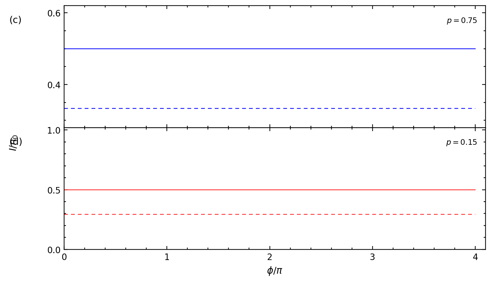
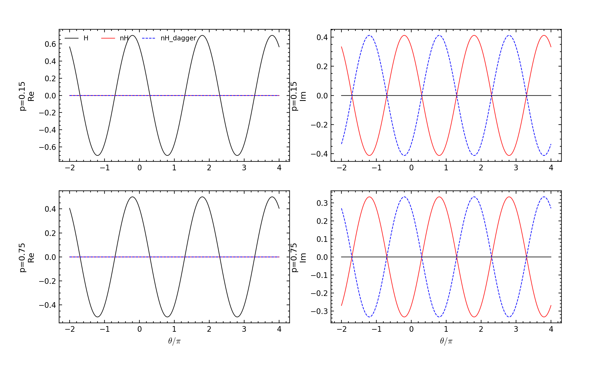
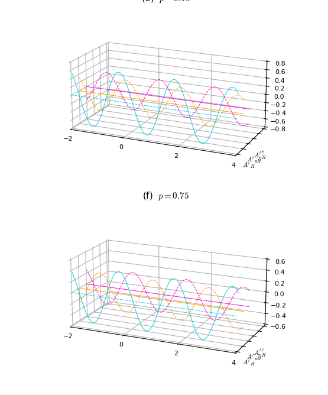
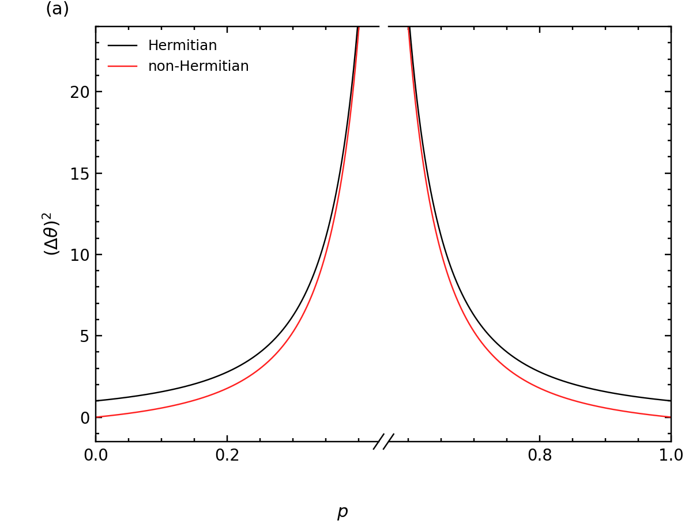
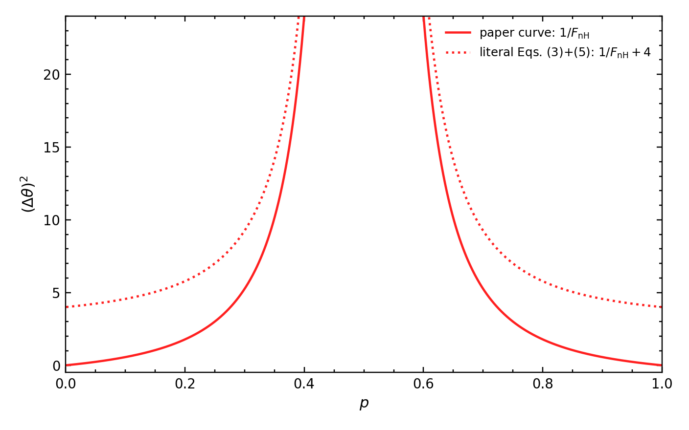
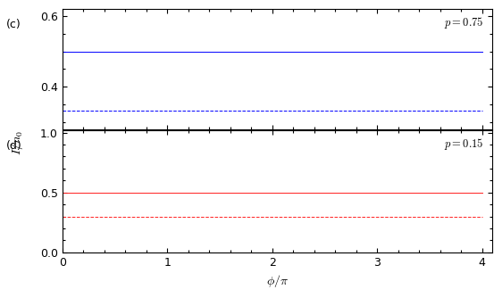
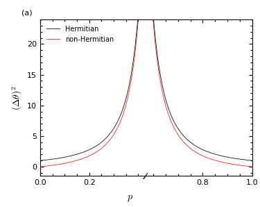
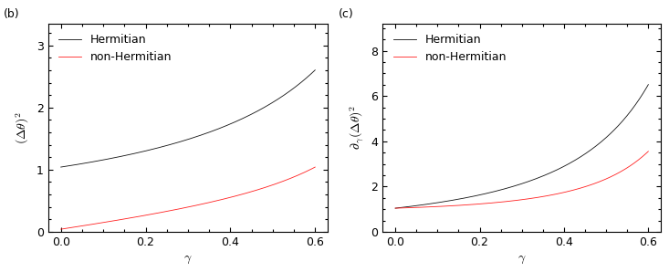

# 2607.23978: Non-Hermitian-enhanced quantum sensing in an optical interferometer

Preprint: [arXiv:2607.23978 — Non-Hermitian-enhanced quantum sensing in an optical interferometer](https://arxiv.org/abs/2607.23978)

Formal publication: **Not recorded as of 2026-08-04**

Public status: **Historical scientific artifact (4 numerical targets; 4 evidence_compared)** · Audit score: **78.48/100**

Publishes the independently generated numerical artifacts retained by the historical case: 4 public generated data files, 9 public generated figures, and 4 declared numerical targets. The package preserves failed, partial, proxy, and unresolved outcomes instead of upgrading them to completion.

## Start Here / 从这里开始

- [中文复现 Note](note/reproduction-note.zh-CN.md)
- [English reproduction note](note/reproduction-note.en.md)
- [Code and run commands](code/README.md)
- [Machine-readable scorecard](outputs/checks/similarity_scorecard.json)
- [Derivation (equations)](docs/DERIVATION.md)
- [Numerical methods](docs/NUMERICAL_METHODS.md)
- [Lessons learned](docs/LESSONS_LEARNED.md)

## Main Reproduced Results

| Paper item | Reproduced result | Figure | Check |
| --- | --- | --- | --- |
| FIG2CD | Optimal Hermitian and non-Hermitian interferometric fringe baselines. | [PNG](outputs/figures/fig2_optimal.png) | [JSON](outputs/checks/similarity_scorecard.json) |
| FIG2EF_OPT | Real and imaginary parts of optimal observable expectations. | [PNG](outputs/figures/fig2_expectations.png) | [JSON](outputs/checks/similarity_scorecard.json) |
| FIG2EF_OPT | Real and imaginary parts of optimal observable expectations. | [PNG](outputs/figures/fig2_expectations_pixel_registered.png) | [JSON](outputs/checks/similarity_scorecard.json) |
| FIG3A | Noiseless Hermitian/non-Hermitian variances and the printed-order discrepancy. | [PNG](outputs/figures/fig3a.png) | [JSON](outputs/checks/similarity_scorecard.json) |
| FIG3A | Noiseless Hermitian/non-Hermitian variances and the printed-order discrepancy. | [PNG](outputs/figures/fig3a_ordering_audit.png) | [JSON](outputs/checks/similarity_scorecard.json) |
| FIG3BC | Variance and gamma derivative under amplitude damping. | [PNG](outputs/figures/fig3bc.png) | [JSON](outputs/checks/similarity_scorecard.json) |
| FIG2CD | Optimal Hermitian and non-Hermitian interferometric fringe baselines. | [PNG](outputs/figures/fig2_optimal_pixel_registered.png) | [JSON](outputs/checks/similarity_scorecard.json) |
| FIG3A | Noiseless Hermitian/non-Hermitian variances and the printed-order discrepancy. | [PNG](outputs/figures/fig3a_pixel_registered.png) | [JSON](outputs/checks/similarity_scorecard.json) |
| FIG3BC | Variance and gamma derivative under amplitude damping. | [PNG](outputs/figures/fig3bc_pixel_registered.png) | [JSON](outputs/checks/similarity_scorecard.json) |

### FIG2CD: Optimal Hermitian and non-Hermitian interferometric fringe baselines.



### FIG2EF_OPT: Real and imaginary parts of optimal observable expectations.



### FIG2EF_OPT: Real and imaginary parts of optimal observable expectations.



### FIG3A: Noiseless Hermitian/non-Hermitian variances and the printed-order discrepancy.



### FIG3A: Noiseless Hermitian/non-Hermitian variances and the printed-order discrepancy.



### FIG3BC: Variance and gamma derivative under amplitude damping.


### FIG2CD: Optimal Hermitian and non-Hermitian interferometric fringe baselines.



### FIG3A: Noiseless Hermitian/non-Hermitian variances and the printed-order discrepancy.



### FIG3BC: Variance and gamma derivative under amplitude damping.



## Quick Run

```bash
python -m venv .venv
source .venv/bin/activate
pip install -r requirements.txt
cd cases/2607.23978/code
python scripts/verify_public_artifacts.py
```

### Independent numerical rerun

This command recomputes the scientific numerical arrays from the public equation-based implementation. It does not read a paper image, digitized source curve, or author numerical code; runtime varies from seconds to CPU minutes.

```bash
cd cases/2607.23978/code
python scripts/run_reproduction.py --config config/paper_exact.json
```

Generated files are kept under [data](outputs/data/), [figures](outputs/figures/), and [checks](outputs/checks/).

## Reproduction Boundary

This public case includes paper-derived code, generated data, generated figures, public validation checks, and explanatory notes. It does not redistribute the paper PDF, arXiv source archive, original figures, EPS paths, digitized source curves, source-derived point sets, or source-vs-generated composite panels.

Remaining limitation: Frozen non-final target states: T001=evidence_compared, T002=evidence_compared, T003=evidence_compared, T004=evidence_compared. The legacy case has no machine-verifiable author-code isolation attestation. No source-image comparison panel or digitized source curve is published in this projection.

Final-parameter rule: final public figures use the paper parameters when feasible. Any reduced-scale, subset, proxy, or blocked target must be labeled explicitly and cannot be presented as a complete reproduction.
